# Simplified Convoy Operations

*“A well-planned route is worth a thousand guns.”* – Unknown.

This set of instructions outlines the fundamental interactions needed to operate and should be used to familiarize yourself with the interface and requirements.The mechanics and UI elements for how this works are largely the same as Air Assault operations covered in 4. Steps here will only note the differences in Convoy Operations compared to Air Assault.

**NOTE:** Convoy behavior and logistics systems are identical across both factions. While truck models and escort vehicles may differ, movement rules, ambush risk, and resupply mechanics operate the same whether you’re running a NATO or Warsaw Pact convoy.

**NOTE:** Land Transport (Convoy Operations) follow the same steps as those found in the Air Treansport (Air Assualt) Tutorials.

MISSION: A/1-12 will conduct a convoy movement to **Objective Iron**, where the company will establish defensive positions to repel any enemy attack. The company will:

1. **Staging & Departure:** Form up the convoy and depart the start point toward the objective.

2. **Movement Route (MSR):** Follow the planned route.

3. **Arrival & Offload:** Halt at the destination, unload troops or cargo, and establish immediate local security.

4. **Establish Perimeter:** Infantry unit moves to assigned positions, sets up a defensive perimeter, and prepares to repel enemy attacks.

5. **Return / Redeployment Route:** Reposition vehicles for future use or return them to the staging area along the planned route.

## Loading the Scenario

This tutorial uses the scenario Tutorial - Convoy Operations found in the Tutorials menu, which can be accessed from the Main menu.

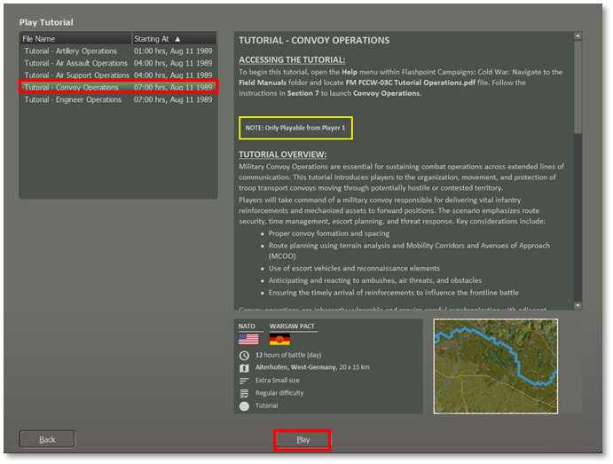 Like other tutorial scenarios select to play as the NATO Commander and for this first look set the Difficulty to Recruit to activate all the options to make things clear and easy for the first playthrough of this tutorial.

!!! note

    After

playing through the Simplified Scenario at least once, you can change the difficulty to a harder level to add in more realism for the operation (mainly hiding any enemy units if present).

As shown in the screenshot below, the Tutorial: Convoy Operations is now displayed. 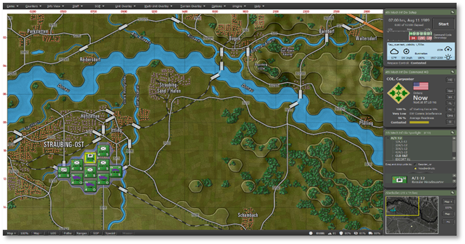

## Opening Mission Overlay

We will review the Mission Overlay to gain a better understanding of the battlefield layout. From the Menu, select “Staff,” then choose “Import Mission Graphics from Briefing,” as shown in the screenshot below, to display the provided graphics.

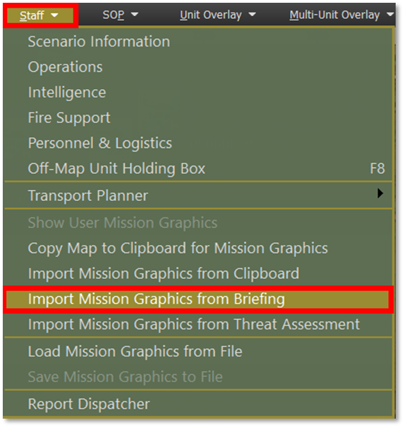

Once you have the map overlay displayed as seen below, proceed to the Transport Planner.

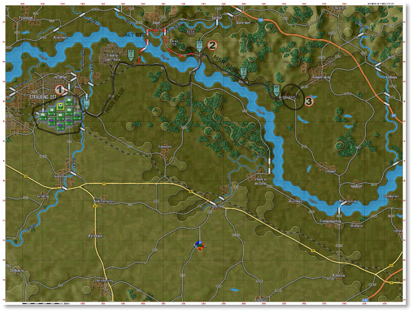

By going to Staff, Transport Planner, and selecting Land Transport. As shown in the screenshot below.

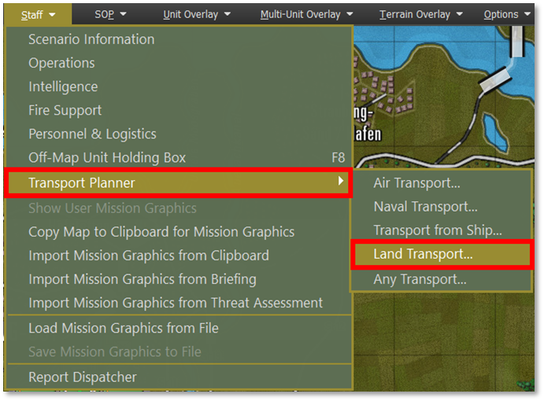

Or you can also:

- Right-Click on the unit’s counter on the map, which must be a transport truck.

- Click on the unit’s name in the Spotlight OOB (Order of Battle) to open the unit menu.

The following image illustrates the unit pop-up menu displaying the ‘Plan Land Transport’ option for an M35A1 (truck), as shown in the screenshot below.

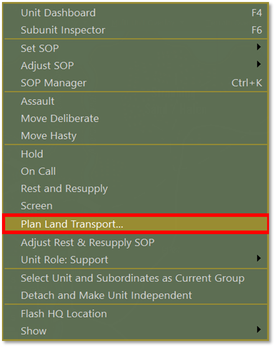

## Phase 1 – Load and Launch

For transport operations involving multiple units, selecting them on the map using Shift+Click is faster than launching the Transport Planner individually for each unit, as shown in the screenshot below.

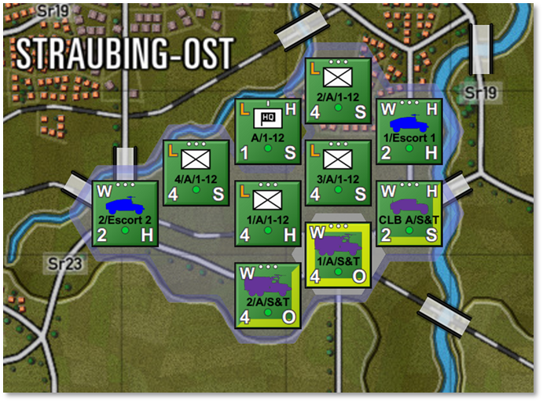

The top section of the Transport Planner UI displays the current transport plan. Tabs at the top allow you to switch between existing plans or create new ones.

Each plan tab contains the following:

1. A roster of assigned transport units and their designated passengers/cargo.

2. The planned route or serial pick-up and drop-off locations.

3. Any assigned escort units.

4. The plan’s status and corresponding action options.

As shown in the screenshot below.

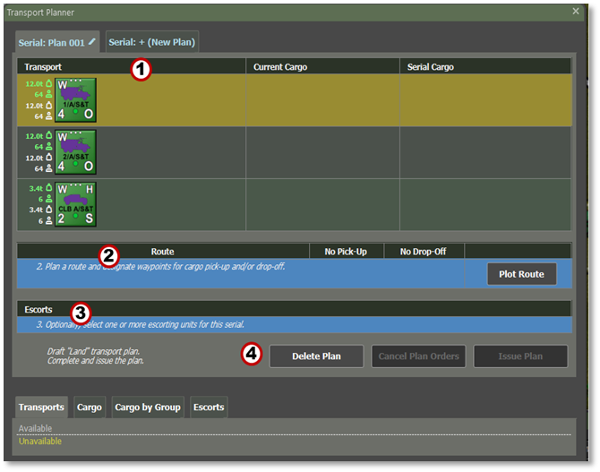

The Headquarters element will be loaded onto an HMMVW, while the infantry platoons and their equipment will load onto the remaining M35A1 trucks at AA.

To load cargo or passengers onto an M35A1 truck, first Left-Click anywhere within the transport row to highlight it.

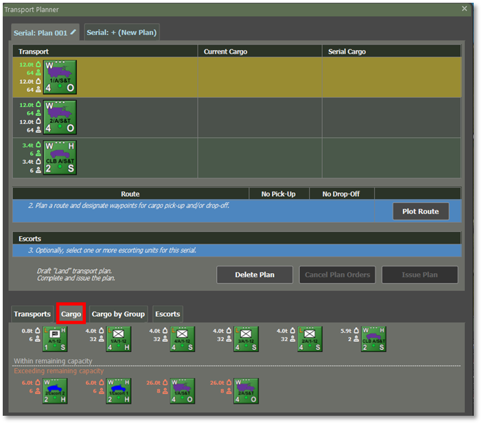

Then, Right-Click on the unit or cargo you want to load. 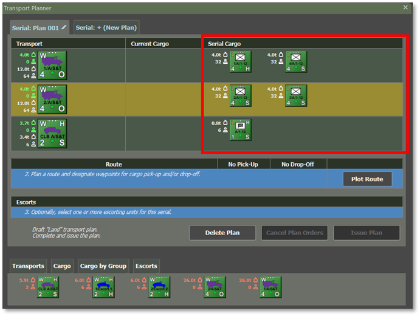

Once selected, it will appear in the Serial Cargo list, as shown in the screenshot below.

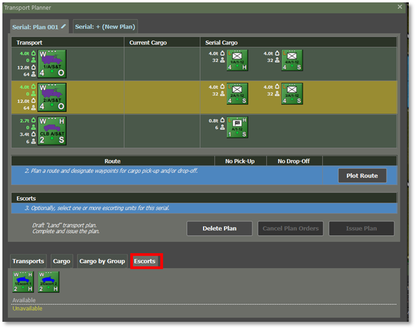

After loading the troops/cargo and equipment, we will assign 2 × M1026 HMMWVs from the Escort Platoon element, as shown in the screenshot above.

## Phase 2 – Movement to Final Destination (FD)

In the Route section of the plan, click Plot Route as shown in the screenshot below. Plot points as shown in the picture below for the pick-up point, ingress route, drop-off location, and then egress to a safe area.

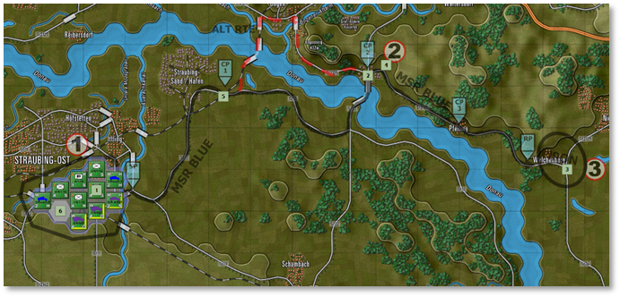

The example, as shown in the screenshot above, shows the plotted route.

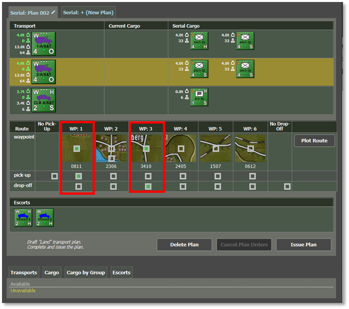

- Set Pick-Up Locations

- Set Drop-off Locations

To modify a route, plot a new one.

**NOTE:** The planner does not allow unit drop-offs before pick-ups in the same plan.

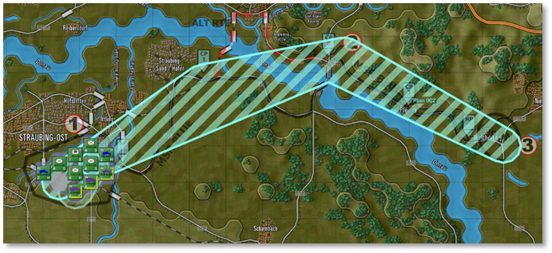

When you select the pick-up location as shown in the above screenshot, this is the route plot to the FD.

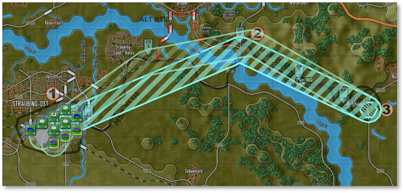

When you select the drop-off location as shown in the above screenshot, this is the route plot from the FD-Iron back to the AA.

If everything looks good, select Issue Plan and then close the Planner dialog.

## Phase 3 – Drop-off / RTB

Convoys of M35A1 trucks arrive at FD-Iron. The Infantry unit moves to its assigned positions, sets up a defensive perimeter, and prepares to repel enemy attacks. After dropping off A/1-12, the M1026 Escort Platoon will escort the M35A1 back to the AA for refuel and staging for follow-on missions, as shown in the screenshot below.

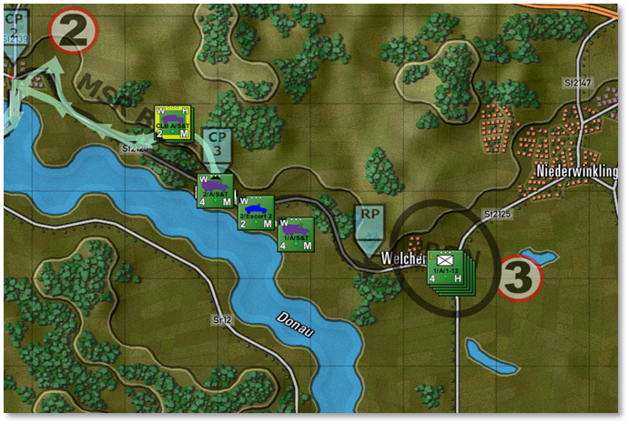

## Assign Post-Disembark Orders

As with air assault, issuing follow-up orders to inserted units is crucial, as it directs them to move and secure positions beyond the drop-off area.

The final screenshot shown below displays the final orders for this unit.

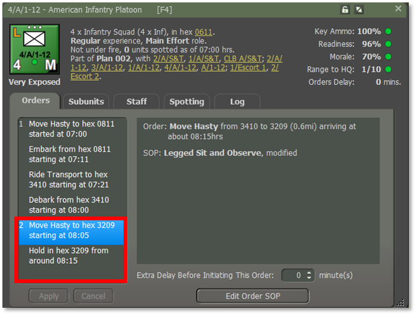

This process should be repeated for all units involved in the insertion.

Start Execution: Press the ‘Start’ button on the game clock panel to execute the orders. The Transport Planner will close automatically, but it will remain available for review until all orders are fulfilled.