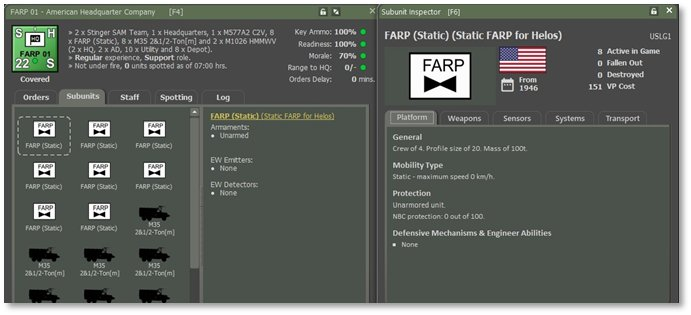
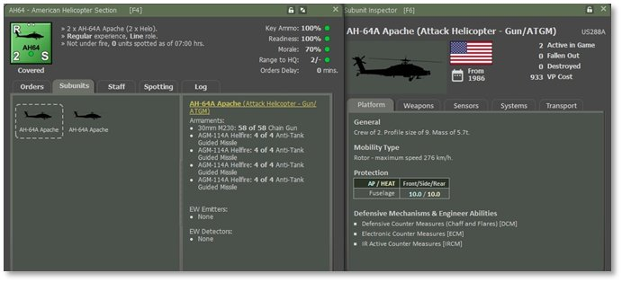
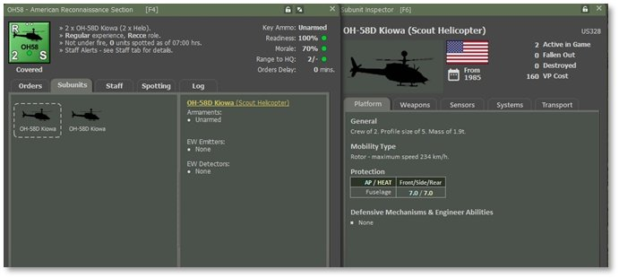
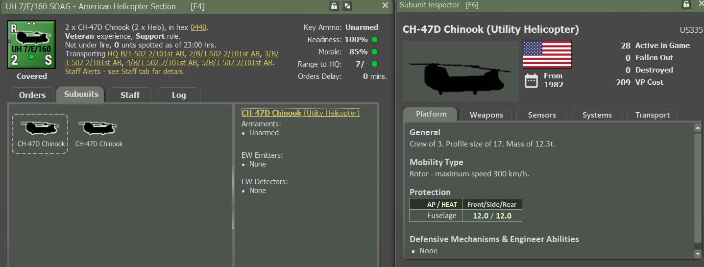

# Air Assault Operations

*“**Strike deep, strike fast, and disappear.” – Air Assault Creed.*

Air Assault Operations involve rapidly deploying ground forces by **rotary-wing aircraft** (helicopters) into an area to **seize and hold key terrain,****conduct raids, or reinforce units in combat****.** These operations emphasize speed, mobility, and shock effects to overwhelm enemy forces before they can react effectively.

**NOTE:** Whether you’re commanding Soviet Mi-8s or American UH-60s, air assault operations play the same role. Helicopter insertions, landing zones, and air mobility are handled using identical mechanics across factions—only the unit names and aircraft models differ.

## What are Air Assault Operations

**Air Assault Operations**are military missions in which**combat forces are inserted, moved, or extracted by rotary-wing aircraft, primarily helicopters,**to engage and defeat the enemy or seize and hold key terrain. These operationsare a form of**vertical envelopment****,** allowing forces to bypass enemy defenses andstrike from unexpecteddirections.

### Key Features of Air Assault Operations

- Helicopter-centric: Troops and equipment are delivered by helicopters, such as the UH-60 Black Hawk, CH-47 Chinook, or attack helicopters like the AH-64 Apache, which provide fire support.

- Speed and surprise: Air assault forces can rapidly move over terrain obstacles (rivers, mountains, or enemy lines) to surprise the enemy.

- Light, mobile units: Air assault troops are usually light infantry, optimized for mobility and short-duration missions rather than sustained combat.

- Precision: Designed to seize critical terrain (e.g., crossroads, high ground, bridges) or to disrupt enemy command and control.

These features give commanders significant tactical advantages, enabling forces to strike quickly, achieve surprise, and accomplish complex missions across various operations.

## Helicopter Support Units

**Helicopter Support** refers to the use of rotary-wing aircraft to provide various forms of assistance to ground, air, or naval forces during military operations. This support can be categorized into several key roles, depending on the mission requirements:

- Close Air Support (CAS): Attack helicopters engage enemy forces in direct support of friendly ground troops.

- Reconnaissance: Lightweight helicopters conduct reconnaissance while sometimes being capable of engaging targets as needed.

- Utility: Unarmed or lightly armed helicopters with a primary purpose of carrying troops and material.

Helicopter support significantly enhances operational flexibility, enabling rapid responses to dynamic battlefield conditions and bridging gaps between ground and air operations.

### Forward Arming and Refueling Point (FARP)

**A Forward Arming and Refueling Point (FARP) is a temporary, tactical facility near the front lines that provides rapid refueling and rearming support for rotary-wing aircraft, such as helicopters**. FARPs enable continuous air operations by reducing the time and distance aircraft need to travel to resupply, thus increasing sortie rates and operational tempo.

### Attack Helicopter

**Attack helicopters** are rotary-wing aircraft designed for offensive operations against ground targets. Their primary roles include close air support (CAS), anti-tank warfare, armed reconnaissance, and suppression of enemy air defenses (SEAD). Attack helicopters are heavily armed and armored, capable of engaging a variety of threats on the battlefield.

### Scout Helicopter

**Scout helicopters**, known as reconnaissance helicopters, are light, highly maneuverable rotary-wing aircraft designed primarily for observation, target acquisition, reconnaissance, and command and control (C2) roles.

Their primary purpose is to gather intelligence on enemy positions, movements, and terrain, supporting ground and air operations. While some scout helicopters are lightly armed, their key advantages are speed, agility, and stealth rather than heavy firepower.

### Utility Helicopter

Utility helicopters are often unarmed or lightly armed like scout helicopters, but they are larger and heavier. This increased size gives them a greater potential to carry large loads not typically representative of helicopters. This can vary from the relatively lightweight UH-1 Huey to the venerable and flexible Mi-8. They typically have a lower speed than other helicopter types, but are still much faster than any land based equivalent.

