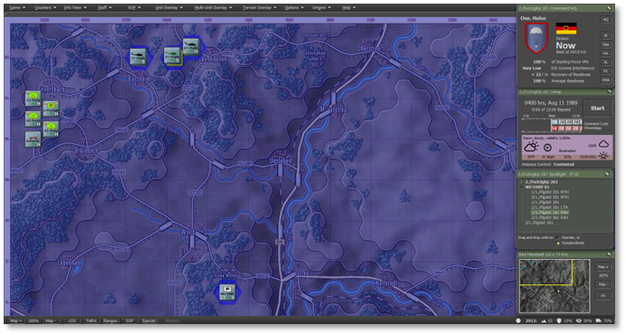
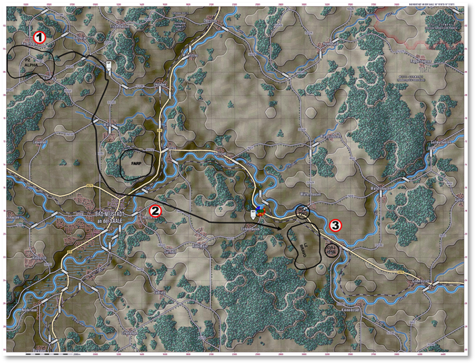

# Detailed Air Assault Operation

After you have tried the Simplified version of the Air Assault Operation and are comfortable with the UI and mechanics, this is the same mission now done with more emphasis on the operation and less so on UI mechanics to understand the new feature.

!!! note

    If you are interested in learning more about Air Assault Operations, refer to the Deep Dive Section.

We’re once again going to use Tutorial - Air Assault Operations. This time, select the Difficulty level at “Grognard”.

## Review Your Forces

Before initiating air assault operations, take the time to review your airborne assets and assigned infantry units. Confirm the readiness of transport helicopters, air assault infantry, and attached support elements, ensuring they are equipped for the planned mission.

Assess troop loadouts, flight routes, and planned landing zones to mitigate the risk of ambush or mechanical failure.

Identifying potential threats and verifying air defense suppression plans will further enhance the success of the air assault, allowing your units to deploy swiftly and secure key objectives.

### 2nd Company, Paratrooper Battalion 261

- **Quantity:** 1× FschJ Company (3× Platoons; 2× Kraka ATV Milan II)

- Role: The 2nd Company of Paratrooper Battalion 261 is a rapid-deployment airborne infantry unit capable of conducting air assault, direct action, and reconnaissance missions. It is equipped with small arms, anti-armor weapons, and light vehicles; it is a flexible strike and maneuver element.

### CH-53G Sea Stallion Section

**·****Quantity: 2× Sections (2× helicopters each; total: 4)**

**·****Role: The CH-53G Sea Stallion is a heavy-lift helicopter used for air assault, troop transport, and resupply operations. It can carry troops, vehicles, and equipment, providing vital support for airborne and airmobile operations.**

### Dornier 205 Utility Aircraft Section

**·****Quantity: 2× Sections (2× helicopters each; total: 4)**

**·****Role: The Dornier 205 is a light utility aircraft for reconnaissance, liaison, and casualty evacuation missions. It is equipped to operate from austere airstrips and provides rapid air mobility for small units.**

### PAH-1 BO-105 Attack Helicopter Section

**·****Quantity: 2× Sections (2× helicopters each; total: 4)**

**·****Role: The PAH-1 BO-105 is a light attack helicopter with TOW anti-tank missiles and 20mm cannon pods. It is tasked with anti-armor missions, reconnaissance, and close air support for ground forces.**

### Forward Arming and Refueling Point (FARP)

**·****Quantity: 1x FARP**

**·****Role: The FARP provides forward-based refueling and rearming support for rotary-wing aircraft, enabling sustained aviation operations near the front line. It allows rapid turnaround of helicopters conducting air assault, MEDEVAC, and close air support missions. FARPs are mobile, tactically positioned, and critical for maintaining the tempo and reach of aviation assets.**

## Launching Air Assault Operations

However, before we proceed, let’s review the steps to understand your task better. You have already read the Mission Brief.

### Opening Mission Overlay

First, we will review the Mission Overlay to understand the battlefield layout better. From the Menu, select “**Staff**,” then choose “**Import** **Mission Graphics from Briefing**” to display the provided graphics.

## Phase 1: Planning & Preparation

Develop the air assault plan, coordinate supporting fires, and task-organize forces for the mission. Some of these steps you may not need to do in this tutorial, but are outlined here for completion of what you will want to do in regular scenarios.

### Assess the Mission Objective

- Review the briefing to identify the assault’s purpose (e.g., seize key terrain, interdict a route, reinforce a position).

- Confirm mission type (e.g., deliberate assault, rapid reaction, blocking force insertion).

### Identify the Air Assault Force

- Select the Fallschirmjäger or Luftbewegliche Infanterie company from the unit list.

- Confirm available assets:

- Troop strength (typically 3x platoons + HQ and support).

- Transport helicopters (e.g., CH-53G or UH-1D), and how many are available.

- Attached support (e.g., engineer team, AT section, or recoilless rifles).

### Determine Lift Requirements

In an air assault operation, “Lift” and “Serial” are essential to organizing how troops and equipment are transported by helicopter. Here’s a clear breakdown:

- A Lift is a wave of troops moving onto their points, it is usually comprised of multiple Serials. There is no in game representation of a Lift, just the constituent Serials.

- A Serial is all of the units being picked up and dropped off at single, specific points together. These are what the player plans and are displayed in the various UI elements of the game.

- A Serial is typically made up of multiple Chalks/Loads. These are the specific assignments of which transport soldiers will get on. This you do not need to plan, it will be taken care of by the game.

You will want to estimate the number of helicopter lifts:

- Calculate how many squads/platoons can be moved per lift.

- Consider troop count and weight, helicopter capacity, and total force size.

- Plan lift sequence: which platoons go in first lift and follow-on waves.

### Select Landing Zones (LZs)

- Identify LZs within 1–2 km of the objective.

- Choose a landing zone away from heavy enemy fire or obstacles.

- Avoid LZs near known/suspected enemy AD or MG positions.

- If possible, plan for alternate LZs in case the primary becomes compromised. There is no in game mechanic for adding alternate LZs to a plan, but it is a good idea to have in mind where you might need to order your troops to. You can drag an Unload waypoint to the alternate LZ after issuing orders, same as you can drag any other movement waypoint.

### Analyze Threat Environment

Plan suppression of these threats with artillery, CAS, or diversionary actions to draw defenders away from the objective.

- Use recon assets or intel to locate:

- Enemy air defenses (AD) such as SA-7/SA-9.

- Machine gun nests or strongpoints.

- Enemy troop concentrations.

### Plan Fire Support

Assign artillery or mortar units for LZ suppression before and during insertion.

- Establish Pre-Planned Fire (PPF) missions to:

- Suppress likely enemy positions.

- Cover landing and movement routes.

- If available, request air support or gunship overwatch.

### Plot Flight Routes

- Chart helicopter ingress and egress paths using low-level approaches.

- Avoid enemy AD zones and use terrain masking when possible.

- Use waypoints to simulate terrain-following and safe ingress corridors.

- Helicopters by default in a Tactical Transport plan will use Move Deliberate, which uses a lower altitude than Move Hasty. Combined with using valleys for movement this can be an effective way to stay hidden from enemy SAMs.

### Synchronize Timings

- Time artillery suppression to hit just before the helicopters arrive.

- Ensure lift timings allow for company-level coherence at LZ.

- Plan follow-on waves to insert reinforcements or resupply.

## Phase 2: Insertion & Landing Zone (LZ) Selection

- Select LZs based on terrain, enemy threat, and supportability to ensure safe and effective troop insertion.

### Finalize LZ Selection

- Choose your Primary LZ based on:

- Proximity to the objective (ideally 1–2 km).

- Prefer open, flat terrain (e.g., fields, road junctions, clearings).

- Minimal tree cover or elevation changes.

- Cover and concealment options for disembarking troops.

- Plan for Alternate LZs in case of enemy resistance or weather complications.

### Confirm Suppression and Fire Support Plans

Ensure artillery or mortars are scheduled to suppress enemy threats around the LZ just before arrival.

- Use Pre-Planned Fire Missions (PPF) to target:

- Known enemy AD positions (e.g., SA-7 teams).

- Likely ambush or strongpoint areas.

- Delay fire just enough to prevent harming helicopters or dismounted troops.

### Initiate the Helicopter Insertion

- Select helicopters assigned to the operation (e.g., CH-53G or UH-1D).

- Assign infantry units to transport assets.

- Designate the LZ as the destination waypoint.

- Coordinate Multi-Wave Lifts (If Needed)

- If only a portion of the company can be lifted at once:

- Send the lead elements (e.g., 1st Platoon + HQ) first.

- Reserve follow-on lifts for support units and remaining platoons.

- Plan LZ reuse or shift to secondary LZs based on operational progress.

### Monitor Threats En Route

- Observe helicopter movement paths.

- Adjust or reroute helicopters if enemy AAA, SAMs, or small arms fire are detected.

- If under fire, abort the mission and divert to alternate LZs or cancel the wave.

### LZ Touchdown and Troop Disembarkation

- Upon arrival:

- Helicopters land, troops dismount automatically, and assume SOP and Orders based on planning.

- Disembarked units will be vulnerable — do not leave them unsupported.

- Ensure artillery suppression is active during touchdown.

- If under fire:

- Reinforce with artillery, air support, or deploy smoke to obscure enemy vision.

### Establish Initial Defensive Perimeter

- Move units into defensive positions immediately after landing.

- Use nearby woods, ridgelines, or buildings for cover.

- Prepare for enemy contact while regrouping your whole company.

### Recover or Withdraw Helicopters

- After disembarkation:

- Move helicopters to a safe zone (rear FARP or staging area).

- Keep them out of enemy AD range.

- Prepare for follow-on lifts of units.

- If you did not use the maximum of 6 waypoint in a Tactical Transport plan, you can use the remainder to plot an exfiltrate path for your transports. (Your Drop Off can be any of the 6 waypoints in a plan, as long as it is after your Pick Up point.)

### Tips for Success

- Use low-altitude ingress routes to avoid radar detection.

- Select LZs that allow rapid expansion and movement toward the objective.

- Avoid inserting directly into contested areas unless fire support is overwhelming.

- Use smoke or obscurants as needed during hot LZ operations.

## Phase 3: Securing the LZ

Deploy assault elements to secure the LZ and establish a defensive perimeter for follow-on operations.

### Establish a Security Perimeter

Upon landing, deploy dismounted squads to form a 360° perimeter around the LZ. Utilize terrain features, such as treelines, ridgelines, or buildings, for cover. Place MG teams or AT weapons at key chokepoints or danger areas. Keep helicopters as long as necessary; extract or reposition them as needed. Helicopters with Hold orders will use a lower altitude than Screen orders, similar to Move Deliberate vs Move Hasty.

### Reorganize the Company

- Check unit cohesion and status:

- Confirm all squads, HQ, and attachments (e.g., engineer or AT teams) are on the ground.

- Identify any stragglers or units left in transit.

- Reassign waypoints or control groups as needed to prepare for movement.

### Conduct a Local Recon Sweep

- Use a squad or recon element to probe the area around the LZ. Identify:

- Any remaining enemy units in the area.

- Best terrain routes toward the objective.

- Minefields, obstacles, or ambush positions.

- If engineers are present, utilize their expertise to clear paths or prepare for demolitions.

### Update Fire Support Plans

- Adjust Pre-Planned Fires (PPF) based on new recon data or enemy contact.

- Shift artillery or mortar support closer to the movement axis.

- Prepare on-call fires for bounding movements or anticipated contact.

### Move Out from the LZ

- Advance in bounding overwatch by platoons:

- One platoon moves while another overwatches.

- Use covered routes, tree lines, or ridge shoulders.

- Avoid open ground unless supported by fire.

### Maintain Tactical Spacing

- Keep proper intervals between platoons to prevent vulnerability to artillery or ambush.

- Stagger movement to avoid traffic jams or bottlenecks.

- Ensure command and control by keeping platoons within HQ range for support.

### Engage and Overcome Resistance

- If enemy contact is made:

- Deploy into hasty battle formations (line, wedge).

- Call in fire support immediately if available.

- Use flanking maneuvers with one platoon fixing while another moves.

- Engineer teams may be used to breach or bypass obstacles.

### Prepare for the Final Assault

- Once near the objective:

- Conduct a final recon or visual scan.

- Set artillery to suppress or soften the target area.

- Ensure all elements are ready for a coordinated assault.

### Pro Tips

- Keep helicopters away from the objective once troops disembark—they’re vulnerable to AA fire.

- Use terrain masking during movement—your infantry is light and best when not exposed.

- Rotate squads that take heavy contact to the rear if replacements are available or conduct MEDEVAC later.
