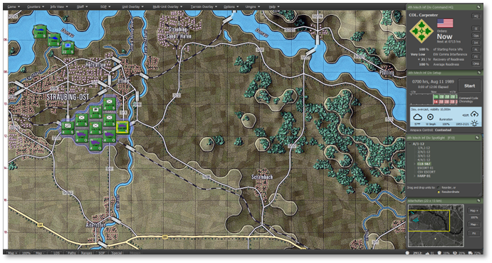
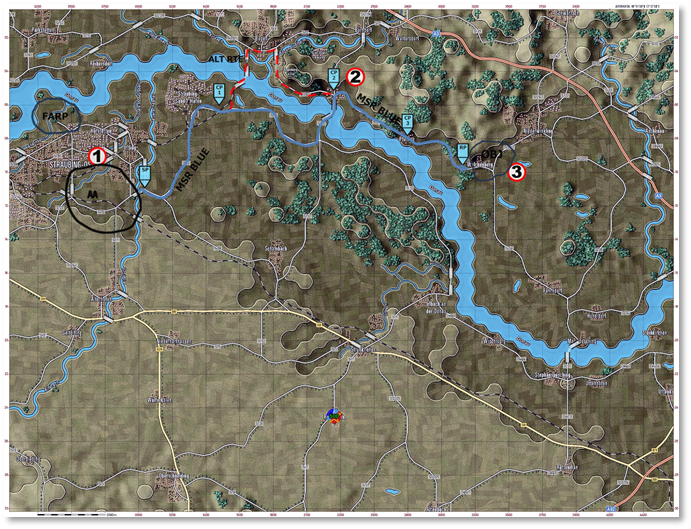

# Detailed Convoy Operations

After you have tried the Simplified version of the Convoy Operation and are comfortable with the UI and mechanics, this mission is now done with more emphasis on the operation and less on UI mechanics to help you understand the new feature.

!!! note

    If you are interested in learning more about Convoy Operations, refer to Sections 8 and 9.

## Loading the Scenario

Select Tutorial - Convoy Operations, but this time set the Difficulty level at “Grognard”.

## Review Your Forces

Before starting a convoy operation, thoroughly assess the composition and readiness of the convoy units. Review the assigned transport vehicles, escorts, and support elements, verifying vehicle loadouts, communication protocols, and convoy formation plans. Ensure that each vehicle is prepared for potential threats, such as ambushes or roadblocks, and confirm that convoy leaders understand the movement schedule, checkpoints, and emergency response procedures. Effective planning and coordination will keep the convoy moving safely through potentially contested terrain.

### A/1-12 INF:

- Quantity: 1x Company (4x Platoons)

- Role: A/1-12 INF is an infantry company. It is tasked with securing objectives, providing defensive positions, and conducting offensive operations against enemy forces.

### S&T Company:

- Quantity: 1x Company (4x M35A2 in 3x Platoons)

- Role: The S&T Company provides logistical support for ground forces, including transporting supplies, ammunition, and personnel using M35A2 2.5-ton trucks. It ensures sustainment and resupply operations for front-line units.

### AH-64 Apache Attack Helicopter:

- Quantity: 2x Helicopters

- Role: The AH-64 Apache is a heavily armed attack helicopter equipped with Hellfire missiles, a 30mm chain gun, and rockets. It conducts close air support, anti-armor missions, and reconnaissance to engage enemy ground targets.

### OH-58D Kiowa Warrior:

- Quantity: 1x Helicopter

- Role: The OH-58D is a scout and observation helicopter with advanced sensors and communications equipment. It provides reconnaissance, target acquisition, and fire coordination for ground and air assets.

### Security Teams:

- Quantity: 2x Teams

- Role: The M3A1 is a cavalry fighting vehicle with a 25mm autocannon and TOW missile launcher. It provides security, convoy escorts, and anti-armor support for logistics and maneuver elements.

### Escort Teams:

- Quantity: 4x Vehicles

- Role: The M1026 HMMWV, armed with the Mk19 automatic grenade launcher, serves as a convoy escort vehicle. It provides suppressive fire and perimeter security against dismounted infantry and light vehicles.

## Executing Convoy Operations

However, before we proceed, let’s review the steps to understand your task better. You have already read the Mission Brief.

### Opening Mission Overlay

First, we will review the Mission Overlay to understand the battlefield layout better. From the Menu, select “Staff,” then choose “Import Mission Graphics from Briefing” to display the provided graphics.

