# Simplified Air Assault Operations

This set of instructions runs through the fundamental interactions required to perform the operation and should be used to get familiar with the interface and requirements.

MISSION: 2./FschJgkp 261 will conduct a heliborne assault to secure a vital bridge. The company will:

1. Departure: CH-53G Sea Stallions and PAH-1 BO-105s depart PZ (Pickup Zone) Falcon heading northeast.

2. Ingress Route: Follow the Saal river valley south-east, staying low for nap-of-the-earth flight and natural terrain masking.

3. Insertion: Land at LZ (Landing Zone) Saal, infantry dismounts and begins the assault on OBJ 1, 1km to the east.

4. Egress: Once infantry is on the ground, PAH-1 BO-105 escorts the CH-53Gs back to FARP following the same valley route in reverse.

5. FARP: Positioned near Lebenhan (hex grid ~07-11), where CH-53Gs and PAG-1 BO-105 refuel and await follow-on tasking.

## Loading the Scenario

This tutorial uses the scenario Tutorial - Air Assault Operations found in the Tutorials menu, which can be accessed from the Main menu.

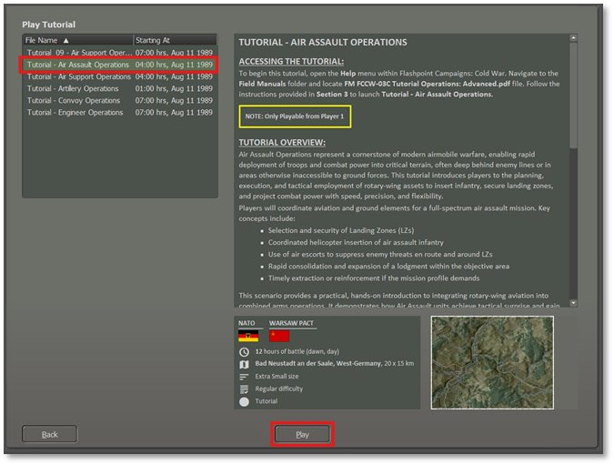

Like with other tutorials, select to play as the NATO Commander and then set the Difficulty to Recruit to activate all the options to make things clear and easy for the first playthrough of this tutorial.

!!! note

    After

playing through the Simplified Scenario at least once, you can change the difficulty to a harder level to add in more realism for the operation (mainly hiding any enemy units if present).

As shown in the screenshot below, the Tutorial: Air Assault is now displayed.

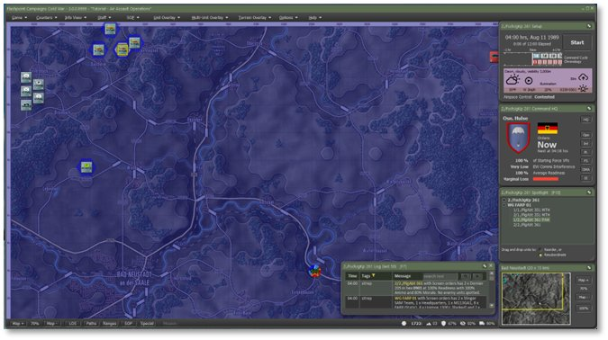

## Opening Mission Overlay

We will review the Mission Overlay to gain a better understanding of the battlefield layout. From the Menu, select “Staff,” then choose “Import Mission Graphics from Briefing,” as shown in the screenshot below, to display the provided graphics.

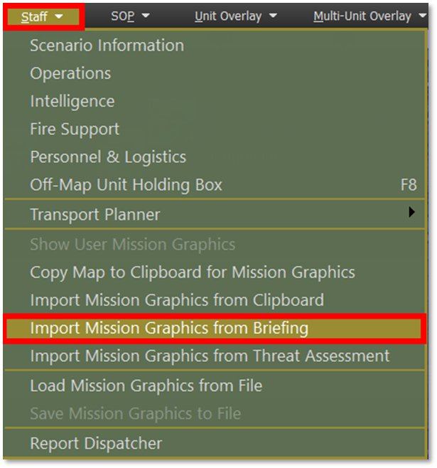

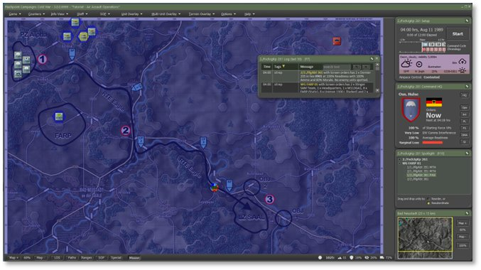

Zoomed in on the operational area of the map.

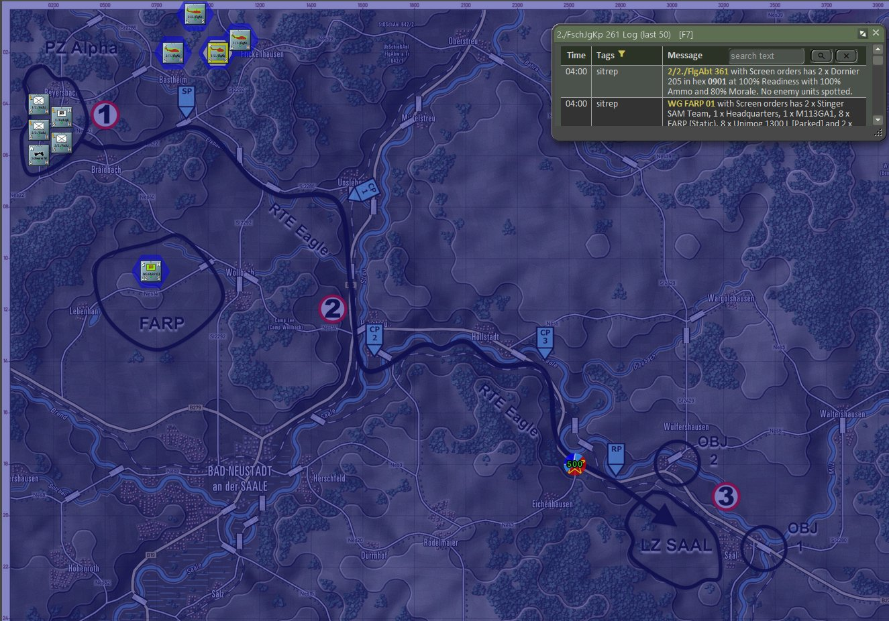

!!! note

    For

this training, the time frame for the actual Air Assault was adjusted so that you can see the map overlay.

Once you have the map overlay displayed, proceed to the Transport Planner.

By going to Staff, Transport Planner, and selecting Air Transport. As shown in the screenshot below.

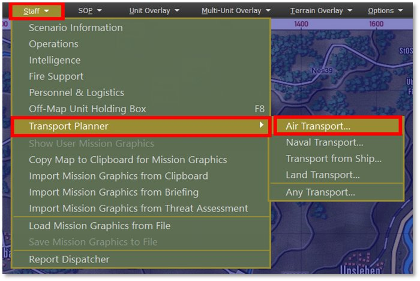

Or you can also.

- Right-Click on the unit’s counter on the map, which must be a transport helicopter.,

- Click on the unit’s name in the Spotlight OOB (Order of Battle) to open the unit menu.

The following image illustrates the unit pop-up menu displaying the ‘Plan Air Transport’ option for a CH-53G Sea Stallion (Helicopter), as shown in the screenshot below.

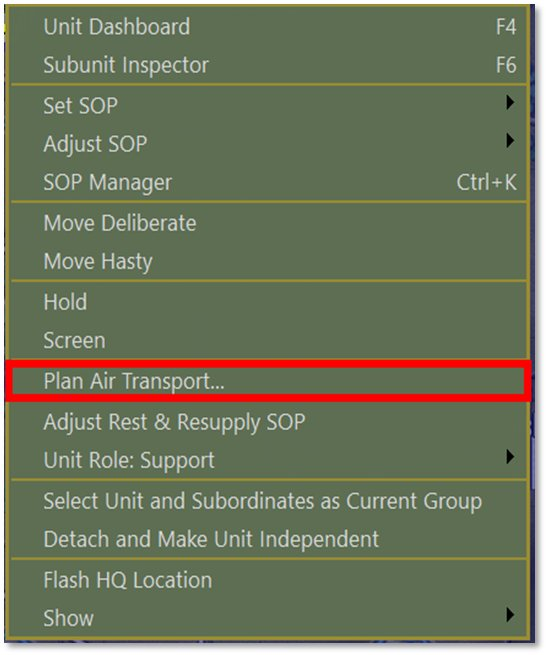

## Phase 1 – Load and Launch

For transport operations involving multiple units, selecting them on the map using Shift+Click is faster than launching the Transport Planner individually for each unit, as shown in the screenshot below.

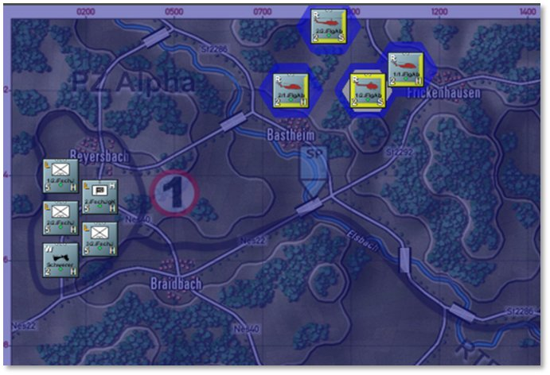

The top section of the Transport Planner UI displays the current transport plan. Tabs at the top allow you to switch between existing plans or create new ones.

Each plan tab contains the following:

- A roster of assigned transport units and their designated passengers.

o Passengers in Serial Cargo are participating in the plan shown.

o Passengers in Current Cargo are being currently carried by the transport unit, but will not unload if a Drop-Off point is selected. They will continue to take up capacity on the transport unit.

- The planned route or serial detailing pick-up and drop-off locations.

- Any assigned escort units.

- The plan’s status and corresponding action options.

As shown in the screenshot below.

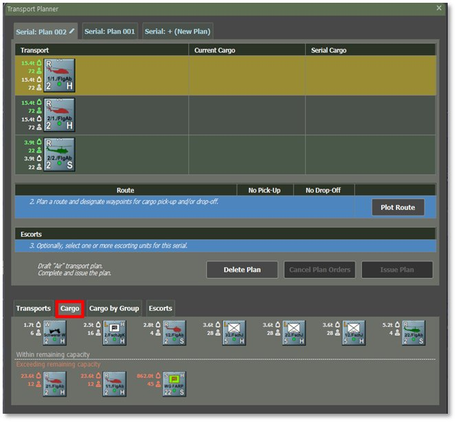

The Headquarters element will be loaded onto a Dornier 205 helicopter, while the infantry platoons and their equipment will board CH-53G Sea Stallions at PZ Falcon.

To load cargo or passengers onto a helicopter:

- Select the “Cargo” tab if it is already not selected.

- Left-Click anywhere within the transport row to highlight it.

- Right-Click on the unit or cargo you want to load. Once selected, it will appear in the **Serial Cargo** list, as shown below.

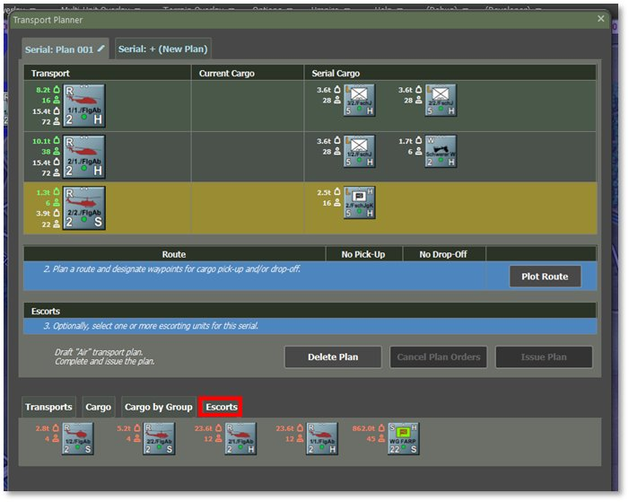

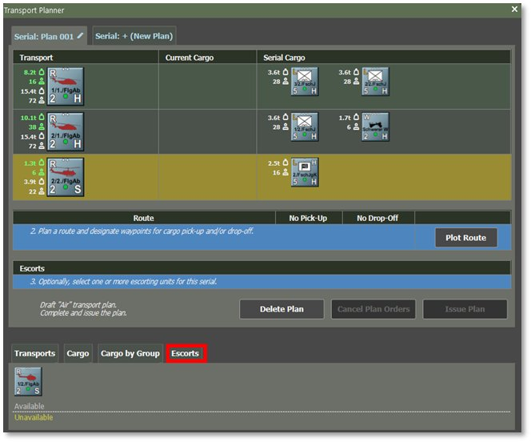

After loading the troops/cargo and equipment, we will assign 2 × PAH-1 BO-105 gunships from the escort element, as shown in the screenshot above.

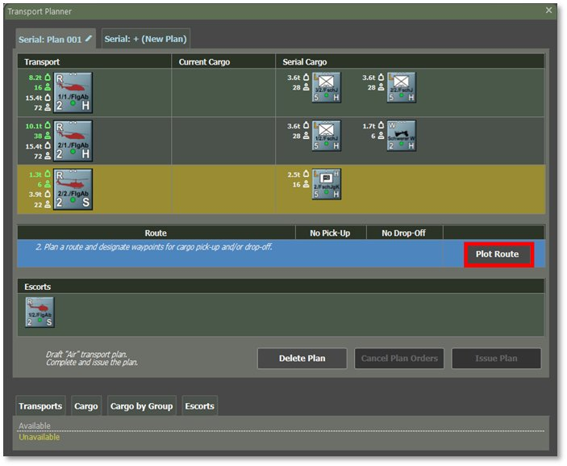

## Phase 2 – Movement to LZ

In the **Route** section of the plan, click **Plot Route** as shown in the screenshot above. A pop-up window will appear, reminding you that you can use up to **six waypoints** total — for the pick-up point, ingress route, drop-off location, and then egress to a safe area.

**NOTE:** There MUST be at least either a Pick-up or Drop-off point in the plan.

**NOTE:** Transport passengers will always travel directly to pick-up points, without using any other waypoints (they will still follow all their normal movement preferences).

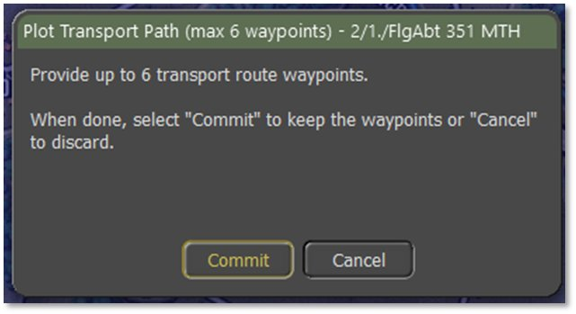

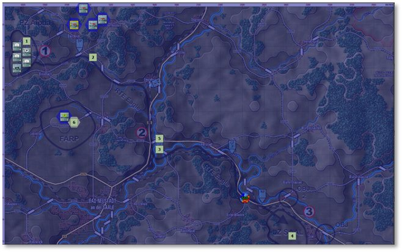

The example, as shown in the screenshot above, shows the plotted route.

Once you set the six waypoints, the Route section updates to display the waypoint locations. The screenshot, as shown below, shows a route with up to six waypoints, options for skipping pick-up or drop-off of cargo units, and the ‘Plot Route’ button.

1. Set Pick-Up Locations (if applicable):
- Select a waypoint hex where units will be picked up.

- Check the box beneath the chosen waypoint in the ‘Pick-Up’ row.

- Select the’ No Pick-Up’ option if no units are picked up.

1. Set Drop-off Locations (if applicable):
- Select a waypoint hex for unloading units by marking the corresponding box in the “Drop-off” row.

- If the plan is only for loading units, select ‘No Drop-off’ instead.

To modify a route, plot a new one.

**NOTE:** The planner does not allow unit drop-offs before all scheduled pick-ups in the same plan.

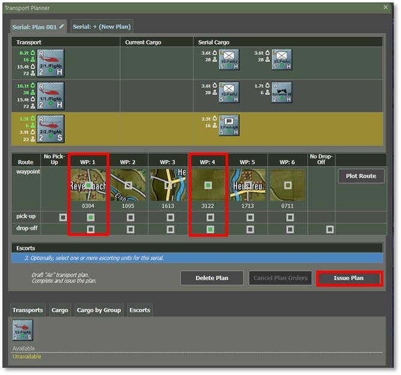

Once you’ve selected your pick-up and drop-off, the route will be displayed as shown in the screenshot below.

Then select the “Issue Plan” button to commit your plan for the operation.

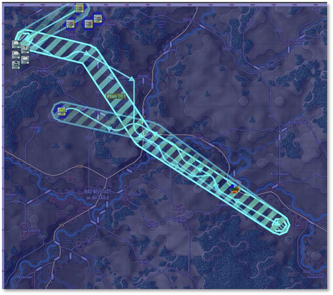

- Flight departs PZ and moves on a nap-of-the-earth path toward LZ Saal (~4 km away).

- Gunships perform route reconnaissance and provide overwatch.

## Phase 3 – Insertion / Return

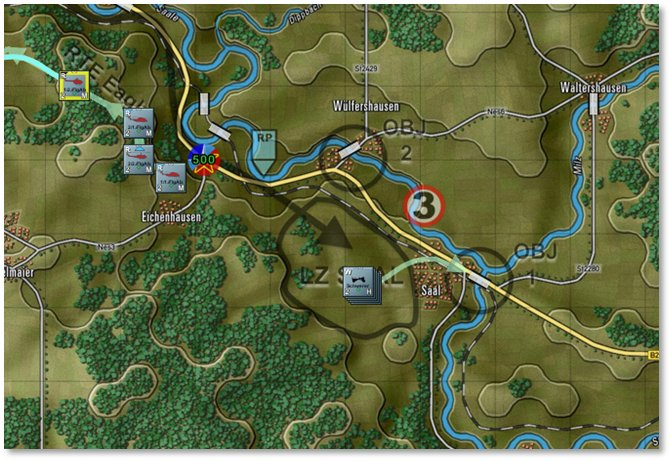

- CH-53G lands at LZ Saal, and the infantry dismounts quickly and begins the movement to OBJ 1 (see instructions following). After insertion, PAH-1 BO-105s will escort the CH-53G back to the FARP for refuel and staging for follow-on missions, as shown in the screenshot above.

## Assign Post-Landing Orders

For air assault, issuing follow-up orders to inserted units is crucial, as it directs them to move and secure positions beyond the landing zone. Follow these steps to ensure a smooth transition after disembarkation:

- Open the Unit Dashboard and select one of the transported units, as shown in the screenshot below.

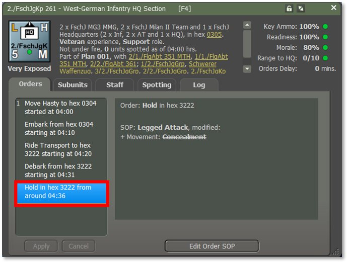

Change the final order from Hole to Move Deliberate, and then plot the route to the Objective. The following screenshots are shown below.

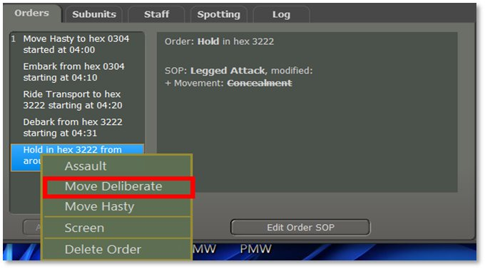

Once you plot your route, select either “Hold” or “Screen” as shown in the screenshot below.

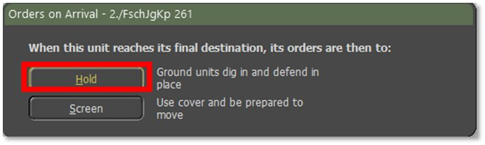

Once you select the orders for the unit, you will see the route as shown in the screenshot below when it gets to the location. Once you have chosen the new orders for the unit, you will need to select the “Apply” button to confirm the order change.”  Once you choose the “Apply” button, the new orders will change from “Yellow” to “White” to indicate that the orders have been applied.

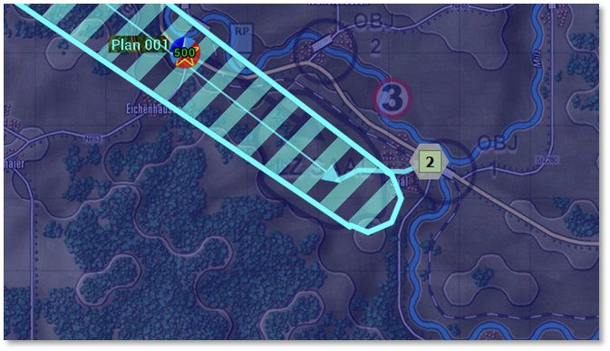

The final screenshot shown below shows the final orders for this unit.

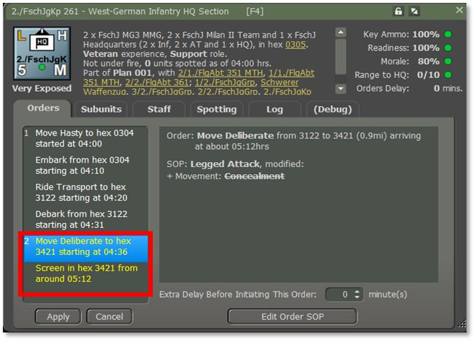This process should be repeated for all units involved in the insertion.