# Transport Operations Planning

Transport operations are meticulously planned by matching the capacity of transport units with the specific needs of the units being moved.

**NOTE:** NATO and Warsaw Pact forces may differ in equipment and capabilities, but both sides rely on the Transport Planner to manage the movement of units. No matter which faction you command, mastering transport planning is essential to ensure the timely arrival of critical forces and coordinated execution of operations. Effective transportation planning can distinguish between success and failure on the battlefield.

This is modeled at the individual vehicle, accounting for weight (mass) and personnel (troop capacity). Players can create detailed transportation plans incorporating ground vehicles, helicopters, and escort elements. These plans also define specific routes with designated pick-up and drop-off points. Once established, transport plans are translated into executable orders, which can be further refined, particularly for assault units requiring coordinated movement and rapid deployment after insertion.

## Transport Capacity and Requirements

The unit database now features detailed vehicle mass and personnel capacity data.

For transport-capable units (inorganic transport), the database tracks the weight and number of personnel each vehicle can accommodate.

This data is accessible through the Unit Dashboard (F4) and can be viewed at various organizational levels, including section, platoon, and company, as shown below.

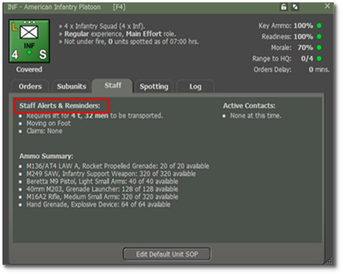

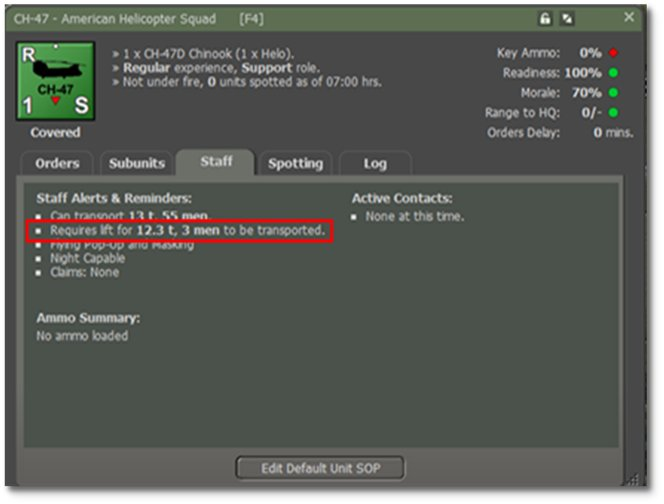

## Passenger Loading Mechanics

The game simulates the loading of passenger units at the individual squad and vehicle level, with the following conditions determining whether a transport unit can carry a passenger unit:

- The total mass (displayed in tons) of each passenger sub-unit must fit within the remaining weight capacity of a transport *sub-unit*.

- The total personnel count of the passenger sub-unit must fit within the available seating capacity of the transport *unit*.

- Both conditions must be met individually for each transport vehicle.

**Example:** A single CH-47 Chinook unit, with a capacity of 12 tons and 55 personnel, can transport an American Infantry Platoon of 5.3 tons and 39 personnel.

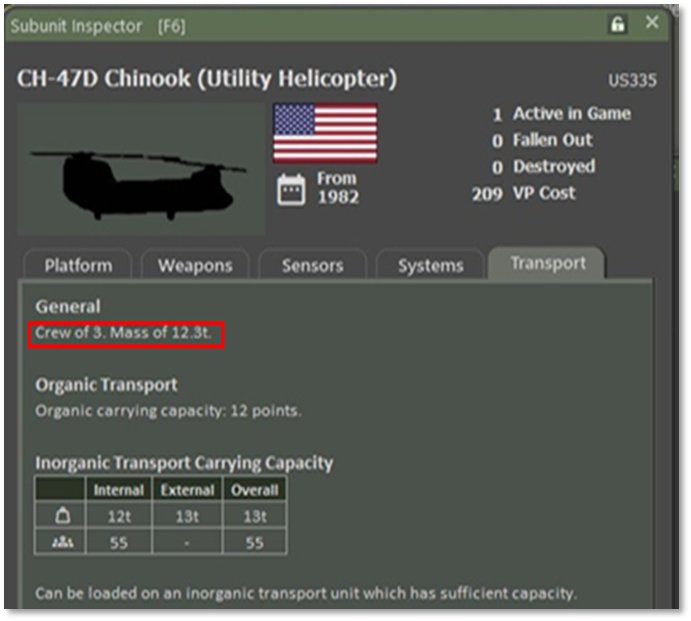However, a section of two CH-47s, with a combined carrying capacity of 24.6 t and a capacity for 110 men, cannot transport an entire American Infantry Company. This is because the American Infantry Company would have 3 infantry platoon units for a total of 117 men exceeds the seating capacity of the Chinook unit. (This is to say nothing of the headquarters section or weapons platoon that would be part of the company.)

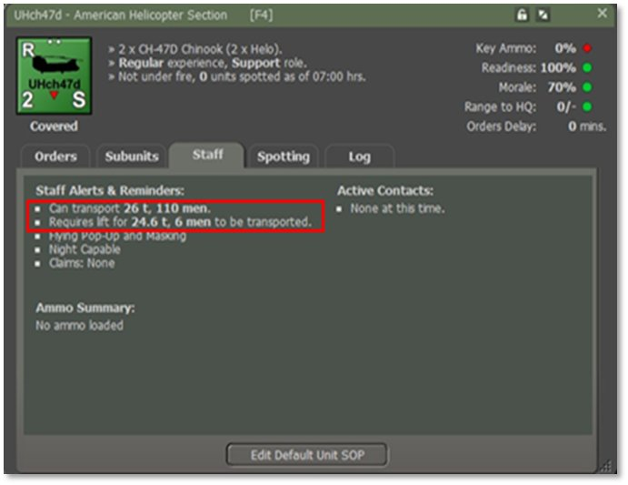

## Transport Planner UI and Plans

The Transport Planner UI facilitates the creation and modification of transport plans, ensuring efficient organization and management of logistics operations.

The following image illustrates the Transport Planner, showing a plan for a Helicopter Squadron, four Sections of two per CH-47. The squadron is tasked with transporting an American Infantry Company and four Recon HMMWVs.

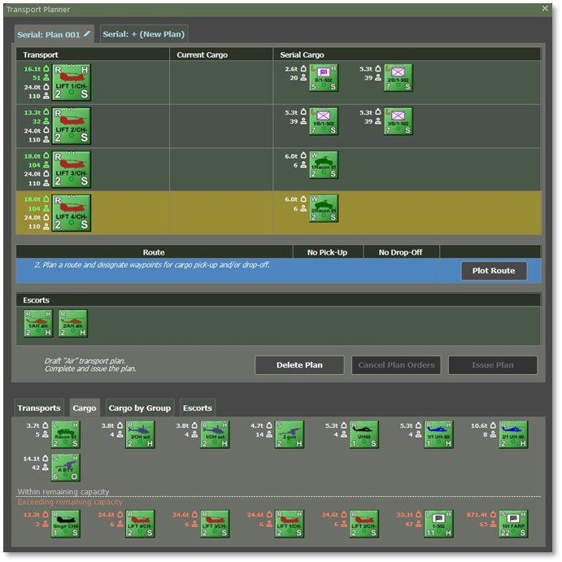

## Plans: A Tool for Issuing Orders

A transport plan remains available for review if the units involved have active or pending orders derived from it.

The plan is automatically deleted once all related orders are executed or canceled.

**NOTE:** The transport plan issues complex orders to transport, passenger, and escort units. After creation, the game executes the assigned orders and incorporates subsequent modifications.

## Accessing the Transport Planner

The Transport Planner is only available during the orders phase of the game. It cannot be accessed during game execution, game pauses, or within the Scenario Editor.

### Launching the Planner for a Single Unit

The Transport Planner can be activated for any unit capable of transporting others. To launch it:

- Right-Click on the unit’s counter on the map, which must be a transport helicopter.,

- Use the fly-out panel, or

- Click on the unit’s name in the Spotlight OOB (Order of Battle) to open the unit menu.

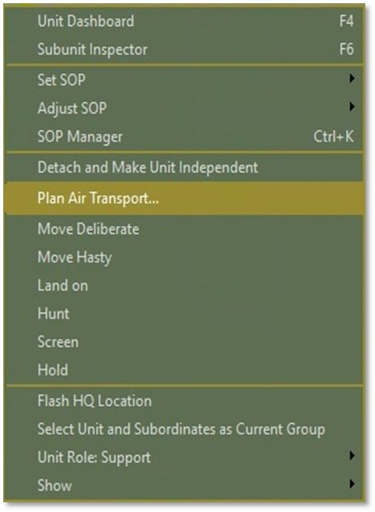

The following image illustrates the unit pop-up menu displaying the ‘Plan Air Transport’ option for a CH-47 Chinook (Helicopter).

Available transport options depend on the unit type and may include:

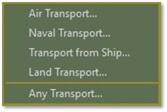

If a transport plan already exists for the selected unit, the planner will display it. Otherwise, a new plan will be created, assigning the chosen unit as the transporter.

### Launching the Planner for Multiple Units

For transport operations involving multiple units, selecting them on the map using Shift+Click is faster than launching the Transport Planner individually for each unit.

**NOTE:** The pop-up menu will only show transport options applicable to the last selected unit. The Transport Planner will apply add transport units within the selection.

The following image illustrates that launching the planner for multiple selected units generates a new plan, assigning them as transporters, provided that no existing draft or active transport plans include these units.

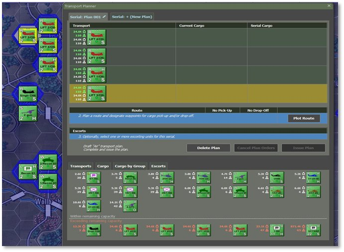

### Launching Without a Selection

The Transport Planner can be accessed without selecting specific units. This allows you to define the scope and view all available transport options. This is done via the Staff menu.

As shown below, the Staff menu provides access to the Transport Planner, enabling the creation of various transport plans, regardless of whether specific units have been pre-selected.

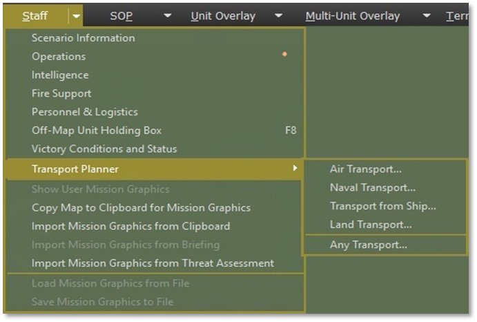

**NOTE:** The game permits launching features like *Naval Transport Planning* even if the scenario lacks naval units.

While Air Transport, Naval Transport, Land Transport, and Transport from Ship automatically filter out units that don’t meet the respective transport criteria, the Any Transport option lists all available transport types (air, land, sea).

## Planner UI: Managing Transport Plans

The top section of the Transport Planner UI displays the current transport plan. Tabs at the top allow you to switch between existing plans or create new ones.

You highlight the row for the transport in which the cargo/passengers are by Left-Clicking somewhere within the row itself. Then, you Right-Click on each cargo/passenger you want to move from Current to Serial.

Each plan tab contains the following:

- A roster of assigned transport units and their designated passengers.

- The planned route or serial detailing pick-up and drop-off locations.

- Any assigned escort units.

- The plan’scurrent status and corresponding action options.

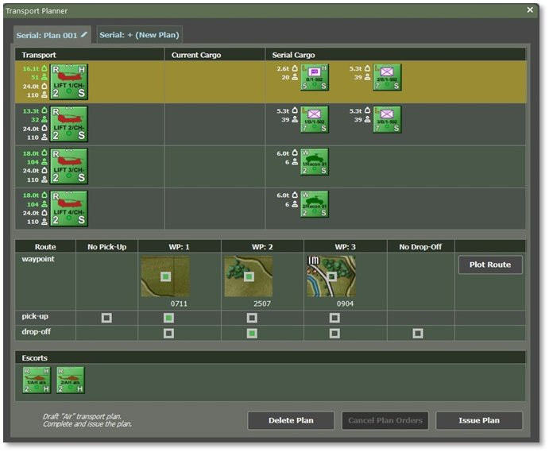

### Serial versus Current Cargo

Serial Cargo: These are considered all of the units (cargo) to be loaded and unloaded as part of the transport plan.

Current Cargo: These are the units on transports and taking up troops and/or weight for the transporting platforms.

### The ‘Plans’ Tabs

- Rename a plan by clicking the pencil icon, entering a unique name, and clicking the pencil again to confirm.

Plan Status & Color Codes:

- Yellow – The plan is in execution and cannot be edited.

- Green – The plan has issued orders that can be modified and reissued.

- Blue – Draft plan in development (no orders issued yet).

This system ensures clarity when managing multiple transport plans effectively.

To change to a different plan, Left-Click on its corresponding tab. To create a new plan, click the “+ (New Plan)” tab.

The following image illustrates the color-coded plan names, with yellow representing an executing plan, green indicating a plan with issued but not executed orders, and blue indicating a draft plan with no orders issued.

The tab system enables you to:

- Switch between the current plan (highlighted) and other active plans.

- Click “+ (New Plan)” to create a new transportation plan.

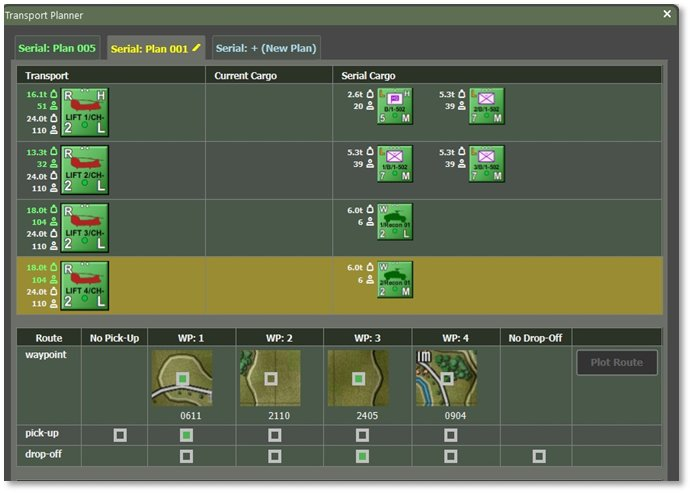

### Transport and Passengers in the Plan

The transport list displays a column of available transport units (left), showing their remaining capacity in green text and total capacity in white text. Each transport unit’s row includes smaller counters representing currently embarked cargo (“current cargo”) and any cargo scheduled for pick-up or drop-off in this serial.

The corresponding weight or personnel count for each cargo or passenger unit appears in white text next to its counter.

Only one transport unit can be selected, highlighted with a yellow background. When selected, the cargo tabs update to allow loading onto that unit.

To manage transport:

- Add transport: Navigate to the “Transports” tab and Right-Click on another transport unit.

- Remove transport: Right-Click on its counter in the list.

Managing cargo:

- Load cargo onto a selected transport: Right-Click the cargo unit counter in the cargo tabs.

- Remove cargo from a transport’s serial: Right-Click the cargo unit counter in the transport’s row.

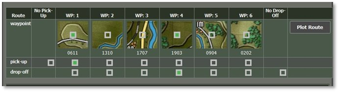

### Route, Pick-up & Drop-off Locations

In the Route section of the plan, click the ‘Plot Route’ button to set up six waypoints for the serial. The available route options depend on the type of the first transport unit. For example, if the first transport unit is a ship, movement will be restricted to connected sea and river hexes.

Once you set the six waypoints, the Route section updates to display the waypoint locations. The following image illustrates a route with up to six waypoints, options for skipping pick-up or drop-off of cargo units, and the ‘Plot Route’ button.

Set Pick-up Locations (if applicable):

- Select a waypoint hex where units will be picked up.

- Check the box beneath the chosen waypoint in the ‘Pick-up’ row.

- Select the ’No Pick-up’ option if no units are picked up.

Set Drop-off Locations (if applicable):

- Select a waypoint hex for unloading units by marking the corresponding box in the ‘Drop-off’ row.

- If the plan is only for loading units, select ‘No Drop-off’ instead.

To modify a route, plot a new one.

**NOTE:** The planner does not allow unit drop-offs before all scheduled pick-ups in the same plan.

**NOTE:** A plan must have at least a drop-off or a pick-up. If you do not want either, do not use the Transport Planner.

### The Plan’s Escorts

The Escorts section of the plan displays the escort units assigned to the mission.

- To add an escort, Right-Click on an eligible unit in the Escorts tab.

- To remove an escort, Right-Click on the escort unit counter already placed in the plan.

The following image illustrates the Escort section with AH-64 Apache helicopters selected.

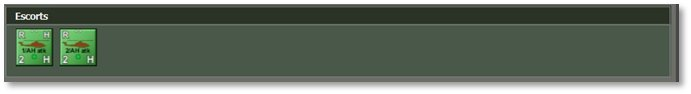

### Actions: Issue, Cancel, and Delete

At the bottom of the plan interface, you’ll find a summary of the plan’s state and type, along with three key action buttons: Issue Plan, Cancel Plan, and Delete Plan, as shown in the following image.

The following explains their functions:

- Issue Plan: This button becomes active once transport units, cargo, a valid route, and pick-up and drop-off locations are selected. Clicking ‘Issue Plan’ converts the plan into active orders for all assigned units, overriding any previous orders they had.

- Cancel Plan: Once orders have been issued, this option removes the transport orders issued and replaces them with default orders. However, it does not restore the units’ orders before the plan. The plan itself remains intact for future modifications and re-issuance.

- Delete Plan: This permanently removes the plan from the Planner, freeing space for new plans. However, deleting a plan does not cancel any orders that have already been issued associated with it.

**NOTE:** If you need to remove a unit from the plan after issuing orders, use ‘Issue Plan’ to ensure the removed unit is no longer assigned orders from the plan.

**NOTE:** Clicking either Issue or Delete Plan will Cancel the plan first, so all units that were previously involved will get set back to default orders.

## Planner UI – Tabs with Candidate Units

The lower half of the Planner UI contains tabs that list candidate units for transport, passengers, or escorts. These tabs are designed to help you quickly locate units that meet the requirements of the selected transport unit.

### Transports Tab

The ‘Transports’ tab displays transport units that match the plan type (e.g., ships for a naval plan and helicopters for an air assault). The list is divided into available and unavailable transport, sorted by remaining transport capacity, with units having the highest capacity appearing first.

The following image shows the candidate transport for the current plan. The available transport is listed above a separator line, while allocated transport appears below it in descending order of capacity. **Right-Click** on its unit counter to add a transport unit to the plan.

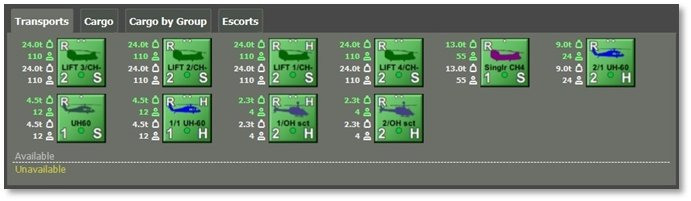

### Cargo Tab

The “Cargo” tab and the “Cargo by Group” provide access to available cargo or passenger units. Candidate units are categorized into three groups based on their transport compatibility:

- Group 1: Units within the selected transport’s remaining capacity are not assigned to other plans. These units are displayed in white text following their counters, indicating their transport requirements, and are listed in order to increase transport needs.

- Group 2: Units that fit within the selected transport’s remaining capacity but are already assigned to other plans. These units are denoted in yellow text, indicating their prior assignment, and are also sorted by increasing transport requirements.

- Group 3: Units that exceed the selected transport’s remaining capacity. These are marked with red or yellow text, highlighting their growing transport requirements.

To add a cargo unit to the selected transport, Right-Click on a unit counter labeled in white text.

**NOTE:** The list of units within the remaining capacity is determined by the currently selected transport in the plan. Assessing whether a unit fits into a transport is more complex than comparing weight and personnel limits. For detailed information, refer to Section above, “Transport Capacity and Requirements.”

The accompanying image illustrates candidate cargo units, displaying:

- White-labeled units (available and within capacity),

- Yellow-labeled units (assigned to other plans but within capacity), and

- Red/yellow-labeled units (exceeding capacity).

All units are sorted to increase transport requirements.

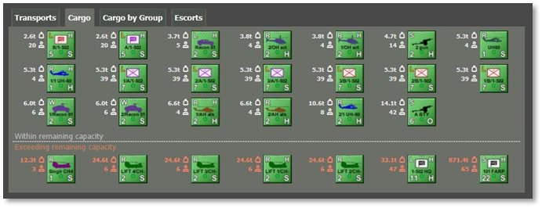

### Cargo by Group Tab

The “Cargo by Group” tab displays available cargo or passenger units categorized by their respective group affiliation.

It prioritizes maintaining unit integrity by distinguishing units from the same group as the already selected cargo in the plan from others.

As shown in the following image, units belonging to the same group as the existing cargo appear above the separator line. In contrast, other units are sorted by group and transport requirements below. To add a unit, Right-Click on a unit counter with white text.

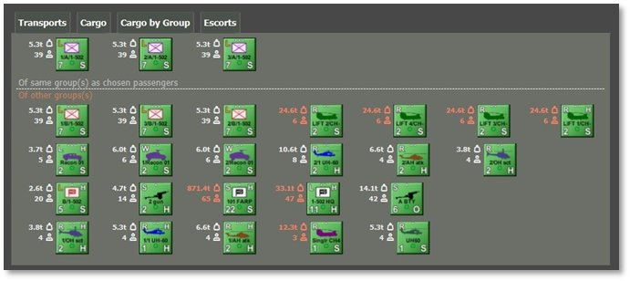

### Escort Tab

The ‘Escort’ tab displays eligible escort units that meet the transport’s mobility, speed, and armament criteria. Escorts are categorized into available units and those currently assigned to other plans.

The following image illustrates that available escort units are listed above the separator line, while unavailable units are listed below. Right-Click on a unit counter above the separator line to assign an escort to the plan.

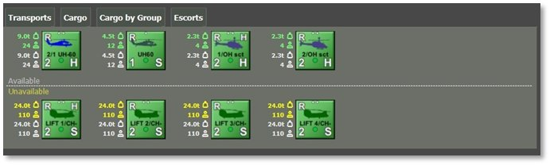

## Monitoring Transport Operations

Transport operations can be tracked using three primary methods:

- Transport Overlay – Displays simplified routes for all planned and executed transport missions.

- TOC Operations, Transport Tab—This tab provides an overview of transport units, their capabilities, embarked cargo, and estimated pick-up and drop-off times.

- Unit Dashboard—This dashboard displays each unit’s participation in a transport serial and their assigned transport, allowing for quick post-disembarkation orders.

### Transport Overlay

The transport overlay highlights movement corridors for current and planned transport operations, including designated load and unload locations.

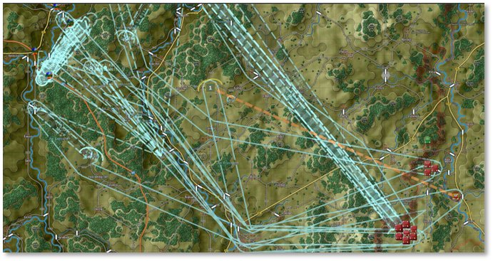The image above emphasizes the route from pick-up (if applicable) to drop-off, while the return (egress) portion is less prominent.

- If a pick-up or drop-off occurs within a hex, a single load/unload hex is displayed.

This overlay appears automatically when planning transport and can be manually enabled through the *Multi-Unit Overlays* menu under *Transport Plans*.

**NOTE:** These corridors serve as a reference. Transport units may adjust their routes between waypoints as necessary.

### TOC Operations – Transport Tab

The ‘*Transport’* tab in TOC Operations provides a comprehensive view of ongoing transport missions and available transport capacity for air and land assets.

The following image presents a summary of active operations and remaining transport capacity.

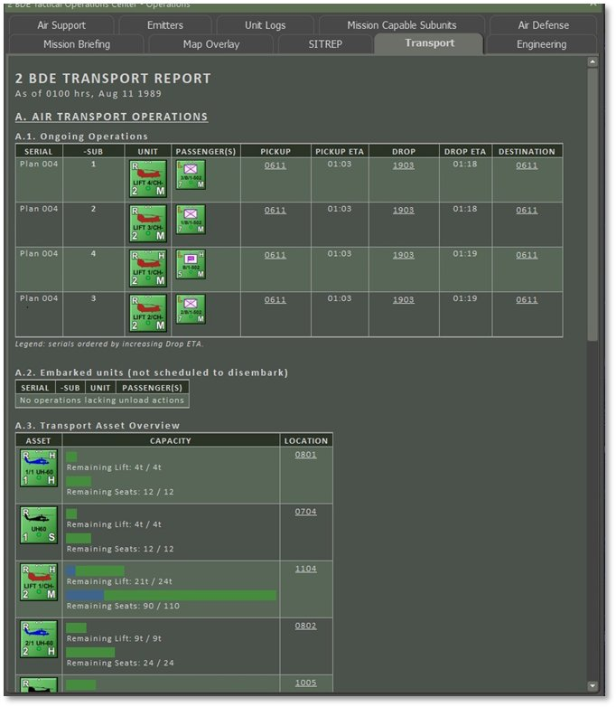

### Unit Dashboard – Transport Information

The Unit Dashboard provides essential transport details for units engaged in transport operations. It features links between transport and cargo units, enabling seamless navigation and quick switching between them.

The image below highlights the Unit Dashboard’s capability to connect cargo and transport units (marked in red). This functionality streamlines navigation, enabling users to view and manage unit orders efficiently.

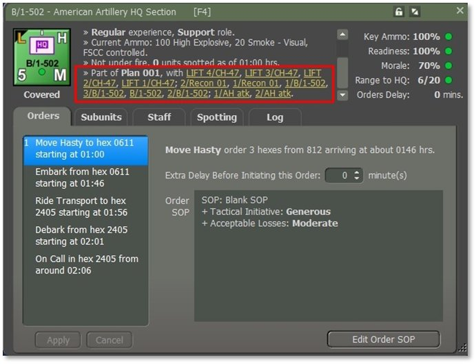

**NOTE:** Clicking on a cargo unit in the plan will automatically update the Unit Dashboard to display that specific cargo unit.

## Issuing Orders After Disembarkation

For air assault, issuing follow-up orders to inserted units is crucial, as it directs them to move and secure positions beyond the landing zone. Follow these steps to ensure a smooth transition after disembarkation:

- Select the Transport Unit – Open the Unit Dashboard and manually select the transport unit, or use the transport plan interface.

- Load the Cargo Unit – Click on the linked cargo unit assigned for transport.

- Switch to Movement Order – Right-Click to change the unit’s last order to a movement order. Plot a path toward the objective.

- Confirm Orders – Review the updated orders (highlighted in yellow). Click Apply to finalize or Cancel to discard changes.

## Modifying Issued Transport Orders

Transport orders issued can be modified in the Unit Dashboard with certain restrictions:

- Only the last order in a transport’s sequence can be deleted or changed.

- Movement waypoints can be adjusted by dragging them to new locations.