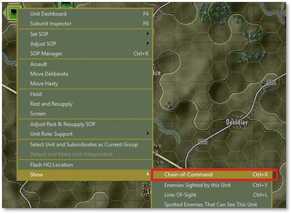
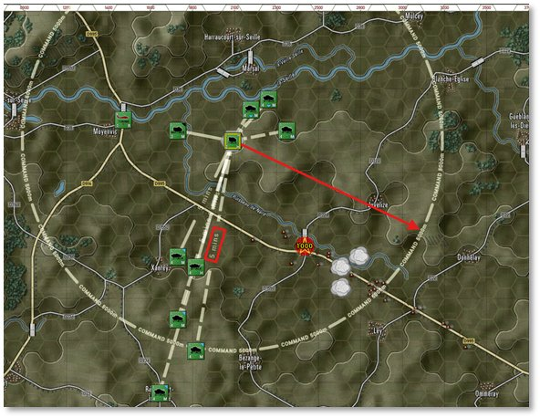
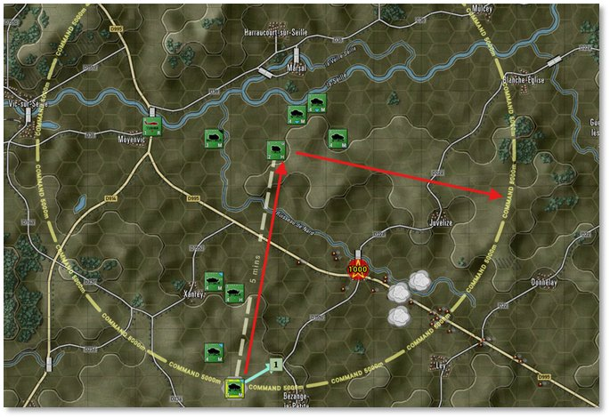
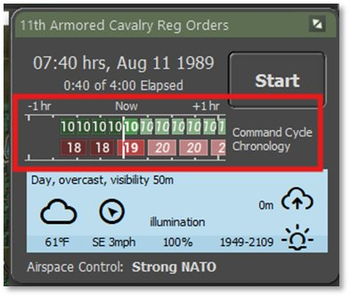
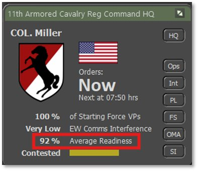
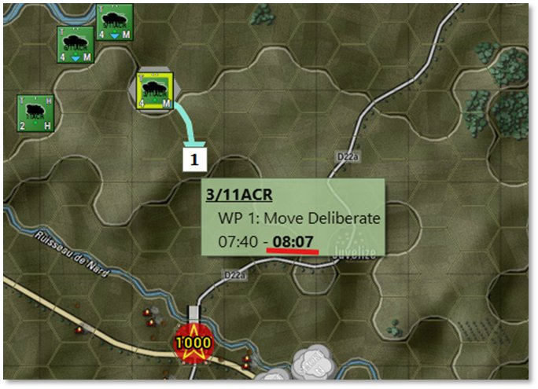

# Command and Control

In Flashpoint Campaigns: Cold War, Command and Control (C2) refer to effectively directing and coordinating military units to accomplish assigned missions. C2 involves managing the flow of information, issuing orders, and maintaining situational awareness through the game’s command interface. The game simulates realistic command delays, communication disruptions, and decision-making processes, requiring players to plan, adjust, and synchronize operations while considering unit readiness, command structure, and battlefield conditions.

!!! important

    In Flashpoint Campaigns: Cold War, the Command and Control (C2) system operates similarly for both NATO and the Warsaw Pact. Units rely on HQs, radios, and delays in receiving orders and reporting contact. Managing your chain of command is key to success, regardless of your side.

For detailed instructions on Command and Control, refer to ***FM01 Game Operations***.

## Chain of Command

Other than the initial set of orders to the units, all other units take time to get up and down the change of command and then roll out to any subordinates. There is also time required to change from one order state to another as crews may need to pack up their kit, load on transports, and coordinate movements.

To see the Chain of Command of formations, right-click on the 11ACR unit and then select Show and the click on Chain of Command as shown below.

This brings up the overlay as seen below the shows lines to subordinate units with base delay time and the command radius of the HQ unit.

In this case, there is a 5 minute delay for orders to travel from the HQ to the subordinate units and the HQ itself has a 5000m command radius. This radius allows units to get resupplied normally and have normal delays for communications. If units are outside of this radius and not of the recon type (like our units are) they would suffer additional delays and be less capable of full resupply.

If you select a subordinate unit, like the scout seen below, you get the line of command up to its local HQ unit and the Command Radius of the HQ

With the overlay active you can select any unit and see the command relationship. Also, it is worth noting that the AH-64 and the Artillery Battery do not report to the 11ACR unit as they are on the same level in the OOB and are considered independent units (command themselves).

!!! note

    If there are other HQs in the Command Chain, clicking on one will show the command chain to the others based on which HQ you select.

You can turn this overlay off right-clicking a unit and deselecting the Chain of Command entry. You can also close this by clicking the Special button on the bottom left speed buttons.

## Command Cycles

Another key component of Command and Control are the Orders Cycles. As seen to the right, this is the interval of timing when you as the Commander can inject orders into all your units. Currently, the player force is at 10 minutes, and the enemy is estimated at 18-19 minutes.

These numbers will increase with losses in force readiness, losses of units and losses of HQ units in the force. The Cycle Time can be reduced by resting forces and gain back lost readiness. Unfortunately, there is no way during a battle to replace lost HQ units so you need to protect those the best you can while seeking to take out the enemies HQ elements.

You can keep track of you forces Average Readiness as seen in the Command Panel above.

## Command Delays

All the previous Command and Control elements roll up into Orders getting sent that have delays involved and those delays can increase as a battle rages on.

What this means to you as the Commander, is you must be thinking “X” minutes into the future and then some. Nothing after game starts happens immediately on the battlefield. If you want units in a position you need to review the ETAs on the waypoints to have an idea of when you troops are going to be where they need to be. In the case below, The current game time is 07:40 hours but the Scout units won’t be on the hill until 08:07 hours.

As we noted before, the unit must receive the orders, plan the move, pack up kit, load on the transports, and finally get moving.

## Common Recruit Commander Oversights

The following list is a few common oversights made by new Recruit Commanders that can lead to frustration and loss on the battlefield.

- Thinking of the game as an RTS where units respond instantly to inputs.

- Thinking once a unit is in contact and the shooting has started that there is a way to fall back quickly. Make sure your SOPs are set to make this happen or plan well ahead.

- Failing to use the supporting forces in a way that aids in the mission. Smoke screens to block enemy vision. Dropping ICM on massed formations. Hitting suspected enemy HQs with artillery or airstrikes to drive the command cycle time of the enemy up.

- Keeping an eye on the weather and time of day. Your units have sensors and weapon systems that perform differently or not at all depending on the weather and time of day.

- Failing to plan the fight. While the plan will fall apart on contact in most cases, having a plan and understanding contingency actions will go a long way to winning battles or saving force.

- Those little pixel troops have a will to live and can go off script if they are under heavy attack, taking losses or heavily outnumbered. They will, in most cases, not die in place unless the SOPs are very do or die oriented.

- While it may sound counter-intuitive, failing is one of the best ways to learn what went wrong during a battle and make sure the lessons learned are carried with you into the next battle.

Let’s get on with the battle and run things to conclusion.