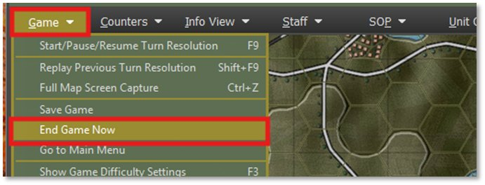
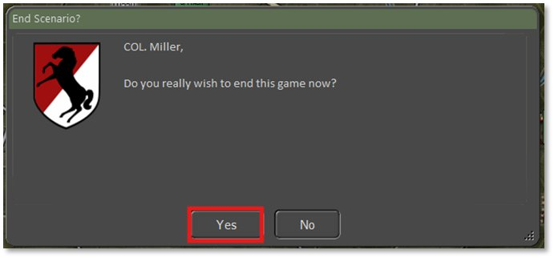
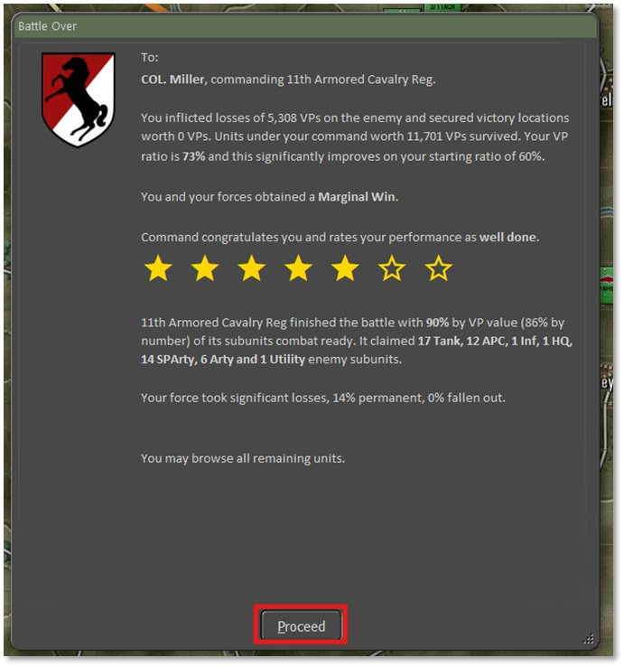
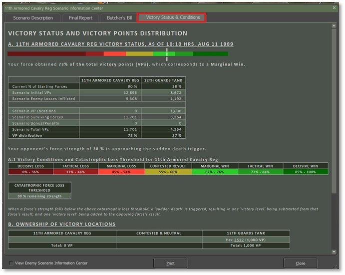
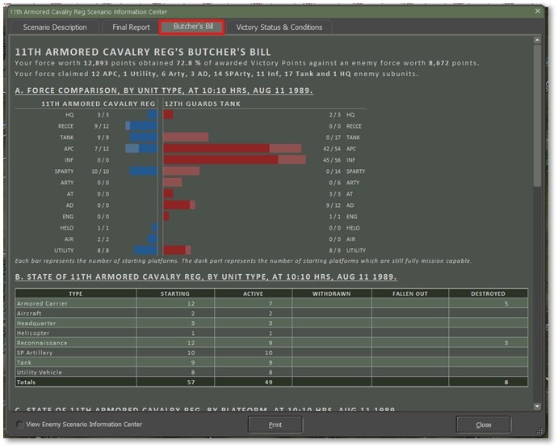

# End Game Post-Mortem

Go to the main menu, Game tab and select End Game Now.

The dialog below pops up, and you need to select Yes to end the game.

The No button will place you back in the game.

After hitting Yes, you get the end game music and the Battle Over overview dialog and score in number of Stars. The dialog also states the losses in Victory Points. Also, the level of victory or loss is shown, in this case we rated a Marginal Win. A summary of what our forces destroyed and an assessment of our losses.

Hit Proceed to bring up the Scenario Information Center. If not selected, click on the Victory Status & Conditions tab to get the information below.

The tab shows details on the scoring, the final victory condition, and the ownership of the battle VP locations. In this case the Soviets owned it at the end.

Next click on the Butcher’s Bill tab to see the information below.

You get a graphical representation of the unit type losses and then more detailed reports on units and then platform losses as you scroll down.

The Final Report Tab shows you the same information seen in the Battle Over dialog.

The Scenario Description shows you the pre-game scenario information.

Now you can close the dialog and look over all the units on the map. You can double click on all units to bring up the dashboard and review their information.

Feel free to look at the various overlays, probe the enemies equipment to see what they have. You can also open the Ops and Int reports and review the final state of the battle.

The follow on Tutorials will dig much deeper into the aspects of many of the mission functions we touched on in this basic tutorial, including how to make best use of engineers, artillery, air support, air assault and so forth.  You can consider these tutorial documents the “introductory manual” and then once you have completed them there’s the main Game Operations manual as a further reference.

Happy Hunting Commander!