# Issuing Orders to Units

In Flashpoint Campaigns: Cold War, issuing orders to units involves providing clear, concise, and actionable instructions to subordinate units, enabling them to execute specific tasks or missions within the game.

These orders outline objectives, assigned tasks, coordination measures, timing, and available support, ensuring that units understand their roles and responsibilities. Orders are delivered through the game's command interface, allowing players to manage unit actions such as movement, engagement, and resupply in a structured and realistic operational environment.

**NOTE:**Whether you're commanding NATO or Warsaw Pact forces, issuing orders works similarly. You'll use the same process to order units, assign fire missions, and manage readiness. Don’t worry about differences in nationality—focus on learning how to give smart, timely orders.

For detailed instructions on Issuing Orders to Units, refer to ***FM01 Game Operations***.

## Plotting Red Route Movement for Scouts

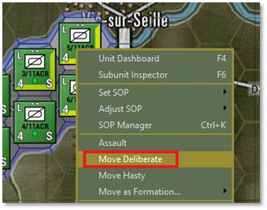Use Shift to select 3, 5, & 6/11ACR. Right click on one of the units and then select Move Deliberate to order a protected and slower approach to the destination.

A dialog will pop up noting the number of waypoints you can select.

Next, we will select the following waypoints as seen in the screenshot below.

Click on the map in the three hexes to set the waypoints and then select

The Commit button to set the movement order.

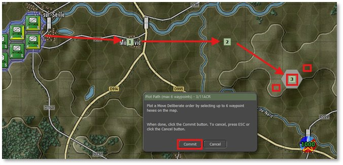

Then from the Orders on Arrival dialog, click on Hold to have the units dig-in and defend from the final locations.

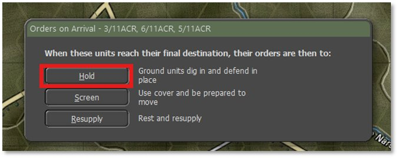

The units can cross the creek (the thin blue water obstacle the runs north to south across the path) without engineering help with a bridge. The river just to the north of the path would need a bridge to cross.

A standard movement order makes all the selected units travel and ends on the given waypoints. To not stack up and be a larger target for the enemy, especially artillery, we need to select each of the three Scouts and click on two of the end points and drag them to either side of the final waypoint with the end result as seen below. To help see all movement paths, select the Multi-Unit Overlay from the Main Menu, and click on All Paths or click on the Paths button in the bottom left bar.

Once the movement order is issued, the troops mount up, and the counter image changes from the NATO Scouts to the M3 Bradley and the movement type goes from L (Leg) to T (Tracked) as seen below.

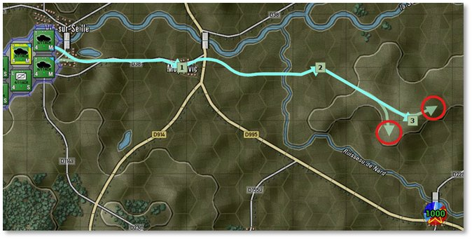

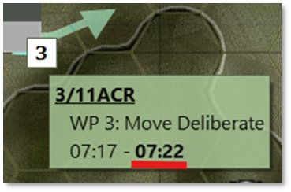To get an idea of arrival time at the final locations you can hover over waypoint #3 to get the information seen below. Our units should been on station around 07:22 hours. This could vary as traffic and other factors may alter the arrival time.

We need to have this idea to know when to start dropping the smoke screen and move the helicopter up for support.

Looking at the Game panel, it may take 2 or 3 command cycles for those units to get into position.

**NOTE:** These are the basic steps for plotting any type of movement command to on-map units. The following sections will show the movement orders in less detail as it is the same type of information.

## Plotting Blue Route Movement for Scouts

Use Shift to select 1, 2, & 4/11ACR. Right click on one of the units and then select Move Deliberate to order a protected and slower approach to the destination.

Next, we will select the following waypoints to move these Scout to the southern ridge and select Hold for the Arrival order. Then select two of the other scouts and fan the final waypoints out as seen below.

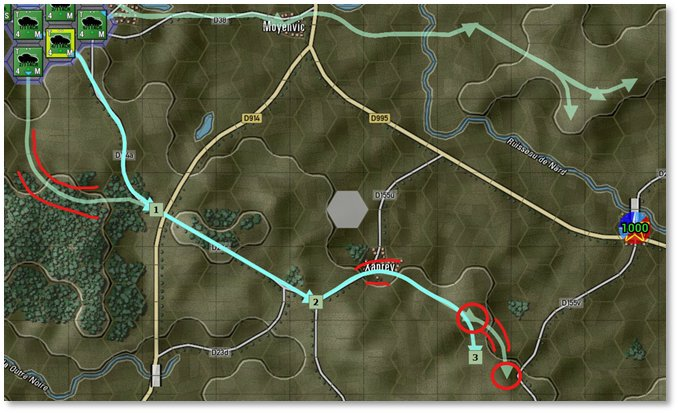

What we see in the three red-lined areas are movements that aren’t really what we want to keep our units on the higher ground. If this happens there are a few options to correct the pathing. One is redoing the order and setting more or different waypoints to keep units where we want them. Another is to right-click on a waypoint marker and use the pop-up menu to adjust the movement preference just for that waypoint.  The last is to adjust the SOP for movement. We will do that in this case. Shift select the three scouts and then Right-click on one to bring up the Orders Menu and select Adjust SOP/Movement Preferences/Direct Path and click on Prefer.

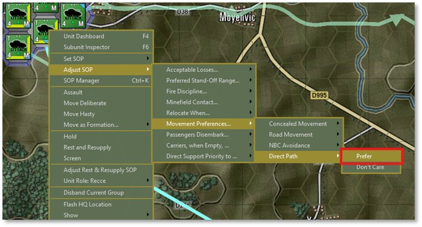

This will adjust the pathing as seen in the image below. This is a better movement and end location pathing. Units will get there near 07:18 hours.

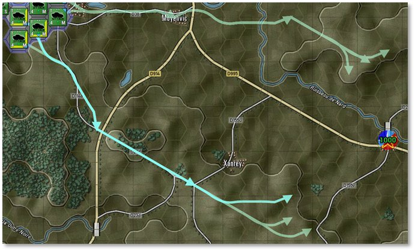

Next let’s get the tanks in position.

## Plotting Green Route Movement for Tanks

Use Shift to select 7, & 8/11ACR. Right click on one of the units and then select Move Deliberate to order a protected and slower approach to the destination.

Next, we will select the following waypoints to move these Tanks just East of Xanrey and select Hold for the Arrival order. Then select one of the tanks and position final waypoints out as seen below.

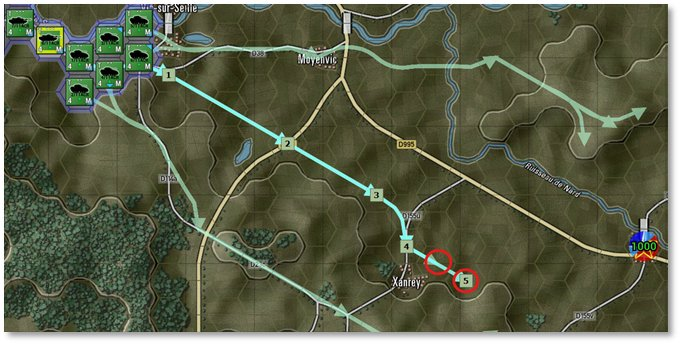

## Running the First Turn Resolution

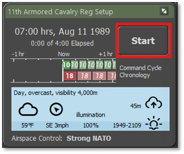We need to at least get these units moving before setting the other moving and dropping the smoke screen.

Click on the Start button to run the first turn of game resolution. Watch the action as the forces you ordered move out. Of course, the enemy is on the move as well so we will hope we do not run into them before getting set up.

After hitting Start, the units will move out across the map following the pathing set by the orders.

At the start of a scenario, or later if they have just entered as reinforcements, units follow assigned orders without any delay.  In all other instances, there is a delay between when you assign an order and when the unit begins to execute that order.

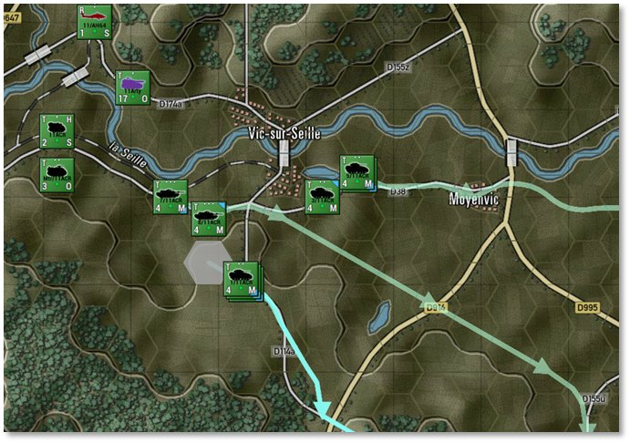

As seen below four or so minutes have elapsed and the units have covered about 3.5 kilometers of ground as seen below.

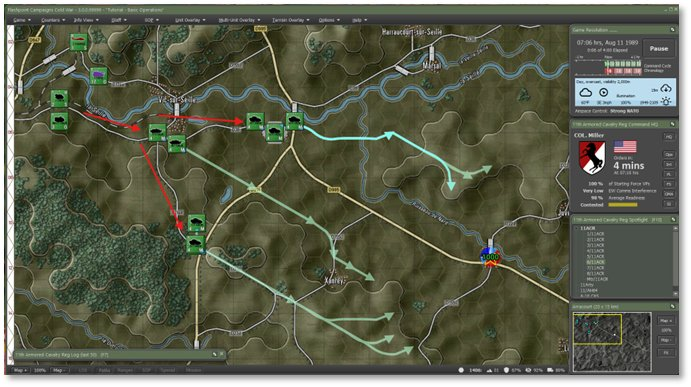

Nearing a minute left and we receive a game message about a change in the weather and a shift in visibility down to 500m as there is haze/fog in the area. Good news is that will help mask your existence to the enemy who does not have thermal sights and can’t see through the haze like your forces can.

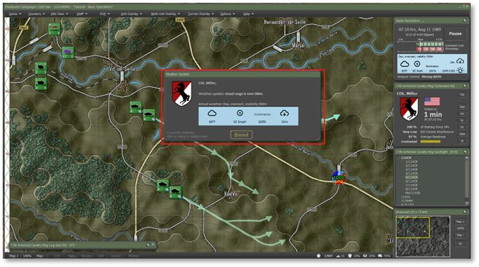

When the turn cycle ends you will see the message below and hear a double burst of radio static.

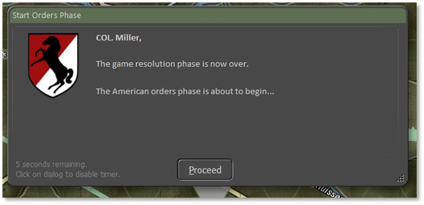

## Plotting the Gold Route Movement for the AH-64

While the Scouts and Tanks have another turn or two on the move to reach the fire positions, we need to order the AH-64 Attack helicopter to begin moving out. It is much faster than the ground units, but units will now have some orders delay getting going as we are now past the pre-battle orders.

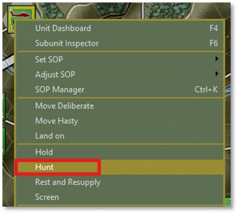Right-click on the 11/AH64 unit and then select the Hunt order. Hunt is an order specific to helicopters that has them dance around and use terrain masking while looking for enemy targets to engage. This movement is designed to reduce their exposure to enemy air dense units or ground fire that could take them out.

Plot the route as seen in the image below and then set the Order on Arrival to Screen so the helicopter will move and disengage if under fire based on its SOP settings.

**NOTE:** There is no FARP (Forward Arming and Refueling Point) on the map for this helicopter to go back to if it needs to rearm when out of key ammunition. The unit may go back and land near the HQ unit as that acts like the FARP when one is not in the battle.

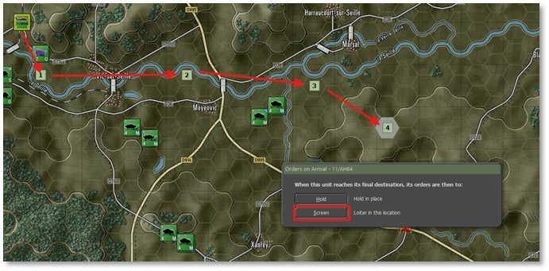

## Plotting Pink Route Movement for the HQ and the Mortar

Use Shift to select 11ACR & Mtr/11ACR. Right click on one of the units and then select Move Hasty to order a faster and less defendable approach to the destination. We should be safe doing this with the combat units forward.

Next, select the following waypoints to move these units behind the ridge just south of Marsel. Then select the Mortar and position final waypoint out as seen below. Set the Order on Arrival to Hold for these units.

Note that the Mortar’s default SOPs will cause it to seek Concealment as it moves, which will send it out of the way, and we don’t need that in this case.  Use the previously explained method to adjust its SOP movement preference to turn off Concealment so it paths through the open terrain and arrives at its destination more quickly.

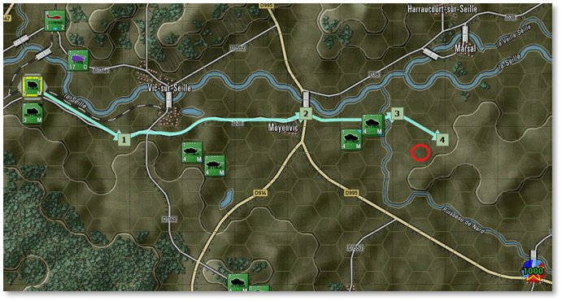

Double click on the Mtr/11ACR unit to bring up the Dashboard. Select the final order the hold and right-click on it. This will being up a small Orders Change menu. Select the On Call order. The Apply button will turn yellow. To confirm the order change, click on the Apply button.

**NOTE:** You can alter the order for each movement point. You can go from a Hasty move to a Deliberate Move and finish with an Assault move if it fits the need. You can also adjust the unit’s SOP setting for each order in the list in this dialog and there are cases where that will be useful.

Close the Dashboard with the “X” in the upper right.

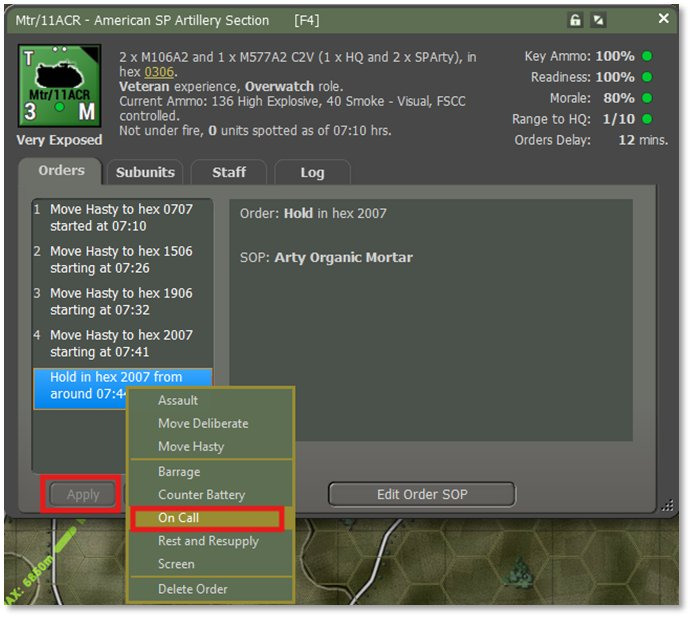

## Requesting the Smoke Screen Mission

Select 11Arty. Right click on the unit and then select Barrage and then select Smoke – Visual Blocking. This will open the Plot Targets dialog.

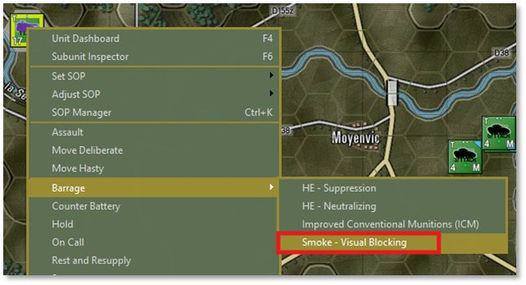

Set up the 6 Target Points as shown to attempt to block the entire approach in the valley.

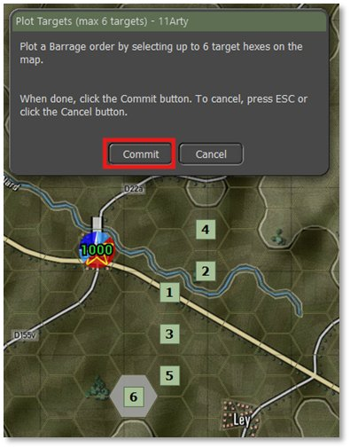Odds are we do not have enough rounds to do the whole line but getting the central portion up will help when contact is made.

Hit the Commit button to lock in the barrages and this will pop up the Dashboard for the Artillery unit and show the fire missions on the map as seen below.

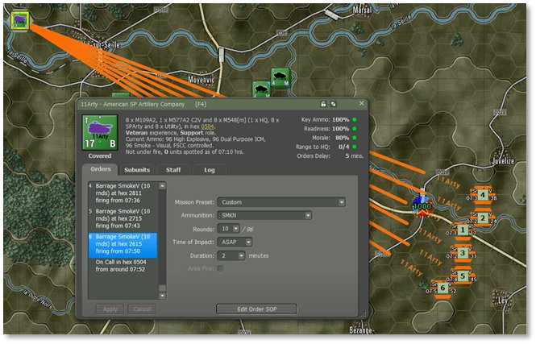

The default 20 minute mission per hex will be too slow to get the screen up so we need to adjust all 6 fire missions to change to a 2 minute duration of each mission.

Click on each mission and then click the Duration drop down and scroll up to get to 2 minutes and then click on the 2. Do this for all six missions and then hit Apply to order the changes.

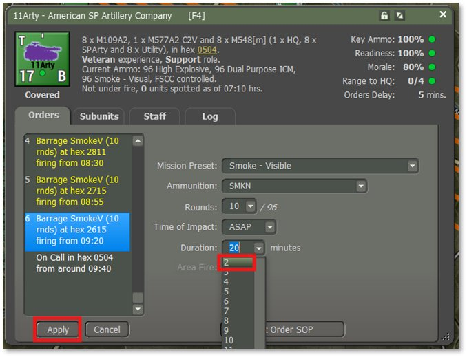

Click the “X” up in the corner to close the Dashboard so we can start the second turn resolution.

## Running the Second Turn Resolution

Let’s hit Start to get the second turn of resolution underway. Then hit Proceed from the Announcement dialog.

After about 5 minutes the first of the smoke rounds hit and produces a smoke screen in the first target hex as seen below.

Please note that once combat begins, because there is variability in the game, some events may proceed differently for you, but the lessons below will still apply generally and allow you to adjust for any differences.

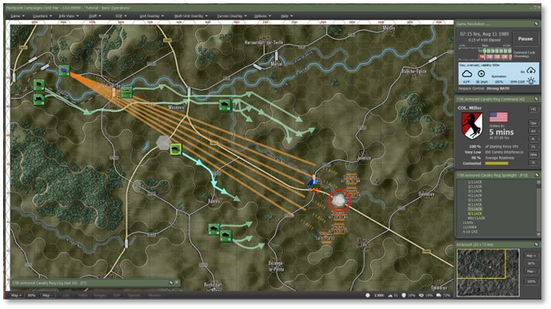

2 minutes later, the first enemy contact in the valley comes from one of the Scouts on the southern ridgeline. On inspection, it is noted as some type of tank unit moving up the autobahn.

In a well-timed appearance on the northern ridge, the AH-64 spots the tank unit and fires and then sees another unit further down the road and launches Hellfire ATGMs at both groups and gets kills in both target units.

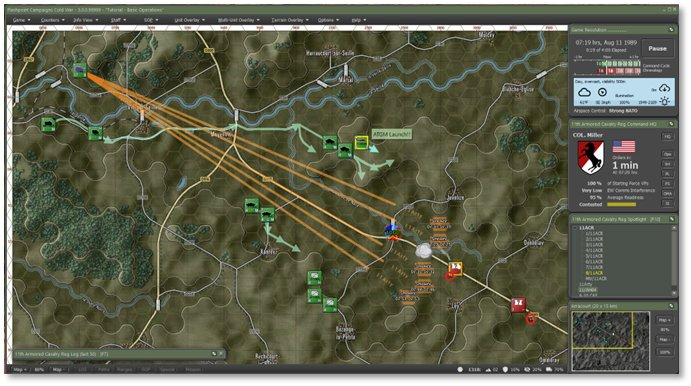

After the turn ends, opening the Dashboard of the AH-64 and checking the Log tab, we see the reports of the engagements and the claimed kills.

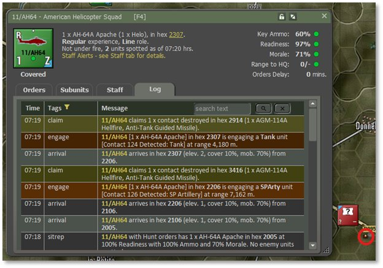

Checking the Line of Sight (LOS) of the M3 Bradleys on the Southern Ridge, we can see that the one unit is within line of sight of our units, but just outside of the TOW ATGMs carried on board.

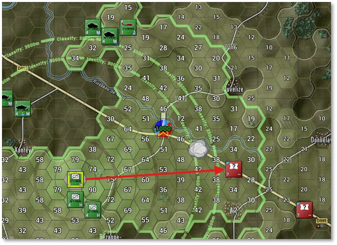

The northern Scouts are still not quite in position, and the Tanks are also still getting close to their final locations.

Let’s move on to the next turn resolution as we have all the units in motion and have started engaging the enemy.

## Running the Third Turn Resolution

Let’s hit Start to get resolution underway. Then hit Proceed from the Announcement dialog.

After a minute the Scouts on the Southern ridge open up with ATGM fire.

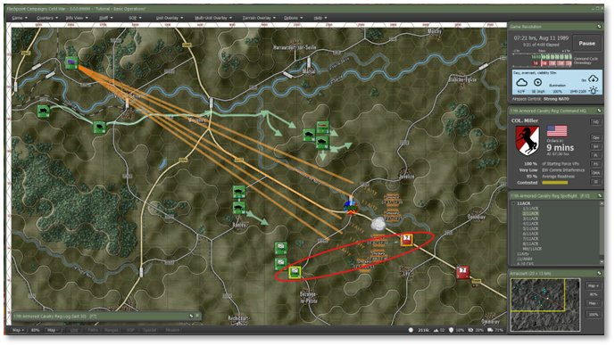

1 minute later, the contact is identified as T-80s and a TOW-2A finds its mark. Also of note, the AH-64 has fired off its ATGMs and is pulling back to the HQ to rearm.

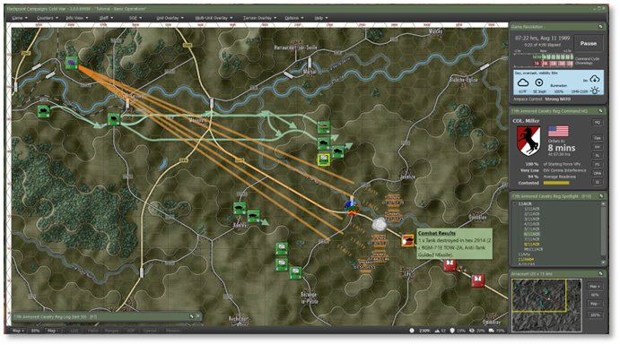

Our units have managed to take out the detected tank unit. All units are now in position on the ridges, and the Tanks are sitting in reserve behind the hill. Looking to engage anything that leaks through the objective.

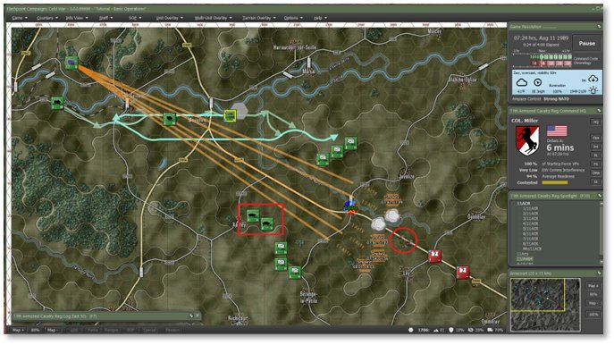

As we are down to 4 minutes before the next order phase, a unit of mechanized units pops up out of the smoke near the objective.

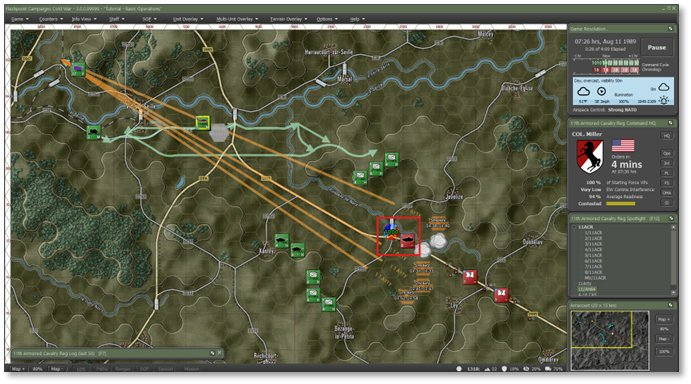

The enemy unit immediately comes under fire from the Scouts on both Ridges and takes losses.

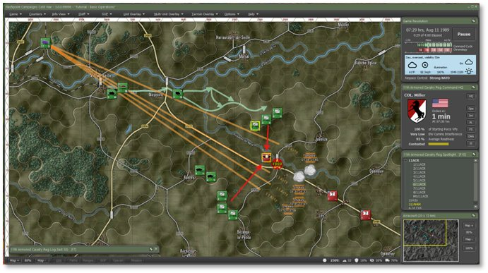

After the turn ends, we can open the Dashboard and look at the scouts and see the logs to see the results of the combat. In the case shown, three enemy vehicles were taken out with fire from the Scouts. You can review all units to see how they did.

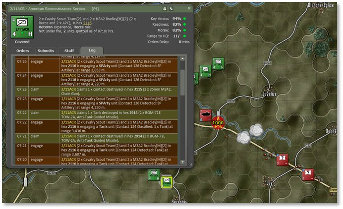

Now open the Intelligence Staff report dialog by hitting the “Int” button on the Command Panel. Select the Reported Kills and Claims tab. Here you can see what your units have claimed were destroyed up to this point in the battle.

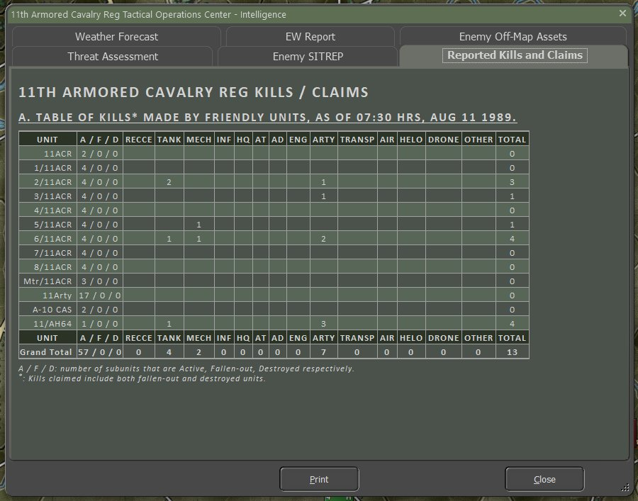

**NOTE:** Your playthrough can have a different set of results as the game is not scripted and the combat is dynamic every time. Please continue as we work toward an end game resolution.

## Running the Fourth Turn Resolution

Let’s hit Start to get the turn resolution underway. Then hit Proceed from the Announcement dialog.

Our units might have taken fire this turn, but the weather has changed in our favor with fog on the battlefield. The 50m visibility and the 0m cloud ceiling mean the enemy troops can’t see us, but we see them with the thermal sights (even with them degraded by the fog). Our units on both ridges continue to pick off enemy units.

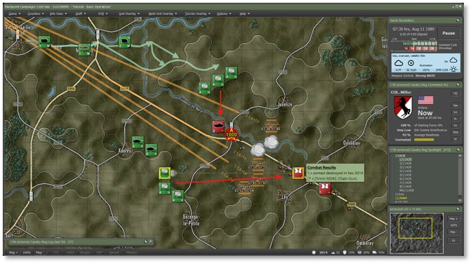

As more enemy units try to push up the autobahn, the Bradleys are doing good work with with volleys of TOW-2A ATGMs and when in range, 25mm autocannon fire, but some may slip through.

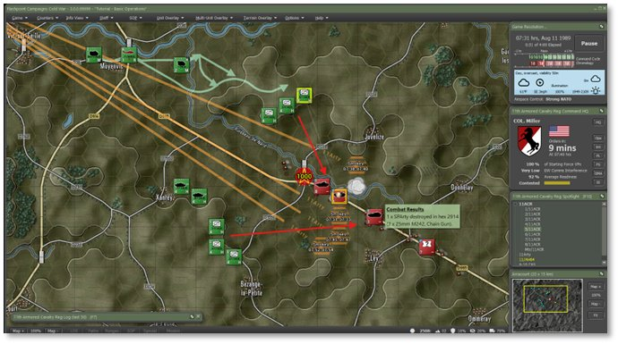

Now for the bad news. Due to the SOP settings that set a decent 3km standoff range from the enemy, our scouts on both ridges are starting to fall back as the action dies down.

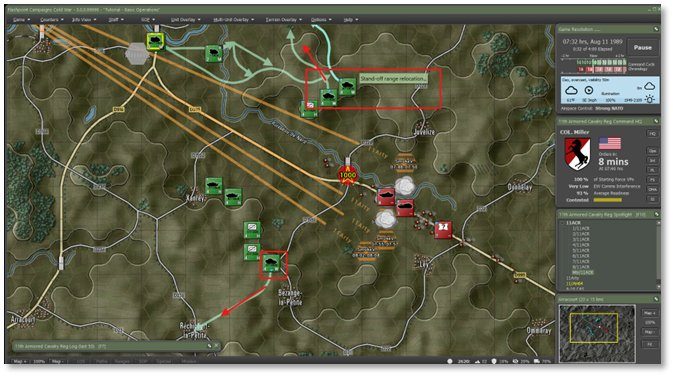

With the change in weather to fog, we probably should have gone ahead and adjusted the SOPs for the units and placed them in more of a hold versus the screen. We will fix this on the next Orders phase.

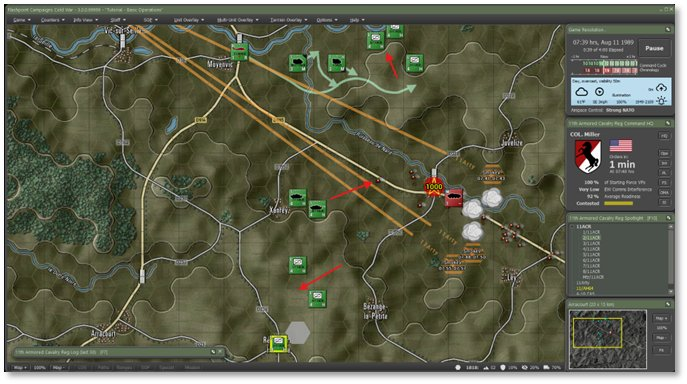

Now open the Intelligence Staff report dialog by hitting the “Int” button on the Command. Panel. Select the Reported Kills and Claims tab. We are up to 25 enemy subunits killed (lower right) versus none of our forces taking any losses (lower left numbers). We have removed the enemies security force at the point, minus a few stragglers that might be in the town.

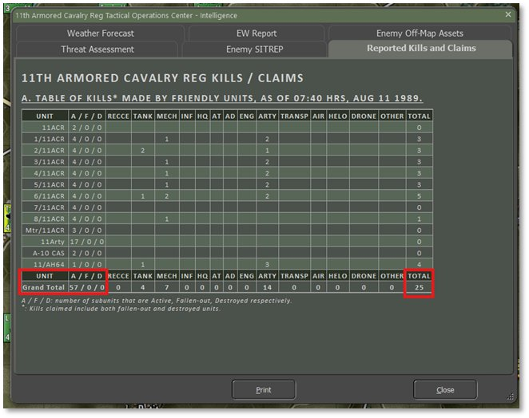

Now we need to issue some new orders to get our Scouts back into those nice firing positions so we can deal with the rest of the enemy’s mechanized force that should be hitting us soon.

## Issuing New Orders for the Scouts

As seen below, we need to get both sets of scouts on the ridge again to be ready for the main enemy effort we are expecting to appear soon.

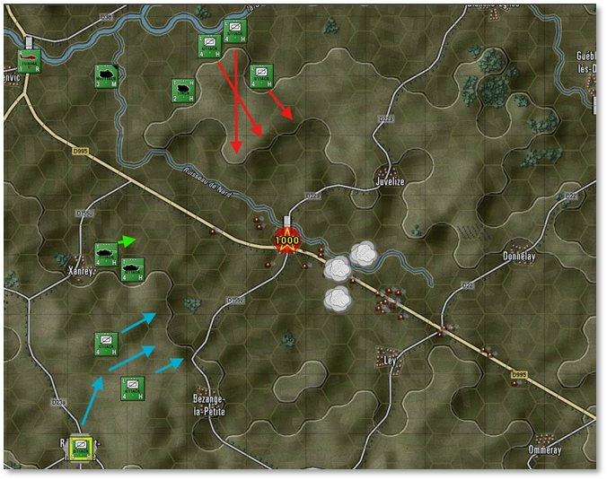

Select the three northern scouts by shift-clicking on them and order them to make a Deliberate move to the waypoint as shown below. Then set the Arrival Order to Hold.

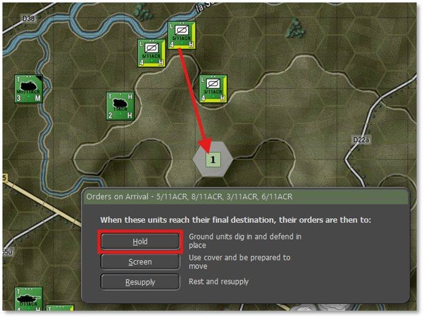

After setting the order, click on the other two scouts to shift their final waypoint as shown to spread the units out on the ridge.

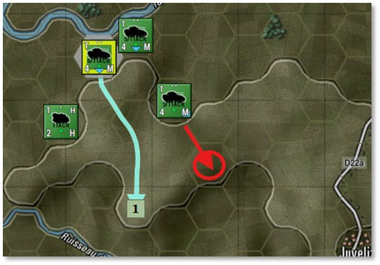

Next use the Shift-Select to select the three southern scout units and give them a Deliberate move order to the location shown and then click on the Hold Arrival Order.

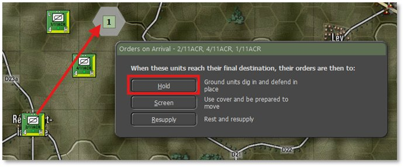

Next, select each of the other two scouts and spread out the final waypoint an shown below.

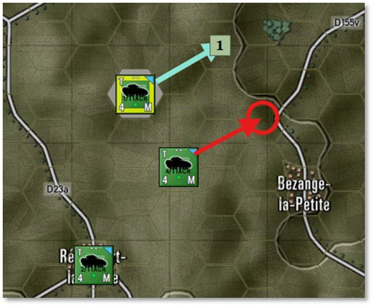

Setting the units to hold will keep them at the locations, but we should also alter the standoff range for all six scouts.

Shift-Select all six scout units and then right-click on one to bring up the orders menus. Select Adjust SOP/Preferred Standoff Range and click on 2 Hexes / 1000m to set the new range.

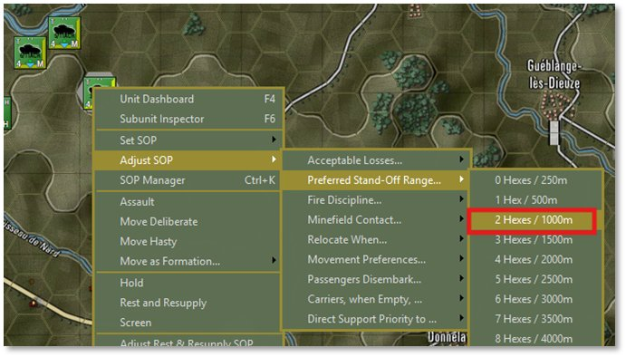

The dialog seen below will pop up and you can click Proceed to make the listed change to all the units.

**NOTE:** Below each unit, you can see the current setting that is getting revised.

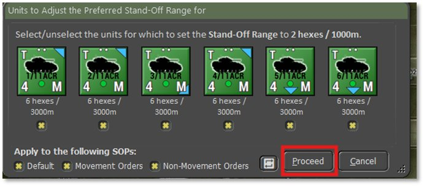

You will want to make the same adjustment to 2 Hexes / 1000m for your M1A1 Abrams tanks and also move them back if any of them also started to withdraw.

Before we continue with the battle, we need to talk about Command and Control in the game and its effects on orders and timing during the battle.