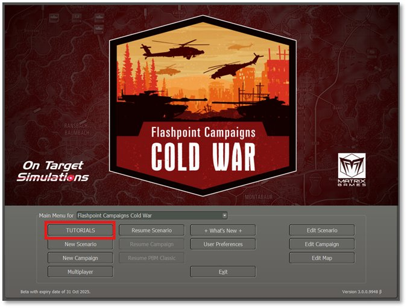
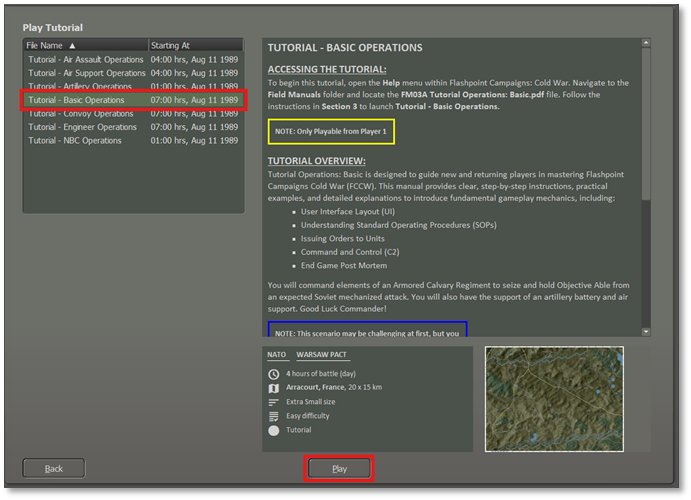
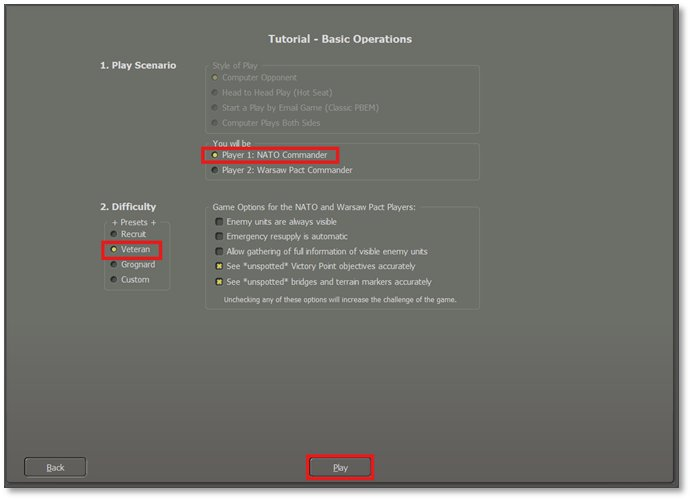

# Load the Basic Operations Tutorial

## A Quick Start Tutorial

The Basic Operations Tutorial scenario is used for all the sections of this guide. It is a simple mission you can execute to learn the basic game mechanics of the game engine and functions as a Quick Start and introduction to Cold War.

!!! note

     More information and details for all the games functions can be found in [**FM01 Game Operations**](../../game-operations/). We strongly urge new players to skim this document to gain an understanding of all the tools available.

The screenshot below shows the first screen when the game launches. To proceed, click the “Tutorial” button.

## Select the Tutorial Mission

As shown in the screenshot below, a list of tutorials will appear.

Select **Tutorial – Basic Operations by clicking on it with the mouse.**

Review the scenario briefing information provided on the right side of the dialog.

When ready, click the **“****Play****”** button at the bottom of the dialog to move to the next dialog screen

## Choose the Player Side and Options

On the screen below are two option areas. The first sets the Style of Play and Player Side and the other sets the Difficulty and Game Options.

Style of Play is automatically set to Computer Opponent.

Choose to play as the NATO Commander. The scenario is only designed to be played from the NATO Side.

Click on Veteran to set the difficulty options for this battle.

!!! note

     If the first run results are not to your liking, come back and set the Difficulty to Recruit to see the enemy units on the map. They are not visible to your units until they are spotted by them in the game.

Click on Play to load the scenario. It may take a minute or so to load the scenario and initialize the game.