# Resolving the Battle

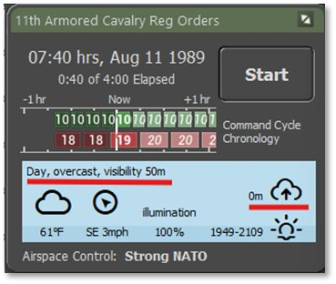We need to resolve the next two or three turns to get the scouts on the ridges and hopefully contact the main body of the enemy mechanized force. If we do, then we will need to alter our plan to deal with this new threat.

Looking at the Game Panel, we still have a heavy ground fog which works in our favor for the ground troops, but leaves our A-10 out of the picture for now until the weather improves later in the morning.

Let’s click on Start to get things rolling along.

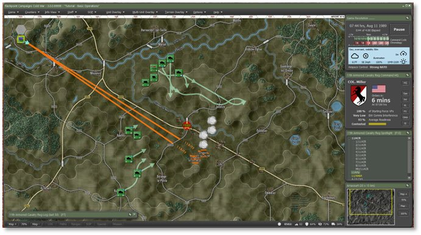

Not any real motion on the Scouts as they are getting orders relayed and getting packed up to start moving. More Smoke has dropped in the valley. You may be fighting some of the remaining forces trying to push through and even with your advanced sights, it may be difficult to keep them all sighted.

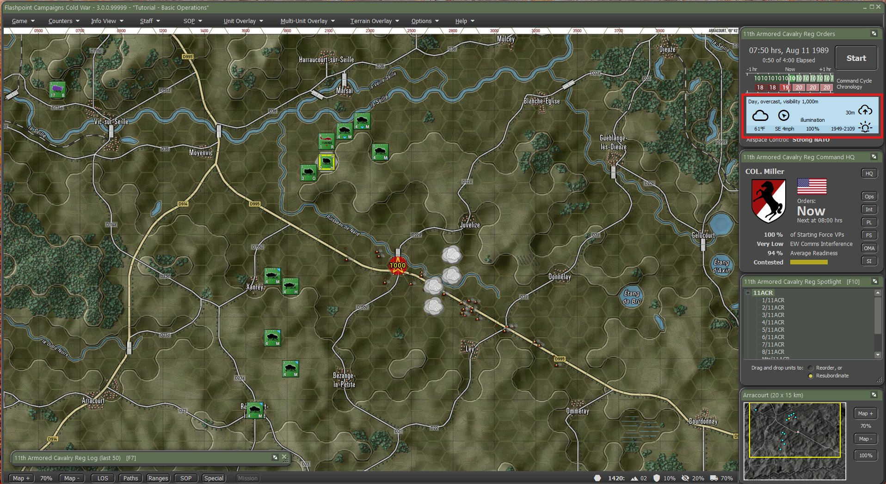

End of the turn resolution at 07:50 hrs and no reports of the main body yet. In the weather panel we can see that the fog is being to lift so we may get a sudden number of contacts as out Thermal sights peak deeper into the retreating fog.

Let’s hit Start again and proceed with the next turn resolution and take us to 08:00 hrs and we should have all the scouts on the move again.

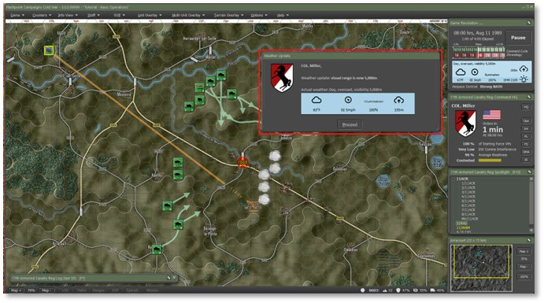

Another Smoke mission has completed, and we also have even more lifting of the fog with visibility out to 5000m.

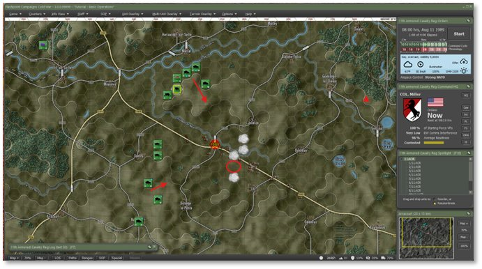

As units started moving again, we had one of our smoke missions deplete.

Hit Start and Proceed to move to 08:10 hrs and get most of our forces back on the ridgelines.

With 3 minutes left in the turn resolution, the southern ridge is set again.

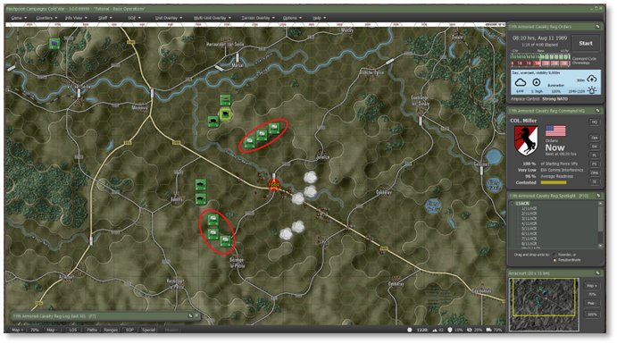

By 08:10 hrs we have all our forces in position. Now we hit Start again and see where the enemy is coming from.

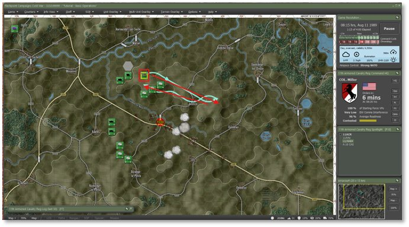

If your AH-64 finished reloading and needs an order, right click on it and issue a Hunt order across the northern ridge as shown above.

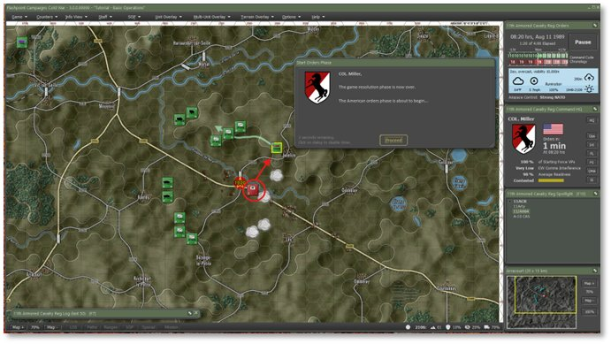

On the return leg, some stragglers near the objective fired at the AH-64. While the M109 Battery would hammer them hard, we need that battery ready to deal with the enemies main force when it shows. The better move is to issue an HE Barrage from the Mortar unit to suppress and eliminate those enemy units.

Right-click on the Mortar unit, then select Barrage and then click on HE-Neutralizing as seen below.

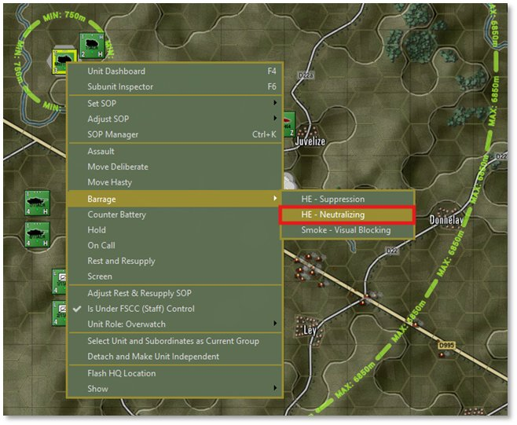

After the Plot Targets dialog comes up, click on the enemy unit and hit Commit. Once the Dashboard opens, scroll down on the number of rounds and select 60. Click on Apply to set the new round count and close the Dashboard with the “X” in the upper right of the dialog.

**NOTE:** It is very possible that there may be no enemies in the area or more. You can place more target points if more units are visible in your play through. This is again due to the dynamic nature of the game engine as we do not use scripted events.

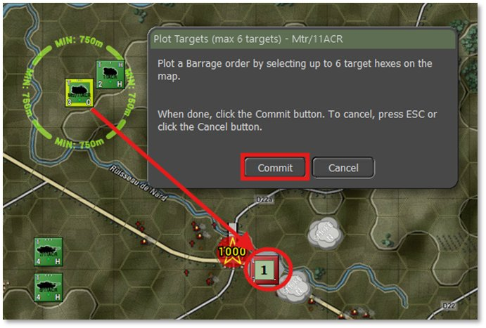

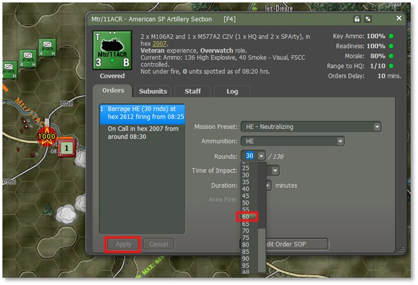

Let’s hit Start to proceed with the next 10 minutes of action.

Well, it did not take long for the action to pick up. A company of Soviet T-64 tanks popped up very close to our Scout on the southern ridge and there was a volley of fire from the AH-64 and the Bradleys that took out a good number of tanks for the cost of two Bradleys.

We also hit the unit in Objective Able with Mortar and chain gun fire from the AH-64 and either destroyed them or ran them off into the village in Able.

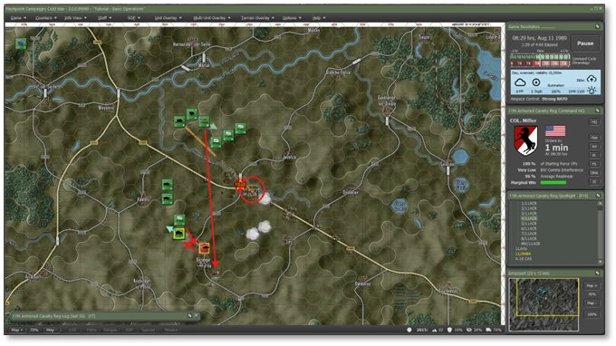

The other two remaining Southern Scouts are attempting to withdraw, but into not so great locations given the direction of advance of the tanks and the fact more enemy units are coming behind them. As seen below, click on each of the scouts, then click on and drag the waypoints as shown to pull them further back off the ridge.

Also click on the southernmost M1 tank platoon and issue a Deliberate move to the location shown so it has a better range of vision of enemy units coming down the hill. Set the Order on Arrival to Hold.

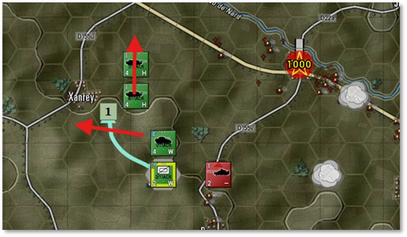

Click on the Int button on the Command Panel and tab to the Reported Kills and Claims. As you can see below, we lost both Bradleys and the loaded scout teams to the enemy tank fire. Our units have claimed 37 enemy units destroyed to this point in the battle. Also take a moment to review the information on the Enemy SITREP tab to note any units and spotting reports. Close the Intel dialog.

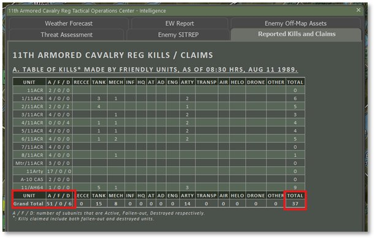

Now we will let the game run a few turns until we see the mechanized forces and then can hit them with ICM (Improved Conventional Munitions) and drop the A-10s in to take out the majority of those units.

Hit Start and proceed with the turn resolution.

Another 10 minutes and our force has taken out all the enemy tanks, but the Southern Scouts paid for it with heavy losses as seen in the Dashboard image below.

**NOTE:** As you can see on the counter and in the Dashboard, the “L” (Leg) movement icon is now orange indicating the unit no longer has enough transports to move is infantry units. These guys are on foot for the rest of the fight.

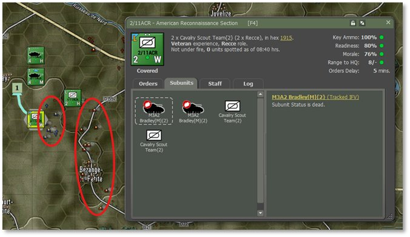

We also caught a glimpse of a Mechanized Company roughly Southeast of our remaining southern scouts.

Let’s hit Start again to resolve the next 10 minutes of action.

There was another glimpse of a possible enemy unit, but no shooting.

Let’s run the next turn and get to 09:00 hrs and hopefully see some targets.

Well, another 10 minutes and we have the suspicion of units in the area indicated below, but no hard contacts.

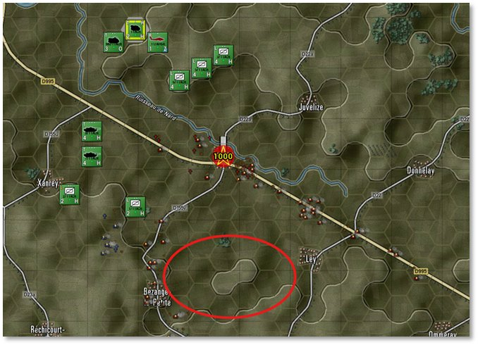

At this point it is possible that the enemy is replanning it’s movements based on the losses taken. They are also at a 20 minute Command cycle and we can do 2 orders sessions to their one now.

This is known as operation inside the enemies OODA loop (Observe, Orient, Decide, Act).

It’s now 0940 hours and the last 30 minutes has seen no action or contacts. While risky, we will plot a Hunt order for the AH-64 in hopes of locating the rest of the enemies force as seen in the image below.

The path for your Apache may be a bit different and depending on if it comes under fire and what it fires on, it may not find what our Apache found.  It may also decide to fall back to resupply before completing its route.  Hopefully it will still reveal some possible targets of opportunity for you, even if they are not the same ones we describe below.

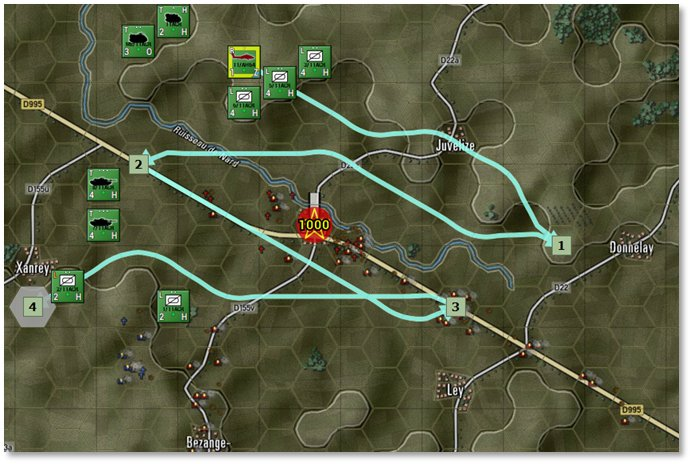

Hit Start to proceed with the next resolution and get the AH-64 in motion.

Our hunting helo ran across another enemy BMP-2 in Able and exchanged fire and got another kill. The AH-64 also spotted what appears to be an enemy Artillery unit located in the South. That is a juicy enough target to roll the A-10 in on and maybe we get lucky and find the other forces in the area.

If you spotted a different target with your Apache, you can choose to target that instead.

Open the Int Dialog and review the Enemy SITREP tab to locate the enemy target’s hex.

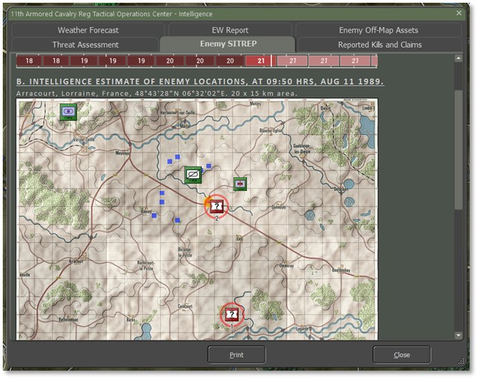

Next, click the OMA button and open the Off-Map Assets dialog and right-click on the A-10 counter to open the Orders menu. Select Air Strike and then select the location of the contact as noted from the intel Dialog as seen below.

Close the OMA dialog.

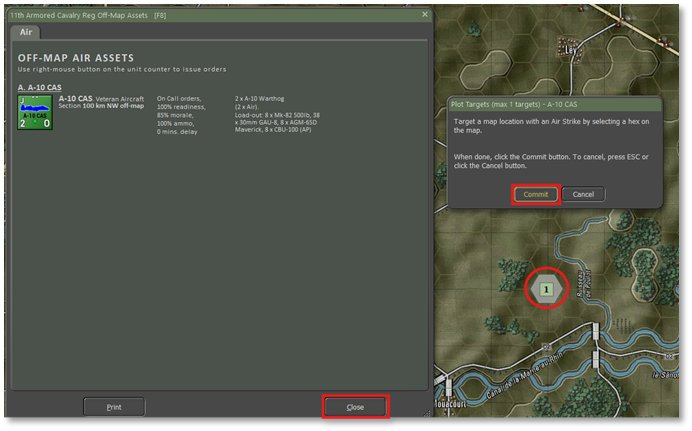

Since we have hit the apparent end of the fighting, The remaining force has decided to hole up and defend since they own the objective, lets use that Battery of M109s to drop some HE rounds across ABLE to try to remove the last of the enemy in there.

Right-click on the M109 Battery to bring up the orders menu and then select barrage and then click on HE – Neutralization as seen below.

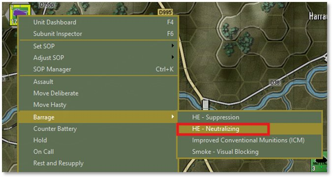

After the Plot Targets dialog pops up, select the three hexes as seen below to hit locations where the enemy may still be holed up.

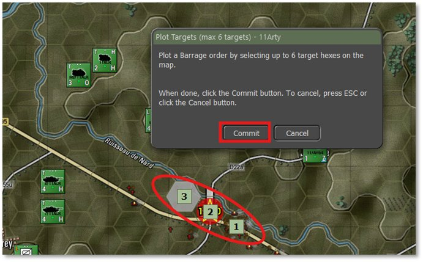

The M109 Battery Dashboard will pop up and in this case the defaults are good enough, so close the Dashboard with the “X” as seen below.

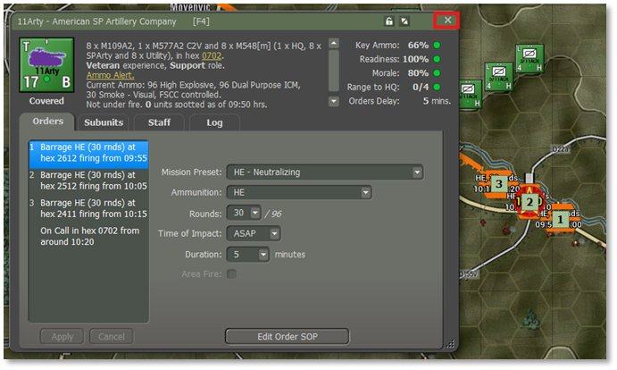

Run through the next few turns to see the results of the Air Strike and the Artillery Barrage. After that we will end this mission and move on to the End Game Post-Mortem to review the results.

The 155mm rounds dropping on the enemy locations.

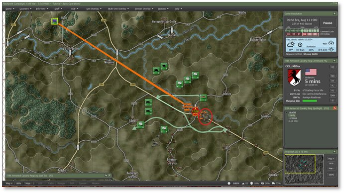

AH-64 Hits an engineering unit in the town.

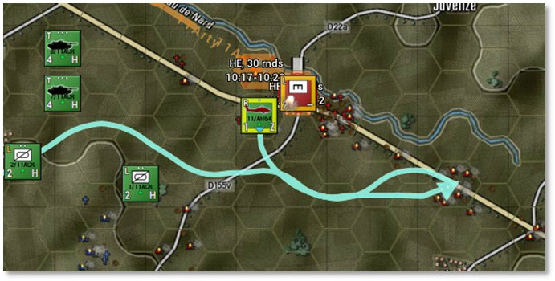

Next the A-10 flies in.

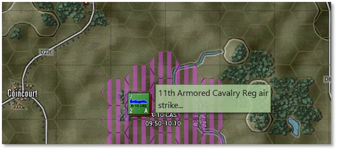

Dodges a MANPADs SAM from one of the Mechanized units.

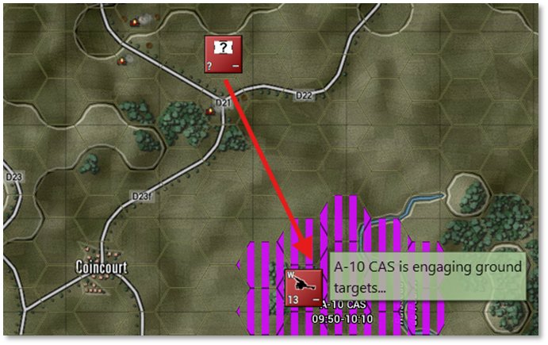

Hitting the target.

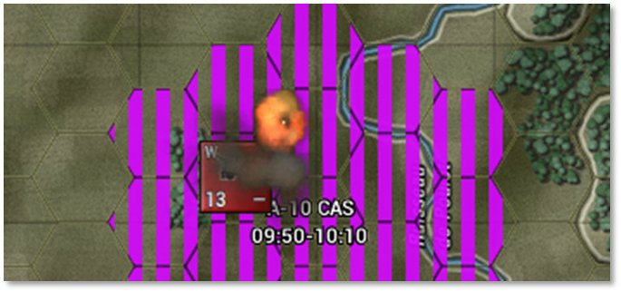

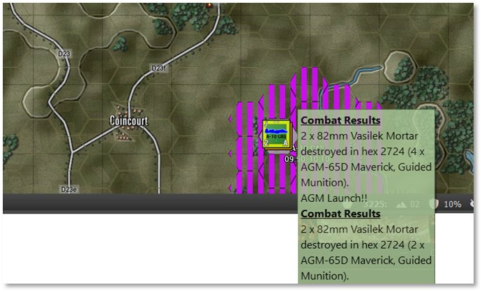

As seen above the A-10s hit several of the 82mm Mortars with Maverick missiles.

We are going to end the mission here and review the Post-Mortem information.

However, you may feel free to carry on or reload and try different approaches to the fight.  We will leave you with some suggestions regarding taking the objective, if you want to press the attack and try to get a better result than what we achieved.

First, you’ll likely want to reduce the SOP standoff range for your units further, to 1 hex for example, to allow them to close on the enemy and spot any units that are hiding without withdrawing.  Second, you’ll want to use the Move Deliberate order with your Scouts and Move Deliberate or Assault with your M1A1s to plan your attack.  Before you move into the objective, use your artillery and smoke to suppress it and consider moving next to it before moving in to take it to limit the chance of surprises. Good luck!