# Standard Operating Procedure (SOP)

**Standard Operating Procedures (SOPs)** are predefined unit instructions that dictate how forces should act in specific battlefield situations.

This menu allows players to customize SOP settings for selected units or apply SOPs based on unit type and the chosen SOP package.

**NOTE:** All units in Flashpoint Campaigns: Cold War follow Standard Operating Procedures (SOPs) similarly, no matter the faction. SOPs dictate how units respond to enemy contact, utilize cover, or employ weapons. NATO or Warsaw Pact—your units will follow your SOP settings consistently.

For detailed instructions on the Standard Operating Procedure, refer to ***FM01 Game Operations***.

## Reviewing Our Forces

Before jumping into mission planning and setting SOPs for the units, we will review the forces we have to work with.

### HQ for 11ARC

This unit is a support unit there you, as the commander, reside for the battle. There is one M1A1(HA) tank and one M577A2 command vehicle.

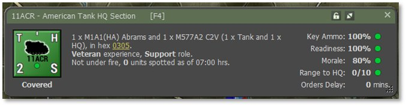

### Scout Sections – 1/11ARC to 6/11ARC

There are six scout sections comprised of two M3A2 Bradly IFVs and two Calvary Scout Teams.

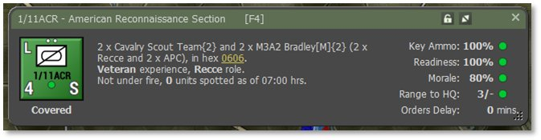

### Tank Platoons – 7/11ACR & 8/11ACR

There are two tank platoons comprised of 4 M1A1(HA) tanks.

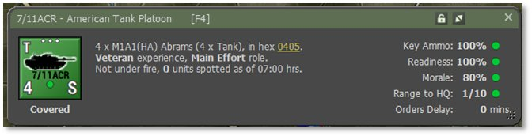

### Mortar Section –Mtr/11ACR

This is a single section with two M106A2 self-propelled mortars with HE and Smoke munitions and one M577A2 command vehicle.

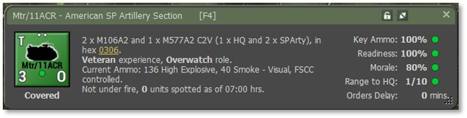

### Supporting Artillery Battery – 11Arty

This is one battery of eight M109A2 self-propelled artillery guns with HE, ICM, and Smoke munitions, one M577A2 command vehicle and eight M548 cargo vehicles.

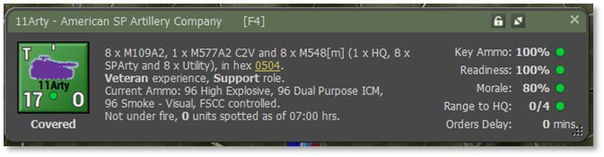

### Supporting Helicopter – 11/AH64

This is a single AH-64 Apache attack helicopter loaded out in a full anti-tank loadout with 16 Hellfire anti-tank guided missiles (ATGMs) and loaded 30mm cannon.

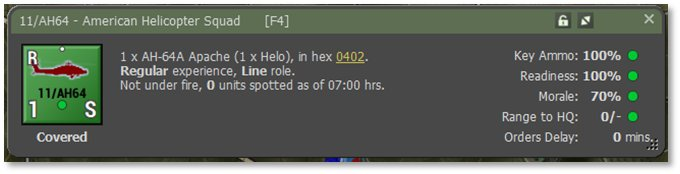

### Off-Map Air Support – A-10 CAS

There is an off-map two ship section of A-10s for Close Air Support (CAS) strikes once large formations of the enemy are spotted. The A-10s have the 30mm cannon, Maverick Guided missiles, Anti-Armor Cluster Bombs, and a few iron bombs for good measure.

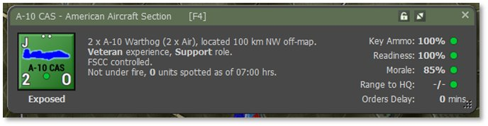

## Planning for the Mission

Next, we need to first investigate how this mission will be fought. The mission objective is to take and hold Objective Able in the middle of some open ground.

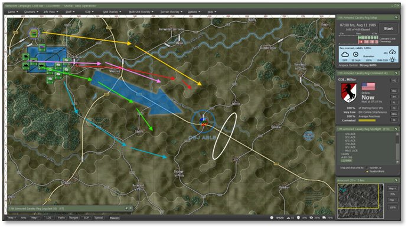

Given our force is outmanned, but not outgunned, we need to move and position the units so we can take advantage of our longer-ranged killing power and thermal sights which allow our units to see through smoke. We have both a mortar unit and artillery unit to lay a smoke screen to assist in our mission.

Setting up on the high ground on either side of the objective area gives us eyes on the approaches to the objective from the north and south plus the ability to maximize firepower on the objective area. The high ground also provides a means of cover and escape if the forces get overwhelmed.

### Gold Route – 11/AH64

This will be the flight path of the single AH-64 Apache and setting up on the hill will give the AH-64 a long line of sight and fire into the valley and should keep the helicopter safe from most air defense fires.

### Pink Route –11ACR and Mtr/11ACR

Once the Scout IFVs and Tanks have moved out, we will need to move the HQ and the Mortar section forward to support the force as it moves toward and secure the objective area.

### Green Route – 7/ACR & 8/ACR

The two Tank platoons will move in behind the Scouts and set up near the ridgeline west of the objective. This will provide them with some cover from enemy units moving up the autobahn and allow them to shoot at enemies at long range.

### Red Route – 3, 5, & 6/11ACR

Three of the Scout sections will move and occupy fire positions on the ridge north of the objective and have a line of fire down the autobahn if the enemy comes down the road. It also provides eyes on the hill to the north of the objective in case the enemy comes out of the north.

### Blue Route – 1,2, & 4/11ACR

The remaining three Scouts will loop south of the objective and set up on the high ground there to serve as eyes to a southern approach of the enemy and a good line of fire down the valley.

## Setting Initial SOPs for Route Missions

SOPs are a critical element that tells your units how to perform their action during the scenario. SOPs control engagement ranges (Max, Long, Medium, and Short), types of movement (Covered, Road, and Direct), when to relocate (Taking Fire or Losses), how far to stay from spotted enemies (Standoff Range), and other unit type parameters. Having these set properly for the situation and mission is crucial if you plan to defeat your enemy.

There are several pre-planned SOP packages for each type of unit in your force and several independent adjustments that can be made to any SOP and for any order given to the unit. We will focus primarily on the preset version in this tutorial with minor adjustments as needed.

### SOP for 11/AH64

Right-click on 11/AH64 and click on Set SOP and then click to select Helo Attack as seen below.

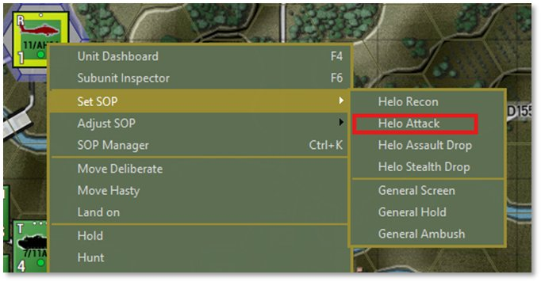

This will set the unit up to engage at long range, relocate if taking direct fire, keep a moderate standoff from the enemy, and use concealed (terrain masking) movement as noted in the dialog that pops up as seen below.

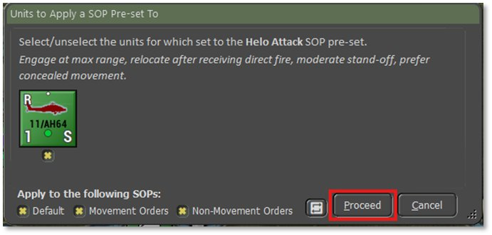

Click Proceed after reading the dialog.

### SOP for 11ACR

Right-click on 11ACR and click on Set SOP and then click to select HQ March as seen below.

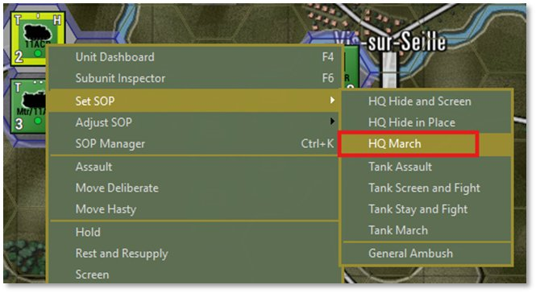

Since we plan to move this to a better supporting location, the HQ March preset keeps the unit on the road with a large standoff range and relocation under any fire as noted in the dialog below. We need to keep the command center safe.

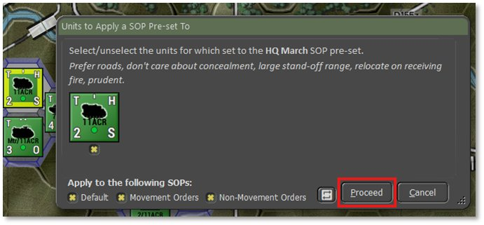

Click Proceed after reading the dialog.

### SOP forMtr/11ACR

Right-click on Mtr/11ACR and click on Set SOP and then click to select Arty Organic Mortar as seen below.

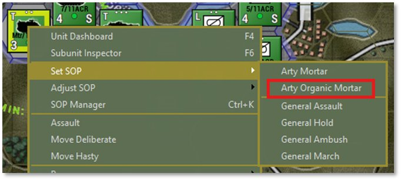

This will set the unit up to support all the units in its formation in case they run into the enemy, relocate if they take any fire, and keep a short standoff from the enemy as noted in the dialog that pops up as seen below. Having this unit ready to respond to call for fire will help keep the force safer.

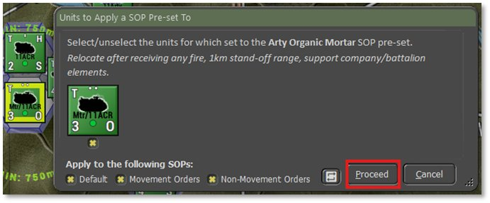

Click Proceed after reading the dialog.

### SOP for 11Arty

Right-click on 11Arty and click on Set SOP and then click to select Arty Shoot and Scoot as seen below.

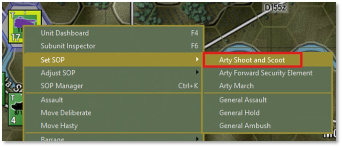

This will set the unit up to shoot and scoot after a fire mission to avoid being targeted by enemy counter battery fire (good practice to get into), do what needs to be done to avoid losses, and keep a large standoff from the enemy as noted in the dialog that pops up as seen below.

This unit will serve as the only heavy supporting fires unit and keeping it intact is critical for mission success.

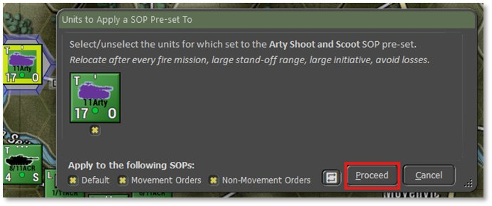

Click Proceed after reading the dialog.

### SOP for 7/11ACR & 8/11ACR

While holding the Shift key down, left-click both 7 & 8/11ACR to select them both and then right-click on one of them and click on Set SOP and then click to select Tank Screen and Fight as seen below.

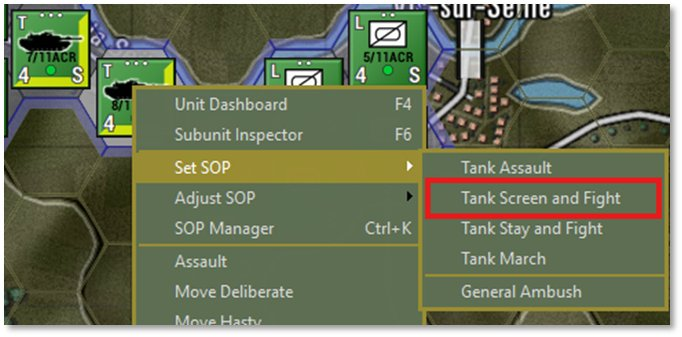

This will set the unit up to engage at long range, relocate if taking fire, and keep a large standoff from the enemy as noted in the dialog seen below. Both selected tank units are shown in the dialog box, and we could remove the SOP presets from any of them if we needed to.

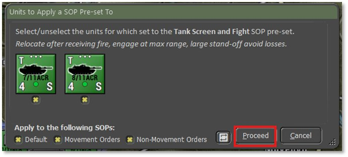

Click Proceed after reading the dialog.

### SOP for All ACR Scout Units

While holding the Ctrl key down, left-click and make a box that covers all the Scout units as seen below.

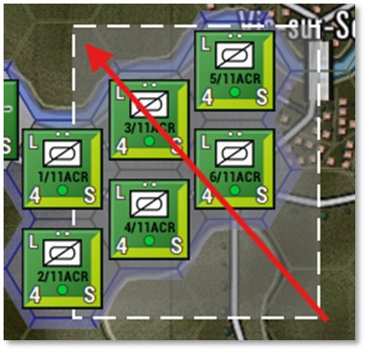

Next, right-click one of the selected Scouts and click on Set SOP and then click to select Recon Screen and Fight as seen below.

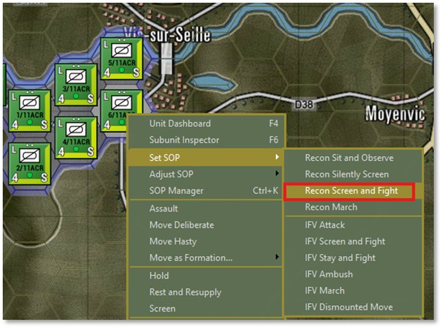

This will set the units up to engage at long range, relocate if taking fire, keep a large standoff from the enemy, not dismount scout teams early, and support the dismounts when engaging the enemy as noted in the dialog seen below. All six of the selected scout units are shown in the dialog box, and we could remove the SOP presets from any of them if we needed to.

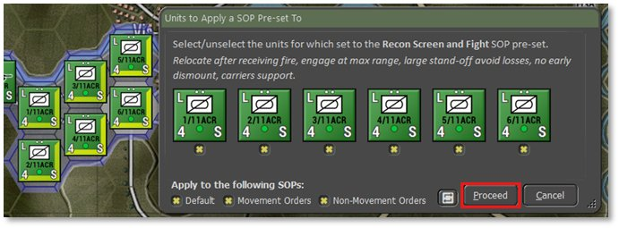

Click Proceed after reading the dialog.

### SOP for A-10 CAS

Although it is not necessary, we can also set the SOP preset for the A-10 CAS flight. To access the menu, we need to right-click on the A-10 CAS entry in the OOB list in the Spotlight panel to bring up the menu seen below. Then select the Air Attack option.

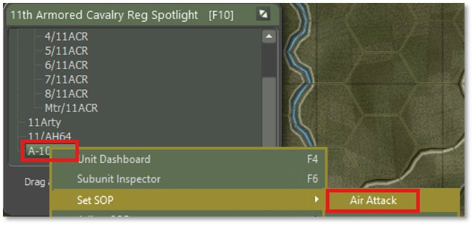

This will set up the aircraft as shown in the dialog box below.

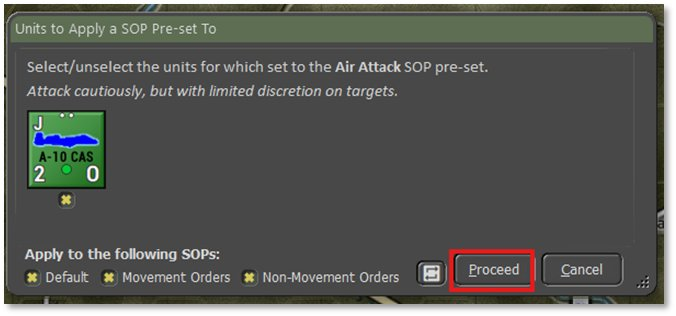

While we are here, let’s right-click on the A-10 CAS again and follow the same procedure but this time click on the “Is Under FSCC (Staff) Control” option to turn that off.  That will ensure that the air strike only comes in when we order it to do so and not at our staff’s discretion.

Click Proceed after reading the dialog and we will start to issue orders for the units to put the battle plan in motion.

As we issue orders in the next section, we will adjust SOPs as the situation changes, and we need to adapt to what the enemy is doing.