# User Interface Layout

The User Interface (UI) in *Flashpoint Campaigns: Cold War* is designed to provide players with streamlined access to battlefield information and command tools.

Key elements include the Main Map, which displays unit positions and terrain; the Orders Panel, used to issue movement, combat, and support commands; and the Unit Info Panel, which provides detailed stats, status, and SOP settings for selected units.

The game also includes tooltips, overlays, and color-coded icons to improve situational awareness.

Whether new to the series or returning, the UI provides intuitive control over complex operations, with hotkeys and filters available to customize your experience and enhance gameplay speed.

For detailed instructions on User Interface Layout, refer to ***FM01 Game Operations***.

## Game Start Screen

After hitting Play and waiting for the game to load, the following screen is shown.

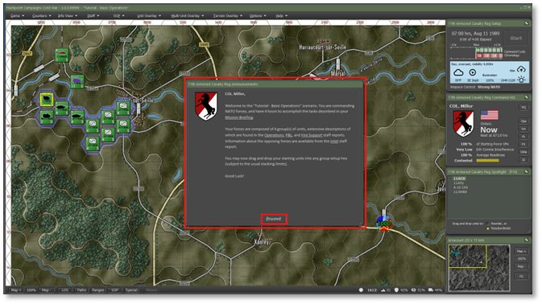

In the screen center you get a dialog for announcements. Read this over and use the links to see Staff related information dialogs. We will look at a few shortly. Either let the timer run out or click Proceed to exit the dialog.

## Main Game Screen UI Elements

The Main Game Screen is seen in the image below and let’s take a minute to review what is there from top to bottom.

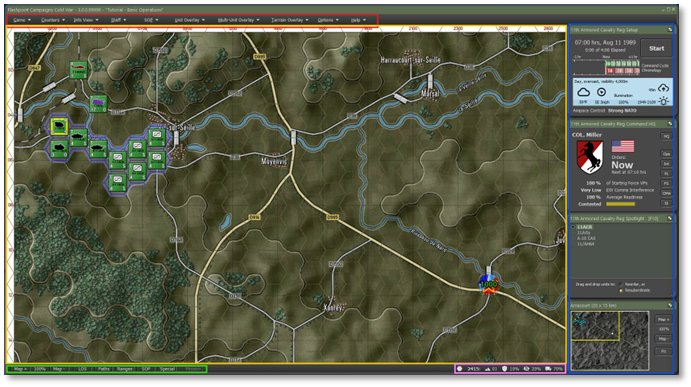

Red Box: Main Menu – The vast number of dialogs, overlays, and options can be found in these menu entries.

Gold Box: Game Map – This is the area that shows the game map, counters, and all the action as a command cycle resolves.

Green Box: Speed Buttons – These buttons toggle several of the most used Overlays on the map. Most are unit focused, but the first two control the map zoom level.

Pink Box: Hex Info - A breakdown of the selected hex and its game related values. This includes Map Location (column/row), Elevation level, Cover percentage (higher is better), Concealment percentage (higher is better), and Mobility percentage (higher is faster movement rate).

Blue Box: Info Panels – Top panel is the Game Panel. It covers Game Time, Start/Pause button, Command Cycle estimates, Weather Info, and Airspace Control owner. Next, is the Command Panel. It covers Who you are as the Commander, Time to the next Orders Cycle, Percentage of Victory Points your force has, Electronic Warfare (EW) level impacting your forces, overall Readiness of your forces, Estimated Victory Conditions, and a set of Staff Function speed buttons to open specific Staff Dialogs. Next is the Spotlight Panel. It is a multi-mode panel that can show the Order of Battle (OOB), or the selected Unit Info, or both if you have a large enough screen. They are toggled with the F10 key. Finally, the Mini-Map. The map shows NATO forces (blue), and Warsaw Pact (red), Victory locations (yellow), and a rectangle show what part of the map is displayed on the screen. Depending on the options set for enemy visibility, the enemy markers will only show if spotted on the Mini-map. You can recenter the map by clicking on a point in the Mini-Map. There are buttons on the side to adjust the zoom level or set the map to 100% or Fit.

**NOTE:** All these panels can be moved around the screen or moved to another screen. They can also collapse and expand by clicking the double arrow icon in the upper right of the panel.

## Frequently Used Main Menu Items

Click the Staff item and then click on Scenario Information to take a moment to read and review the mission information.

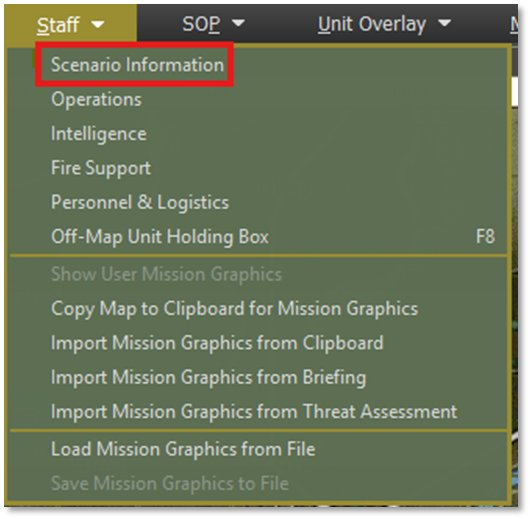

**NOTE:** We will not go through all these items in this Tutorial, Refer to ***FM01 Game Operations*** to see all these entries covered in detail.

**NOTE:** You can also open the Staff Dialogs using the speed buttons on the Commander Panel. For example, Ops will open the Operations dialog and Int will open the Intelligence dialog.

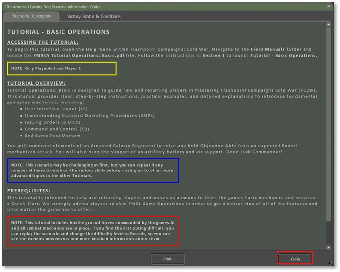

Once you have read the information, select the Close button.

Next, Select Staff and then Operations to open that information dialog.

Select the Mission Briefing tab (if not open) and read the Mission orders and check out the map. In this case, you are to move your force to Objective Able and secure the bridge and Crossing at the city of Lezey.

Take a minute to scroll down and see the rest of the information in the tab. When done, feel free to review the information on the other tabs. Of interest in this scenario is the Map Overlay and SITREP tabs. The other tabs will have use with certain units and once the battle has started.

See the Dialog below.

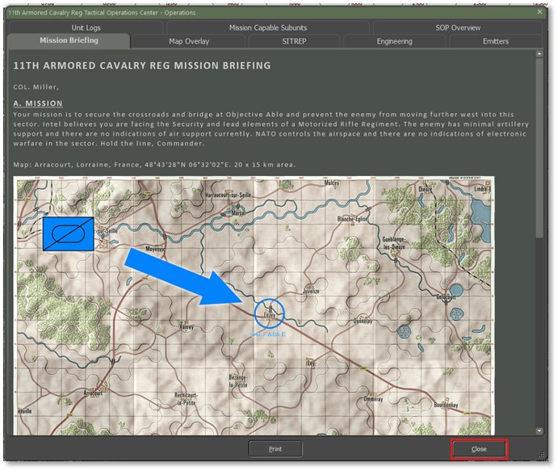

Click on the Close button when done with the Dialog.

Next Open the Intelligence Dialog by selecting Staff and then Intelligence from the Main Menu or using the Int button on the Command Panel.

Of interest here are the first two tabs. The Threat Assessment tab shows the best idea of the enemy plan. In this case, a Mechanized Battalion with support is planning to push up the autobahn and seize key locations. The information also includes a rough estimate of the force and its composition as seen in the image below.

During the upcoming battle, you will want to review the Enemy SITREP (Situation Report) as this map and update information in real-time as your forces make contact with the enemy.

In Section D at the bottom of the SITREP you can find a list of lost contacts. This is a record of units that were spotted and then at some point that fell out of contact. This section will give you an idea of what was seen, where it was headed, and the type of units involved.

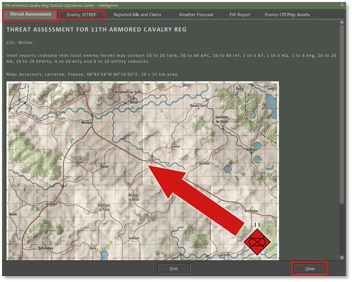

Before jumping off into the planning and battle part of the Tutorial, take a moment to review and set the options to suit your tastes in the various display elements like map contrast, counter art colors and halos, animated fire exchanges, showing the map hex grid, and various map overlay transparency options.

It may also be a good time to look at the User Preferences and adjust game options as you see fit.

All these settings and options are covered in detail in ***FM01 Game Options***.

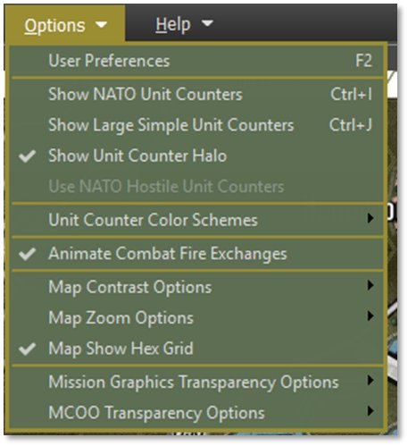

## Main Map Functions

First use one of the Map Zoom controls to set the map to 70% zoom.

Hover the mouse over one of your Scout units as seen below to pop-up the Fly-out dialog. The Flyout shows the map hex area, units in the hex (you can right-click on a unit in the fly-out to open the Orders menu popup), and any markers in the hex. At the bottom of the fly-out you also get the hex values information seen in the bottom right of the screen.

If you have a unit selected in the fly-out or hovering over a unit, a Hint window (green window) opens to show the details of the selected unit.

This is shown in the image below.

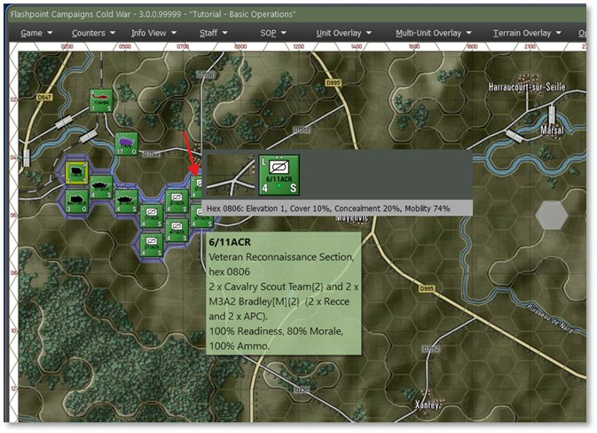

If you right-click on a hex, not on a unit counter, The Map pop-up menu comes up and allows you to toggle map values for many hex-related game parameters. Slightly more important in planning is the function at the top of the menu, the Modified Combined Obstacle Overly of MCOO for short. This is an important planning tool to help visualize the battlefield to see cover, poor mobility, and open lines of fire.

**NOTE:** You can also open the MCOO from the Terrain Overlay Main Menu as seen below.

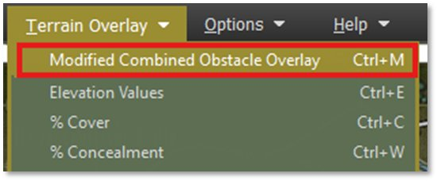

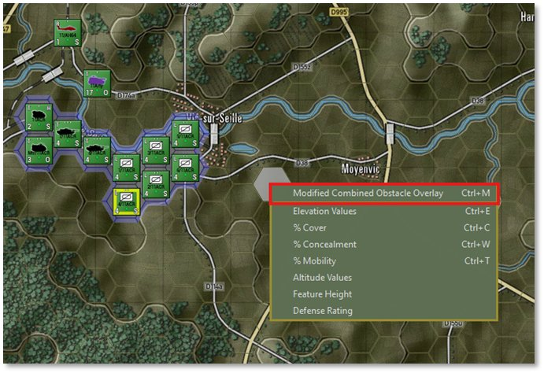

Click on the MCOO menu item to turn on the overlay as seen below.

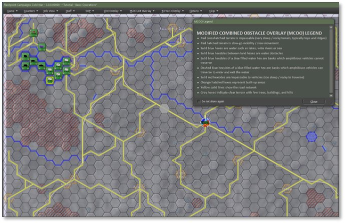

Once you read through the MCOO Legend, you can close it or move it off screen. What you are looking for in the MCOO are places you can place you units in cover as you move or defend, what routes are open and fast versus slow and confined, where are the long lines of fire, and where are all the roads and rivers/bridges.

Ideally, you want to mask moving units with elevations or cover (woods/towns) so the enemy can’t get good shots at you or see your defenders and drop artillery on them. You also want to find locations where you can see the enemy coming from a long way off so you can use your long-range weapons to thin out the enemies numbers as they close. With any luck using higher ground and cover to make return fire less impacting.

On this map there is a very open corridor down the middle of the map and sparse cover in that area and the surrounding hills. This will make things a bit difficult, and you will need to plan carefully and use the artillery, you must drop smoke to blind the enemy as you approach the objective. We will get to that a bit later in the tutorial.

## Unit Information

Units are represented by counters on the map. Each unit is comprised of various types of subunits like tanks, helicopters, self-propelled artillery guns, troops, and transports (Armored Personnel Carriers -APCs or Infantry Fighting Vehicles – IFVs or trucks and jeeps).

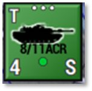On the counter itself you will see the following:

- The size of the unit at the top center – in this case a platoon (...)

- Upper left shows the movement mode – in this case T for Tracked

- Upper right will have an H if it is a Headquarters unit

- Middle has either a vehicle silhouette or NATO marker depending on setting and if it is an infantry type unit

- Formation name below the image

- Lower left states the number of subunits in the formation – in this case 4 tanks

- Middle bottom is a status dot reflecting the units ability to fight – currently green

- Lower right is the orders state for the unit – currently in a Screen

In the image below, you can see the various units on the map that you command.

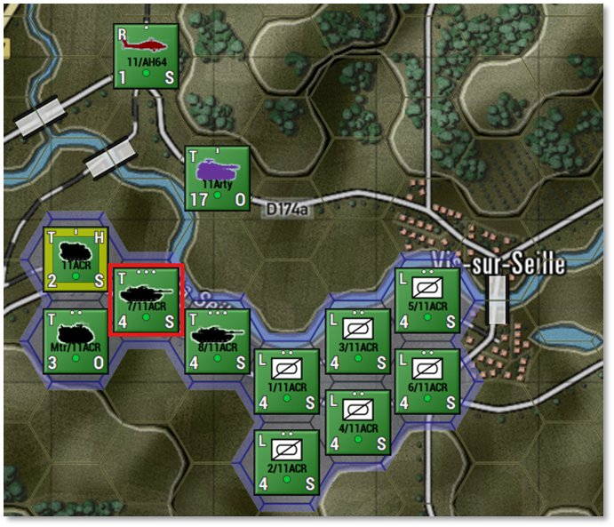

To get more details on what these units are and what they can do, we need to bring up the Unit Dashboard. Double-click the highlighted tank unit as seen above to open the Dashboard as seen below.

The Dashboard shows the Unit Counter, information of the Unit’s composition, experience, and role, and a listing of key indicators for items like Ammo, Readiness, Morale, HQ Range and Orders Delay.

The Tabs cover various details related to the selected unit.

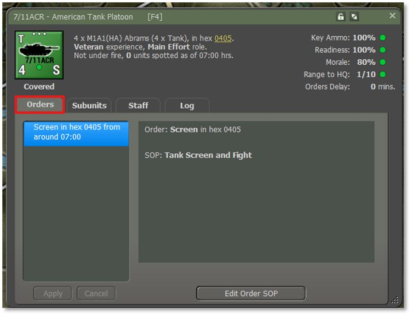

In the Orders Tab seen above, the list of current orders for the unit is shown and in the window to the right information about the selected order and the current SOP Preset being used for the selected order.

The information in the right window will change based on unit type and order given.

Click on the Subunits Tab to see the individual subunits that make up the units. This is shown below.

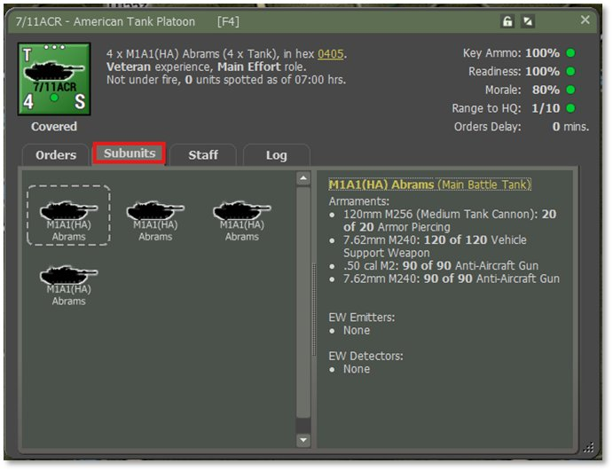

In the left window we see the 4 M1A1(HA) tanks of this unit. You click on any of the subunit icons to show the information on the right window which provides a listing of the subunits weapons and current ammunition allocation. At the bottom, If the unit has any special EW emitters or EW detectors will be listed here.

**NOTE:** As the battle continues, the amounts of ammunition will change for all the listed subunits.

Click on the Staff tab next to see important alerts, contact information, and Ammo summary for the unit selected as seen below.

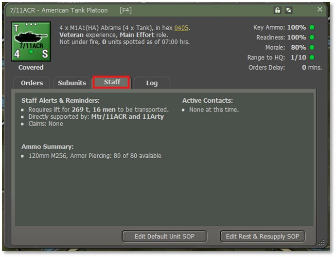

In the upper left there are Staff Alerts & Reminders. These note many different types of information from kill claims, out of ammo notices, transport losses, transport needs, support from artillery units, and others. Critical issues will appear in yellow.

The upper right area has Active Contacts information. Any enemy units spotted or engaged by the selected unit will show up here.

Finally at the bottom, there is a listing of the unit’s ammo supply for key weapon systems.

Finally, let’s click on the Log tab as shown below.

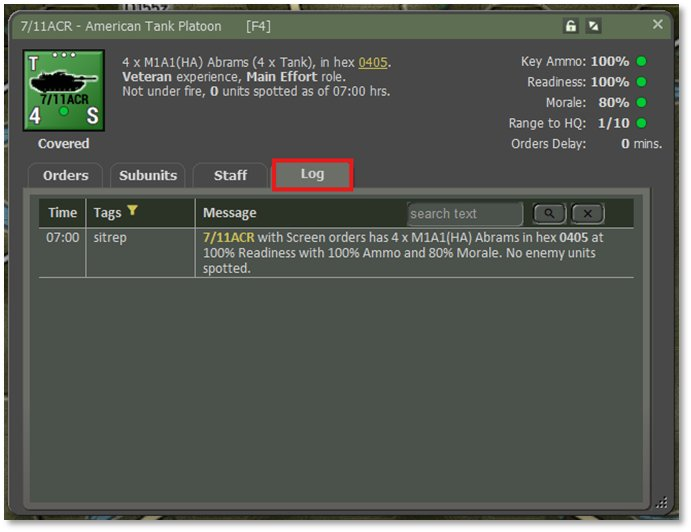

This is the same log as you can bring up on the main game screen by hitting F7 or opening it from the Info View items from the main menu except it is focused on the selected unit.

As the battle is fought this window will be populated with messages dealing with this unit. Orders, spotting reports, engagements, kills, and losses, will all get posted here.

**NOTE:** There are filters and color settings in these logs. See FM01 Game Operations for details on how to set them up.

Now we need to look at the Subunit Inspector (SUI) to see greater details of the subunits in the selected unit. With the Dashboard open, switch to the Subunits Tab and double click on one of the subunit images. You can also right-click on a unit counter on the map and select the Subunit Inspector option for the popup menu or select a unit and hit F6. Yes, we do have a number of ways and locations to access important information.

## The SubUnit Inspector (SUI)

The SubUnit Inspector (SUI) is used to take a detailed look at your troops and equipment.

The top section tells you about what platform or infantry unit you are looking at, image, date available, nation, status of units in the scenario and Victory Point cost of each.

The middle section has a tabbed display that looks in detail at the Platform, Weapons, Sensors, Systems, and Transport information.

Take a few minutes to select each tab to get familiar with what information is provided on each tab.

The bottom section allows you to look at other units in the unit, scenario, or data file. You can also look at enemy equipment.

With the SUI open you just need to click on other units on the map to have the information shown in the dialog. If there is more than one type of subunit in the unit selected, the buttons in the lower left will be active and the number of entries is shown.

After you have reviewed your equipment and troops, you can close the dialog by clicking on the “X” at the top right of the dialog.

The lock will freeze the SUI on the currently selected unit. You can then open another SUI from another unit for comparisons.

**NOTE:** For details about what the various values and items mean, refer to ***FM01 Game Operations***.

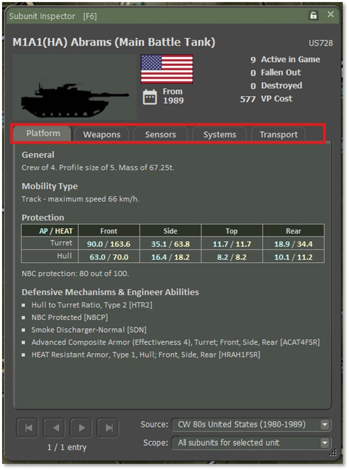

Now we will move on to Setting up our units and planning the mission.