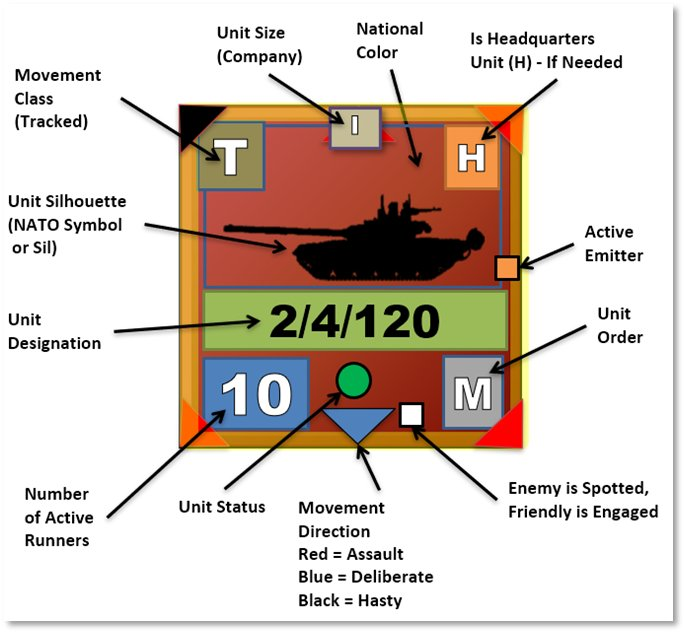
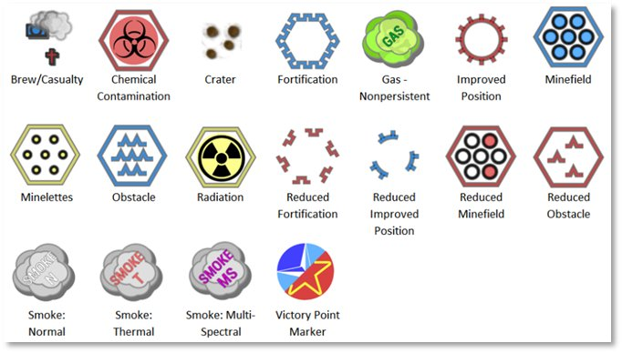
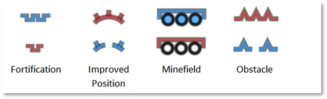

# Counter Layout and Map Objects

Details about these items can be found in FM FCCW-01 Game Operations.

## Counter Layout

The image below shows all the various bits of information contained on most of the counters in the game. Understanding these items and their meaning is an essential part of the game.

## Map Markers (Full and Hex Edge)

Full hex map markers apply their effects on the entire hex and any units within. The color shows ownership with Blue for Player One and Red for Player Two. Unowned markers are in yellow.

Hex Edge Map Markers are placed along the edge of a hex, and the marker's effect only applies when crossing that hex edge. These markers are shown as full on the top of the picture below or reduced at the bottom of the image for each type. The color shows ownership with Blue for Player One and Red for Player Two. Unowned markers are in yellow.

