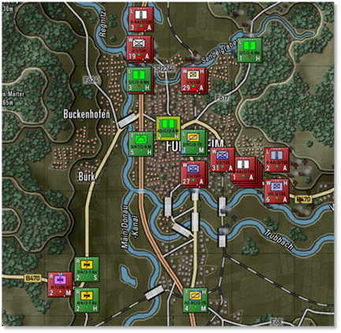
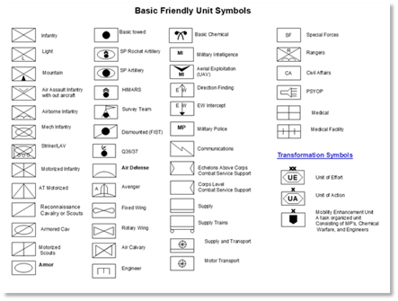
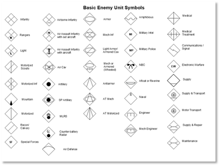

# NATO Symbols

NATO symbols are used to represent various types of forces on the map by military users. The tables below show a number of the commonly used symbols for friendly and enemy forces, but the game has more depending on function. 

If you want to look closer at all of the possible NATO map marking and symbols, do a web search for NATO APP-6A, and you can see the extent of the military symbology used by the professional military.

 

While the symbols in the interior of the symbols is the same, friendly troop markers are in a rectangle (as seen above) and the enemy are denoted in diamonds as seen below. Unknown or neutral units are seen in circles and with a yellow fill color. These are not used in the game currently.

