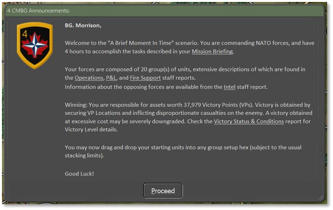

# Announcement Dialog

A dialog pops up in the center of the screen with basic information about that scenario when it opens for the first time. It shows the commander’s name, side played, and a few links to Staff Reports to open and review continuously (see Section 15 below for details on those reports; they can be opened from the Commander Panel as well as the Staff menu bar item).

This dialog also states your overall game objective, an overview of your forces, and your ability to drag and drop units within your Deployment Area zone (see Section 11.7.5 below). We wish you good luck!

## In-Game Announcements

In-game announcements bring information in the form of small Secure Transmission dialogs that pop up when specific events happen. Information that may be received this way includes:

- Weather updates (see Section 29 below) and changes in Visibility (see Section 24.3 below)

- Changes in time of day and lighting conditions (see Section 28 below)

- Reinforcements and withdrawals of specific units (see Section 15.5.3 below)

- Leader killed

- HQ intercepts

- Electronic warfare level changes (see Section 25.9 below)

- Off-map events like strike aircraft intercepts

- Detection of on- and off-map enemy artillery assets

- Losses of friendly off-map artillery assets

- Scenario or campaign conclusion

Other messages may also be displayed. You can dismiss them by clicking the Proceed button.