# Campaign Game Play Overview

A campaign is a sequence of scenarios from one nation’s perspective where the result of one scenario may influence the subsequent scenario. The player carries over core forces from scenario to scenario. This means that campaign scenarios might play out very differently from single scenarios because it is of vital importance to preserve your force as you try to win your part of the war.

To start a new campaign, click on the New Campaign button in the Main Menu.

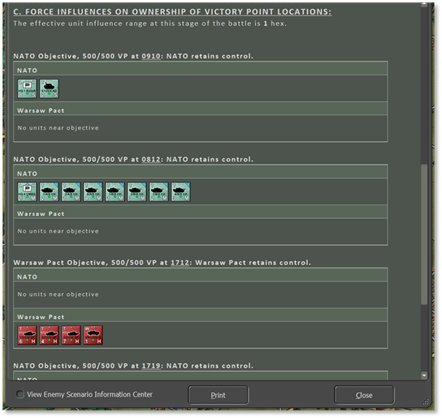

This launches the Campaign Selection dialog, as seen below. Review the campaigns that are available in the module. Click on a campaign to open an overview of it in the right-side window to get an idea of the overall mission and historical context of the campaign.

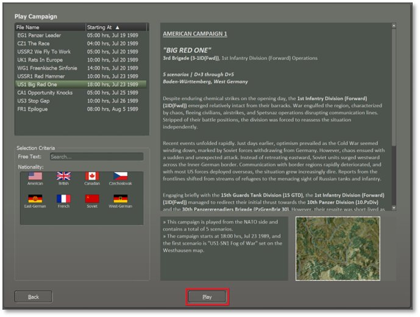

Click Play to proceed.

Only the Difficulty settings can be customized for a campaign, as shown below. Select a Difficulty preset or set custom Game Options and Fog of War options that will apply to all scenarios in the campaign. These settings are covered in Section 4.3 above.

!!! note

    You cannot pick which side you play or who your opponent will be in a campaign. These are specified by the campaign author, and the opponent will be the AI.

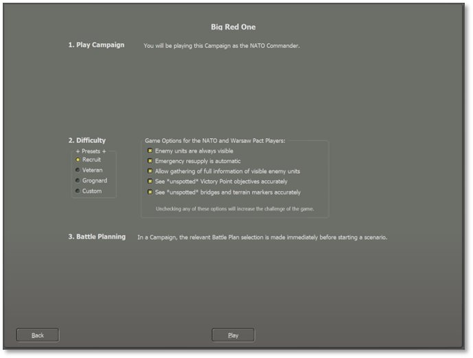

If the following two settings in the Game Options are selected during campaign setup: Enemy Units Always Visible and Allow Gathering of Full Information of Visible Enemy Units, then Staff Report dialogs will have an option in the bottom left corner to View Enemy Tactical Operations Center (see the last image of this subsection below). Checking this toggle converts each tab to show the same information but from the enemy’s perspective and the details change accordingly. Uncheck this toggle to return to your forces’ information. Selecting only one or the other of these two Game Options will not allow this information to be viewed in-game (see Section 4.3.2 above).

Click Play to proceed. Next, choose the Battle Plan for the first campaign scenario (if there is more than one available) or leave it at Random Selection to be picked at random. Battle Plans will be selected at the start of each campaign scenario.

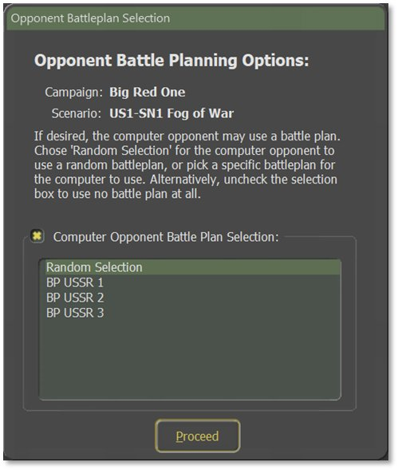

Click Proceed to load the scenario and begin to play. The game program’s title bar displays the name of the campaign and which scenario is currently in progress as seen below:

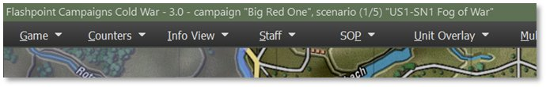

Play the scenario to the conclusion or end it early, if at least two-thirds completed, to proceed to the next scenario via the Game menu bar item, End Game Now selection. After the standard Battle Over dialog, save the campaign in progress as a “.cav” file. Manually enter a file name or use the default file name detailing the campaign, scenario, real-world date and time, percentage complete, and game time, then click the Save button.

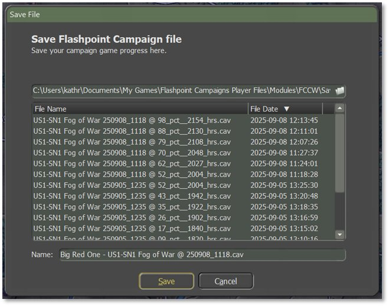

The following Campaign Scenario Completed message will appear:

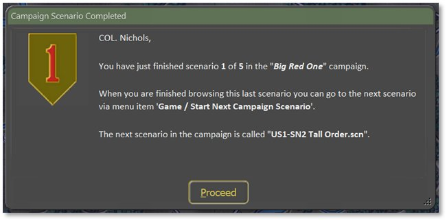

Click on Proceed to view the Scenario Information dialog for the usual postmortem debrief. Note that there is a new tab in this dialog called “Campaign Chronology”. This report will show the accumulated campaign information to date. It contains:

- The campaign description.

- For the first scenario, it will show:

- The Scenario Briefing, including scenario start and end game times.

- The Scenario Verdict, including your star rating and very brief staff evaluation (see Section 30.1 above).

- The distribution of Victory Points between forces.

- The Core Force Status, depicted with a bar graph of how many unit types are still active.

- As subsequent scenarios’ results are available, it will also show:

- Details on the Campaign Force Recovery Phase, including where you are in the progression of the campaign and Recovery details for your core forces.

- The Subunit Distribution in table form, about the fate of your units.

- Any new Force Attachments made to your force.

- Followed by the same information as provided for the first scenario, as above.

- When the entire campaign is complete, a final summary evaluation is appended for you to review.

After reviewing and closing the scenario postmortem, use the Game menu bar item, Start Next Campaign Scenario option to go to the next scenario as shown below:

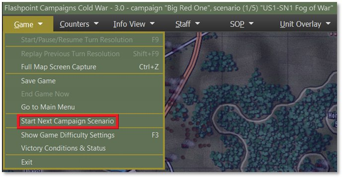

The new scenario will load and import your core forces, placed in the appropriate setup areas. Select an Opponent Battle Plan when prompted.

The Force Recovery dialog shows next (see below) which recounts how much rest and recovery your core force has received as well information on any replacements and attachments. Review this carefully to understand your forces going into the next battle.

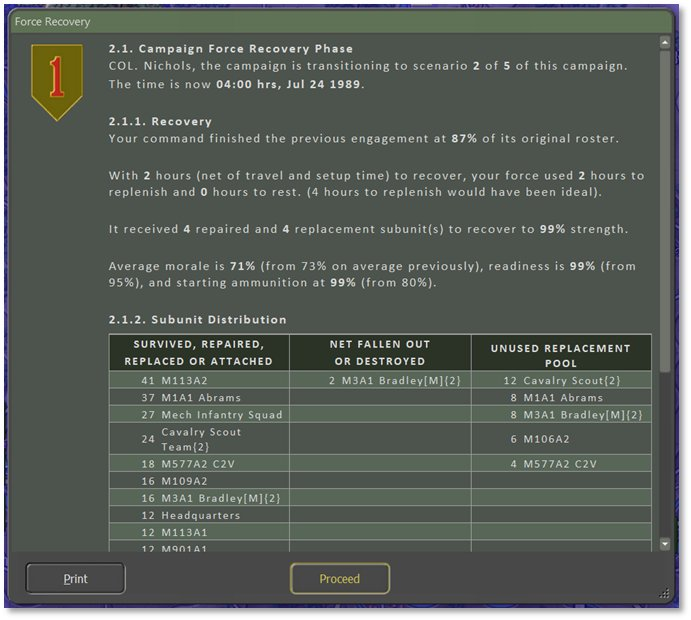

Click Proceed, review the Mission Briefing for the scenario, and then begin playing. When this scenario is complete, the same process is used to start the third and subsequent scenarios.

A campaign summation screen is displayed after the final scenario is finished, as seen below. It is similar to the Final Report (see Section 30.2 above) but includes ratings for all the scenarios making up the campaign.

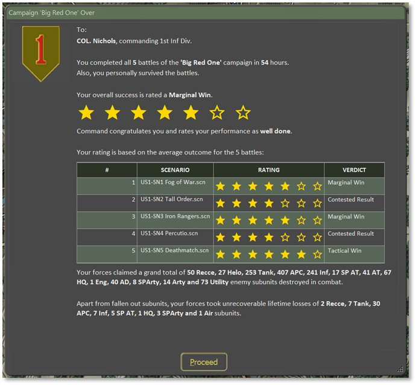

Click Proceed and the final game postmortem can be browsed in the usual way (see Section 30 above). The Scenario Information dialog’s Campaign Chronology Report is now complete and can be reviewed in the tab on the right, as shown below. At the bottom of this tab is a summary of each scenario.

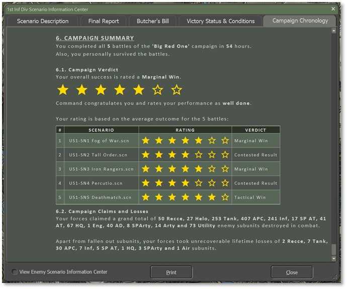

When finished with the reports, click the Close button to return to the Main Menu to start another battle or campaign.