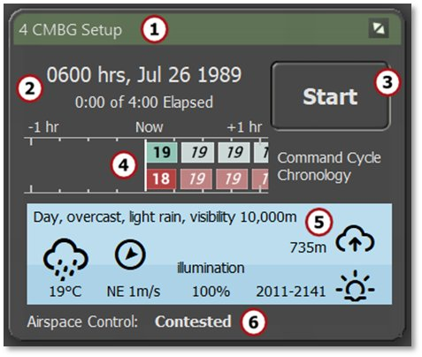
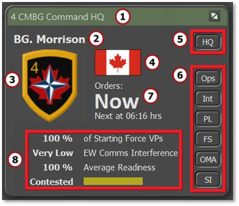
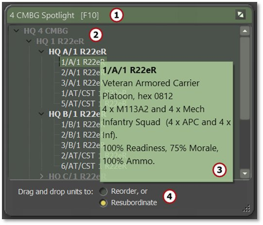
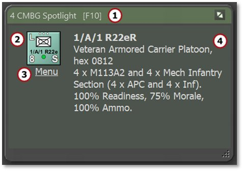
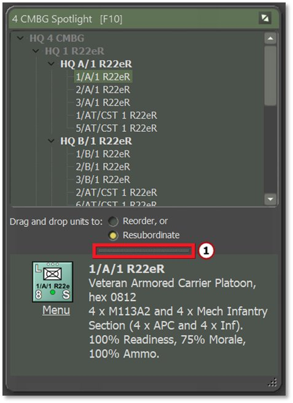
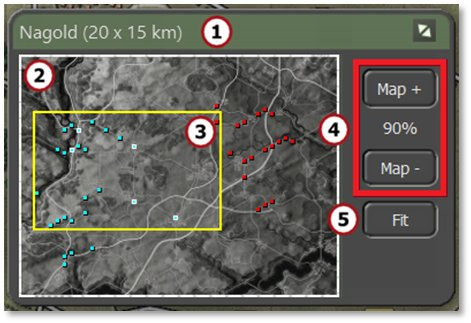

# Core Game Panels

Next to the map are the Core Game Panels. The default location of these panels is positioned along the right edge of the screen, however they can be moved anywhere on screen or onto other screens if available.

The Core Game Panels include the Game Control Panel (Section 13.1), the Commander Panel (Section 13.2), the Spotlight Panel (Section 13.3), and the Mini Map (Section 13.4).

## Game Control Panel

The Game Control Panel contains information critical to the overall play of the scenario as well as the button to Start and Pause play.

The panel can be moved around or moved to another screen for convenience, and reset to its default position by selecting Reset Core Info Panels in the Info View menu bar item.

1. The green title bar states the name of the commanding force. During turn resolution, the title changes to “Turn Resolution.”

2. This area shows the time of day, date, elapsed time of the scenario, and the total time limit of the scenario.

3. This is the Start/Pause button that starts turn execution after an orders phase or pauses the resolution if the game is running. Both starting and pausing the game produce a confirmation dialog to Proceed. Pausing the turn resolution can take a moment while the actions in progress finish. A dialog appears when the game becomes paused.

4. This graph shows the command cycles for both sides. The player’s side is an exact measure of the command cycle time, and the enemy’s is an estimated value.

1. This area is the weather panel. At the top, the current conditions
for Weather (see Section29 below) and Visibility (see Section 24.3 below) are shown. The furthest left icon shows a Weather icon and the temperature. The next icon is for wind direction and wind speed. Next is the percentage of Illumination (which is vital at night based on the phase of the moon, see Section 24.3 below). The upper right-most icon is the cloud ceiling in meters (if one exists). Finally, the lower right shows what time the next change in the time-of-day cycle takes place (dusk in this case).

6. This area along the bottom provides the state of Air Superiority Control. This shows who is in control of the air space and how strong that effort is.

## Commander Panel

The Commander Panel contains information about your command and has shortcuts to the Staff Report dialogs in the Tactical Operations Center. The panel can be moved around or moved to another screen for convenience, and reset to its default position by selecting Reset Core Info Panels in the Info View menu bar item.

1. The green title bar shows the name of the commanding force.

2. This is the commander's name and rank. This is you as the player.

3. This is the force’s badge or flag.

4. This is the national flag of the commanding force.

5. The HQ button calls up the Unit Dashboard (see Section 14.2 below) for the highest HQ unit on the map and highlights its counter, making it the currently selected unit.

6. These buttons can be used to call up any of the Staff Report dialogs (see Section 15 below) as well as the Off Map Assets (OMA) dialog (see Section 14.5 below).

7. This area displays the time of your next orders input cycle in minutes of game time.

1. This area has information related to the overall condition of your
force. This includes the current percentage of Starting Force Victory Points (VPs; see Section15.1.2 below), Electronic Warfare Interference level (see Section 25.9 below), overall Average Readiness of your force (see Section 26.1 below), and a current estimation of Victory Status. Victory status estimation can be turned off in User Preferences ([***F2***], see Section 3.1.1 above).

## Spotlight Panel

The Spotlight Panel can be set to one of three display modes. First is the Order of Battle (OOB Tree). Second is the Detailed Unit Information for the selected unit. Third is both of these shown at the same time in a Combined View. Each is described below.

Use the ***F10*** key to toggle between the OOB Tree, Detailed Unit Information, and showing/hiding the whole panel. To switch to the Combined View, press ***Shift***+***F10*** while the window is open.

The panel can be moved around or moved to another screen for convenience, and reset to its default position by selecting Reset Core Info Panels in the Info View menu bar item.

### OOB Tree View

Use the ***F10*** key to toggle between the OOB Tree, Detailed Unit Information, and showing/hiding the whole panel.

The first Spotlight mode is the Order of Battle (OOB) Tree. It lists the names of each unit in your force and provides information on units when hovering the mouse over them, as well as provides options to (re)organize units.

1. The green title bar shows the name of the commanding force being spotlighted.

2. This main window displays your force’s order of battle (OOB). Open and close the OOB by clicking on the downward-pointing chevrons to the left of list item names. Clicking on a unit name highlights that unit on the map. Right-clicking on a unit name opens the Unit Popup Menu (see Section 21.1 below).

3. Hover the mouse over unit names in tree view to see the composition of that unit in the tooltip window that pops up.

4. Resubordinate a unit to another HQ or change its order within a formation by left-clicking on the unit and dragging and dropping to a new position in the list. For more details on both actions, see Sections 20.1 and 20.2 below.

### Detailed Unit Information View

Use the ***F10*** key to toggle between the OOB Tree, Detailed Unit Information, and showing/hiding the whole panel.

The second Spotlight mode is the Detailed Unit Information View. It shows a variety of helpful details about one specific unit at a time.

1. The green title bar shows the name of the commanding force being spotlighted.

2. The selected unit’s counter is shown.

3. Left-clicking on the Menu text item below the counter opens the Unit Popup Menu to select orders and other unit-related functions and information (see Section 21.1 below).

4. The main window area shows the selected unit's complete ID, training level, type of unit, hex location (column/row grid coordinates), unit composition (by platform name and type), and the unit’s Readiness, Morale, and Ammo levels (see Section 26 below).

### Combined Spotlight View

Use the ***F10*** key to toggle between the OOB Tree, Detailed Unit Information, and showing/hiding the whole panel. To switch to the Combined View, press ***Shift***+***F10*** while the window is open.

The final Spotlight mode stacks the OOB Tree and Detailed Information View into one Combined view.

This view combines both windows into a single dialog view with all the information noted in Sections 13.3.1 and 13.3.2 above. The dialog size can be adjusted to accommodate both panels by dragging the bottom right corner or other edges to the desired size. The splitter bar (1) adjusts the size of both panels relative to each other within the dialog by clicking and dragging it up or down.

## Mini-Map Panel

The Mini-Map Panel (or Jump Map as it is called in many games) shows the entire map (in grayscale), all units (as blue or red squares with dark outlines), and the objectives (as white-outlined blue or red squares based on ownership).

The panel can be moved around or moved to another screen for convenience, and reset to its default position by selecting Reset Core Info Panels in the Info View menu bar item.

1. The green title bar shows the name of the map and its dimensions in parentheses.

2. This is the full Mini-Map in greyscale. Click anywhere on this map to recenter the visible map on the game screen.

3. The yellow outline shows what part of the map is currently visible on screen based on the level of zoom and location on the main map.

4. The Map + and Map - buttons change the level of the map zoom up or down.

5. The Fit button zooms the game map out so all of it fits on the screen.