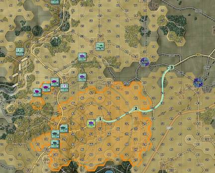
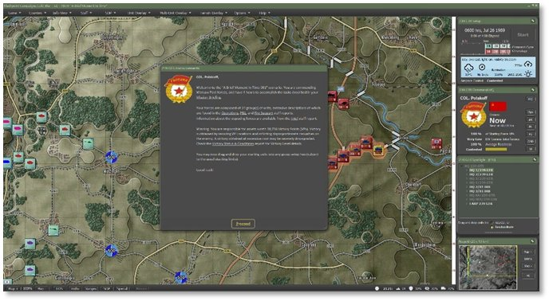

# Game Launch and User Interface

This section covers the basics of launching a scenario and the new User Interface (UI) in the game.

## Scenario Start-Up

Once you have selected a scenario to play by one of the means noted earlier, a waiting screen appears for a few seconds (or more on slower computers or larger scenarios) for the game to load the map and data.

Once that is complete, you arrive to the main game screen seen below.

## Setting Up the UI

Before we dive into the details of all the various User Interface (UI) elements, there are a few new capabilities for how you can set up the UI to suit your taste.

- All dialogs and panels that are shown can be moved around on the screen (or onto other screens) with the exception of the Menu Bar at the top and the Status Bar at the bottom.

-  Dialogs and panels with this symbol in the lower right corner can be resized. Most have a minimum and maximum size.

-   Dialogs and panels with this symbol in the upper right corner can be collapsed to the title bar or expanded to full size. Useful to see more of the screen.

- A few Staff Report dialogs have active maps that update with information as the game is played (see Section 15 below).

- Most of the dialogs and panels remember the last location they were placed on the screen and will be in those positions the next time you play a scenario.

- The Unit Dashboard can be locked to display information on one unit, and more Dashboards can be opened (see Section 14.2 below). The Dashboard can also collapse to a smaller size if needed, and dock against each other. Locking Dashboard information can be helpful to click around to other units while keeping specific units’ information open.

- The UI should work well with ultra-wide screens and scale well with 4K monitors.

!!! note

    If you have multiple monitors with different font scaling levels and drag dialogs to another screen with a different scale, dialogs and other menu panels may not display correctly. This is something we are looking into and hope to correct in the future.

## Manual Sections Covering the UI

The following sections cover all the various parts of the game interface and what they do.

- See Section 10 below for information on the Announcement Dialog.

- See Section 11 below for information on the Menu Bar.

- See Section 12 below for information on the Status Bar.

- See section 13 below for information on the Core Game Panels.

- See Section 14 below for information on the Info View Panels.

- See Section 15 below for information on the Staff Report Dialogs.

- See Section 16 below for information on the Game Map.

- See Section 17 below for information on Unit Counters.

!!! note

    If you want to jump to the how-to-do things portion of the manual, head for Section 21 below on Issuing Orders.