# Info View Panels

There are five additional panels to use during the game for various functions. These are the Unit Popup Menu (Section14.1), Unit Dashboard (Section 14.2), Subunit Inspector (Section 14.3), Command Log (Section 14.4), and Off-Map Assets (Section 14.5).

## The Unit Popup Menu

The Unit Popup Menu is the primary means of interfacing with the selected unit(s). Right-click on a unit to bring up the menu. See Section 21.9 below for issuing group orders. Any orders given to one selected unit will also apply to any other selected units.

### General Menu Layout

The Unit Popup Menu is divided into seven sections with access to additional information panels, orders, unit assignments, and overlays.

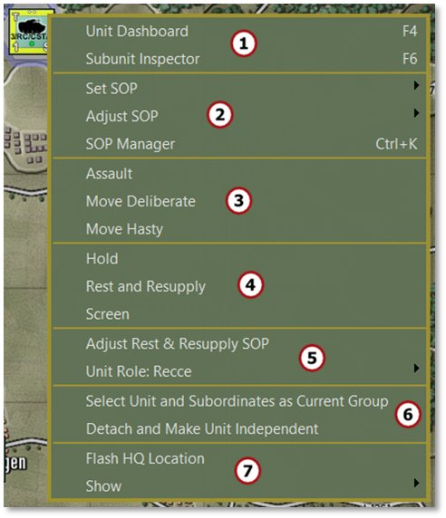

1. The first section has options to open the Unit Dashboard ([***F4***], see Section 14.2 below) or the Subunit Inspector ([***F6***], see Section 14.3 below) for the selected unit.

2. The second section has SOP-related commands. Set and Adjust SOP are covered in Section 11.5 above. The SOP Manager [***Ctrl+K***] is covered in Section 23 below.

3. The third section shows the available orders for the selected unit. The options change based on the unit’s capabilities. See Section 21 below for details on orders.

4. The fourth section groups the static (non-moving) orders available for the selected unit, also covered in Section 21 below.

5. The fifth section contains a shortcut to the SOP settings specific to the Rest and Resupply order. Additionally, Unit Role displays the unit’s current role in the battle. This can be changed via the arrow and submenu that pops out. See Section 18 below on specific unit role information.

6. The sixth section of the menu contains a shortcut to Select Unit and Subordinates as Current Group which selects the formation from a single selected unit. Detach and Make Unit Independent removes the selected unit from the formation and HQ it is under and places it on its own. For most subunits, it is better and safer to use the Order of Battle Tree to do resubordinations. See Section 20 below for more on using the Order of Battle Tree for this.

7. The seventh section has an item to Flash HQ Location which flashes the hex of that unit’s immediate HQ unit to help locate it on the map. The Show option provides a submenu with Unit Overlay options which can also be accessed from the Unit Overlay menu bar item. See Section 11.6 above for details on the various overlays.

## Unit Dashboard

The Unit Dashboard is the central interface for dealing with many important factors of the selected unit. Double-click a unit on the map to bring up the Dashboard. Hitting ***F4*** while a unit is selected also brings up the Dashboard. The Dashboard can be opened via the Unit Popup Menu as well.

### General Layout

The Unit Dashboard shows a variety of useful information across several tabs and the general layout is described below.

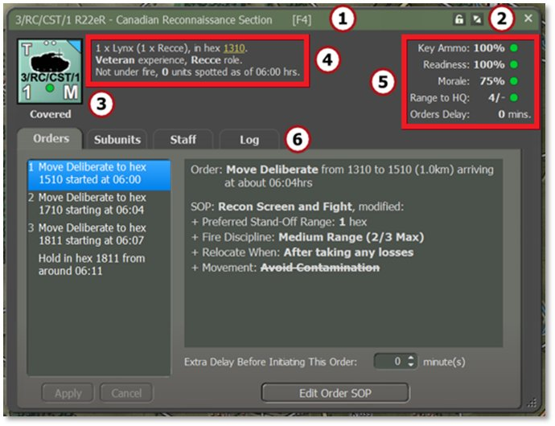

1. The green title bar shows the name of the selected unit.

2. Click the Lock icon to freeze the panel on the selected unit. This keeps that unit’s information displayed while clicking around to other counters. The Expand/Collapse icon collapses the tabbed portion of the dialog to save space.

3. This area shows the counter of the currently selected unit. Below the counter is an indication of the current tactical posture of that unit.

4. This text area relays the current SITREP (Situation Report) of the unit. This includes the composition, hex location (written as four-digit column/row grid coordinates, hyperlinked for direct movement on the map), training level, and the unit’s role. At the bottom, there is an indication of whether the unit is under fire as well as the number of enemy units it has Spotted. In cases of critical alerts, such as low Ammo, a line shows up in this area noting the problem.

Units participating in a transport mission will have additional information in this section. Details of their serial and assigned transport will appear below the previous line to facilitate quick post-disembarkation orders. See **FM03 Tutorial Operations: Advanced** for more information on transport planning.

5. The stats on the right shows the unit’s Key Ammo level (primary weapons), Readiness, Morale, Range to HQ (local HQ for the unit), and any Orders Delay. 100% indicates high levels of each factor and 0% is completely ineffective. Range is indicated with how many hexes away the selected unit is from its HQ (e.g., 18 in the example below) versus how many hexes from the HQ the command range reaches (e.g., 8). See Section 18.4.1 below for how headquarters support units in their command.

Status icons for these factors include a green circle for good condition, a yellow upward triangle for marginal condition, a red diamond for critical condition, and a black square for a combat ineffective condition, as shown below. See Section 15.5.1 below for more on staff alerts.

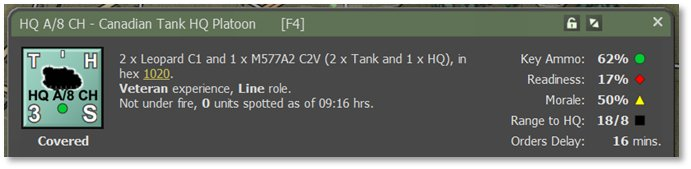

6. The tabbed area below this primary information panel covers the unit’s Orders, Subunits, Staff, and Unit Log information which are detailed in the following sections.

### Orders

The Orders tab of the Unit Dashboard provides information on the unit’s orders and SOP.

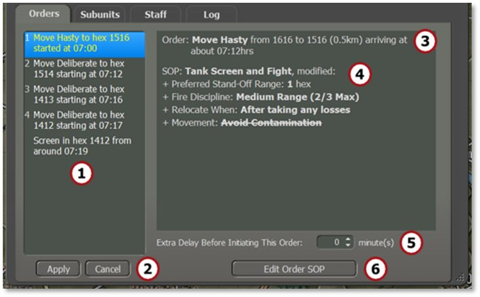

1. This window lists the unit’s orders noting the type of order, the hex location of the order (four-digit column/row grid coordinates), and the estimated start time of the order execution. Left-click to select any of the orders to view their SOP information. Right-click to open a popup menu to change the selected order. The selection is context-sensitive based on the initial order, as seen below.

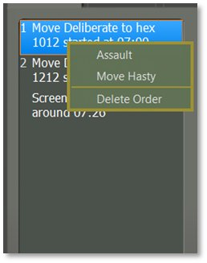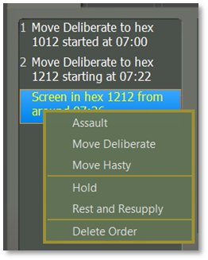

2. After changing one or more orders, hit Apply underneath the list to commit the changes or Cancel to ignore the changes.

3. This is a text summary of the currently selected order with time and distance information.

4. This is a text summary of the unit’s current SOP (Standard Operating Procedures, see Section 23 below for details) for the highlighted order.

5. This option adds an Extra Time Delay before an order starts if the timing is necessary for your plan. It may be useful to synchronize units to get to locations at the same time to execute their orders.

6. Click the Edit Order SOP button to edit the current unit’s SOP. See Section 23 below for details on how to set the SOP items.

### Subunits

The Subunits tab provides detailed information for all that unit’s subunits, including their various armaments, emitters, and detectors.

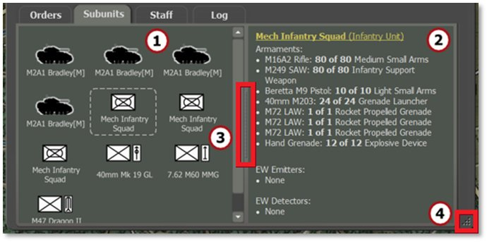

1. The window on the left shows all the subunits within the selected unit on the map. Click on any of the subunits in the left window to display information about it in the right window. If units have fallen out or have been destroyed or killed, icons appear over the subunit art and the information in the second window notes that state.

2. The window on the right shows a breakdown of the subunit's weapons and current ammunition levels, emitters (radars) if they have them, or electronic warfare detectors (ESM or radar detectors). The hyperlink at the top opens the Subunit Inspector (SUI) to see more details about the subunit (see Section 14.3 below for breakdown of the SUI).

3. Move the splitter bar positioned between the two panels to the left or right to resize the windows.

4. Resize the dialog by dragging the corner point. The dialog has a minimum size set by the game.

### Staff

The Staff tab of the Dashboard provides many valuable bits of

information about the selected unit’s alerts, summaries, and contacts.

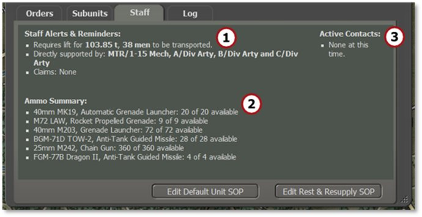

1. Staff Alerts and Reminders displays alerts for any weapons that are out of Ammo, any artillery units that can support this unit (if available), any unique unit capabilities, and any claims of destroyed enemy units.

2. Ammo Summary shows the total ammo inventory for the unit to avoid clicking around to look it up manually.

3. Active Contacts shows a list of Detected enemy units. It lists contact number, type of detection (visual, thermal, radar, etc.), number and type of units (if known), range of the contact, and a hyperlinked hex location (four-digit column/row grid coordinates).

### Log

The Log tab lists messages that are recorded to the various unit logs and are related to the actions of the selected unit. Both the Time in game and Tag are listed with the Message as shown below. See Section 14.4 below for full details on the Log.

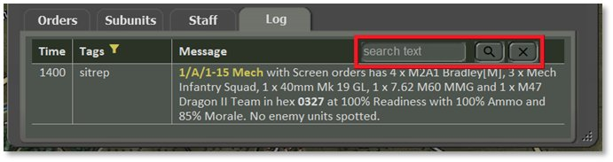

Unit names and hex locations are hyperlinked to scroll the map to those hexes when clicked, if they are not already in frame.

The top right corner of the Log tab hosts a search field that filters the display to messages involving only the desired text (e.g., searching for a particular unit or vehicle type). Search is case-sensitive.

Tags can be filtered, and a yellow funnel icon appears in this column header. Right-click on it, or anywhere on the log, to open a pop-up filtering menu as shown below.

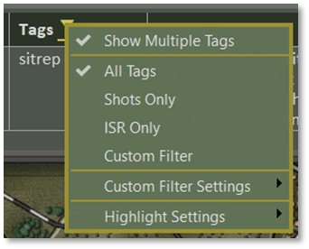

Selecting (checking) Show Multiple Tags displays every tag attached for each message. Unchecking this option conveniently shows only the dominant primary tag for each entry.

Choose which group of messages you would like to see by selecting All Tags, Shots Only, ISR Only, or Custom Filter. Selecting one of these options does not change how many tags are shown, as above. To see just the messages that involve bullets firing, select Shots Only. To see only messages about the enemy from Intelligence Surveillance Recon, select ISR Only.

To make different sets of information visible, select Custom Filter Settings and a pop-up submenu has a very large list of Tags. Uncheck the Tag types you don’t wish to see and then set the filter to “Custom Filter” in the main pop-up menu.

Different colors can make your tags stand out. Select “Highlight Settings” and a pop-up submenu with a very large list of Tags appears (see Section 14.4.1 below). For example, to see messages with the Tag for “Mines” with a color to stand out, select “Mines” from the list and then set the color for that Tag.

**NOTE:** Be cautious not to overdo it as it may be too hard to read the text.

## Subunit Inspector (SUI)

The Subunit Inspector is the primary tool for deep diving into all the information on a given subunit. The following sections detail the various tabs and information displayed. Hitting ***F6*** while a unit is selected brings up the Subunit Inspector. This can be opened via the Unit Popup Menu as well.

### General Layout

The Subunit Inspector shows a variety of useful information and the general layout is described below, with the dialog shown in two parts.

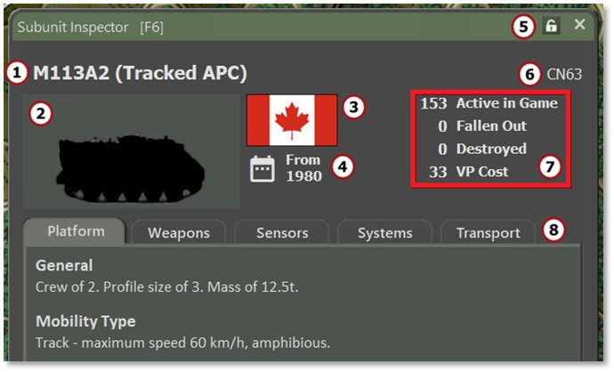

1. The subunit name and the type of subunit in parentheses.

2. The subunit silhouette or image if available via mod.

3. The national flag or emblem.

4. The date the unit is active in the game.

5. Click the lock to freeze this dialog on the selected subunit to preserve its information while clicking around to other subunits. Click the “X” to close the dialog.

6. The unit code of the subunit from the data file.

7. The number of the selected subunits that are Active, Fallen Out, or Destroyed in the current scenario. It also shows the Victory Point (VP) cost of this subunit that will count for or against your total score (see Section 15.1.2 below).

8. These five tabs cover the Platform, Weapons, Sensors, Systems, and Transport that the selected subunit has. These tabs are detailed in the next subsections.

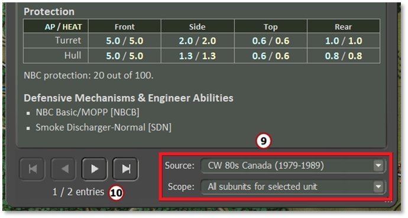

9. Under Source, use the drop-down selections to look at other national data files in the scenario.

Under Scope, select different groups of subunits to view in each tab’s details including All Subunits For Selected Unit, All Subunits For This Scenario, or All Subunits For This Nationality.

1. Click through different subunits if there is more than one type available
based on the Scope chosen above.

### Platform Tab

The Platform tab provides information related to the general capabilities of a given subunit. These values include crew number, profile size, and mass.

The Mobility Type lists the type of movement (e.g., track, as shown below), the maximum speed, and any other mobility capabilities if applicable (e.g., amphibious).

Protection ratings are displayed for the Front, Side (flank), Top, and Rear parts of the subunit or a static Protection factor for aircraft and helicopters. Armor piercing (AP) values are in blue and high explosive anti-tank (HEAT) values are in yellow, and are shown as Protection Factor ratings. One point of Protection Factor is equivalent to 10 mm of armor. Each platform has its own range and scale of values. The NBC (nuclear, biological, chemical) Protection rating is listed below the table.

Defensive Mechanisms & Engineer Abilities show platform-specific characteristics/traits of the subunit that can impact gameplay, if available.

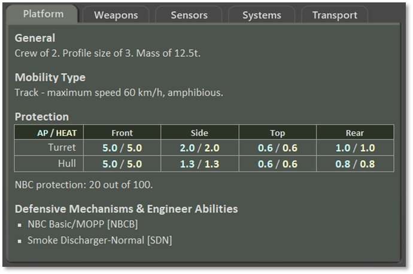

### Weapons Tab

Every weapon system on a platform/subunit is listed on this tab with its various performance parameters and any unique characteristics that the systems possess.

The weapon name and type are shown with bold headings followed by the maximum range in meters. Underneath, specific features of the weapon and the rate of fire and number of rounds or bursts come next. These values can be different across scenarios based on supply and munitions loadouts set by the scenario designer. Different ratings for the weapon/munition are then listed with its type(s) of damage or defense, area, and range. If the weapon system has any unique characteristics used in the game, those are listed after the munition specifications.

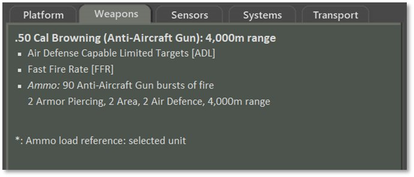

Basic Ammo comes in various types as noted below:

- **Armor Piercing (AP)** – These are solid, long-rod projectiles used to defeat armor.

- **High Explosive Anti-Tank (HEAT)** – This round uses an explosive charge to create a plasma jet that cuts through armor.

- **High Explosive (HE) –** These rounds use a blast fragmentation warhead and affect an area as described in Section 21.3 below.

- **Area –** This type of damage reflects weapons that impact an adjoining group of hexes and are used against soft targets that cover an amount of ground as described in Section 21.3 below.

### Sensors Tab

The Sensors tab shows all the equipment on a platform that is used to Detect, Spot, or Identify enemy units on the map. If a system has Detection capability, it lists the ranges (under optimal conditions) that it can Detect an enemy unit, Classify the type of enemy unit, and Identify the subunits of an enemy unit. Sensor systems contribute to combat calculations.

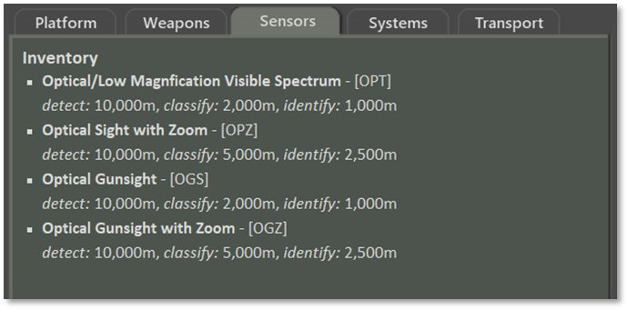

### Systems Tab

The Systems tab notes any other systems that provide a unique capability not already covered in the other tabs. Examples include being amphibious or tow capable, as shown in the image below.

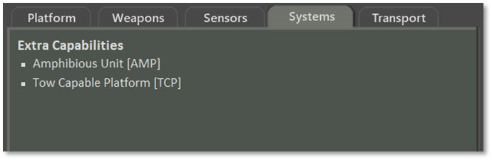

### Transport Tab

The Transport tab shows all transport capabilities of a platform. It first lists general information including the crew size and mass, followed by Organic Transport capacity. For the tracked armored personnel carrier pictured below, the Carrying Capacity is noted:

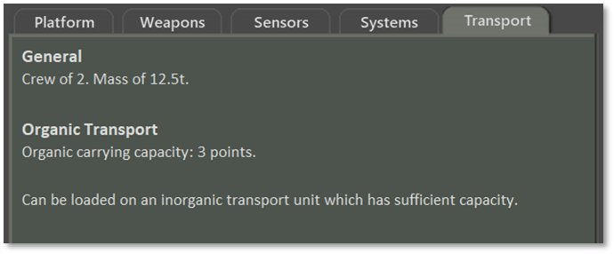

An infantry unit, on the other hand, will note the Lift Needed, as shown below:

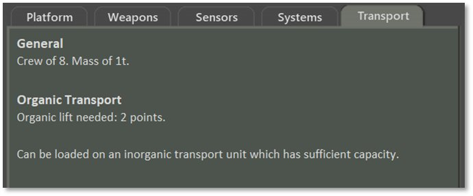

These values are relevant for transport plans (see Section 15.2.4 below for additional transport information and **FM03C Tutorial Operations: Advanced** for more on this planner).

### Further Information on Capabilities

**FM02 Battlefield Primer** and **FM09 Data Structures and Editing** have more information on various platform capabilities if you would like further details. **FM03C Tutorial Operations: Advanced** has more information on transport planning.

## Command/Unit Log

The Command/Unit Log dialog lists the latest 50 log messages for all units in your force. Older logs can be found in the Unit Log of the Dashboard for each unit (see Section 14.2.5 above). Open and close the Command Log by hitting the ***F7*** key. Expand and collapse the dialog by clicking the arrow icon on the right side of the title bar.

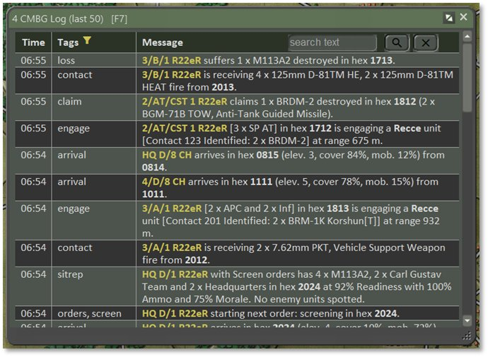

A series of messages are recorded to the Logs as the game unfolds. Both the Time in game and Tag (type of message) are listed with the Message. On the face of it, radio logs/unit logs don’t look like much has changed. On closer inspection, you will see that all messages are now Tagged (instead of just some of them as before), unit names are highlighted, and locations are given subtle highlights (just bold, no color). Unit names and hex locations are now hyperlinked to scroll the map to those hexes when clicked (if not already in frame).

A search field is located in the top right that filters messages to only show the desired text (e.g., searching for a particular unit or vehicle type). Search is case-sensitive.

There is an abundance of tag names now, with every message having at least one label. Examples include:

- **sitrep** – A breakdown of the current active subunits in the unit, hex location, Readiness, Morale, average Ammo level, and the number of Spotted enemy units.

- **orders** – After an order change, the new order is listed with start and end times and hexes if available.

- **loss** – After any losses, details are listed here and the hex they were lost in.

- **spot** – Notes any Spotted enemy units, temporary enemy bridges, Victory Point (VP) locations, and other Spottable items.

- **claim** – Any kills or suspected kills are listed in this entry with the number, type, and hex(es)

A complete listing of your force’s log entries can be found in the Operations Staff Report in the Unit Logs tab (see Section 15.2.7 below).

### Log Capabilities

Logs have been given many updates. These changes include:

- All messages are now given Tags (instead of just some of them as before).

- Tags can now be filtered (see below). The filter icon (a yellow funnel) is located next to the “Tags” column header. Right-click on it, or anywhere else on the log, to pop up the filtering menu.

- Unit names are highlighted to make them easier to find and are hotlinked to that unit’s Dashboard.

- Locations are given a subtle highlight (bold, no color) and are hotlinked to flash on the map.

- The log can be searched using the text box in the top right corner. Search terms are case-sensitive.

- Highlight colors may be set by Tag Type so that specific tags can be emphasized or de-emphasized.

The Tags column can be set to conveniently show only the dominant primary tag for a log entry by turning off (unchecking) Show Multiple Tags. Turning on (checking) Show Multiple Tags displays every tag attached for each message with the primary tag listed first and any other tags after. This control for how many tags are shown is independent of the filtering criteria below and can be toggled on and off.

To filter by Tag, choose which group of messages you wish to see by selecting All Tags, Shots Only, ISR Only, or Custom Filter. Selecting one of these options does not limit the number of tags displayed but does require tags to meet the selection criteria in order to appear.

To see just the messages that involve bullets firing, select Shots Only.

To see only messages about the enemy from Intelligence Surveillance Recon, select ISR Only.

To see specific sets of information, select Custom Filter Settings to pop up a submenu which has a very large list of Tags. Uncheck the Tag types you don’t wish to see and then set the filter to “Custom Filter” in the main pop-up menu.

The Highlight Settings make the tags you want to feature stand out by picking different colors for them (see image below). Use with care! It's all too easy to set everything to have a highlight color and become dazzled by the beautiful but unreadable Christmas tree-like effect that gets produced.

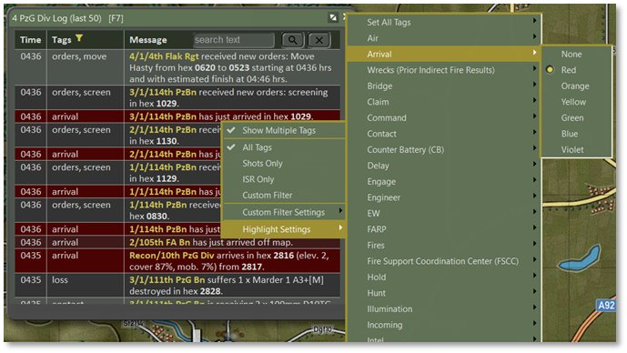

Select “Highlight Settings” and a pop-up submenu with a very large list of Tags appears. For example, to accent messages with the “Arrival” tag, select “Arrival” from the list and then choose the color for that Tag among the submenu’s options.

This new system is used everywhere there are unit logs – this log, the Unit Dashboard, the Counter-Battery tab located in the Fire Support Staff Report (see Section 15.4.4 below), and the Unit Logs report located in the Operations Staff Report (see Section 15.2.7 below).

If this dialog has the Windows operating system’s focus, it can be closed by tapping the ***Esc*** key.

## Off-MapAssets

The Off-Map Assets dialog [***F8***] provides a listing of any forces that exist off-map that can support your on-map force. This includes aircraft or artillery assets in the Artillery tab and weapon locating systems in the Sensors tab. For example, in the image below a headquarters and an artillery battery are located 2 km off the west edge of the game map.

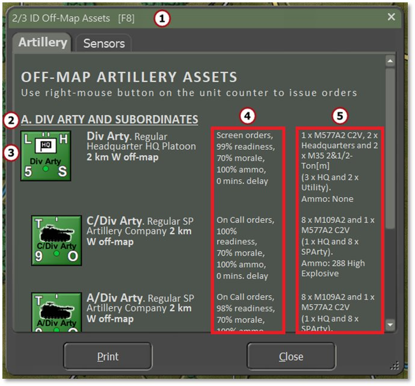

Features of note in this dialog include:

1. The name of the overall force being supported by the off-map assets.

2. The name of the smaller off-map asset formation(s) available to use.

3. The counter of each supporting off-map unit, unit name, type, and off-map location.

4. The first column shows what the current orders are for each unit as well as Readiness, Morale, and Ammo levels, and the current Delay for orders to process.

5. This second column shows the unit’s composition by platform and type and then a breakdown of the Ammo carried by the unit.

The Sensors tab follows the same format as Artillery, as seen below.

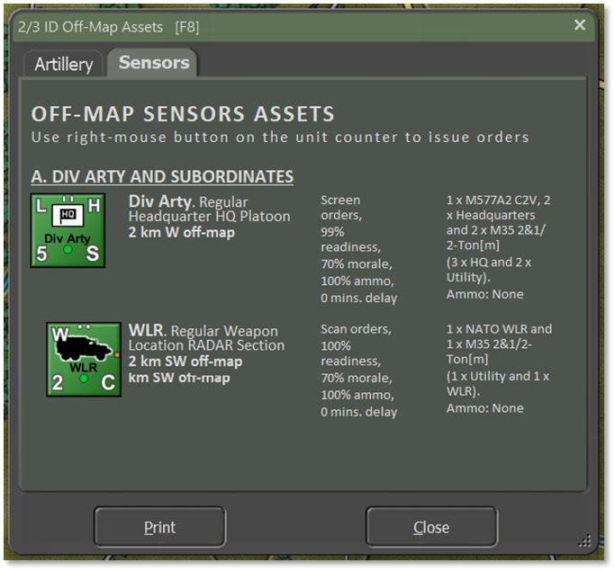