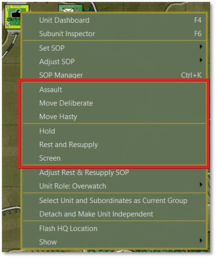
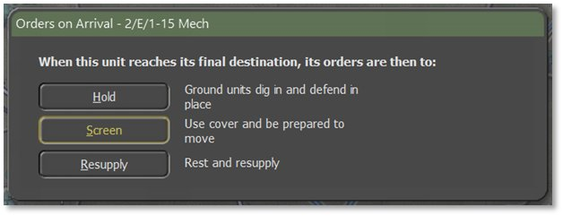
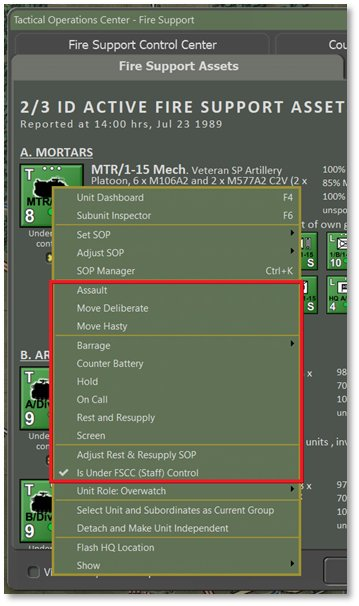
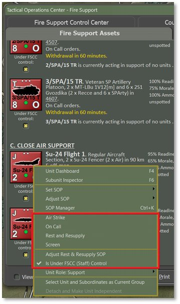
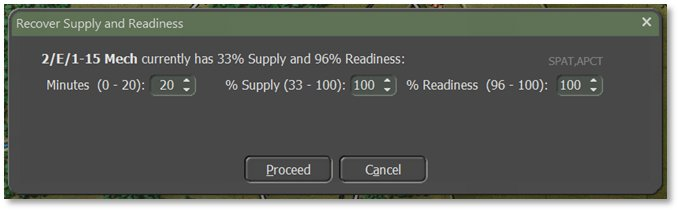
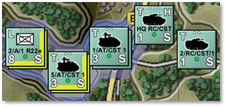

# Issuing Orders

Control your forces by giving orders to your units. Be aware that a certain period is needed by the staff to formulate and transmit your orders. The units need time to prepare for the new orders which is a function of the type of order, training level, Readiness, and the tactical situation of the unit to which it is issued.

Orders take as long as they take to run to completion and this may not coincide neatly with the command cycle/orders phase intervals. Orders persist to the next turn if new ones are not issued. If you keep interrupting orders with new orders, the Delay time will increase as orders must be rescinded and new ones generated. The lengths of the command cycles are displayed in the Game Control Panel (see Section 13.1 above).

One notable exception to this is the special case of the first turn, or opening salvo. Orders given during the initial setup phase only are deemed pre-planned, therefore have no orders delay. The first turn will begin in the first minute of battle. All necessary work to prepare is assumed to have been finished during the setup time. This makes the first turn particularly advantageous as the execution will be quicker than in later turns (see Section 21.7 below for more information on Delays).

## Open the Unit Popup Menu

Orders are given to a unit by right-clicking on the unit counter on the map and selecting an order from the Unit Popup Menu that opens. Some orders only require selecting the option to set them (Screen, On Call, Hold, Resupply, etc.). Others require the player to designate waypoints or target points before they can be set (Moves, Assault, Barrage, Hunt, etc.). With these last actions, finish the order by selecting one of the options in the Orders on Arrival dialog that pops up when finished selecting waypoints for the move.A breakdown of the orders is provided in the next section.

In the image below, the blocks containing orders in the Unit Popup Menu are highlighted in red. The listed orders may be in two sections of the dialog and are based on the type of unit selected and which orders are appropriate for that unit type.

Press the ***Esc*** key to stop an order rather than continue on to waypoint selections if you decide to take a different direction instead of issuing a Move or Barrage order. Accepting an order (by selecting the final Orders on Arrival shown below) and then issuing a new order also works. This change does not add additional time to the command delay as the order is not yet in process (i.e., the turn resolution has not been started and progress has not begun yet).

For more detailed information about plotting movement and setting waypoints, see Section 22 below.

Another way to open the Unit Popup Menu is by right-clicking the unit counter in some reports and displays when visible. This is useful for off-map assets like artillery and air units, as shown below.

## Primary Unit Orders

Most units have the following primary orders available:

- **Assault** – Move in a spread-out formation using both road and off-road movement to be ready to attack an enemy.

- **Move Deliberate** – A more defensive form of travel than Assault but also travels both on and off-road.

- **Move Hasty** – Faster than Assault and Deliberate moves, but trades better defensive coverage for better speed. It sticks mainly to roads even when there is less Cover or Concealment.

- **Screen** – A non-moving state of seeking moderate Cover and being ready to attack or move from that position if required.

- **Hold** – A non-moving state of seeking the best Cover in the hex and in some cases, digging in for improved defensive protection if the unit will be in the hex for at least 30 minutes. This is the strongest choice for defending locations.

- **Rest and Resupply** – A state of rearming, refueling, and resting to recover Readiness and Morale. After selecting this option from the popup menu, set the Rest and Resupply parameters based on spending a certain amount of time in this action (in Minutes), resupplying to a certain Ammo level (% Resupply), or resting to a certain Readiness level (% Readiness). Increasing or decreasing one threshold criterion will alter the others based on a proportionate level of recuperation.

Rest and Resupply only takes place if the unit is not in combat. Units with Resupply orders will receive supply trucks and other vehicles that meet them in place during lulls in battle, or units may drive to the rear if close enough and then promptly return to their original location. Aircraft and helicopters return to base to rearm and refuel. See Section 27 below for supply and logistics information.

## Indirect Fire Specific Orders

Additional orders that are available for units with indirect fire capabilities include:

- **Barrage** – Opens a submenu of orders to fire certain types of munitions at a set of targets on the map.

- **Suppression Fire** – Low rate of fire of high explosive (HE) rounds that have limited kill power but do inflict Readiness loss to targeted units.

- **Neutralizing Fire** – High rate of fire of high explosive (HE) rounds that maximize killing power and inflict Readiness loss to targeted units.

- **Saturation Area Fire** – This option is found only on multiple rocket launchers. It allows all the unit’s rockets to be fired off in rapid succession and strike a much larger target zone. Only one target point can be selected if this mission is chosen. Rounds will land in the target hex and surrounding six hexes. This is a devastating attack that can cause severe losses to person and machine. Units firing a saturation attack automatically go to zero Ammo and must Resupply before shooting again.

- **Smoke** – Fires rounds that deploy smoke screens of various types that obscure vision and sensors.

- **Scatterable Mines (FASCAM)** – Deploys hex-wide minefields in the targeted hexes.

- **Improved Conventional Munitions (ICM)** – Rounds deploy several submunitions capable of destroying both armored and soft targets.

- **Nuclear Munition** – Single rounds with a tactical nuclear warhead that cause massive area-wide damage and nuclear contamination.

- **Chemical Munition** – Rounds drop persistent or non-persistent chemical attacks into hexes. Non-persistent strikes dissipate over time.

- **Counter Battery** – Units are set to fire on located enemy artillery units if they are within range, including both on- and off-map units. Units do not shoot other missions while on Counter Battery. Units with Counter Battery orders can be available to the Fire Support Control Center (FSCC) for fire support requests if they are under FSCC control and not already engaged (see Section 25.4.1 below).

- **On Call** – Unit is ready for new orders from the player or FSCC.

- **Is Under FSCC (Staff) Control** – When checked, gives fire mission control to the Staff AI. When unchecked, the unit is placed under the player’s direct control. Not exactly an order, but affects how orders are made for this unit.

## Engineering Specific Orders

Orders that are specific to engineering units include:

- **Remove (Blow) Bridge** – Deconstruct a fixed bridge if they are in an adjacent hex.

- **Lift Mines** – Clear lanes in a minefield for units to pass safely through.

- **Remove Engineered Obstacle** – Remove obstacles to create lanes for units to pass through.

- **Demolish Positions –** Destroy Improved Positions in a hex (see Section 16.10 above for information on Improved Positions).

- **Lay/Recover Bridge –** Short-span bridging vehicles place or retrieve a temporary bridge over a hex-side water obstacle.

## Helicopter Specific Orders

Helicopters have their own specific attack order:

- **Hunt** – Moves from waypoint to waypoint looking for enemy units to engage, while doing its best to use terrain to mask its movement.

## Aircraft Specific Orders

Aircraft have similar options as above, with an additional strike order:

- **On Call** – Unit is on station and waiting to be called back in for a strike.

- **Is Under FSCC (Staff) Control** – When checked, gives fire mission control to the Staff AI. When unchecked, the unit is placed under the player’s direct control. Not exactly an order, but affects how orders are made for this unit.

- **Air Strike** – Orders an aircraft to attack a selected hex with its carried ordinance. Depending on the type of aircraft and weapons, targets may be restricted to specific types.

## Unit Orders Delay Factors

Orders take time to transmit, absorb, and implement. Some are fast and some take time. For many orders, there is a preparation time before the order can begin and then a period during which the order is executed. If the unit is On Call or is already performing the same kind of order requested (e.g., Move to Move or Screen to Screen, just with different parameters) then the Orders Delay equals 2 minutes. Otherwise, the Orders Delay equals the standard Orders Delay (2 to 60 minutes, average 5 to 10 minutes).

Other delay factors include:

- If the unit is being rested, then the Orders Delay is increased by 10 minutes.

- If the unit needs to relinquish a dug posture, then the Orders Delay is increased by 5 minutes.

- If the unit is not currently moving and the new order requires movement, then the Orders Delay is increased by 5 minutes.

- If the unit is under fire, then the Orders Delay is increased by 50%.

- If the scenario electronic warfare (EW) intensity is Medium then the Orders Delay is increased by 20%. If EW intensity is High then it is increased by 33% (see Section 25.9 below for more on this).

- If the unit is ordered to Assault, then the Order Delay cannot be less than 15 minutes.

These are base delays and vary based on the training level of the forces, their Readiness, and command and control losses. Command delays appear in posted Estimated Times of Arrival (ETAs) and the Orders tab of the Unit Dashboard ([***F4***], see Section 14.2.2 above).

As described at the start of this section, one notable exception to this is the special case of the first turn, or opening salvo. Orders given during the initial setup phase only are considered pre-planned and have no Orders Delay. The first turn begins in the first minute of battle. All necessary preparation work is assumed to have been finished during the setup time. This makes the first turn particularly advantageous as the execution will be quicker than in later turns which are subject to the above mentioned delay factors.

## Involuntary Orders Changes

Not all units follow orders under all circumstances. Self-preservation takes over long before the very last bullet is fired or life is lost. There may be an involuntary change of orders if the unit reaches a stress threshold limit. This limit is calculated using the current Morale, Readiness, and training levels, losses, HQ proximity, and national factors for following orders and command flexibility. If the limit is exceeded, attacks will stall and defenses will turn into retreats. Specifically:

- Assaults, Moves, and Resupply orders become Screens.

- Screens and Holds become Scoots for relative safety.

- Specialist units (e.g., artillery, supply, etc.) revert to On Call or Scoot to safety.

- Overwatch and Support units stop advancing if their associated Main Effort and Line units are lost in battle.

- Units in a group movement halt to keep spacing and formation by role (Recon in front, Main Effort and Line, then Overwatch, and Support in the rear).

**NOTE:** Units doing an automatic Scoot show an “F” for the order type when moving (for “fallback”’; see Section 17.1 above for counter information breakdown). Units that trigger a Withdrawal via SOP settings (see Section 23 below) show a “W” for their orders. These order types cannot be set by the player since they are reactions to whatever is going on in the game for the unit in question.

## Issuing Group Orders

It is possible to give orders to more than one unit at a time via the following means:

- ***Shift*** + left-click on each unit you wish to issue a standard order to. These can be units from different groups and headquarters.

- ***Alt*** + left-click on a headquarters (HQ) to select all subordinate units in that HQ’s formation.

- ***Ctrl*** + left-click on a subunit to highlight that subunit, its HQ, and the rest of the subunits under that HQ.

To issue orders to the selected group, right-click on any of the highlighted units to open the Unit Popup Menu and select an order. If selecting a Movement order, the AI provides intelligent pathing to keep units in a cohesive formation and then spread them out at the final waypoint in defensive locations (if possible) to avoid stacking. Select any unit and alter the placement of the waypoints as you see fit (see Section 22 below for ordering and modifying movement orders).

**NOTE:** Do this efficiently by selecting the order that will apply to the most units and then use the unit’s/units’ Dashboard(s) to change the type of Movement order at various waypoints to individually customize them, as described in the next section.