# Main Menu Bar

At the top of the screen is the Main Menu Bar for the game. The following sections will go over each menu and function in detail. Hotkeys are shown in brackets (**[*hotkey*]**) for each item that can be used.

## Game Menu Items

The Game Menu covers those functions that relate to the overall playing of the scenario.

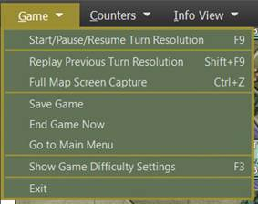

- **Start/Pause/Resume Turn Resolution [*F9*]** – This menu item will start turn resolution after you issue orders or pause the turn resolution if it is running and then resume resolution when you are done looking at information.

- **Replay Previous Turn Resolution [*Shift-F9*]** – This menu item will replay reset the turn that was just resolved and start it over with a VCR dialog for control (See Section for details on the VCR dialog functions). You can only replay the last turn resolved.

- **Full-Screen Map Capture [*Ctrl+Z*]** – Captures the entire game map and all counters and markers on it with no UI shown in the specified folder.

- **Save Game** – This opens the Save Game dialog, and you can save the current turn and return to the game. The Cancel button will exit the save dialog back into the game.

- **End Game Now** – Depending on the confirmation dialog, Yes will stop the current scenario, score the outcome, and display the end of the scenario post-mortem. Once invoked, you cannot restart the game and would need to reload a previous save. If you wish to continue the game, select No from the Confirmation dialog.

- **Go to Main Menu** – When this action is selected, a confirmation dialog to save the scenario will appear. Selecting Yes will save the game via dialog and then return to the Main Menu. Selecting No will end the game and return to the Main Menu.

Finally, selecting Cancel will abort the action and return to the game.

- **Show Game Difficulty Settings [*F3*]** – Selecting this action will open a read-only display of the Difficulty Settings of the scenario for you to review.

- **Exit** – Exits the game back to the desktop without saving the game.

## Counters Menu Items

The menu items in this tab relate to actions to better see specific units or to show/hide counters and markers on the map.

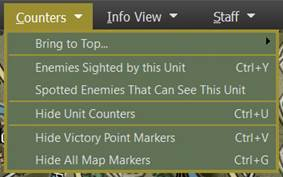

- **Bring to Top** – For all your units in the stack, selecting a particular unit type will bring the unit type to the top of the stack to make them visible.

- **Enemies Sighted by this Unit [*Ctrl+Y*]** – For the selected unit on the map, this action will remove all the enemies from the map that are not spotted by the unit, only showing those enemies this unit can see. It can be toggled on and off.

- **Spotted Enemies That Can See This Unit** – For the selected unit on the map, this action will only show those known enemies that can see the selected unit. It can be toggled on and off.

- **Hide Unit Counters [*Ctrl+U*]** – Selecting this action will hide all the counters on the map, both friendly and the enemy, so the map and markers are visible. It can be toggled on and off.

- **Hide Victory Point Markers [*Ctrl+V*]** – Selecting this action will hide all the Victory Point (VPs) markers on the map. It can be toggled on and off.

- **Hide All Map Markers (not kills/craters) [*Ctrl+G*]** – Selecting this action will hide all map markers except the kills and craters so the map and unit counters can be seen more easily. It can be toggled on and off.

## Info View Menu Items

The menu items in this tab open or close several helpful dialogs, toggle the Spotlight Panel look, or change the look of the Core Panels.

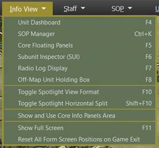

- **Unit Dashboard *[F4]*** – Selecting this action brings up the Unit Dashboard for the currently selected unit on the map. See Section 14.1 below for the details of this dialog. You can have more than one of these open at a time on different units.

- **Core Floating Panels [*F5*]** – These are the four primary panels you see on the left side of the screen (default locations). These are Game Control, Commander, Spotlight, and Mini-Map panels. This is on by default. These are covered in detail in Section 13 below.

- **Subunit Inspector (SUI) [*F6*]** – Selecting this action brings up the SubUnit Inspector for the currently selected unit on the map. See Section 14.3 below for the details of this dialog.

- **Command Log Display [*F7*]** – This panel displays the diary log messages for the entire force in the scenario. It is on by default. It can be toggled on and off. In head-to-head or AI versus AI games, there are tabs for both forces on the display.

- **Off-Map Unit Holding Box [*F8*]** – Selecting this action will open the Off-Map holding Box to show you any off-map units that you can use during the scenario. See Section 14.5 below. It can be toggled on and off.

- **Toggle Spotlight View Format [*F10*]** – Selecting this action will toggle the Spotlight Panel between the Order of Battle (OOB) display and the Detailed Unit information display.

- **Toggle Spotlight View Format [*Shift+F10*]** – Selecting this action will split the panel and show both the OOB and the Detailed Unit information on the single panel with a splitter bar that you can adjust up and down to show the information. This is recommended only if the panel has more room or is floating away from other panels.

- **Show and Use Core Info Panel Area**– Selecting this action to be active (check mark showing in the menu) will place the Core Info Panels to the right of the map, so the right edge of the map is visible on the screen. If this is turned off, the map edge will go to the screen edge and be hidden under the Core Panels.

- **Show Full Screen [F11]** – Toggles the game display between full screen (no windows task bar) and default display with task bar. This only works on the primary display if multiple screens are present.

- **Reset All Form Screen Positions on Game Exit** – Selecting this action will set all the various game panels and dialogs back to their default location for the next game played.

## Staff Menu Items

This is a critical menu for all Commanders to utilize during the game. The dialogs here provide you with information from your various staff officers (Operations, Intelligence, Logistics, and Fire Support) as well as an overview of the scenario.

Other essential functions found in this menu are the items relating to overlay graphics. These are graphics that are placed over the map and are created by an external art program.

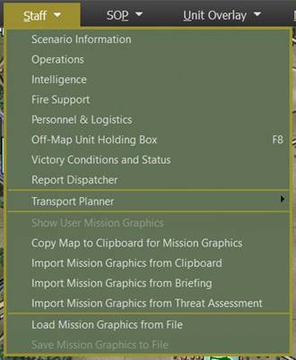

- **Scenario Information** – Selecting this action brings up the Scenario Information dialog. This covers the Scenario Description, Victory Conditions, and VP Distribution Details. See Section 15.1 below for the details of this dialog.

- **Operations** – Selecting this action brings up the Operations dialog. This covers the Mission Briefing, Map overlay, SITREP (Situation Report), Engineering, Air Support, Emitters, Diaries, and Runner information. See Section 15.2 below for the details of this dialog.

- **Intelligence** – Selecting this action brings up the Intelligence dialog. This covers the Threat Assessment, Enemy SITREP, Reported Kills and Claims, Weather Forecast, EW Report (Electronic Warfare), and Enemy Off-Map Assets. See Section 15.3 below for the details of this dialog.

- **Personnel & Logistics** – Selecting this action brings up the Personnel and Logistics dialog. This covers Staff Alerts, Detailed Unit Status, Reinforcements and Withdraws, and Ammunition. See Section 15.4 below for the details of this dialog.

- **Fire Support** – Selecting this action brings up the Fire Support dialog. This covers the Fire Support Assets, Fire Missions, and Fire Support Control Center. See Section 15.5 below for the details of this dialog.

- **Victory Conditions and Status** – Selecting this action will open the Victory Conditions and Status dialog, and you can review the current state of the scenario.

- **Show User Mission Graphics** – Selecting this action will toggle the latest Mission Graphics to be drawn on the map. The graphics can be from the Briefing, Clipboard, or User.

- **Copy Map to Clipboard for Mission Graphics** – Selecting this action will copy the map with unit counters and markers to the clipboard so it can be imported into a paint program for editing. We suggest using Paint.NET in Windows to edit the mission graphics with information. Other programs may not support the format for import.

- **Import Mission Graphics from Clipboard** – Selecting this action will load any mission graphics you have currently copied to the clipboard from your paint program, provided the image dimensions are identical to the map dimensions (as imported from the clipboard). The game will blend the image to show your color graphics on the map while turning grey scale-colored pixels (including white and black) transparent. The game is compatible with the ‘in-memory’ clipboard format from Paint.NET, not with those from MS Paint and Paint3D. **NOTE:** The color Black will not show in the mission graphics.

- **Import Mission Graphics from Briefing** – Selecting this action will load the pre-made mission graphic that supports the given side’s briefing for the scenario.

- **Import Mission Graphics from Threat Assessment** – Selecting this action will load the pre-made mission graphic that supports the threat assessment for the scenario.

- **Load Mission Graphics from File** – Selecting this action will load the pre-made mission graphic from the Custom folder in a scenario folder.

For the NATO side, the graphic must be named Overlay0.png, and for the Warsaw Pact side, it must be named Overlay1.png.

- **Save Mission Graphics to File** – Selecting this action will save the currently shown mission graphics to the Custom folder of the scenario folder with the name Overlay0.png for NATO and Overlay1.png for Warsaw Pact. It will only save a single image currently.

## SOPItems

SOPs (Standard Operating Procedures) are unit instructions on how to behave in certain situations on the battlefield. This menu item provides a means to adjust SOP characteristics for selected units or to set SOPs based on the type of unit and the selected SOP package for the selected units.

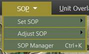

- **Set SOP** – Selecting this option will display the Set SOP options sub-menu. See Section 11.5.1 below for details on the various color options.

- **Adjust SOP** – Selecting this option will display the Adjust SOP options sub-menu. See Section 11.5.2 below for details on the various color options.

- **SOP Manager** – Selecting this action will open the SOP Manager Dialog for the selected unit.  See Section 23 below for details on the setting of this dialog.

### Set SOP

The Set SOP menu item brings up an additional menu dialog with a list of unit types and arrows to open an additional menu with pre-set SOP options for those unit types. The pre-sets are based on the unit type and the roles it typically performs and the values that have been set by our team.

The Set SOP submenu is shown below.

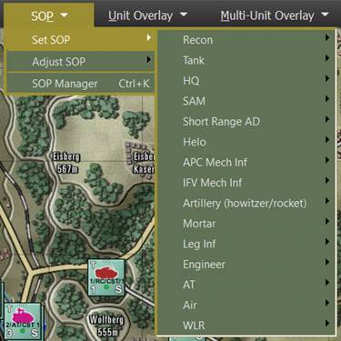

The Custom Unit Type selections are seen in the additional flyout submenu below.

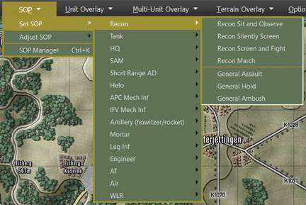

Once a Set SOP is selected, the following confirmation dialog is shown that explains the SOP settings used for the Set SOP selection. Under each counter is a checkbox that allows you to select which of a group of units the Set SOP applies to. At the bottom, there are options to apply the new Set SOP preset to the current default order, all movement orders, and all non-movement orders. The recycle button allows you to quickly invert the selected unit checkboxes in the dialog. When you are ready to apply hit the Done button. If you change your mind and do not want to do a Set SOP setup, click the cancel button.

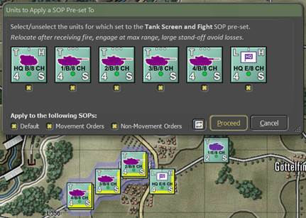

For more information on SOPs, see Section 23 below.

### Adjust SOP

This sub-menu has the following SOP items set out as individual items. These are the same items as found in the SOP Manager dialog. For any selected unit or units (Alt, Ctrl, or Shift selected), the setting will be applied to those units shown as checked in the setting dialog that pops up after choosing a setting.

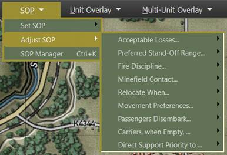

- **Acceptable Losses...** – This is the unit(s) willingness to take losses before seeking a change in orders. This works with the Tactical Initiative above to set how a unit reacts. The settings for this item are Do or Die, Substantial, Moderate, or Minimal.

- **Preferred Standoff Range...** – The number of 500m hexes you wish the unit(s) to be distant from any detected enemy units.

- **Fire Discipline...** – This sets the range or ability to shoot at enemy units in direct fire. The available settings are Refuse fire, Hold until fired on, Point blank (0 to 1 hex), Short Range (1/3 Max Range), Medium Range (2/3 Max Range), and Maximum Range. **NOTE:** This applies to all the unit’s weapons.

- **Minefield Contact...** – This is the unit(s) response to entering a minefield. The options here are Ignore and Run (do not delay and accept the potential for more subunit losses crossing the field), In Stride Breach (units slow down to follow a leader through the field, hoping to avoid mines by traveling in the same tracks), or Stop and Reduce (units halt and either wait for engineers to remove enough mines to open a path through or do the work themselves at a slower rate).

- **Relocate When...** – This determines under what condition a unit will seek to scoot to a new location for better protection or to avoid enemy fire.

The possible selections are After each fire mission, After all fire missions, While the enemy spotted, After receiving any fire, After receiving direct fire, After taking any losses, After taking direct fire losses, or Never. Some of these settings work better for certain types of units. The after-fire mission settings work better for artillery, for instance.

- **Movement Preferences...**  – When a unit moves from waypoint to waypoint, there are a few options for how that travel can be done. The hasty move will prefer roads, and Deliberate or Assaulting move orders will mix roads with cross-country movement. You can set stricter movement preferences by checking the boxes for Concealment (more off-road and seeking better-covered terrain to move through, Roads (favor taking roads instead of cross country), and Avoid NBC (which will path units around NBC-contaminated locations on the map).

- **Passengers Disembark...** – Selecting this option will display the Adjust SOP options sub-menu. See Section 11.5.1 above for details on the various color options.

- **Carriers, when Empty...** – Selecting this option will display the Set SOP options sub-menu. See Section 11.5.1 above for details on the various color options.

- **Direct Support Priority to...** – Selecting this action will open the SOP Manager Dialog for the selected unit.  See Section 23 below for details on the setting of this dialog.

Once an SOP Adjustment is selected, the following confirmation dialog is shown that states the SOP settings adjusted for the selected units. Under each counter is a checkbox that allows you to select which of a group of units the SOP Adjustments apply to. At the bottom, there are options to apply the new SOP Adjustment to the current default order, all movement orders, and all non-movement orders. The recycle button allows you to quickly invert the selected unit checkboxes in the dialog. When you are ready to apply hit the Done button. If you change your mind and do not want to do any SOP Adjustment, click the cancel button.

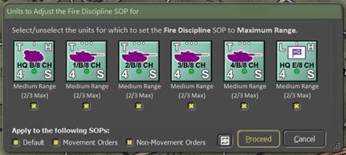

For more information on SOPs, see Section 23 below.

## Unit Overlay Menu Items

Overlays are helpful on-map graphics that show various information for the selected unit to help show lines of sight, the range for weapons and spotting, Electronic Emissions, if any, and a range ruler. Some of these can be used in combination on the map.

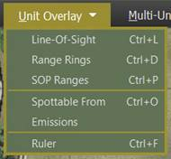

- **Line of Sight [*Ctrl+L*]** – Selecting this action brings up the Line of Sight (LOS) overlay and the basic Detection, Classification, and Identification rings for the selected unit. Hexes are in various shades of green based on how good the visibility is to that hex. The brighter the green, the better the visibility to the hex.

Also included are the visual capability values for each hex. Higher numbers mean a better chance to spot enemy units in those hexes. Hexes inside the hard outline are in weapons range. See Section 24 below for more details on LOS and the Spotting of units.

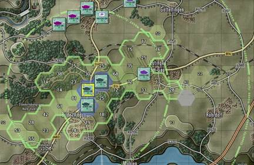

The range ring for Detection notes the maximum range under perfect conditions that an enemy unit of some type can be detected. Once inside the Classification range, the Detected target’s type can be determined (is it a tank or infantry unit). Once inside the Identification range, the exact type of enemy units can be determined (the tank is a T-80BV, for example).

**NOTE:** You can see the line of sight from any hex by doing a Shift + left mouse clicks on the hex you want to check.

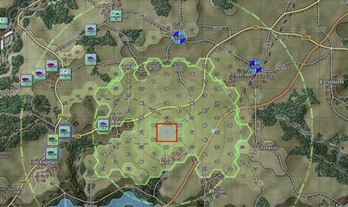

- **Range Rings [*Ctrl+D*]** – Selecting this action brings up the range rings overlay on the map for the selected unit. Rings include weapons ranges (in your combat preferences color), visible spottable range (Thermal and radar distances will be more prominent in most cases), and the max spotting range based on the environmental conditions.

- **SOP Ranges [*Ctrl+P*]** – Selecting this action brings up the SOP-related range rings for the selected unit. This includes the unit’s standoff range and selected weapon engagement range. The filled hexes show the line of sight, with green being out to the maximum spotting range. Yellow hexes are the line of sight within the standoff range, and ones with red numbers are in the selected weapon’s range.

- 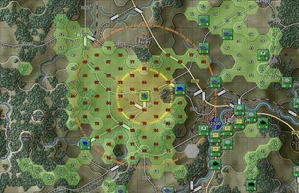

- **Spottable From [*Ctrl+O*]** – Selecting this action brings up the Spottable From overlay for the selected unit. This shows the various ranges and types of systems (Visual, Thermal, and Radar) that the unit is possibly visible to and the hexes where line of sight exists. The size, movement, firing, and other factors impact the ranges.

**NOTE:** You can check the selected unit’s Spottable From in any hex by doing a Shift + left mouse clicks on the hex you want to review. The information will change based on the type of terrain in that hex.

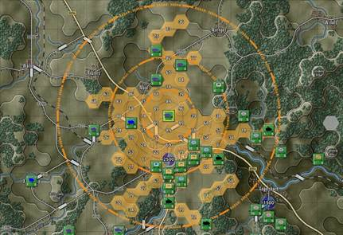

- **Emissions** – Selecting this action brings up the Emissions overlay. This shows the electronic line of sight of an emitting unit. These would be units with some form of radar (air search or ground search), and that system turned on (See Orders, Section 21 below).

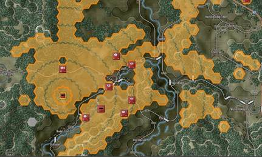

- **Ruler** – Selecting this action brings up the Ruler overlay. This shows range rings in 1000-meter circles with lighter rings for 500 meters up to 5000 meters.

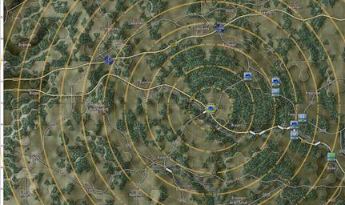

**NOTE:** You can check the from any hex by doing a Shift + left mouse clicks on the hex you want to review.

## Multi-Unit Overlay Menu Items

Multi-Unit Overlays are helpful on-map graphics that show various information for all units to help show lines of sight, ranges for weapons and spotting, Electronic Emissions if any, and Starting Deployment Areas. There are also functions to show Chain of Command, Air Defense coverages, Fire Support coverage, and Direct Support assets. Some of these can be used in combination on the map.

**NOTE:** Many of the following functions will also show the currently selected units overlay as it would appear in other hexes by Shift + Left Mouse Click in the hex of interest. This can be very useful when planning locations for things like air defense or looking at variations in line of sight at different map locations.

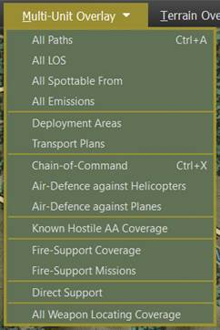

- **All Paths [*Ctrl+A*]** – Selecting this action brings up all the active paths for all your units. The currently selected unit will have a darker path line.

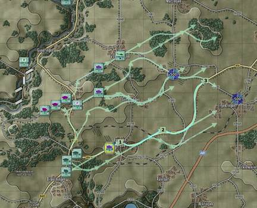

- **All LOS** – Selecting this action brings up the Line of Sight (LOS) overlay for all your on-map units. As you select units, you will see the LOS of that unit shown with the thick hex outline on the map.

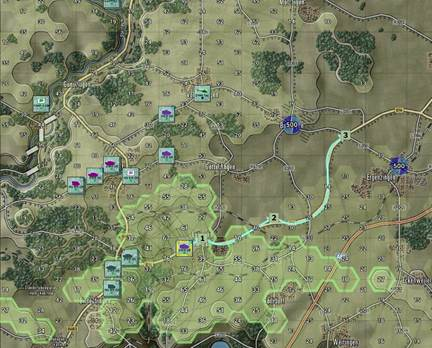

- **All Spottable From** – Selecting this action brings up the Spottable From overlay on the map for all your units on the map. The selected unit’s spottable hexes will be shown with a thick hex outline.

- **All Emissions** – Selecting this action brings up the All-Emissions map overlay. This shows the coverage for all emitting units on the map. The selected unit will have its hexes outlined, and the unit will have a wavey circle around it.

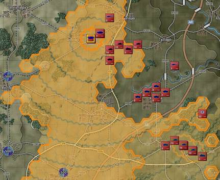

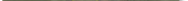[[KC2]](#_msocom_2) In cases where a unit has an emitter(s), but they are turned off, the unit will have a gray wavey circle drawn around it as it shows to the left. See Section 21 below on how to issue orders to turn emitters on and off.

- **Deployment Areas** – This menu action toggles the setup zones for each side off and on. These are the colored hex areas that show up for your units at the start of the scenario. The selected unit can be dragged and dropped into any colored hex. The colors for each side and the level of transparency are set in the game options (see Section 3.4 above).

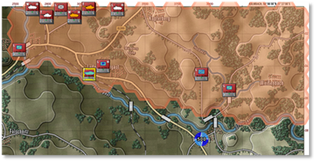[[KC3]](#_msocom_3)

- **Chain of Command [*Ctrl+X*]** – Selecting this action brings up the Chain of Command overlay. This shows the chain of command for units. The chain of command is how orders are given and received by units and headquarters. As shown below, the highest headquarters, when selected, will show lines of command to the next lower-level headquarters. Solid lines are in range. Dashed lines indicate a subordinate HQ or unit that is out of command range. The HQ’s command range is drawn as a large circle. Units outside of the command range face additional delays in orders and reduced resupply. Some units, like Recon units, can operate at full capacity at any range.

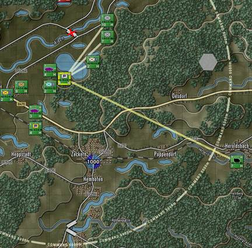

As seen above, dark-colored lines extend from the selected HQ to its next-level subordinate units. In this case, the subordinates are lower-level HQs.

In the picture above, one of the subordinate HQs has been selected. Dark lines extend to the HQ's subordinate units, and a dark circle shows the extent of the HQ’s command radius. A light-colored line goes from the selected HQ up to the next higher HQ if it exists, and the command range of the next higher HQ is drawn on the map.

[[KC4]](#_msocom_4)

In the picture above, one of the subordinate units has been selected. Light lines extend to that subordinate unit’s HQ, and a light circle shows the extent of the HQ’s command radius for that subordinate. Selecting other subordinate units will show the relationship to their local HQ.

- **Air-Defense against Helicopters** – Selecting this action brings up the Air-Defense overlay for on-map Helicopters or Drones (assumed to be flying very low and defensively) for all air-defense capable units in your force. Depending on the type of unit you select, there are three types of overlay effects shown on the map. When you select a unit with an Air-Defense Surface to Air Missile system (SAM), the hexes are shown as filled, and the range of the selected unit is seen in the solid hex side outline, as seen in the image below.

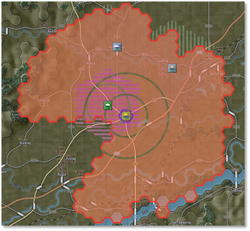

When you select a unit with an Air-Defense Gun system (Flak), the hexes are shown as horizontal hatched lines, and the range of the selected unit is seen in the solid hex side outline as seen in the image below on the left.

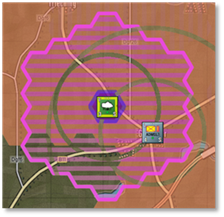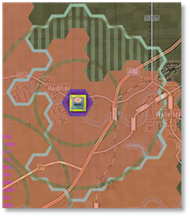

When you select a unit with a Limited Air-Defense system (like an anti-air machine gun or autocannon), the hexes are shown as vertical hatched lines, and the range of the selected unit is seen in the solid hex side outline as seen in the image above on the right. These are limited capability systems. These weapons will engage at a reduced range and only engage air threats approaching them (within a 30-degree arc).

- **Air-Defense against Planes** – Selecting this action brings up the Air-Defense overlay for off-map Aircraft (assumed to be flying low) for all air defense capable units in your force. Depending on the type of unit you select, there are two types of overlay effects shown on the map. When you select a unit with an Air-Defense Surface to Air Missile system (SAM), the hexes are shown as filled, and the range of the selected unit is seen in the solid hex side outline, as seen in the image below.

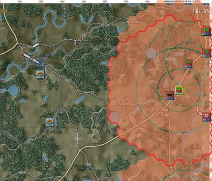

When you select a unit with an Air-Defense Gun system (Flak), the hexes are shown as horizontal hatched lines, and the range of the selected unit is seen in the solid hex side outline, as seen in the image below.

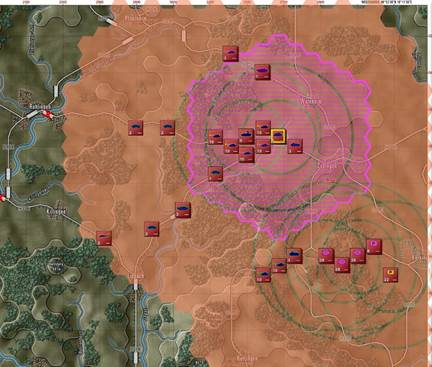

- **Fire-Support Coverage** – Selecting this action brings up the Fire-Support Coverage overlay. This shows the firing range for all on-map and off-map indirect fire artillery units (mortars, field guns, rockets). Selecting a unit will show darkened range rings and map coverage hexes.

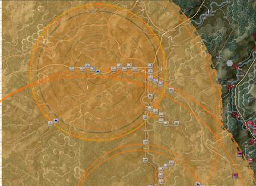

- **Fire-Support Missions** – Selecting this action brings up the Fire-Support Missions overlay. This shows All of the currently plotted fire missions. A line is drawn from each firing unit to the target hex(es). The target hex(es) will state the type of mission (HE = High Explosive, Smoke, ICM = Improved Conventional Munitions, or Chemical, for example), the number of rounds to be fired, and the time the mission starts. Lines will be drawn for off-map assets based on their off-map locations and target hexes.

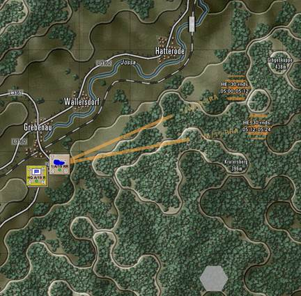

- **Direct Support** – Selecting this action brings up the Direct Support overlay. The direct support overlay indicates, given the selected unit, which assets are in direct support and which units are directly supported. DS assets either have a line to the selected unit supporting that unit), or six short lines in all directions when they are set to support all units. The ranges of DS assets are also shown on the map. If a DS asset is selected, the hexes in the line of sight of all supported units are indicated as hexes with a hard outline.

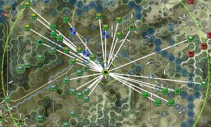

## Terrain Overlay Menu Items

The Terrain Overlay Menu has several useful overlays covering various factors of the map and the terrain. The most important from a planning aspect is the MCOO [Pronounced Ma Coo] or the Modified Combined Obstacle Overlay. The others have been used, and most are found in the Status Bar (See Section 12.2 below) for the hex the mouse is in.

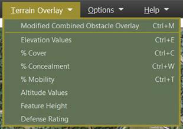

- **Modified Combined Obstacle Overlay (MCOO)** – Selecting this action will bring up the MCOO. The map will be overlayed with various colors, hatching, and edges that represent various levels of useful terrain information. A Legend also pops up to explain all the impact of the various information shown. Use this information to quickly note poor mobility areas, clear lanes of fire, impassible terrain, and good locations to hide recon units. See Section 16.12 below for details on what the various markings mean.

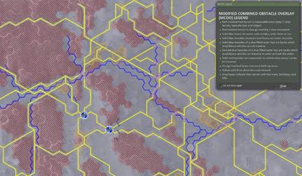

- **Elevation Values** – Selecting this option will show the elevation value for every hex on the map. Elevations run from 1 to 10 and denote changes of 25 to 50 meters of the ground level. Elevation changes impact the line of sight, and elevation changes also impact the speed of unit travel.

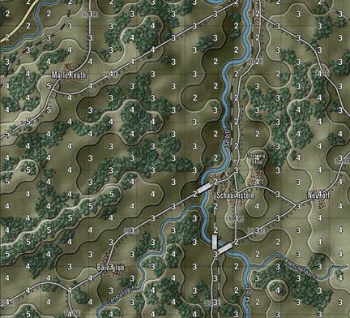

- **% Cover** – Selecting this option will show the Cover Percentage for every hex on the map. The cover runs from 1 to 99 and denotes the ability of the terrain to provide cover from direct/indirect fire, with 1 being no protection and 99 being a maximum.

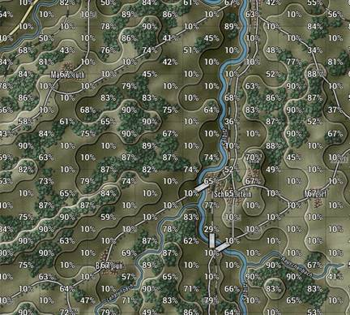

- **% Concealment** – Selecting this option shows the Concealment rating for each hex on the map. Concealment impacts the spotting and line of sight abilities of units. One being no impact to line of sight/spotting, and 99 being extreme degrading of the line of sight and spotting.

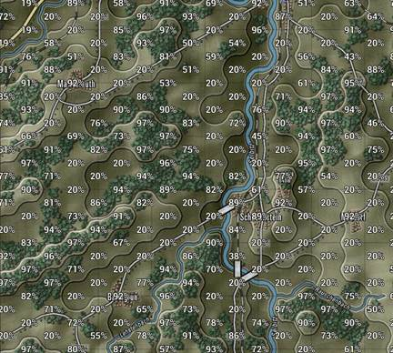

- **%Mobility** – Selecting this option shows the Mobility rating for each hex on the map. The Mobility rating shown reflects off-road movement for units. The higher the number, the faster units can travel off-road. Units using Hasty (road) movement will move faster where there are roads and ignore the mobility rating in favor of the type of road.

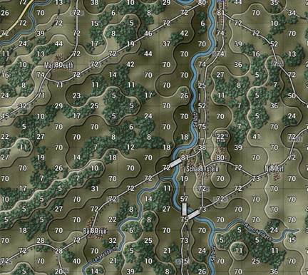

- **Altitude Values** – Selecting this option will display the Altitude value for every hex on the map. The Altitude value is the height above sea level in meters for the area represented on the map. The information is for display only and does not factor into gameplay.

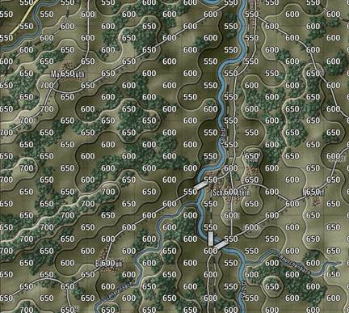

- **Feature Height** – Selecting this option will display the Feature Height for each hex on the map. Feature height is a primary measure of how tall the objects are in the terrain. This value impacts spotting and line of sight during the game.

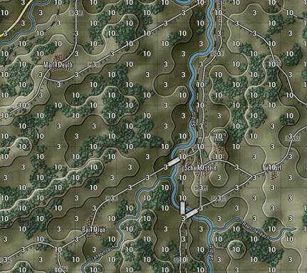

- **Defense Rating** – Selecting this option will display the Defense Rating for every hex on the map. This is a relative rating for how defendable a location is based on the terrain type. One would be very poor defensible terrain, and 99 would be outstanding terrain to defend in.

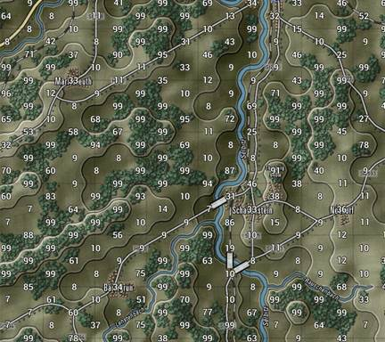

## Options Menu Items

The Options Menu is used to access the User Preference dialog, change up the counter art style and colors, and vary the map contrast to suit your taste to see the counters and markers.

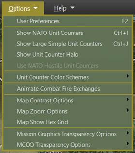

- **User Preferences** – Selecting this option will open the User Preferences dialog that has many of the game settings. See Section 3 above for details on what settings are there and what they do.

- **Show NATO Unit Counters** – Selecting this option will display NATO markers in place of the vehicle silhouettes on all counters. Default silhouette counters left, and NATO counters right. For a rundown of NATO symbols and their meaning, refer to the Battlefield Primer FM FCCW-02.

- 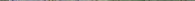**Show Large Simple Unit Counters** – Selecting this option will display Large NATO Symbols on all the counters to make the unit type more visible at extreme map zoom-out levels. Default silhouette counters left and Large Simple counters right.

- **Show Unit Counter Halo** – Selecting this option will display a color halo around all silhouettes. Default silhouette counters left, and Halo enabled counters right.

- **Unit Counter Color Schemes** – Selecting this option will display the Unit Counter Color Scheme options. See Section 11.9.1 below for details on the various color options.

- **Animate Combat Fire Exchanges** – Selecting this option will turn on weapon-based firing animations for direct-fire weapons that replace the static “red” and “blue” lines in the default game setup. See Section 16.13 below for more details.

- **Map Contrast Options** – Selecting this option will display the Map Contrast Options. See Section 11.9.2 below for details on the various map contrast options in the game.

- **Map Zoom Options** – Selecting this option will display the Map Zoom Options. See Section 11.9.3 below for details on the various map zoom levels in the game.

- **Map Show Hex Grid** – Selecting this option will draw a light-colored hex grid over the current map to better show the map hexes. This can be toggled on and off via the menu item.

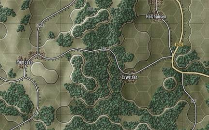

- **Mission Graphics Transparency Options** - Selecting this option will display the Mission Graphics Transparency Options. See Section  11.9.4 below for details on the various transparency options in the game.

### Unit Counter Color Schemes

Along with being able to change the basic look of the counter art between Silhouettes and NATO standard markings, these additional counter options allow you to change the colors for better identification or contrast depending on your style or need. These settings can be changed at any time the menu is active in the game.

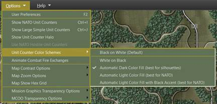

- **Black on White (Default)** – Simple black art or black NATO symbol on a white field.

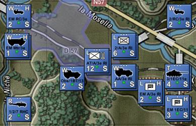

- **White on Black** – Simple white art or white NATO symbol on a black field.

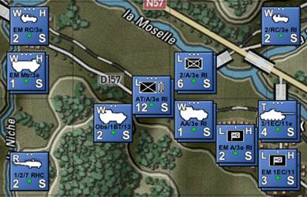

- **Automatic Dark Color Fill (best for silhouettes)** – Based on formations, each unit will get a contrasting dark color fill for the silhouettes and halo or the NATO backgrounds. This makes it easier to see what units belong to what formations and HQs.

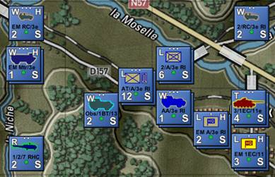[[KC5]](#_msocom_5)

- **Automatic Light Color Fill (best for NATO)** – Based on formations, each unit will get a contrasting light color fill for the silhouettes or the NATO backgrounds and contrasting color lines for the NATO symbols. This makes it easier to see what units belong to what formations and HQs.

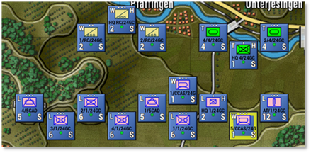

- **Automatic Light Color Fill with Black Accents (best for NATO)** – Each unit, based on its formation, will get a contrasting light color fill for the silhouettes or the NATO backgrounds with black line art for the NATO symbols. This makes it easier to see what units belong to what formations and HQs.

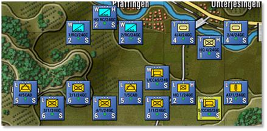

### Map Contrast Options

These options allow the user to change the level of contrast/saturation (color vibrancy) of the map to make the counters and map markers more visible in some cases. The option goes from full color down to a basic grey scale look. This setting can be changed at any time when the menu is active.

- **Full-Color Map Terrain** – This selection shows the map in its default color as made.

- **Lightly Muted Map Terrain** – This selection shows the map with a slight change to contrast and saturation.

- **Moderately Muted Map Terrain** – This selection shows the map with a moderate change to contrast and saturation.

- **Strongly Muted Map Terrain** – This selection shows the map with a strong change to contrast and saturation.

- **Fully Muted Map Terrain** – This selection shows the map with an entirely muted contrast and saturation. Turning the map into a scale.

### Map Zoom Options

The Zoom Options menu item provides the user with the ability to zoom the map from 30% up to 200%. This wide range allows layers on very high-resolution screens to zoom in and still see and read counters and the map. The Fit option automatically scales the entire map to fit on the screen. There are hotkeys for the basic ranges between 50% and 130%.

### Mission Graphics Transparency Options

The in-game Mission Graphics Transparency is 50% and can be set to a less transparent level on the map by selecting 25% or 10% Transparency via this option. The lower the value, the brighter the mission graphics will appear over the map.

## Help Menu Items

The Help Menu contains several items to allow you to access various game documentation folders to access the PDFs for the What’s New, Field Manuals and Operational Area Guides, the in-game Hotkeys listing, About the game info, and the all-important Credits (check it out at least once to see all those responsible for this great game).

