# Menu Bar

At the top of the screen is the Menu Bar for the game. The following sections go over each menu item and function in detail. Hotkeys are shown in brackets (**[*hotkey*]**) for each item that can be used. Due to the number of game functions present, rebinding is not possible. Hotkey definitions can be viewed at-a-glance in a separate document located in the game \Documents folder.

## Game Menu Items

The Game Menu covers functions that relate to the overall playing of the scenario.

- **Start/Pause/Resume Turn Resolution [*F9*]** – Starts the turn resolution after you issue orders, pauses the turn resolution if it is running, or resumes the turn resolution when you are done looking at information or menus depending on where you are in the turn.

- **Replay Previous Turn Resolution [*Shift+F9*]** – Replays the turn that was just resolved from its beginning. It shows a Replay Control dialog with buttons to Replay From The Beginning, Pause, Play, and Skip to End using typical media control symbols. Only the last turn can be replayed.

- **Full Map Screen Capture [*Ctrl+Z*]** – Captures the entire game map with all counters and markers on it without UI showing, saving in the specified screen capture folder.

- **Save Game** – Opens the Save dialog to save the current turn and then return to the game. The Cancel button exits without saving and returns to the game. Auto-saving can be turned on via the Turn Resolution tab in User Preferences [***F2***].

Each game save defaults to a file name containing the name of the scenario, the real-world date and time, the percentage of the scenario completed, and the in-game time of that save point. This makes it easy to replay a scenario from any of these points. File names can also be manually entered at the time of saving.

- **End Game Now** – Battle can be ended early and Victory Points counted if at least two-thirds of the way through. Note that once the game is ended, you cannot restart that game and must either start a new one or reload a previous save. After clicking this menu option, a dialog appears asking if you are sure you want to end the game. Clicking Yes stops the current scenario, scores the outcome, and presents the scenario postmortem. If you wish to continue the game, select No from the confirmation dialog.

- **Go to Main Menu** – Exits to the Main Menu splash screen. A confirmation dialog to save the scenario will appear. Selecting Save and Exit saves the game via save dialog and then returns to the Main Menu. Selecting No sends you to the Main Menu without saving (any progress will be lost). Selecting Cancel aborts the action and returns to the game.

- **Show Game Difficulty Settings [*F3*]** – Selecting this action opens a read-only display of the scenario’s Difficulty Settings to review (see Section 4.3 above for information about these settings).

- **Exit** – Exits the game back to the desktop without saving.

## Counters Menu Items

The Counter menu bar items relate to changing the visibility of different factors to better see specific units or to show/hide counters and markers on the map.

- **Bring to Top** – Select a particular unit type from the pop-out submenu to bring that unit type to the top of the stack when multiple units are stacked in one hex.

- **Enemies Sighted by this Unit [*Ctrl+Y*]** – Removes all enemies from the map that are not Spotted by the selected unit, leaving only enemies that unit can see. It can be toggled on and off.

- **Spotted Enemies That Can See This Unit** – Removes all enemies from the map that cannot Spot the selected unit, leaving your own Spotted enemies that are able to see your unit. It can be toggled on and off.

- **Hide Unit Counters [*Ctrl+U*]** – Hides all the counters on the map, both friendly and enemy, so the map and markers are visible. It can be toggled on and off.

- **Hide Victory Point Markers [*Ctrl+V*]** – Hides all the Victory Point (VP) location markers on the map. It can be toggled on and off.

- **Hide All Map Markers [*Ctrl+G*]** – Hides all map markers including bridges, craters, casualties, and other full hex markers (see Section 16.10 below) so the map and unit counters can be seen more easily. It can be toggled on and off.

## Info View Menu Items

The Info View menu bar items in this tab open or close several helpful dialogs, toggle the Spotlight Panel (see Section 13.3 below), or change the locations of the Core Game Panels (see Section 13 below).

- **Unit Dashboard *[F4]*** – Opens the Unit Dashboard for the currently selected unit (see Section 14.2 below). These dialogs can be locked so that more than one can be open at a time for different units.

- **SOP Manager [*Ctrl+K*]** – Opens the SOP Manager dialog for the currently selected unit (see Section 23 below). This dialog is the best place to see all SOP settings for the current list of unit orders and the defaults for future orders.

- **Core Floating Panels [*F5*]** – Shows (when checked) or hides (when unchecked) the four primary panels that are located along the right edge of the screen by default. These are Game Control, Commander, Spotlight, and Mini-Map Panels. This is on by default. These are covered in detail in Section 13 below.

- **Subunit Inspector (SUI) [*F6*]** – Opens up the Subunit Inspector for the currently selected unit. See Section 14.3 below for details.

- **Radio Log Display [*F7*]** – Opens the diary log of messages for the entire force in the scenario. It can be toggled on and off. In head-to-head or AI versus AI games, there are tabs for both forces on the display. See Section 14.4 below for information on this log.

- **Off-Map Unit Holding Box [*F8*]** – Opens a report to show any off-map units that are accessible during the scenario. See Section 14.5 below. It can be toggled on and off.

- **Toggle Spotlight View Format [*F10*]** – Toggles the Spotlight Panel between the Order of Battle (OOB) display and the Detailed Unit Information display. See Section 13.3 below.

- **Toggle Spotlight Horizontal Split [*Shift+F10*]** – Splits the panel to show both the OOB and the Detailed Unit Information in a single window with an adjustable splitter bar. See Section 13.3.3 below. This is recommended only if the panel has been sized to provide room or is floating away from other panels.

- **Show and Use Core Info Panels Area**– Places the Core Info Panels to the right of the map when checked so that the right edge of the map is visible on the screen. When unchecked, the map edge goes to the screen edge and may be hidden under the Core Panels.

- **Snap Core Floating Panels to Area on Move** –Toggles the Core Info Panels to move and/or realign to the Panel Area if the main game screen is moved or resized.

- **Reset Core Floating Panels –** Aligns the Core Info Panels to neatly fit inside the available Core Panel Area on the right side of the screen.

- **Show Full Screen [*F11*]** – Toggles the game display between full screen with no Windows task bar and the default window mode with task bar. This only works on the primary display if multiple screens are present.

- **Reset All Form Screen Positions on Game Exit** – Selecting this action sets all the various game panels and dialogs back to their default location for the next game played.

## Staff Menu Items

The Staff menu bar items are critical for all commanders to utilize during the game. The dialogs here provide information from your various staff officers (Operations, Intelligence, Fire Support, and Personnel & Logistics) as well as an overview of the scenario. Each of these reports can also be accessed via speed buttons in the Commander Panel (see Section 13.2 below).

Other essential functions found in this menu are items related to overlay graphics. These are graphics that are placed over the map to assist with planning and issuing orders, and are created by an external art program (currently, Paint.NET is most compatible).

- **Scenario Information** – Opens the Scenario Information Staff Report. This covers the Scenario Description and Victory Status & Conditions information. See Section 15.1 below.

- **Operations** – Opens the Operations Staff Report. This covers the Mission Briefing, Map Overlay, SITREP (Situation Report), Transport, Engineering, Emitters, Unit Logs, Mission Capable Subunits, and SOP Overview information. See Section 15.2 below.

- **Intelligence** – Opens the Intelligence Staff Report. This covers the Threat Assessment, Enemy SITREP, Reported Kills and Claims, Weather Forecast, EW Report (Electronic Warfare), and Enemy Off-Map Assets. See Section 15.3 below.

- **Fire Support** – Opens the Fire Support dialog. This covers the Fire Support Assets, Fire Missions, Fire Support Control Center, Counter-Battery, and Air Support. See Section 15.4 below.

- **Personnel & Logistics** – Opens the Personnel and Logistics dialog. This covers Staff Alerts, Detailed Unit Status, Reinforcements and Withdraws, and Ammunition. See Section 15.5 below.

- **Off-Map Unit Holding Box [*F8*]** – Opens a report showing any off-map units (artillery or sensors) you can use during the scenario. See Section 14.5 below.

- **Transport Planner** – Opens a pop-out submenu for the tactical transport systems for both air and land. It defaults to showing the relevant tactical transport planner for the currently selected unit.See **FM03C Tutorial Operations** for more on this advanced planner.

- **Show User Mission Graphics** – Toggles the last-used imported mission graphic to appear over the map. The graphic can be a custom one from the user’s clipboard, the game-generated one from the Briefing, or the game-generated one from the Threat Assessment. The graphic can also be loaded into the game from a local file, see below.

- **Copy Map to Clipboard for Mission Graphics** – Copies or “exports” the map with unit counters and markers to the clipboard so it can be imported into a paint program for custom editing. We suggest using Paint.NET in Windows to edit the mission graphics with any desired information. Other programs may not support the import format.

- **Import Mission Graphics from Clipboard** – Loads any mission graphic currently copied to the clipboard from your paint program, provided the image dimensions are identical to the map dimensions (as exported to the clipboard from above). The game will add the image to show your color graphics as an overlay on the map while turning gray-scale-colored pixels (including white and black) transparent. The game is compatible with the “in-memory” clipboard format from Paint.NET, not with those from MS Paint and Paint3D.

**NOTE:** The color black will not be shown in the mission graphics.

- **Import Mission Graphics from Briefing** – Loads the pre-made mission graphic from your side’s Mission Briefing in the Operations Staff Report.

- **Import Mission Graphics from Threat Assessment** – Loads the pre-made mission graphic from the given side’s Threat Assessment in the Intelligence Staff Report.

- **Load Mission Graphics from File** – Loads the pre-made mission graphic from the \Scenarios\(scenario name)\Custom folder. For the NATO side, the graphic must be named Overlay0.png, and for the Warsaw Pact side, it must be named Overlay1.png.

- **Save Mission Graphics to File** – Saves the currently shown mission graphics to the scenario’s Custom folder with the name Overlay0.png for NATO and Overlay1.png for Warsaw Pact. It only saves a single image currently.

## SOP MenuItems

SOPs (Standard Operating Procedures; pronounced ess-oh-PEEZ in short form) are unit instructions on how to behave in certain situations on the battlefield. This menu bar item provides a means to adjust SOP characteristics for selected units or to set SOPs based on the type of unit. It also provides a shortcut to load the SOP Manager.

- **Set SOP** – Opens the submenu to set new SOP presets for any units selected. See Section 11.5.1 below. If multiple different unit types are selected, presets pertaining to each type will be displayed.

- **Adjust SOP** – Opens the submenu to adjust SOP presets for different battlefield events. See Section 11.5.2 below. If multiple different unit types are selected, presets pertaining to each type will be displayed.

- **SOP Manager** – Opens the SOP Manager dialog for the selected unit. See Section 23 below.

The Set SOP and Adjust SOP mechanisms are designed to facilitate quick SOP changes. Both work with multiple manually selected units on the map (using ***Shift***, ***Ctrl***, or ***Alt***; see Section 21.9 below for group selections). In contrast, the SOP Manager dialog displays details on one selected unit at a time. It has options to apply changes to specific groups, however (see Section 23 below). Depending on which units need to receive new SOPs, group-selecting on the map and using Set or Adjust SOP can be a smoother action especially for players more familiar with the settings.

### Set SOP

The Set SOP option opens a submenu with a variety of unit types along with arrows to open additional submenus with relevant SOP presets. The presets are based on the unit type and the role(s) it typically performs, and the values that have been set by our team.

The Set SOP submenu is shown below.

Clicking any of the unit options available opens a second submenu with specific SOPs as shown in the next image using Recon units as an example.

Selecting an SOP setting produces a confirmation dialog that explains the new selection:

Each counter has a check box underneath to select which units the new SOP applies to.

Along the bottom of the dialog are options to apply the new SOP preset for the current Default orders, all Movement Orders, and/or all Non-Movement Orders. The recycle button quickly inverts the unit selections.

Hit Proceed to apply the changes. If you change your mind and do not wish to apply an SOP preset change, click Cancel.

For more information on SOPs, see Section 23 below.

### Adjust SOP

The Adjust SOP selection opens a submenu of SOP options set out as individual items. Here, you can adjust individual SOP settings rather than the entire preset. For any selected unit or units (using ***Shift***, ***Ctrl***, or ***Alt*** to select multiple units; see Section 21.9 below for group orders), the change will be applied to those shown as checked in the same style of dialog as the new SOP preset (see previous subsection).

- **Acceptable Losses...** – The unit’s/units’ willingness to take losses before seeking a change in orders. The settings for this item are Do or Die, Substantial, Moderate, or Minimal.

- **Preferred Standoff Range...** – The number of 500 m hexes you wish the unit(s) to maintain distance from any Detected enemy units.

- **Fire Discipline...** – The range or ability to shoot at enemy units with direct fire. The available settings are Refuse Fire, Hold Until Fired On, Point Blank (0 to 1 hex), Short Range (1/3 Max Range), Medium Range (2/3 Max Range), and Maximum Range.

**NOTE:** This applies to all the unit’s/units’ weapons.

- **Minefield Contact...** – The unit’s/units’ response to entering a minefield. The options here are Ignore and Run, where units do not delay and accept the potential for more subunit losses crossing the field; In Stride Breach, where units slow down to follow a leader through the field while trying to avoid mines by traveling in the same tracks; or Stop and Reduce, where units halt and either wait for engineers to remove enough mines to open a path or do the work themselves at a slower rate.

- **Relocate When...** – The condition under which a unit(s) seeks to Scoot to a new location for better protection or to avoid enemy fire. The possible selections are After Each Fire Mission, After All Fire Missions, While Enemy Spotted, After Receiving Any Fire, After Receiving Direct Fire, After Taking Any Losses, After Taking Direct Fire Losses, After Taking Indirect Losses, or Stance Only. Some of these settings work better for certain types of units. The after-fire mission settings work better for artillery, for instance.

- **Movement Preferences...** – The unit’s/units’ priority for how to travel from waypoint to waypoint. The Hasty Move prefers roads, and Deliberate or Assault Moves mix roads with cross-country terrain. Stricter Movement Preferences can be set by opening the pop-out submenu for each of these options and choosing “Prefer” or “Don’t Care” for a number of movement options.

Concealed Movement favors off-road travel and seeks better-covered terrain to move through. Road Movement favors taking roads instead of cross-country routes. NBC Avoidance chooses paths that go around nuclear, chemical, and biological contamination to prevent ill effects. Direct Path preference means that getting to the destination takes priority over Concealment, Road, and NBC avoidance preferences and units will travel through potentially risky hexes if necessary.

- **Passengers Disembark...** – The number of 500 m hexes you wish to have passengers disembark when At Range From End of Path and At Range From Enemy. See Section 23.5 below for details on transport-related SOPs.

- **Carriers, when Empty...** – The action carriers take after passengers have disembarked. They can Support Passengers or Hide Nearby when they are empty. See Section 23.5 below.

- **Direct Support Priority to...** – Who receives direct support from the selected unit(s). Support can be directed to All Units, the Same Group (or Lower), or Nobody (Refuse Request). See Section 23.3 below for combat SOPs.

Once any of the above SOP adjustments are selected, the following confirmation dialog appears. The SOP setting being adjusted shows in the green title bar. Check boxes under each counter allow you to select which units the SOP adjustments apply to.

At the bottom, there are options to apply the adjustment to the current Default order, all Movement Orders, and/or all Non-Movement Orders. The recycle button quickly inverts the unit selections in the dialog.

When you are ready to apply changes hit Proceed to apply the changes. If you change your mind and do not wish to apply an SOP preset change, click Cancel. For more on SOPs, see Section 23 below.

### SOP Manager *[Ctrl+K*]

The SOP Manager selection opens the Standard Operating Procedures dialog which shows all the SOP settings in one form-style window with a more comprehensible view. SOPs can be set per unit, per groups of units, per waypoint, or per group of orders, and multiple settings can be changed at the same time via the manager.

Your forces come with pre-existing SOPs so that adjusting these in detail is not required to start shooting or playing the game. There are many ways to customize and craft highly-tailored SOPs for more advanced players.

The SOP Manager’s advantage over the Set and Adjust submenu options is that the new procedures can be set to Also Apply To a number of options: Subordinates, Other Unit Types, Other Selected Units, or Future Orders. A breakdown of this manager can be found in Section 23 below.

## Unit Overlay Menu Items

Overlays are helpful on-map graphics that show a variety of information for the selected unit. Overlays include Line of Sight (Section 11.6.1), the ranges for weapons and Spotting (Section 11.6.2), SOP ranges (Section 11.6.3), where a unit is Spottable From (Section 11.6.4), any Electronic Emissions (Section 11.6.5), and a Ruler (Section 11.6.6). Some of these can be used in combination on the map.

Each are described in turn below.

### Line of Sight [*Ctrl+L*]

Selecting this option brings up the Line of Sight (LOS) overlay and the basic Detection, Classification, and Identification rings for the selected unit. Hexes are overlaid with various shades of green based on how good the visibility is for that hex. The brighter the green, the better the visibility. The color and transparency can be changed in User Preferences ([***F2***], see Section 3.4 above).

Each hex also shows the visual capability values. Higher numbers mean a better chance to Spot enemy units that may be in that hexes. Hexes inside the hard outline are within weapons range. See Section 24 below for more details on LOS and the Spotting of units.

In the LOS overlay, the range ring for Detection (not shown, as it extends far) notes the maximum range under perfect conditions that an enemy unit of some type can be detected. Once inside the Classification range (outer ring on the images above and below), the Detected target’s type can be determined (e.g., tank or infantry unit, etc.). Once inside the Identification range (the inner ring on the images), the exact type of enemy unit can be determined (e.g., the tank is a T-80BV).

**NOTE:** The Line of Sight can also be viewed from any hex by ***Shift*** + left-clicking on the hex you wish to check.

### Range Rings [*Ctrl+D*]

Selecting this option brings up the Range Rings overlay on the map for the selected unit. Rings include the Spottable From range (thermal and radar distances will be more prominent in most cases), the weapons’ Effective/Max ranges, Command range, and the max Spotting range based on the environmental conditions. The color and transparency of these lines can be changed in User Preferences ([***F2***], see Section 3.4 above).

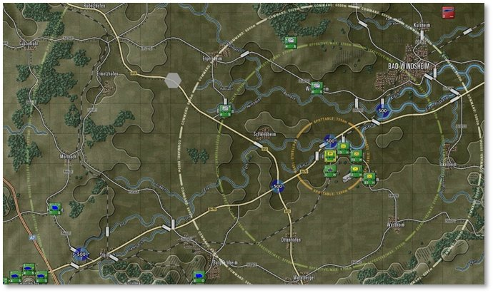

### SOP Ranges [*Ctrl+P*]

Selecting this option brings up the SOP-related Ranges overlay for the selected unit. This includes the unit’s Stand-Off and Max Fire ranges. The yellow hexes show the unit’s Line of Sight within Stand-Off range while the green hexes show the extent of the Spotting range. Hexes with red numbers are within the selected unit’s weapons’ firing range. Higher numbers are more advantageous.

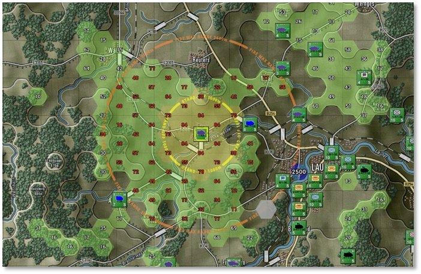

### Spottable From [*Ctrl+O*]

Selecting this option brings up the Spottable From overlay for the selected unit. This shows the various ranges and types of systems (visual, thermal, and radar) that the unit is possibly visible to and the hexes where Line of Sight exists. Unit size, movement, firing, and other factors impact these ranges.The color and transparency of this overlay can be customized in Game Colors under User Preferences ([***F2***], see Section 3.4 above).

**NOTE:** Check the selected unit’s Spottable From ranges in any hex by ***Shift*** + left-clicking on the hex you wish to review. The information changes based on the type of terrain in that hex (see Section 11.8 below).

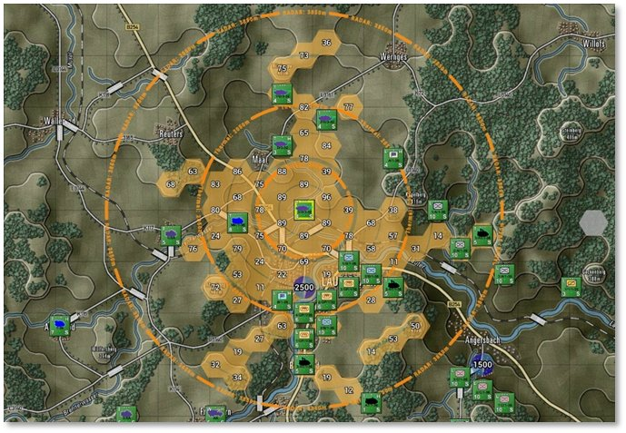

### Emissions

Selecting this option brings up the electronic Emissions overlay for the selected unit if it is emitting (if it is not emitting, no overlay will appear when this is turned on). This shows the electronic Line of Sight of the emitting unit with some form of radar (air search or ground search that system turned on; see Section 15.2.6 below).

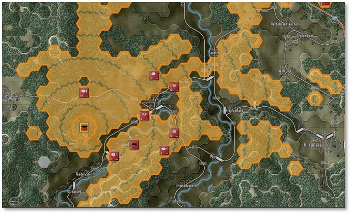

### Ruler [*Ctrl+F*]

Selecting this option brings up the Ruler overlay to assist with measuring distances on the battlefield. This shows rings radiating from the selected hex in darker/thicker 1000-meter circles with additional thinner rings marking 500 meters up to the first 5000 meters.

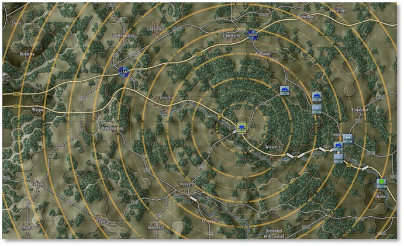

**NOTE:** Check the Ruler from any hex by ***Shift***
+ left-clicking on the hex you want to review.

## Multi-Unit Overlay Menu Items

Multi-Unit Overlays are helpful on-map graphics that show a variety of information for all units at once including Paths, Lines of Sight, Ranges for weapons and Spotting, Electronic Emissions if any, Deployment Areas, and Transport Plans. There are also functions to show Chain of Command, Air Defense coverage against Helicopters and Planes, Fire Support Coverage and Missions, Direct Support assets, and All Weapon Locating Coverage. Known Hostile Air Assault Coverage can also be displayed. Some of these can be used in combination on the map.

**NOTE:** Many of the following functions also show the currently selected unit’s overlay as it would appear in other hexes by ***Shift*** + left-clicking in the hex of interest. This can be very useful when planning locations for things like Air Defense or looking at variations in Line of Sight at different map locations.

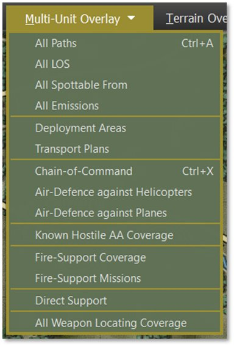

### All Paths [*Ctrl+A*]

Selecting this option brings up the active paths for all units that have been given Movement orders. The currently selected unit has a brighter line and shows its waypoints. The color, width, and transparency of these lines can be customized in Game Colors under User Preferences ([***F2***], see Section 3.4 above).

**NOTE:** Primary orders for each unit can be glimpsed by checking the Movement markers present along the edges of the counters (see Section 17.1 below). For example, a blue triangle along one edge or in a corner indicates the direction a unit will advance with Deliberate Movement.

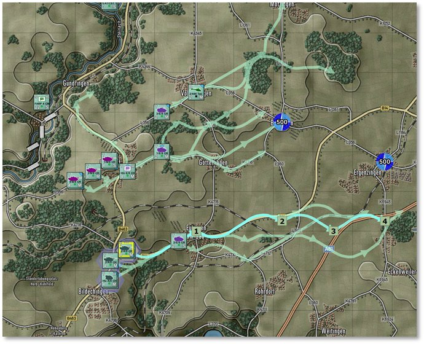

### All LOS

Selecting this option brings up the combined Line of Sight (LOS) overlay for all on-map units. The highlighted unit shows its LOS with a thick green outline. Clicking around to different units shows which hexes their LOS falls over. The appearance of this overlay can be changed in Game Colors under User Preferences ([***F2***], see Section 3.4 above). Adjusting the transparency slider will help the non-selected units’ overlays appear darker.

The numbers in the hexes represent the visual capabilities of that hex. Higher numbers mean a better chance to Spot enemy units from those hexes. Hexes inside the hard outline are within weapons range. See Section 24 below for more details on LOS and the Spotting of units.

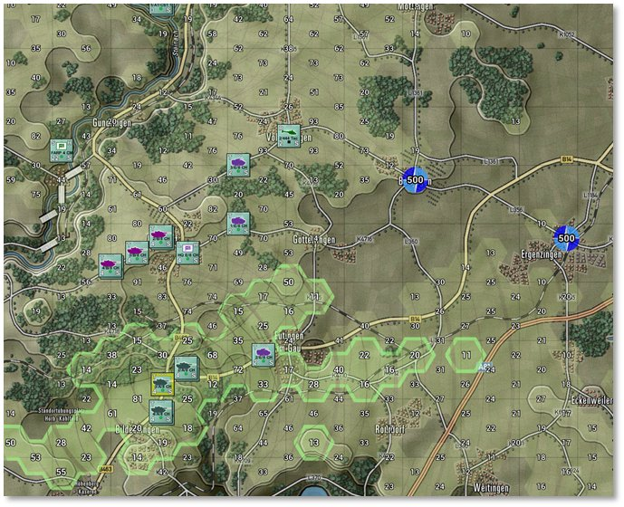

### All Spottable From

Selecting this option brings up the combined Spottable From overlay on the map for all on-map units. The selected unit’s Spottable From range is inside the thick hex outline and has a brighter color. The multi-unit overlay does not display range rings like the individual unit overlay does (see Section 11.6.4 above) but the orange hexes still represent where various ranges and types of systems (visual, thermal, and radar) would be able to Spot a unit from. Unit size, movement, firing, and other factors impact the ranges.The color and transparency of this overlay can be customized in Game Colors under User Preferences ([***F2***], see Section 3.4 above).

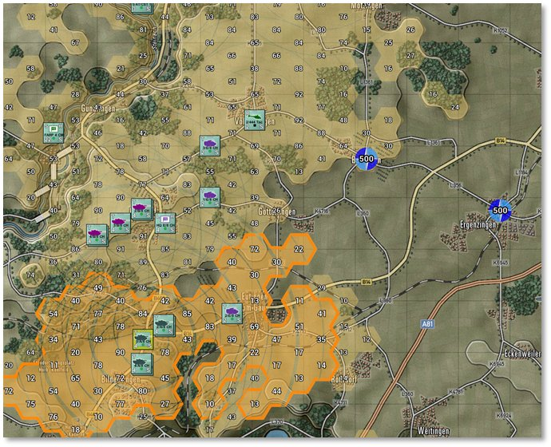

### All Emissions

Selecting this option brings up an overlay of All Emissions present. This shows the coverage for all emitting units on-map. The selected unit’s emissions are outlined with thick hex edges and the unit itself has a wavy circle around it.

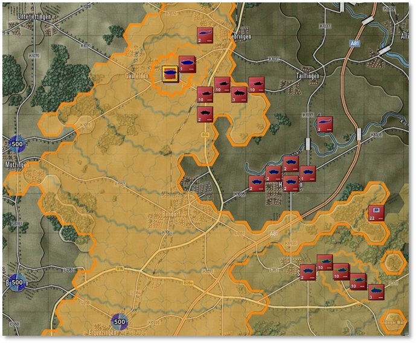

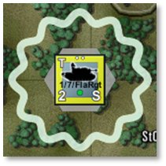In cases where a unit has an emitter but it is turned off, the unit will have a gray wavy circle drawn around it as shown to the left. See Section 15.2.6 below for how to turn emitters on and off.

### Deployment Areas

Selecting this option toggles the setup zones off and on during the initial setup phase only. Drag and drop counters into any of its shaded hex area during this initial set up phase. Deployment Areas are only active for the initial deployment (start of the game) and will be grayed out for the rest. The color and transparency for both sides can be customized in Game Colors under User Preferences ([***F2***], see Section 3.4 above).

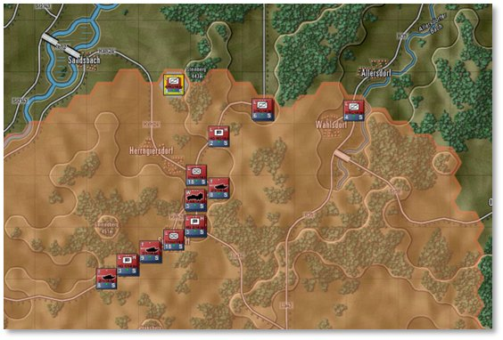

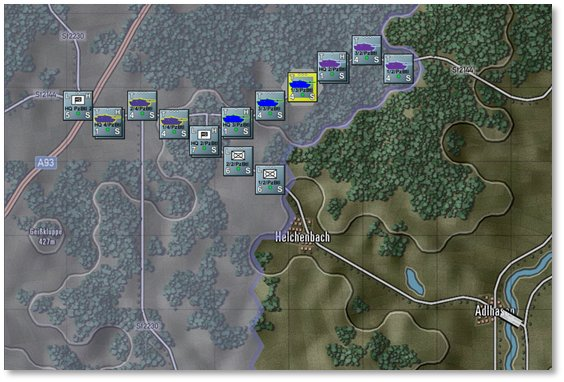

### Transport Plans

Selecting this option displays simplified routes for all planned transport missions that currently exist (in progress or planned). This makes it easier to visualize where the movement corridors are placed on the map in relation to each other, including the load/unload locations (marked by a small outlined hex with diagonal hatch in the opposite direction), as shown below. This overlay is yellow for air and teal for land, with thick diagonal hatches that forms a wide path from waypoint to waypoint. The currently selected unit’s path is a slightly brighter yellow/teal and each waypoint is labeled with WP followed by the corresponding number, up to six. Transport units may adjust their routes between waypoints as necessary so these corridors serve as references only.

See **FM03C Tutorial Operations** for more on this advanced planner.

**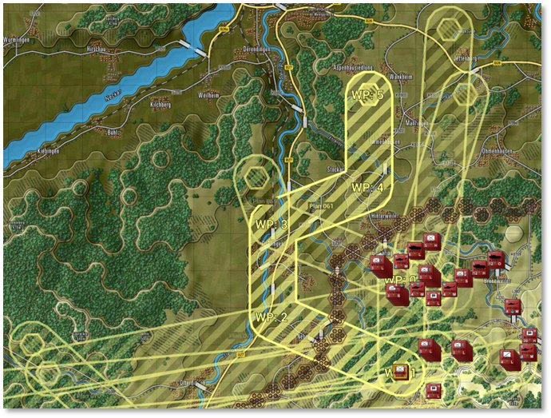**

### Chain of Command [*Ctrl+X*]

Selecting this option brings up the Chain of Command ring overlay. Chain of Command refers to how orders are given and received by units and headquarters (HQ). As shown below, the highest HQ shows lines of command to the next lower-level HQ when selected. Solid lines indicate units in range. Dashed lines indicate either a subordinate HQ or a unit that is out of range. The HQ command ranges are drawn as circles. Units outside of the command range face additional delays in orders and reduced resupply. Some units, like recon units, can operate at full capacity at any range.

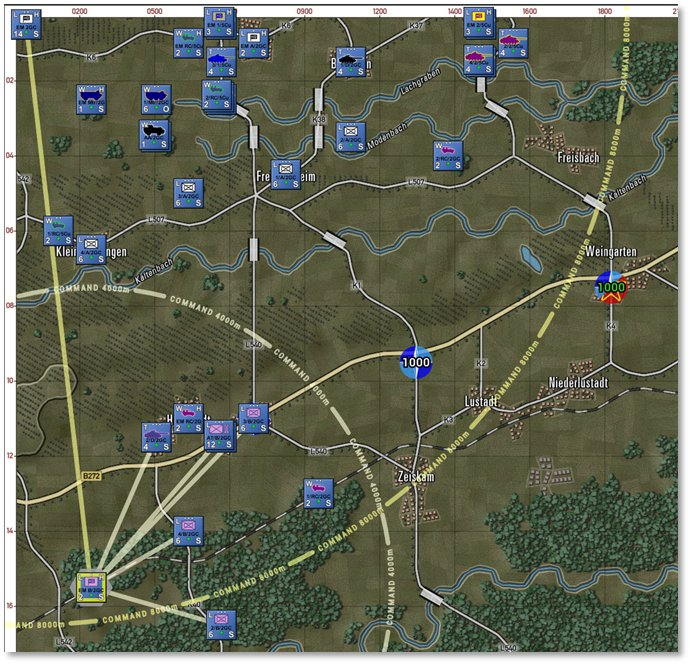

The above image also shows a darker line connecting the selected HQ to the higher-level HQ while lighter lines extend from the selected HQ to its lower-level subordinate units. The HQ command ranges are drawn as circles which are also shaded by superiority (darker = higher up).

In the next picture, one of the subordinate units has been selected. A darker line extends to that unit’s HQ and a darker circle shows the extent of that HQ’s command radius. Selecting other subordinate units will show a similar relationship to their local HQ.

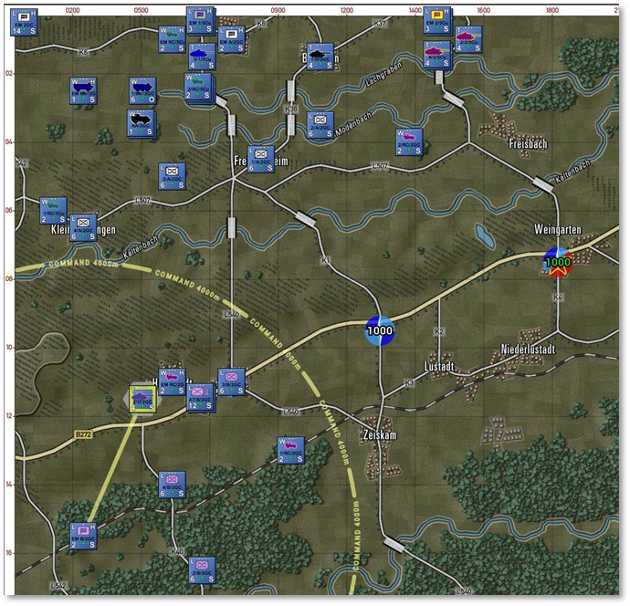

The color and transparency of subordinate command lines can be customized in Game Colors under User Preferences ([***F2***], see Section 3.4 above).

### Air-Defense against Helicopters

Selecting this option brings up the Air Defense overlay for protection against on-map helicopters or drones (assumed to be flying very low and defensively) for all air-defense-capable units in your force. Depending on the type of unit selected, there are three types of overlay effects shown.

First, selecting a unit with an air defense Surface-to-Air Missile system (SAM; see Section 25.5 below) shows hex coverage with a red-filled overlay and the range of the selected unit is outlined with thick hex edges, as shown below.

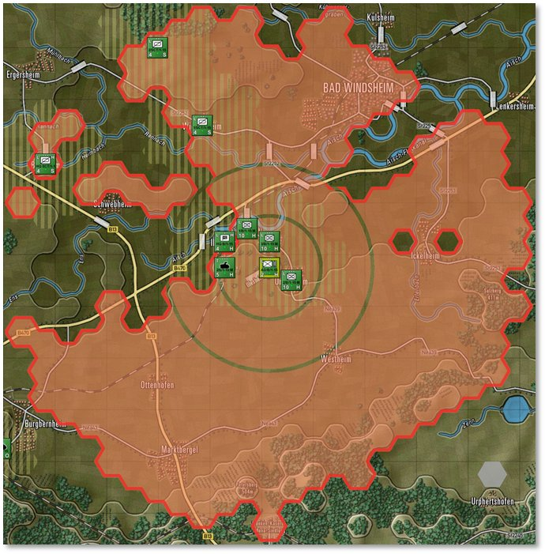

Second, selecting a unit with an air defense gun system (Flak; see Section25.5 below), shows hex coverage with an overlay of horizontal hatched pink lines and a thick outline, as shown below on the left.

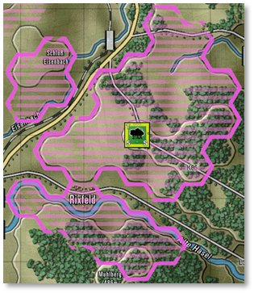 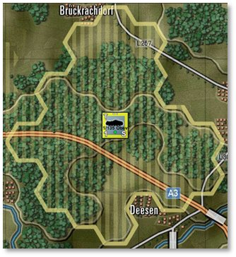

Third, selecting a unit with an Air Defense Limited (ADL) system (like an anti-air machine gun or auto-cannon; see Section 25.5 below), shows hex coverage with an overlay of vertical hatched yellow lines and have a thick outline as shown above on the right. These are limited-capability systems as explained in the noted section on Air Defense. ADL weapons engage at a reduced range and only engage air threats approaching them within a 30-degree arc.

### Air-Defense against Planes

Selecting this option brings up the Air Defense overlay for protection against off-map aircraft (assumed to be flying low) for all air-defense-capable units in your forces. Depending on the type of unit selected, there are two types of overlay effects shown on the map.

First, selecting a unit with an air defense Surface-to-Air Missile system (SAM; see Section 25.5 below) shows hex coverage with a red-filled overlay and the range of the selected unit is outlined with thick hex edges, as shown in the image below. This is the same style of SAM overlay as described in the subsection above.

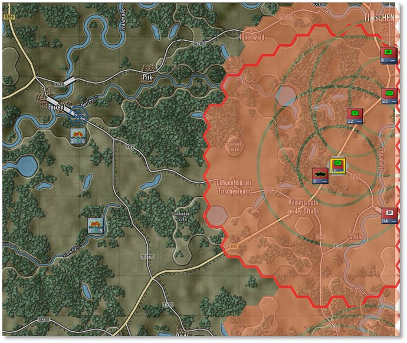

Second, selecting a unit with an air defense gun system (Flak; see Section 25.5 below), shows hex coverage the red overlay as well as a second overlay of horizontal hatched pink lines. The range of the selected unit has a thick hex-edge outline, as shown in the image below. This is the same style of Flak overlay as described in the subsection above.

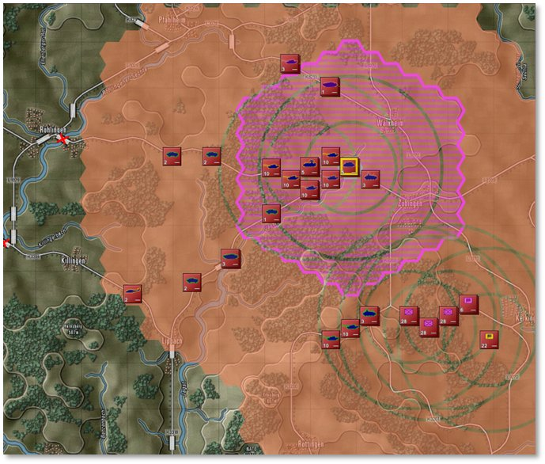

### Known Hostile AA Coverage

Selecting this option brings up an overlay for all the hexes that are covered in some way by known (Spotted) enemy air defense units. The elevations and contours of the map have considerable impact on this coverage. This overlay makes it easier to see where the enemy coverage does and does not exist.

Hostile Air Assault Coverage, with Rulers radiating from the location of the known air defense unit(s), takes three different color forms as explained below. The numbers reflect how many hostile systems cover the airspace of the hex in question, which could be surface-to-air missiles, Flak (AAA) systems, or Air Defense Limited (ADL) systems. See Section 25.5 below for air defense information. These white hex numbers will increase when there are overlapping ranges of more than one system, even if they are of the same type.

Information on enemy air defense is subject to Fog of War settings (selected during scenario setup, see Section 4.3 above) and the ever-changing presence and movement of enemy units.

Solid orange overlay with lighter edges, and a Ruler drawn in with negative space, indicates surface-to-air missile systems providing coverage as shown below.

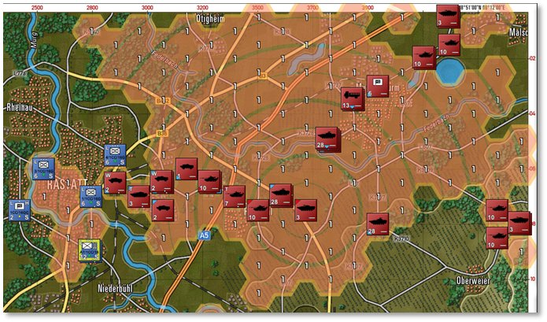

Pink, horizontal hatches indicate AAA guns or Flak systems, as shown below. This overlay does not contain its own Ruler, however one or more may be visible as part of another part of the overlay.

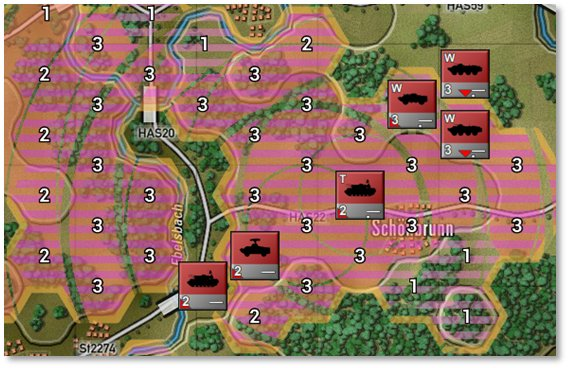

Yellow/light orange, vertical hatches indicate Air Defense Limited (ADL) or point defense systems, as shown below. This coverage is much smaller than the other two and may be harder to see. Hiding the counters (by hitting ***Ctrl+U*** or using the Counters menu bar item) can help make these hexes more distinguishable.

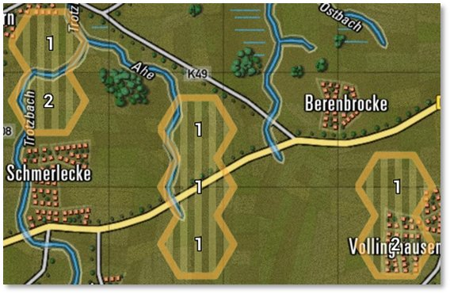

### Fire-Support Coverage

Selecting this option brings up the max firing range overlay for all on- and off-map indirect fire artillery units (mortars, field guns, and rockets). Selecting a unit shows a darkened overlay in the orange-filled hexes for its specific map coverage along with a Ruler (see Section 11.6.6 above). Each ring is labeled with the unit whose maximum firing range it indicates.

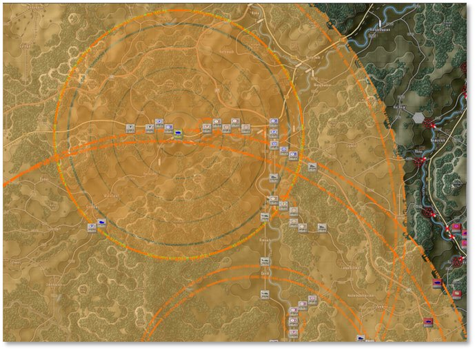

### Fire-Support Missions

Selecting this option brings up an overlay showing all of the currently plotted fire missions. An orange solid line goes from each firing unit to the target hex(es). The target hex(es) state the type of mission (Smoke, Chemical, HE: High Explosive, or ICM: Improved Conventional Munitions), the number of rounds to be fired, and the time the mission starts. Lines are drawn for off-map assets based on their off-map locations and target hexes.

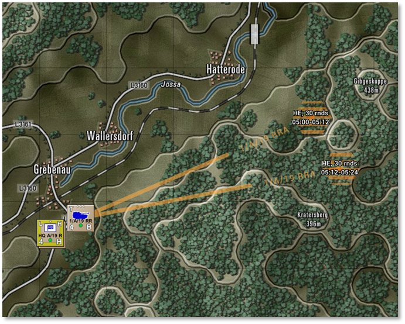

### Direct Support

Selecting this option brings up an overlay that indicates, given the selected unit, which assets are in direct support and/or which units are directly supported. Direct support (DS) assets either have a white line to the selected unit(s) they are supporting or six short lines in all directions when they are set to support all units. The minimum and maximum ranges of DS assets are also displayed, see images below. Selecting the DS asset highlights hexes in the Line of Sight of all supported units with a thick outline (see 11.7.2 above).

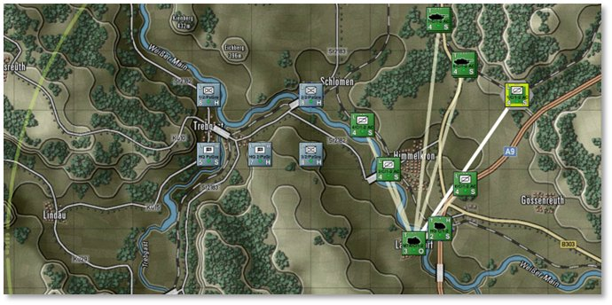

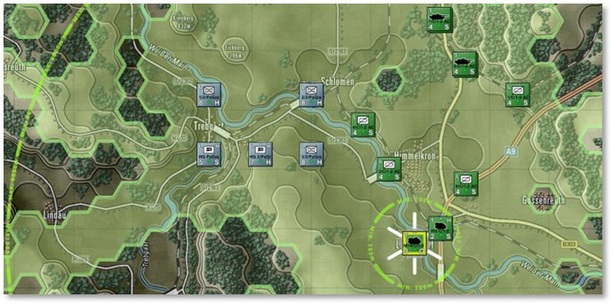

### All Weapon Locating Coverage

Selecting this option brings up an overlay for the area in which friendly Weapon Locating Radar (WLR) can Detect and locate hostile artillery units when these are firing. WLR operates from concealed positions off-map with controlled emission cycles to balance coverage with survivability. Scans can support counter-battery fire, FASCAM delivery, or target updates. Activity records are found in the Fire Support Staff report under Counter Battery (see Section 15.4.4 below). WLR operations are not under player control (see Section 25.4.1 below). WLR coverage is a solid orange overlay for the hexes that are covered by Weapon Locating Radar.

**NOTE:** Not every scenario has WLR for each side.

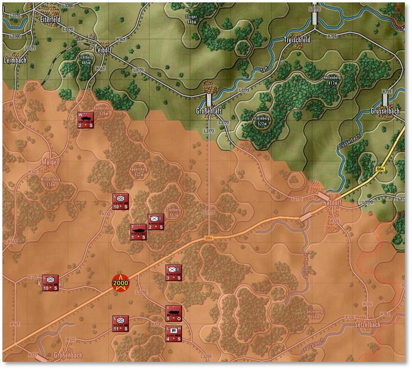

## Terrain Overlay Menu Items

The Terrain Overlay Menu has several useful overlays covering various factors of the map and terrain. The most important from a planning aspect is the MCOO (pronounced mah-KOO) or the Modified Combined Obstacle Overlay. Most of the other terrain feature values are permanently visible in the Status Bar as the mouse hovers over different hexes (see Section 12.2 below).

Terrain Overlays also include Elevation Values (Section 11.8.2), % Cover 11.8.3), % Concealment (Section 11.8.4), % Mobility (Section 11.8.5), Altitude Values (Section 11.8.6), Feature Height (Section 11.8.7), and Defense Rating (Section 11.8.8).

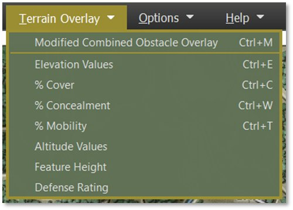

### Modified Combined Obstacle Overlay (MCOO) *[Ctrl+M]*

Selecting this option brings up the MCOO. The overlay shows various colors, hatching, and edges that represent various levels of useful terrain information. A legend pops up to explain the colors and patterns as well as the implications of the various information shown. Use this information to quickly note poor mobility areas, clear lanes of fire, impassible terrain, and good locations to hide recon units. Legend details are also provided in Section 16.12 below.

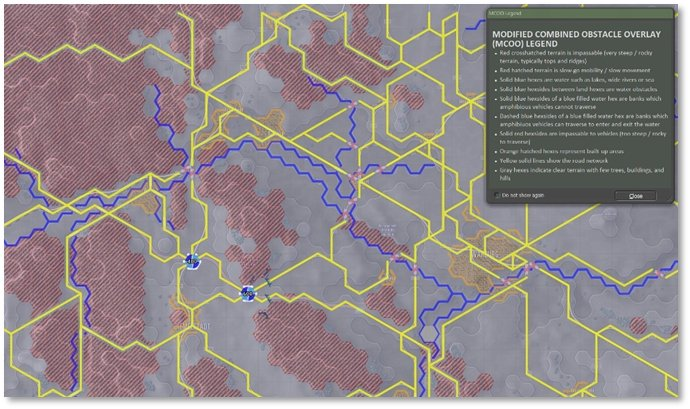

### Elevation Values *[Ctrl+E]*

Selecting this option shows the Elevation value for every hex on the map in white numbers. Elevations range from 1 to 10 and each increment or decrement represents changes of approximately 25 to 50 meters from ground level. Elevation changes can block Line of Sight and can also impede travel speeds.

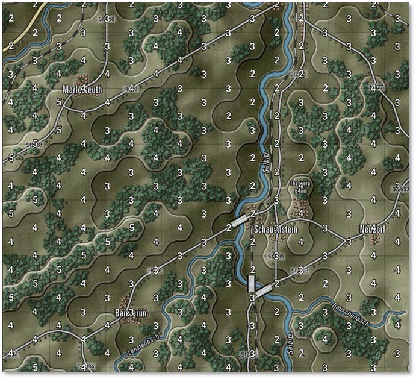

### % Cover *[Ctrl+C]*

Selecting this option shows the Cover rating for every hex on the map in white numbers. Cover ratings range from 1 to 99 percent and represent the terrain’s ability to provide Cover from direct or indirect fire, with 1 being no protection and 99 being maximum protection.

Cover provides shelter and reduces bullets’ abilities to hit their targets. It is represented by a shield symbol in the Status Bar’s hex information for this reason (see Section 12.2 below).

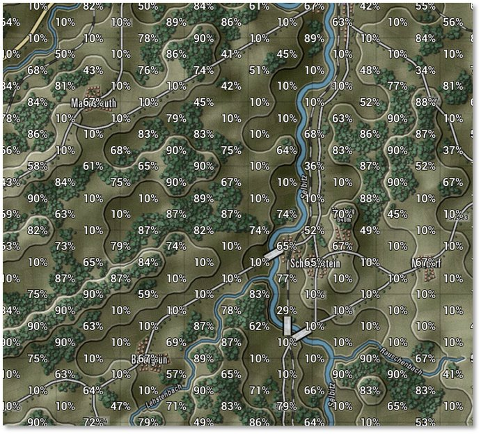

### % Concealment *[Ctrl+W]*

Selecting this option shows the Concealment rating for each hex on the map in white numbers. Concealment ratings range from 1 to 99 percent and represent the terrain’s obstruction of units’ Spotting and Line of Sight abilities, with 1 being no blockage and 99 being extreme degradation.

Concealment hampers the ability to be seen but does not provide protection from being shot at. It is represented by an eye symbol in the Status Bar’s hex information for this reason (see Section 12.2 below).

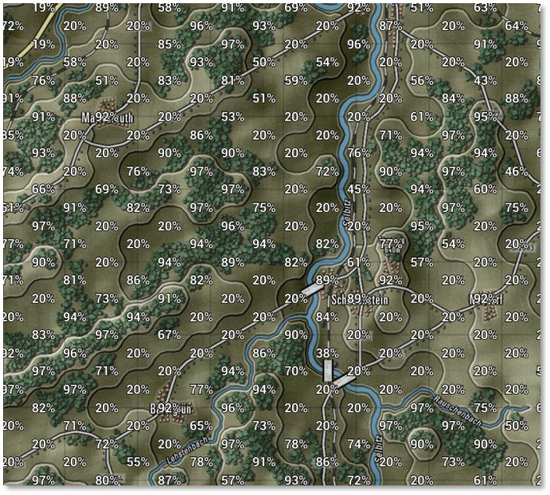

### % Mobility *[Ctrl+T]*

Selecting this option shows the Mobility rating for each hex on the map in white numbers and reflects off-road factors only. Mobility ratings range from 1 to 99 and represent the influence of terrain features on speed for off-road travel, with lower numbers being slower and higher numbers being faster.

Units using Hasty Movement (i.e., favoring roads) move faster where there are roads and ignore the Mobility rating in favor of the type of road. It is represented by a truck symbol in the Status Bar’s hex information (see Section 12.2 below).

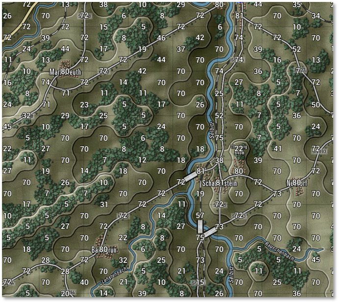

### Altitude Values

Selecting this option shows the altitude value for every hex on the map in white numbers. The altitude value is the height above sea level in meters. This information is for display only and does not factor into gameplay. It is represented by a mountain symbol in the Status Bar’s hex information (see Section 12.2 below).

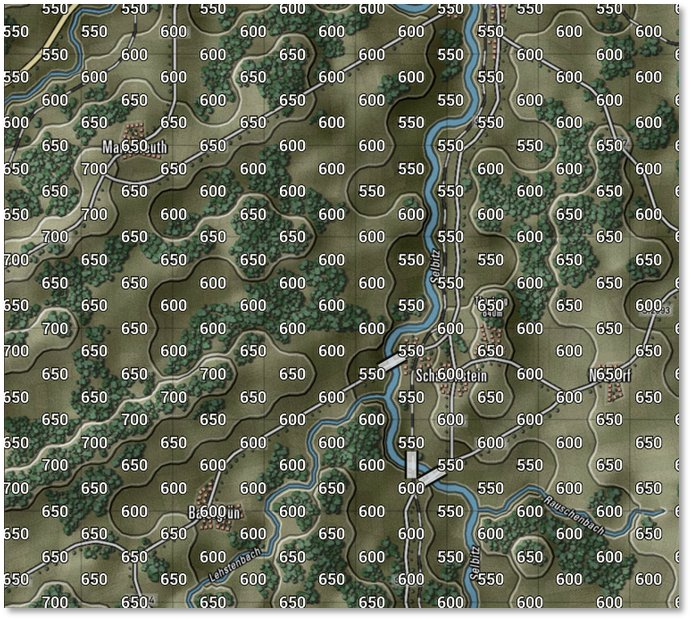

### Feature Height

Selecting this option shows the feature height for each hex on the map in white numbers. Heights range from 1 to 10 and are relative measures of how tall objects are in the hex such as trees, buildings, and other elements both natural and constructed (see Section 16.5 below for terrain information). Features with greater heights can obstruct Spotting and Line of Sight.

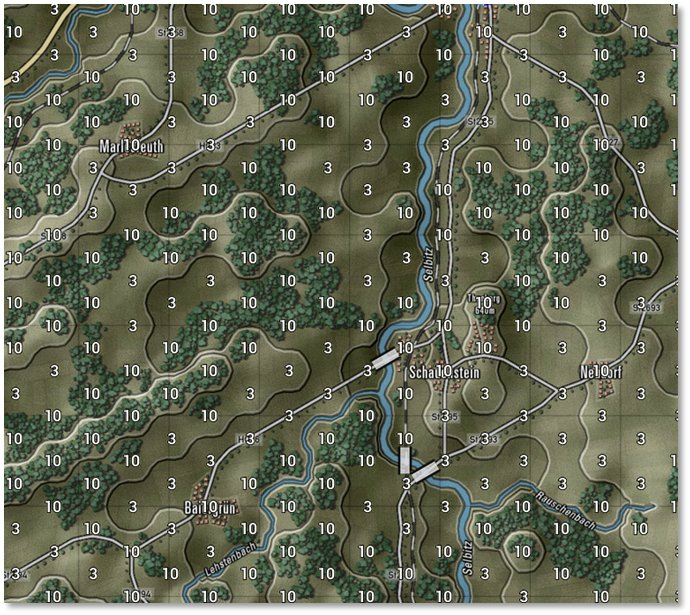

### Defense Rating

Selecting this option shows a defensive rating for every hex on the map in white numbers. Defense ratings are relative and range from 1 to 99, with 1 being very difficult terrain to defend in and 99 being outstanding terrain to defend in. Defense ratings are based on a number of factors including the terrain ratings covered in this section (see Section 11.8 for overview) in addition to Line of Sight (see Section 11.6.1 above).

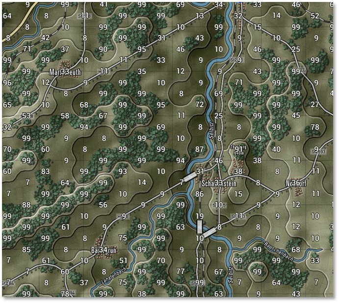

## Options Menu Items

The Options Menu is used to access the User Preferences dialog, change the counters’ art style and colors, vary the map to suit your taste, and to present the counters and markers in different ways. You can also change transparency settings for the Mission Graphics (see Section 11.4 above for Mission Graphics information) and MCOO (see Section 16.12 below). Each option is described in turn.

|  |
| --- |
|  |
|  |  |

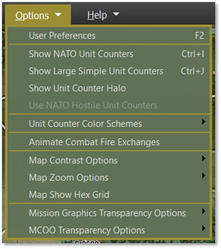

- **User Preferences [*F2*]**– Opens the User Preferences dialog that has many of the game settings. See Section 3 above for details on what settings are there and what they do.

- 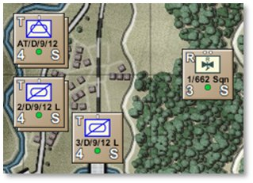**Show NATO Unit Counters [*Ctrl+I*]**– Displays NATO markers in place of the vehicle silhouettes on all counters. Default silhouette counters are shown on the left below, and NATO counters are to the right. For a rundown of NATO symbols and their meaning, refer to **FM02 Battlefield Primer**.

-

|  |
| --- |
|  |
|  |  |

**Show Large Simple Unit Counters [*Ctrl+J*]** – Displays large NATO symbols on all the counters to make the unit type more visible at extreme zoomed-out map levels. These symbols remove some other counter information in order to be larger as demonstrated below. Default silhouette counters are on the left and Large Simple Unit Counters are on the right.

-

|  |
| --- |
|  |
|  |  |

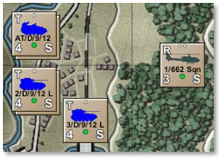**Show Unit Counter Halo** – Displays a thin halo or glow effect around the silhouette art. Default silhouette counters with no halos can be seen on the left below and halo-enabled counters are on the right. Halos are not available for NATO-styled counters.

- **Use NATO Hostile Unit Counters** – Displays NATO-style counters that use a basic rectangle graphic for friendly units and a diamond graphic for enemy units. These shape help make them easier to distinguish at a glance. However, this increases the complexity of their appearance so it is recommended to use them once you are accustomed to them and can decode them at a speed that works for your gameplay. This option is only active while counters are using NATO art.

- **Unit Counter Color Schemes** – Pops out the Unit Counter Color Scheme submenu with options for black/white as well as different color themes. See Section 11.9.1 below for a breakdown on the various color options.

- **Animate Combat Fire Exchanges** – Turns on weapon-based firing animations for direct fire weapons that replace the static “red” and “blue” lines in the default User Preferences. See Section 16.13 below for more details on fire lines.

- **Map Contrast Options** – Pops out the Map Contrast Options submenu to change the appearance of the map’s contrast and saturation. See Section 11.9.2 below for details on the various options in the game to increase contrast.

- **Map Zoom Options** – Pops out the Map Zoom Options submenu. See Section 11.9.3 below for details on the various zoom levels in the game.

- **Map Show Hex Grid** – Draws a light-colored hex grid over the map to better define the hexes.

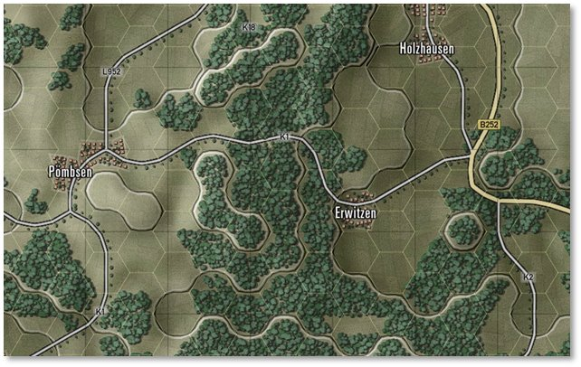

- **Mission Graphics Transparency Options** - Pops out the Mission Graphics Transparency Options submenu for when using graphics to help plan your turn. See Section 11.9.4 below for details on these values.

- **MCOO Transparency Options** – Set the MCOO transparency to 0% (default), 20%, or 40%. The standard MCOO overlay obscures much of the map’s detail by design. Adjusting the transparency allows the player to see more of the underlying map if this is desired (see Section 16.12 below for the MCOO map legend).

### Unit Counter Color Schemes

Along with changing the basic look of the counter art between silhouettes and NATO standard markings, additional counter options change the colors for better identification or contrast depending on your style or need. These settings can be changed at any time the menu is active in the game.

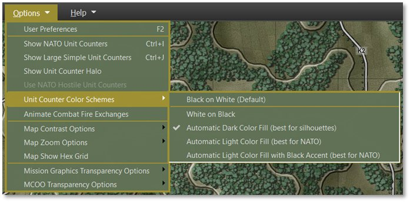

- **Black on White (Default)** – Simple black art or black NATO symbols on a white field.

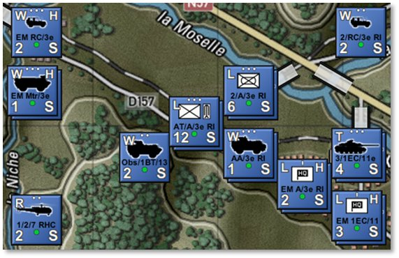

- **White on Black** – Simple white art or white NATO symbols on a black field.

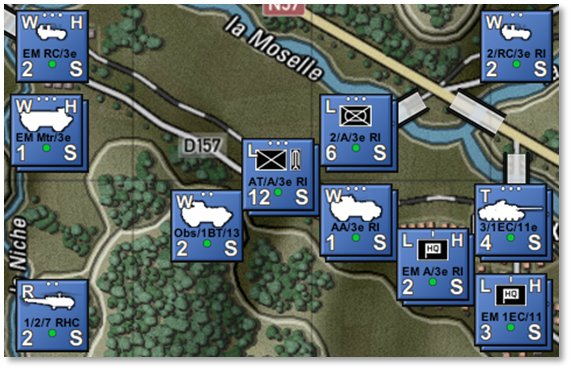

- **Automatic Dark Color Fill (best for silhouettes)** – Based on formations, each unit gets contrasting dark-color fills, lines, and halos for the silhouettes or the NATO backgrounds. This makes it easier to see what units belong to which formations and HQs.

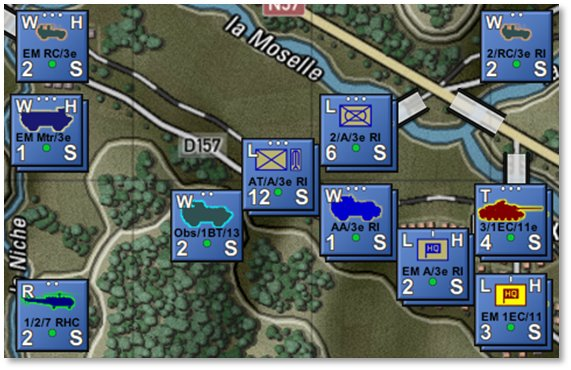

- **Automatic Light Color Fill (best for NATO)** – Based on formations, each unit gets contrasting light-color fills, lines, and halos (if applicable) for the silhouettes or NATO symbols.

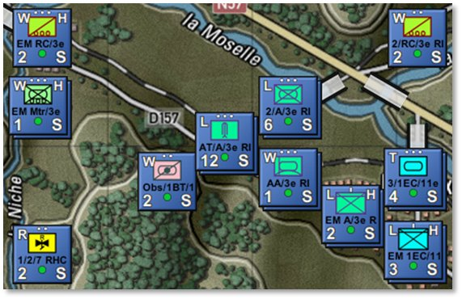

- **Automatic Light Color Fill with Black Accents (best for NATO)** – Based on formations, each unit gets contrasting light-color fills with black fields and halos for silhouettes, or light-color fills with black lines for NATO backgrounds.

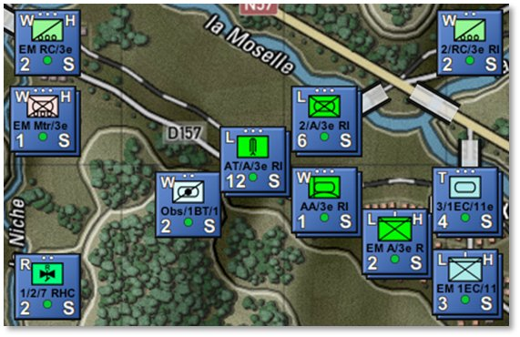

### Map Contrast Options

These options allow the user to change the level of contrast/saturation (color vibrancy) of the map to make counters and map markers more noticeable. The options include Full Color, Lightly Muted, Moderately Muted, Strongly Muted, and a basic grey scale look with Fully Muted. This setting can be changed any time the menu is active.

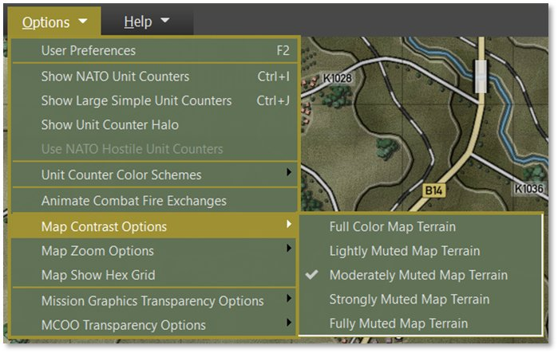

- **Full Color Map Terrain** – Shows map in its default color as made.

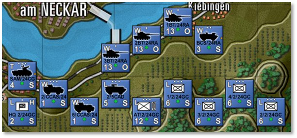

- **Lightly Muted Map Terrain** – Shows map with a slight reduction to contrast and saturation.

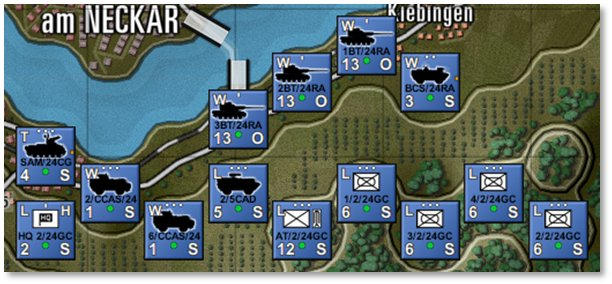

- **Moderately Muted Map Terrain**– Shows map with a moderate reduction to contrast and saturation.

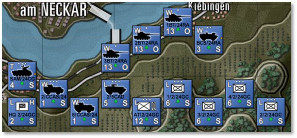

- **Strongly Muted Map Terrain** – Shows map with a strong reduction to contrast and saturation.

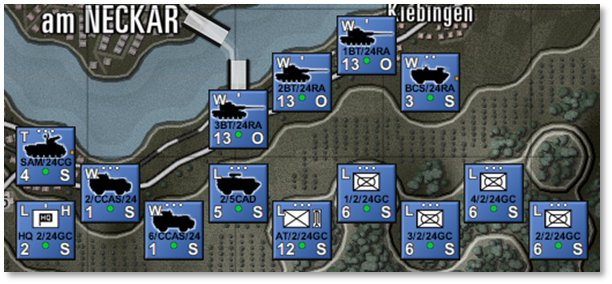

- **Fully Muted Map Terrain** – Shows map with entirely muted saturation, turning the map into a scale.

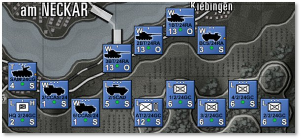

### Map Zoom Options

The Map Zoom Options menu item provides the ability to zoom the map from 30% up to 200%. This wide range allows players on very high-resolution screens to zoom in and still see and read counters and the map. The Zoom (Fit) **[*Ctrl+4*]** option automatically scales the entire map to fit on the screen. There are hotkeys for the basic ranges between 50% and 130% as seen below.

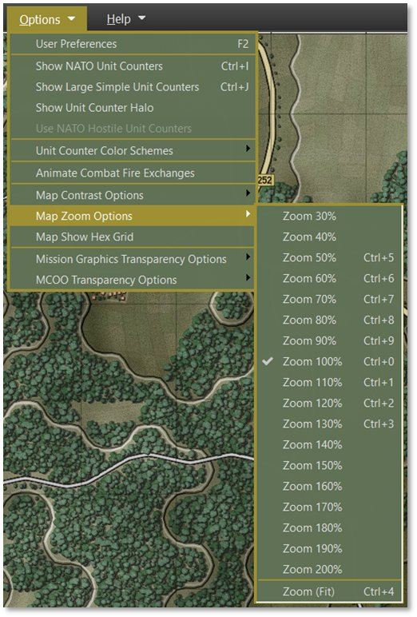

### Mission Graphics Transparency Options

The in-game Mission Graphics Transparency is 50% by default and can be set to be less transparent over the map by selecting 25% or 10% Transparency via this submenu. Lower values make the Mission Graphics appear brighter over the map.

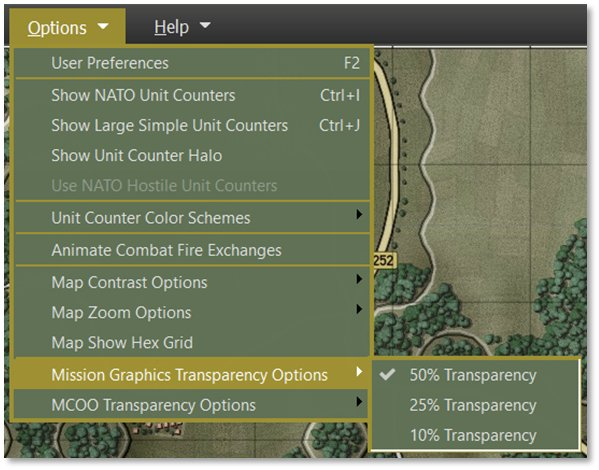

## Help Menu Items

The Help Menu contains several items to quickly access various game documentation folders. These include options for the PDF of the What’s New summary, an in-game Hotkeys Summary dialog, Game Manuals both online in HTML format (opens browser) or locally in PDF format, the Folder for these manuals, the all-important Credits (check it out at least once to see all those responsible for this great game), and the About game information.

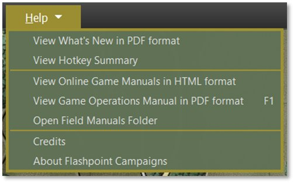