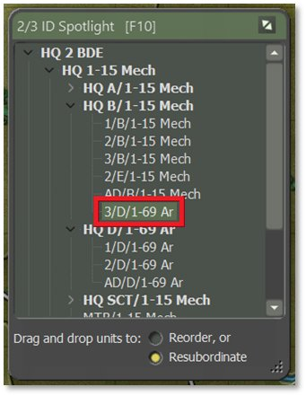
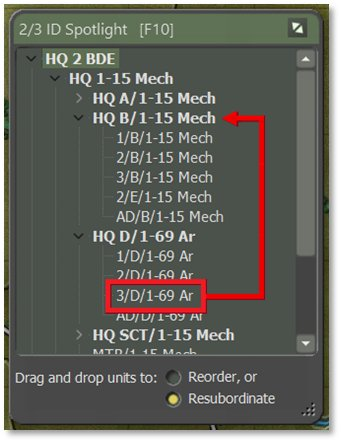
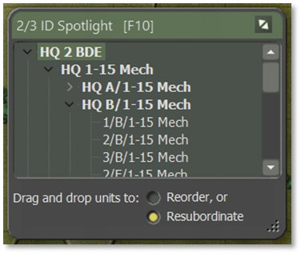
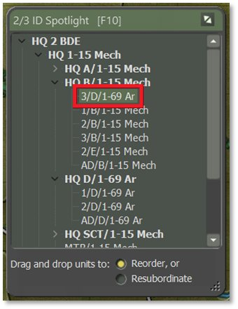
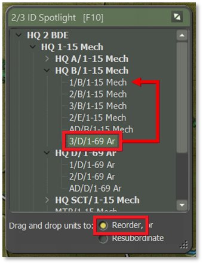

# Order of Battle (OOB) Tree

An important function of the Spotlight Panel [***F10***] is the Order of Battle (OOB) Tree. The OOB tree provides a nested listing of all units and shows which units report to (are subordinate to) which headquarters as shown in the image below. This information is vital as command delays and resupply capability are tied to a unit’s distance from its local/primary headquarters.

In some cases, you as the commander may want to move units under another command or change the composition of a formation to better suit the mission at hand. There are two functions to help with the arrangement of units: Resubordinate and Reorder. They are described below.

## Unit Resubordinate

To move a unit from one command to another, click on the unit being moved, in this case **3/D/1-69 Ar** as shown below, and drag it up to the new HQ name whose formation it will join and release the mouse button (see left image). Here, we are subordinating it to **HQ B/1-15 Mech**. The unit should appear at the bottom of the new HQ’s formation after releasing the mouse button, as seen in the right image.

**NOTE:** Dragging a unit name puts it under the command of whichever unit the mouse is hovering over when released. This allows resubordination to any unit, not just HQs, which can be helpful in some circumstances. Ensure you are releasing the selected unit over top of the HQ’s name to have it resubordinate to that HQ’s command. This will look like the selected unit being in line with the same level of nesting as the rest of that HQ’s subordinates, rather than pushed one more level in under one of the other subordinates.

**NOTE:** Units cannot be reordered via dragging if Resubordinate is selected as the setting option in the Spotlight window. See Unit Reorder in Section 20.2 below instead if this is your goal.

A unit that has been attached to a new HQ uses that HQ for communication going forward, and resupplies based on the new HQ’s command ranges. Adding more units to a new HQ also increases the amount of generated radio traffic and adds to the chance of the enemy locating that HQ (see Section 18.4.1 above).

## Unit Reorder

Once a unit is resubordinated into a new command, you may wish to move it into a different place in the command order. Use the Reorder function to make those changes.

Check the Reorder function at the bottom of the Spotlight window as shown below on the left. Then click and drag the unit you wish to move and release it on the name of the unit you want it to be placed above, as demonstrated in the image below on the left. Releasing the mouse in the first position under the HQ will reorder that unit to take the place of the existing unit in that position.

**NOTE:** You can only reorder units within their own command. Releasing the selected unit in another command will not result in any change to the selected unit’s position in the list. Select Resubordinate (see Section 20.1) if this is your goal.