# Plotting Movement and Fires

One of the primary functions of a commander is to direct your forces across the map to take or hold objectives. You need to know how to order your forces and how to utilize artillery assets and air power to achieve your mission goals and preserve your forces the best you can. The goal of the game is to maneuver your forces to have the most Victory Points at the end of battle (see 15.1.2 above for details on this) which is done with strategic movements and firing.

The following information explains how to move your units, issue orders, adjust and change Movement types along the path, and issue artillery and air strikes on target locations.

## Movement

To order a unit or group of units (see Section 21.9 above), right-click on a selected unit to bring up the Unit Popup Menu. Select a Movement order, for example, a Deliberate Move as shown below. Next, select up to six waypoints to path the unit to the location it should end up in as directed by the Plot Path dialog.

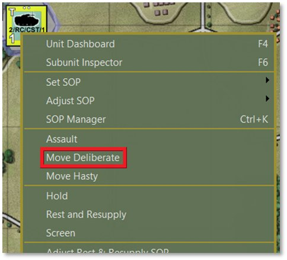

The AI intelligently paths the units based on the terrain, SOP selections (See Section 23 below), and the designated waypoints. After selecting a route, click the Commit button in the Plot Path dialog as shown below. If you wish to stop and not use this Movement order, click the Cancel button to revert the unit(s) to having no new orders.

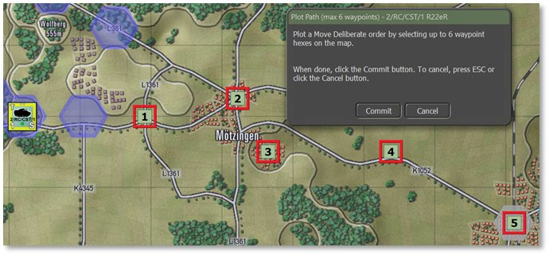

After clicking the Commit button, an Orders on Arrival dialog pops up to set the final order state of the unit(s), as shown below. The options for this box vary to match the type of unit and any special orders it has access to.

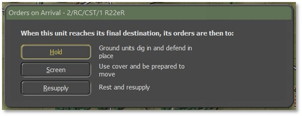

In this case, we will select a Screen order. Now the final path is shown below for the unit.

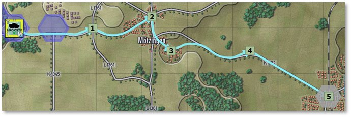

To adjust the path, left-click and drag the closest waypoint marker to a new hex location. In this example, we will move waypoint #2 south to take a different road. This move can be further smoothed out by dragging waypoint #1 one hex south to help the path choose the new road heading south-east before swinging through the city.

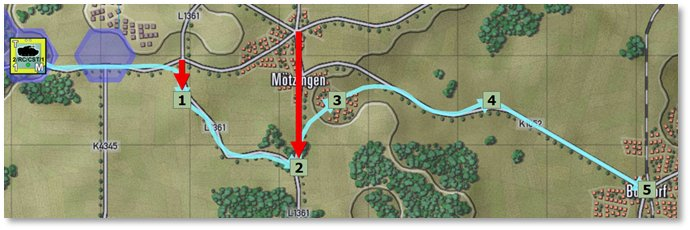

There is also an option to right-click on any waypoint to pop up a Waypoint Editor menu:

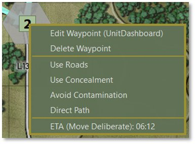

Selecting the Edit Waypoint option opens the unit’s Dashboard on the Orders tab to facilitate several changes to the order as detailed in the following sections. Remove the waypoint by selecting the Delete Waypoint menu option. This also deletes any SOP setting for that waypoint. Set priorities for Roads, Concealment, Avoiding Contamination, or taking a Direct Path with the next group of menu items. Selecting any of these will re-path the route according to the new parameter(s). The item at the bottom shows the unit’s estimated time of arrival (ETA) to that waypoint and the type of Move order being used to get there.

Hover over a waypoint with the mouse to bring up a hint showing the unit name, waypoint number, Movement order, and the start and arrival times of the unit to that waypoint.

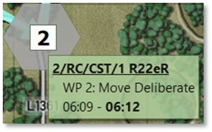

### Changing Movement Orders

Orders can be changed after plotting a set of waypoints. Go into the Dashboard [***F4***] for any unit to change the standing order. This must be done per unit even if a formation or group order is issued. Below is the plotted set of Move orders for our unit from before.

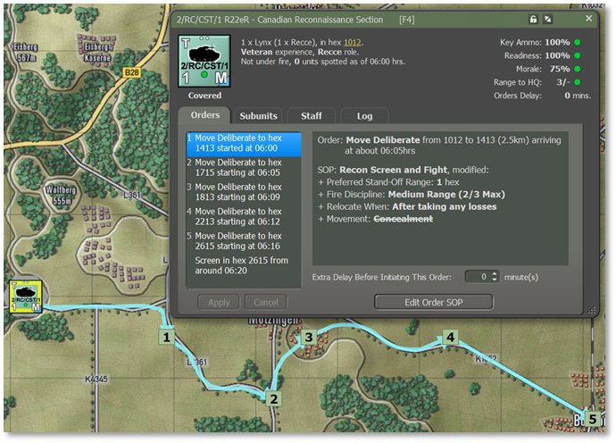

To view and change an order in the Dashboard, select the desired waypoint in the Orders list on the left-hand side and right-click on it to bring up a menu of alternative orders. In the image below, we’ll select a Move Hasty order so the unit moves the first part of this path quickly (see Section 21.2 above for information on primary orders).

**NOTE:** Orders that have been changed present with yellow text and must be implemented by clicking Apply below the Orders list. The text becomes white again when the changes are applied. Multiple waypoint orders can be changed at once, and also as many times as desired. Hitting Apply commits all orders as they are indicated in the list at the time of clicking to Apply. These can be modified right up until the turn resolution begins.

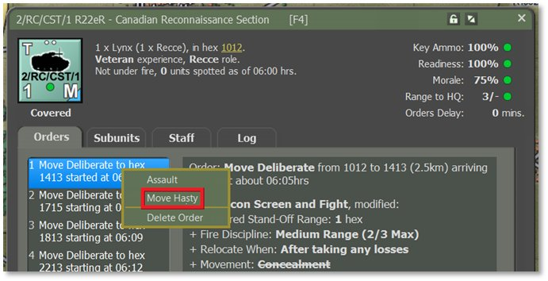

Selecting the new order updates that waypoint’s Move Order in the list, all waypoint times in the Orders list, and the counter’s appearance. The counter changes from a Deliberate Move marker (blue triangle as seen above, in the bottom right corner as this is the direction of movement) to a Hasty Move marker (black triangle) as shown below.

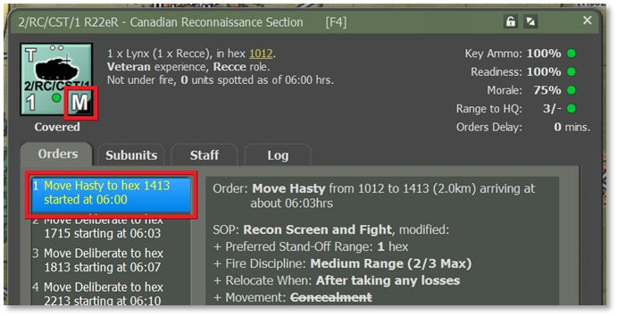

For some attacks it may be desirable to have the opening waypoints within friendly territory set to Hasty, change to Deliberate Moves when enemy contact is possible, and then shift to Assault if taking a contested objective. Modify the terminal (final) order at any point as well in the same way as changing waypoint orders.

### Altering Waypoint Timing

It may be strategic at times to have several units arrive in an area at the same time (or close to it, as unexpected events can alter that timing such as encountering obstacles, etc.). To change the final time of arrival for the last waypoint, set a Delay time for any or all selected order(s) in the Dashboard as highlighted below. Alter other necessary units to have the same arrival time by adjusting this Extra Delay time as needed for their orders.

Find the setting for Extra Delay Before Initiating This Order under the Order and SOP information window and increase or decrease the number of minutes. This Delay can be set for any leg of the movement in the Orders list.

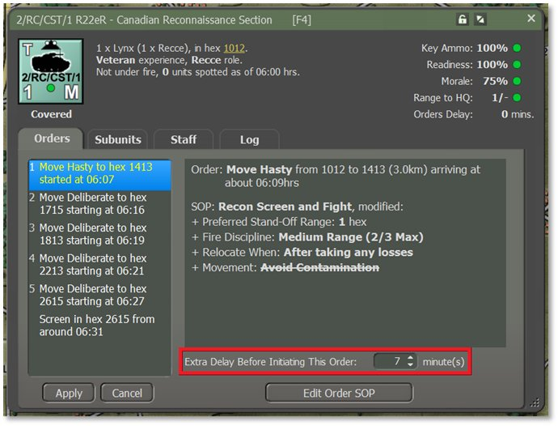

In the case above, adding 7 minutes of Delay to the start of the first order shifts the time each subsequent order starts by 7 minutes, including the final Screen order in the destination. Hit Apply to commit any changes. Click Cancel to revert back to the orders last saved.

**NOTE:** Orders that have been changed present with yellow text and must be implemented by clicking Apply below the Orders list. The text becomes white again when the changes are applied. Multiple waypoint orders can be changed as many times as desired. Hitting Apply commits all orders as they are indicated in the list. These can be modified right up until the turn resolution begins.

### Lost Transport Indicator

Another quality-of-life addition to the unit counters is the Lost Transport Indicator. When a unit can no longer move its troops due to losses of the transport subunits, whether mechanized (vehicles) or motorized (squads/teams), the Leg symbol “L” in the Movement Class indicator turns orange to note this condition (see Section 17.1 above for counter information). The orange “L” for Lost helps to show the difference between that state and a dismounted unit that has the “L” Leg indicator in white when troops are out of the transports in a non-movement order. See image below for the orange Lost indicator.

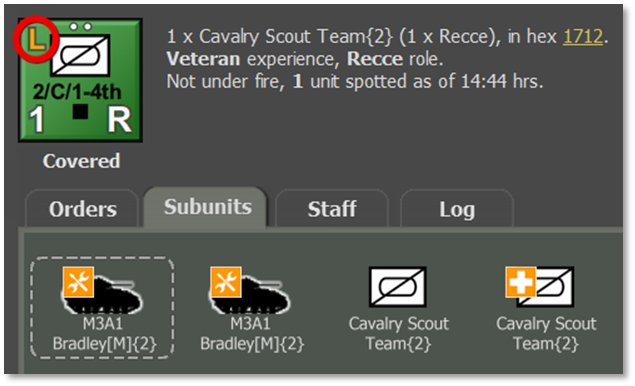

## Fires

The other aspect of plotting orders is setting up fire missions. This covers both on- and off-map indirect fire units like mortars, guns, and rockets if any of these assets are available in the scenario.

To issue a Barrage order, open the Unit Popup Menu by either right-clicking on an on-map artillery unit or open the Fire Support Staff Report and right-clicking from there, as shown below. Then click on the Barrage option in the menu to open the mission submenu with fire options.

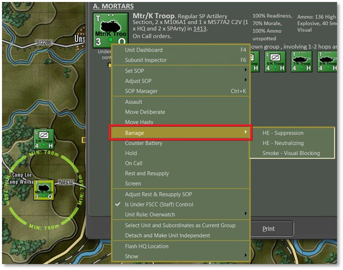

!!! note

    The choice of mission types is

based on the ammunition allocated to the firing unit by the scenario designer.

Select the type of fire mission. The Plot Targets dialog then pops up to prompt placing up to six target hexes on the map. These must be within range of the unit beyond any Minimum Range indicated and inside its Maximum Range (shown on the map; see Section 11.6.2 above). These locations are where the munitions will drop.

The other coverage possible, when equipped, is a Saturation Strike with rockets that centers on the selected hex and also hits the ring of six hexes around the targeted one (not shown).

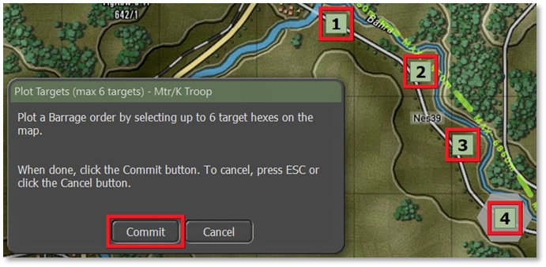

Click Commit. The hexes being attacked are highlighted with orange hatches and fire lines from the firing battery are drawn on the map. The Dashboard also pops up automatically to set various parameters of the fire missions and even change the type of fire mission, as seen below (turn this off in the General tab of User Preferences, [***F2***]).

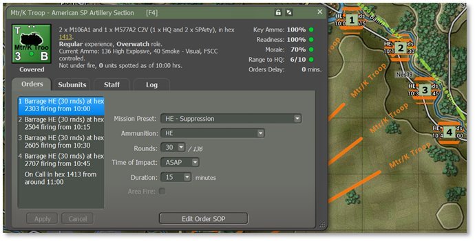

The Orders tab during a fire mission shows the following options which can be adjusted or changed for the selected target hex:

- **Mission Preset** – Change the type of bombardment mission from the type set initially from the Unit Pop Menu (see Section 14.1 above) for the targeted hexes. If the mission is modified from the original via the Ammunition dropdown below, then the Preset will be called Custom.

- **Ammunition** – Select different types of ammunition with this dropdown. This is helpful in cases like high explosive (HE) rounds where a few different types may be available.

- **Rounds** – Set the number of rounds to shoot on the mission. The total number available is noted after the slash (/). You cannot shoot more rounds than you have.

- **Time of Impact** – Set the time to ASAP to fire as soon as the Delay of the order is done (for opening salvos, this Delay occurs during the first turn’s setup phase and will start to fall immediately, see Section 21.7 above). There is the option to Delay the mission several minutes if timing is vital to your plan.

- **Duration** – Set how long the mission lasts (in minutes) and the number of rounds per minute that get fired.

- **Area Fire** – If the artillery unit is a rocket launcher, the Area Fire toggle will be active (not grayed out) and if checked, will fire a saturation strike  that hits the target hex and the surrounding ring of six hexes. This strike fires all rockets on the launching platforms.

## Calling in Air Strikes

To call in an air strike, there must be available aircraft in the scenario. There are two ways to check and then call in an air strike. The first option is to open the Fire Support Staff Report and look at the Fire Support Assets tab like the first image below (see Section 15.4.1 above). Section B of this report shows available Close Air Support (CAS) available to call in. The second way is to open the Off-Map Asset (OMA) dialog (see Section 14.5 above) like the second image below.

Aircraft may not be available until they arrive as reinforcement to provide support and that will be noted in the dialogs. Most aircraft will also have a hard withdrawal time when they return to base and can no longer be used. Weather and Time of Day can also impact air operations (see Sections 28 and 29 below). Some aircraft are not capable of night or all-weather operations over the battlefield. Aircraft have one other threat that you as the commander need to consider and that is the current Air Superiority Level over the battlefield (see Section 25.10 below). Your air strike has a much better chance of getting to the target and delivering ordnance on targets if your side owns control of the air. If the airspace is contested or owned by the enemy, your air strikes run the risk of being run off or worse, shot down.

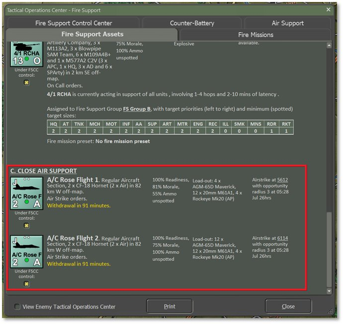

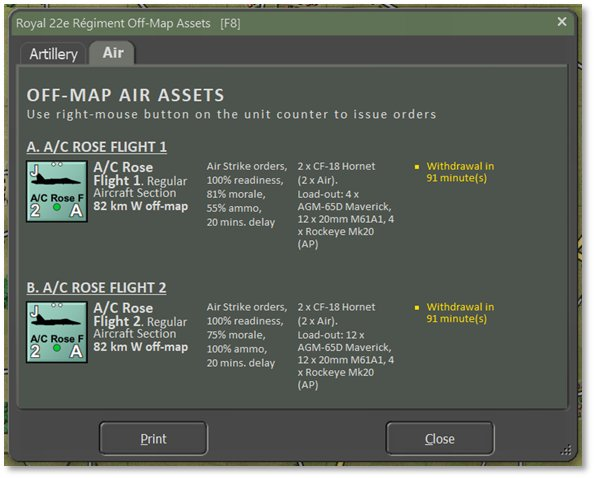

Right-clicking the counter brings up the Unit Popup Menu to order an Air Strike as a primary order as seen below.

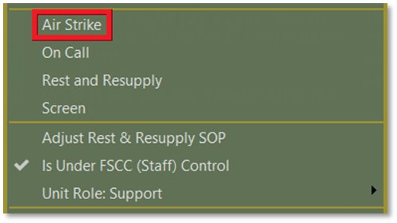

There are two settings to toggle player control over air strikes: the menu item labelled Is Under FSCC (Staff) Control in the Unit Popup Dialog as shown directly above, and the check box for Under FSCC Control underneath the unit counter in the Fire Support Assets dialog three images above. Uncheck this option in either location to assume player control. When checked, these units receive orders from the AI Fire Support Control Center when targets of value show up (see Section 25.4.1 below for more on the FSCC).

Selecting an order of On Call from the Unit Popup Menu cancels any strike ordered and returns the aircraft to its on station location where it will await a call.

There is also the option in the Unit Popup Menu’s primary orders to Rest and Resupply (see Section 14.1 above). This returns the aircraft to base to rearm and refuel and then return on station for future use.

After selecting Air Strike, the Plot Targets dialog pops up to prompt selecting a single hex to be the target of the strike.

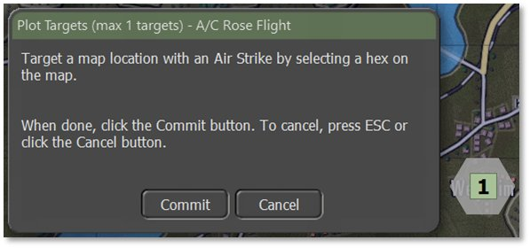

Select a target hex and click the Commit button to issue the order. Pressing Cancel stops the order and places the aircraft back On Call.

Once the aircraft is ready to attack, it appears on the map near the target location and attacks the best target it sees in the area. The discretionary radius of target selection is set in the scenario’s nation data and cannot be altered.