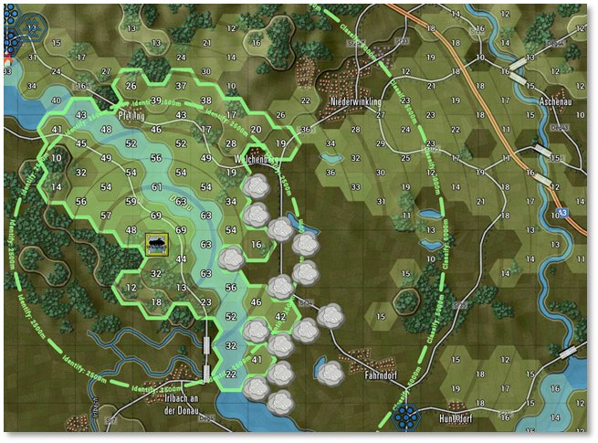

# Spotting and Line of Sight (LOS)

The ability to detect or distinguish between a military platform and its surroundings is heavily impacted by illumination, especially when not equipped with excellent thermal imaging or night vision equipment.

The Game Control Panel (see Section 13.1 above) provides Weather conditions (see Section 29 below) and weather/meteorological Visibility (see Section 24.3 below). Various range overlays on the map indicate the selected unit's ability to Detect other military units (see Section 11.6 above for details on overlays).

Spotting requires that the spotting unit has a clear Line of Sight (LOS) to the target and that the target is visible to the spotter at that range. Having a clear LOS to spot a target is required to shoot at it (see Sections 11.6.1 and 11.7.2 above).

It is possible to only see a small number of subunits in a unit depending on the Cover and Concealment value of the hex that the enemy is in and if there are other factors like movement, smoke, or weather effects.

## Spotting Units

Each unit has a maximum Spotting range within which it can potentially see any enemy unit. This is generally equivalent to the maximum visible range for the Time of Day (see Section 28 below) and Weather (see Section 29 below) except when:

- The unit in question is firing or moving. Its attention is presumed to be at least partly concentrated on that task and unit sighting is slightly reduced.

- The unit posture is very exposed. It is presumed to be feeling unthreatened and is not particularly attuned to its surroundings. The unit sighting range is slightly reduced.

Spotting is evaluated after every move, change of posture, burst of fire, and type of sensor capable of spotting enemy units. Spotting range is a function of a unit’s Readiness, weather, visibility, posture, orders, current movement, current firing activity, special equipment like ground radar and thermal imaging, smoke, terrain, elevation, observation height, etc. Each sensor and means of Spotting are checked against each possible subunit meeting both the Spotting and Spottable From range criteria.

Each unit also has its own range in which it is Spottable From (see Section 11.6.4 above). The Spottable From range is a function of unit posture, size, terrain, current movement, current firing activity, etc. Enemy units beyond this range cannot Spot them unless special sensors are involved.

For example, a small non-firing infantry unit on a hilltop can see a long way but can be Spotted from only a very short distance. See Sections 11.8, 16.4, and 16.5 above for more information on relevant terrain features.

The current Spotting and Spottable From ranges for each unit can be viewed using hotkeys or selecting the Line of Sight (***Ctrl+L***) or Spottable From (***Ctrl+O***) functions in the Unit Overlay menu bar item. Spotting states include:

- **Undetected** – The unit counter is not revealed to the other side in any way. There is no indication that it is in a particular location at all. (Game Options during setup can be chosen to make Enemy Units Always Visible, see Section 4.3.2 above. Selecting this option means enemy counters will not be in Undetected states for that save file.)

- **Detected** – The contact may be as imprecise as a rising cloud of dust or a fleeting glimpse of unknown vehicles between some trees or buildings. The unit counter shows nationality and a question mark (?) but no other details are revealed. This contact is not strong enough to count as a Spotted target for artillery or other types of combat. The unit is not browsable in this state and does not show up in the tally of enemy runners.

Game Options can be selected during setup to present all enemy units in this state at minimum by checking Enemy Units are Always Visible and Allow Gathering of Full Information of Visible Enemy Units (together creating automatic Spotting; see Section 4.3.2 above).

- **Classified** – The unit type has been examined with a fair degree of accuracy. Some counter details are shown. Examples of units that can be Classified could be a tank company, an artillery unit that has fired and given away its location, an HQ that has been too busy on the radio, or a unit that has been previously Spotted and has not yet moved away.

- **Identified** – The unit is close enough and has been seen long enough to determine the exact types of subunits in the enemy unit and most of the unit counter information is shown.

All headquarters and artillery units are deemed to automatically Spot every enemy unit Spotted by any friendly unit via radio communication. This allows the staff Fire Support Control Centre (FSCC) AI to direct fires at known targets.

Units that disappear from Line of Sight may become “lost” and need to be reacquired to be identified again.

## Line of Sight (LOS)

Due to a combination of elevation and terrain considerations, the potential exists to have sweeping views in some directions and to be all but blind in others.

A view from one hex to another is considered blocked if there is an intervening elevation or if the accumulated visual clutter due to wrecks, smoke, or Cover (see also Section 11.8.3 above) along the LOS drops the visibility below 10% for most units. See the image below for an example of LOS being blocked by smoke (gray puffs). The green overlay indicating LOS is absent on hexes that are not within Line of Sight due to smoke presence and other visual clutter, as well as elevation changes.

LOS is checked in two steps:

First, there is a hard check of elevations between each Spotter and each subunit in the target unit. If a line from one hex to the other is broken by an elevation at or above the line at any location, the LOS is blocked.

If the first check passes, the second test is to see if the accumulated visual hindrance from terrain, smoke, wrecks, etc., reduces LOS below 10% which makes it blocked.

Recon units and units with thermal sight have a bonus that improves their ability to see deeper or further through smoke.

## Time of Day and Weather Impact

Two measures that impact Spotting and Line of Sight are Visibility and Illumination.

Visibility refers to the clarity of the air and is not related to Time of Day (see Section 28 below), i.e., the Visibility at night is the same as day. It is determined by dust and water particles in the air and is connected to Weather (see Section 29 below).

Clear nights mean seeing as far as the moon allows, and you might see distant flashes from guns firing. Visibility is limited to 10 km in the game for Western Europe via the weather data.

Illumination refers to the amount of light present that facilitates what can be seen in the environment and is dependent on the moon phase and the sun. At night, Illumination is low (between 0% with no moon to 40% at full moon) compared to 100% during the day, and in-between values during the Dawn and Dusk transitions. Even though the Visibility range may be several thousand meters at night due to lack of particles in the air, how far units can see is a function of both Visibility and Illumination level. Without thermal or other means of Illumination, optical Spotting at 0% Illumination is not possible and gets worse the closer to 0% it gets.