# Staff Report Dialogs

One of the areas in the game that has had a massive increase in information for the player is Staff Reports (also called the Tactical Operations Center). These include Scenario Information (Section 15.1), Operations (Section 15.2), Intelligence (Section 15.3), Fire Support (Section 15.4), and Personnel and Logistics (Section 15.5).

These reports cover all aspects of your virtual command staff and should be used to help formulate your battle plan, keep tabs on various aspects of your force, and monitor the battle itself as the scenario unfolds.

These reports can be accessed from the Staff menu bar item at the top of the game screen (see Section 11.4 above) or from the speed buttons on the floating Commander Panel (see Section 13.2 above).

At the bottom of the dialogs are buttons for Print and Close.

Print opens your operating system’s printer dialog box to print a paper copy of the tab or other printout options if available. The Close button closes the Staff Report.

## Scenario Information

The Scenario Information (SI) dialog provides the Scenario Description and the Victory Status and Conditions information.

If the following two Game Options were selected during scenario setup: Enemy Units Always Visible and Allow Gathering of Full Information of Visible Enemy Units, this dialog will have an option in the bottom left corner to View Enemy Scenario Information Center. Checking this toggle converts each tab to show the same information but from the enemy’s perspective and the details change accordingly. Uncheck this toggle to return to your forces’ information. Selecting only one or the other of these two Game Options will not allow this information to be viewed (see Section 4.3.2 above).

### Scenario Description

The Scenario Description tab provides a detailed narrative of the scenario to be played. This provides some background on the events of the battle and an idea of the forces involved in the fighting.

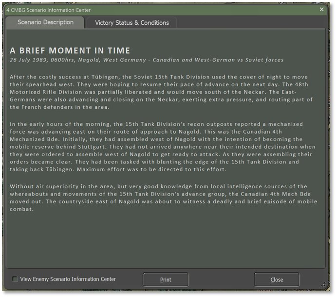

### Victory Status & Conditions

The Victory Status & Conditions tab contains sections of information that detail or estimate the game in progress and how the current scenario is going.

Victory is ultimately determined by the number of Victory Points (VPs) your force accumulates by the final tally at battle’s end. Victory Points are achieved by retaining as many of your units as possible, inflicting losses on your opponent, securing additional strategic locations (see Section 30 below), and other bonuses or penalties. You will be victorious if you have more VPs than your opponent. Your score is numerically presented by a concrete number of VPs secured or by a percentage of how many VPs your side has relative to the number available in scenario (and thus your opponent), as well as deter with different levels of loss or win (decisive, tactical, marginal, or contested) as demonstrated in the images below.

Each section of the report is described in turn.

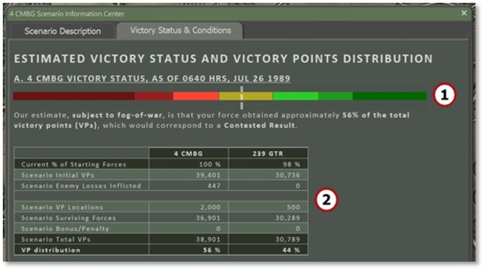

1. This bar is a graphical representation of the currently estimated victory level and a brief explanation below it. The white bar represents where you stand between decisive loss and decisive win. This estimate is timestamped.

2. This table breaks down Victory Point (VP) allocations by type for each side of the battle. VP Distribution total percentages are shown in the last line.

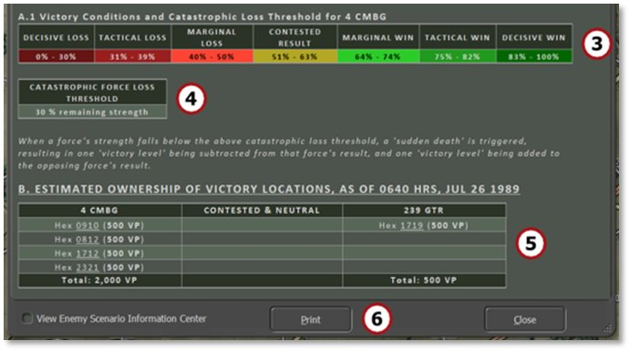

3. This table outlines the levels of Victory Conditions based on the percentage of VPs in the scenario.

4. This table shows the Catastrophic Force Loss Threshold for your force strength. This is the point at which your force becomes combat ineffective. See Section 30.5 below for more information on Sudden Death triggered by dropping below this threshold.

5. This table lists the ownership and value of all on-map VP locations. The left-hand column lists VP locations held by Player 1 and the right-hand column lists VP locations held by Player 2. The middle column lists VP locations that are contested and neutral.

6. This area has the Print and Close buttons for the report.

## Operations

The Operations Staff Reports (Ops) provide a wealth of information about your forces and capabilities, show your mission orders, and provide a view of the map and your force placement.

If the following two Game Options were selected during scenario setup: Enemy Units Always Visible and Allow Gathering of Full Information of Visible Enemy Units, this dialog will have an option in the bottom left corner to View Enemy Tactical Operations Center. Checking this toggle converts each tab to show the same information but from the enemy’s perspective and the details change accordingly. Uncheck this toggle to return to your forces’ information. Selecting only one or the other of these two Game Options will not allow this information to be viewed (see Section4.3.2 above).

### Mission Briefing

The Mission Briefing tab provides all the information for the current scenario with numbered headers. Winning the game requires scoring more Victory Points than your opponent through the course of battle. The Mission Briefing helps to situate the battle and plan accordingly.

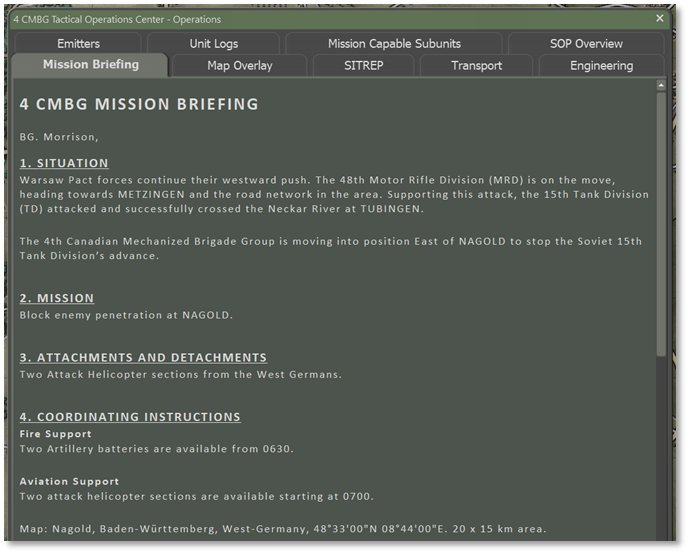

1. The Situation for the mission provides some background and context.

2. The Mission objective(s) are noted to help plan your battle against the enemy.

3. The Attachments and Detachments section notes any additional forces added to your core forces to support the mission.

4. The Coordinating Instructions section lists any Aviation, Fire Support (on- and off-map artillery), and Engineering assets for the mission.

A map is provided with additional visual features chosen by the scenario designer to assist with strategy and planning, such as the one below.

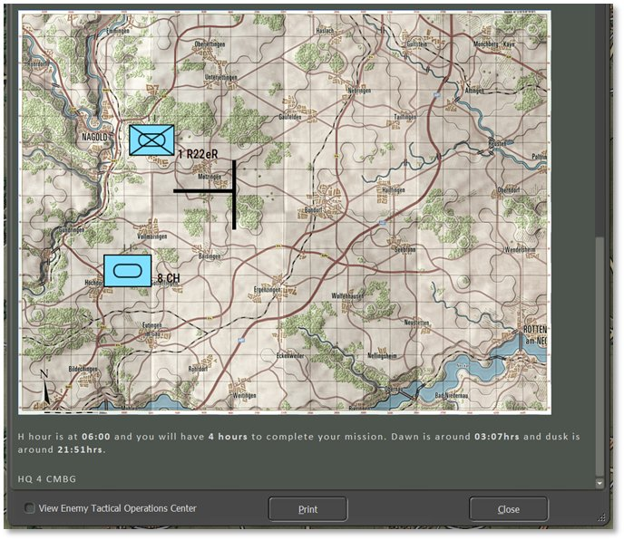

### Map Overlay

The Map Overlay tab shows the location of your forces and any spotted enemy forces. This map updates in real time as the battle unfolds.

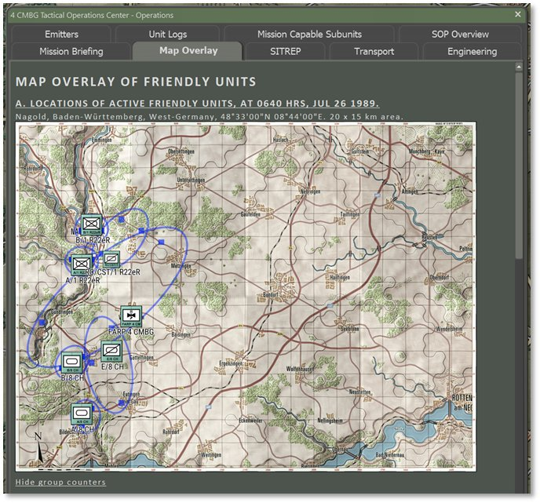

Below the map is a listing of all your on- and off-map headquarters (HQs), the number of units in their command, and the hex location of the HQs using hyperlinked column/row grid coordinates, as shown below:

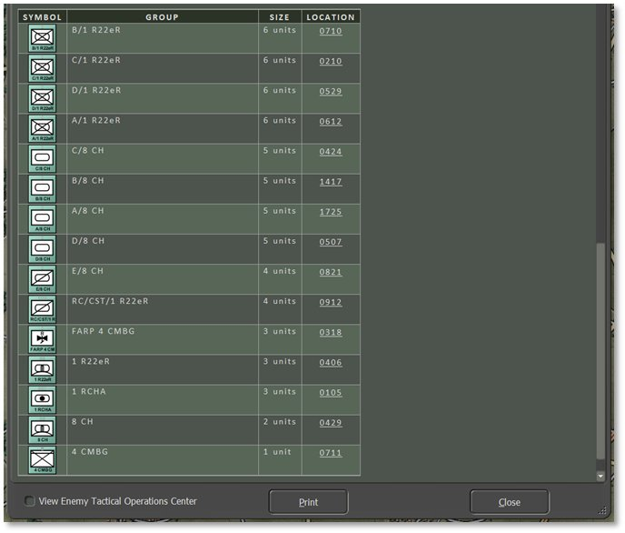

### SITREP

The SITREP (SITuation REPort) tab has a graphical representation of your command cycle times (past, present, and estimated for the future) in Section A.

Section B provides a summary of the numbers and types of units in your force, followed by detailed information on each unit.

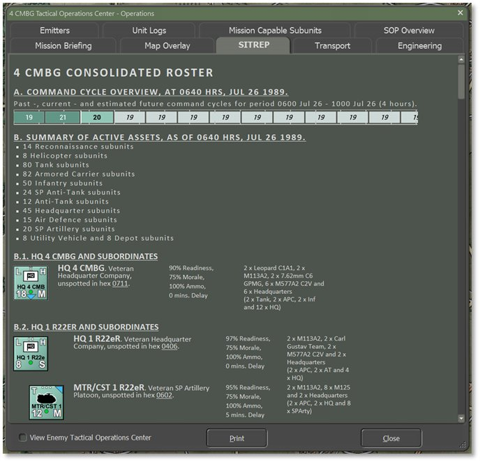

Unit information includes the counter, unit name, training level, unit type, whether the unit has been Spotted, and the hyperlinked hex it is in (marked by four-digit column/row grid coordinates). The next column notes the Readiness, Morale, and Ammo levels along with order Delay information. The last column shows a breakdown of the numbers of different platforms in each unit.

### Transport

The Transport tab provides an overview of ongoing transport missions and the available capacity for air and land assets (naval transport is currently not in-game). This helps with planning and organizing other operations such as air assaults, fire support, etc. Players can create detailed transportation plans incorporating ground vehicles, helicopters, designated transport units, cargo loads, and escort elements that have defined, specific routes with designated pick-up and drop-off points. See **FM03C Tutorial Operations: Advanced** for more on this planner. See Section 11.7.6 above for information on the Transport Plans overlay.

Section A covers Air Transport Operations with three subsections, as shown below.

Ongoing Operations, seen below, displays the Serial, Sub-serial, Unit counter of the transporting platform, counters of the Passenger(s) in transit, Pickup hex location (hyperlinked column/grid coordinates), Pickup ETA, Drop off hex location if applicable, and the Destination hex location.

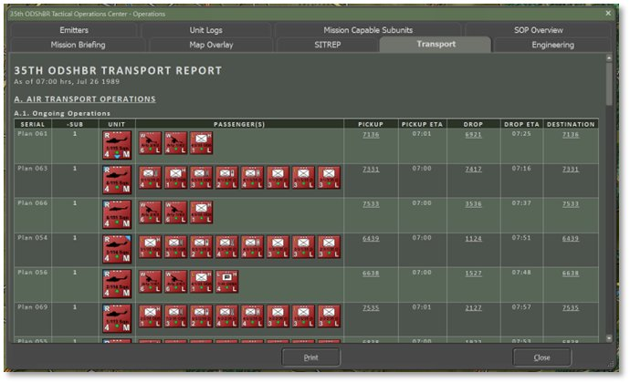

Embarked Units lists any units who are not scheduled to disembark at that time. Their Serial, Sub-serial, Unit counter, and Passenger information are displayed, as seen below.

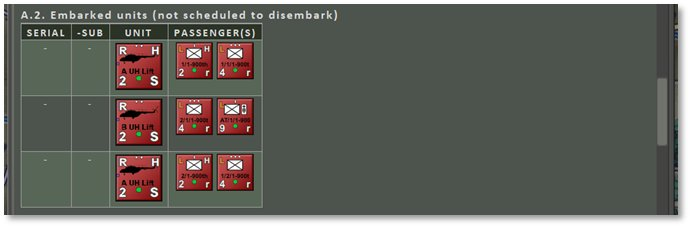

Transport Asset Overview, seen below, displays the Asset counter, the Capacities for Remaining Lift and Seats in the top and bottom bars, respectively, for each asset, and the hyperlinked hex Location of that asset on the map. Capacity is illustrated visually with a bar graph for both factors, with the green portion representing the unit’s free capacity and the blue portion representing the claimed capacity. Discrete values for the total and remaining capacities for both Lift and Seats are presented under the corresponding bars.

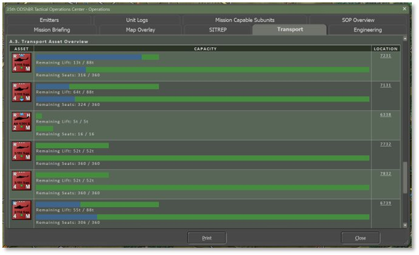

Section B covers Naval Transport Operations and Section C covers Ground Transport Operations. These are not in the game currently but follow the same tabled structure as Section A above.

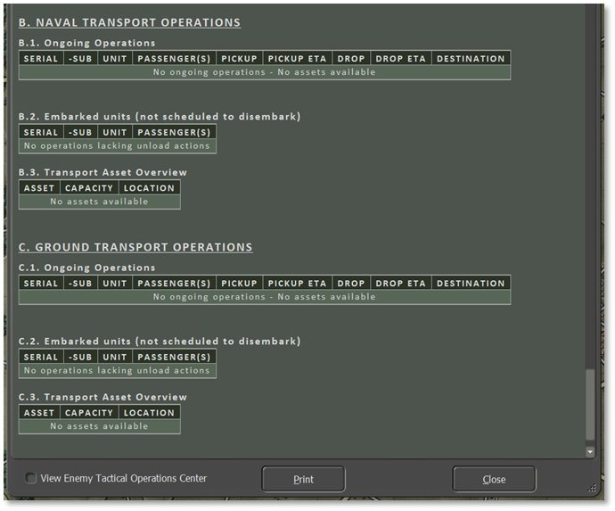

### Engineering

The Engineering tab provides information about any engineering assets in your force. Some scenarios do not have these.

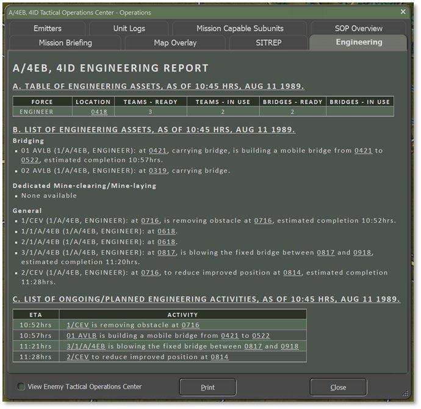

Section A notes the Force name, hex Location (four-digit column/row grid coordinates), number of Teams that are Ready, number of Teams that are In Use, the number of Bridges that are Ready, and the number of Bridges that are In Use.

Section B provides a List of Engineering Assets capable of Bridging, Dedicated Mine-clearing/Mine-laying, as well as any General engineers or troops at your disposal.

Section C shows a List of Ongoing/Planned Engineering Activities on the map and is time-stamped to show current orders. Activities will be removed from this list automatically once they have been completed (or aborted, if necessary).

### Emitters

The Emitters tab provides a detailed breakdown of any units with electromagnetic emitter equipment like radars. Of note, the status of the emitter is shown in a hyperlink that can be toggled on and off from this report. This is the line that says “Unit is emitting now”. Click the hyperlink to set it to “Unit is NOT emitting now”. The type of emitter is described on the furthest-right block of the detailed information.

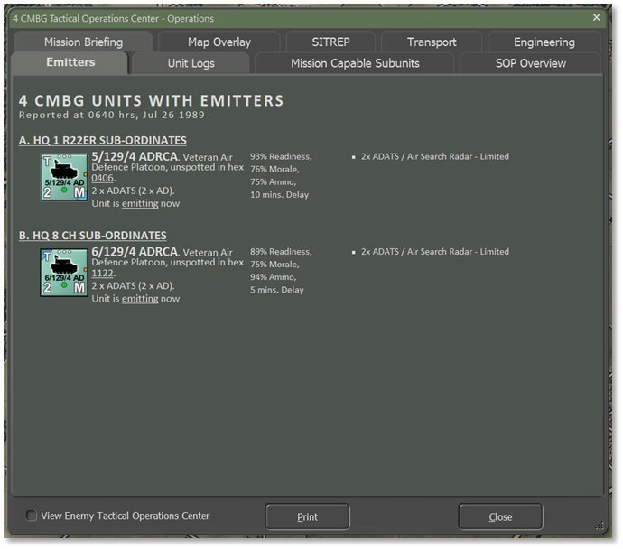

### Unit Logs

The Unit Log tab lists all entries from the command log for all units of your force. Select a unit in the order of battle (OOB) list on the left side to view all related log entries in the right-side window. This window can be scrolled to see all the scenario events when they extend beyond view.

An option to Show Combined Radio Logs is available under the OOB tree. Selecting this shows all unit entries in chronological order in the right-side window.

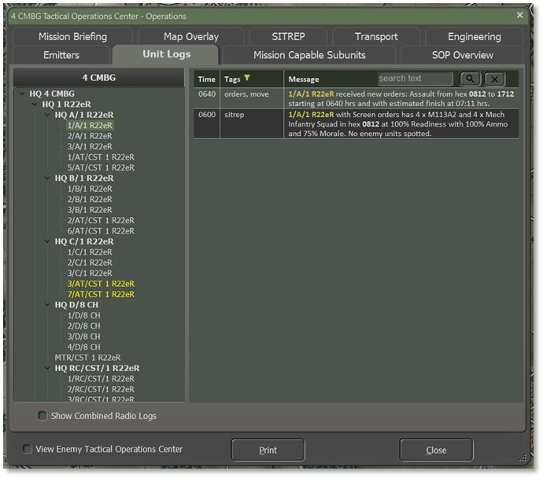

### Mission Capable Subunits

The Mission Capable Subunits tab provides information on the subunits by type and by platform to give a clear picture of how your forces are doing at the current time in the scenario.

Section A is a graphical representation of the number of units of each type under your command. A green bar represents the proportion of units still active out of the total starting number, which is shown with a light gray bar. The image below shows that all units are still active. The green bar gets shorter as units are lost to reveal the light gray bar behind it. The totals and types are in the column on the right.

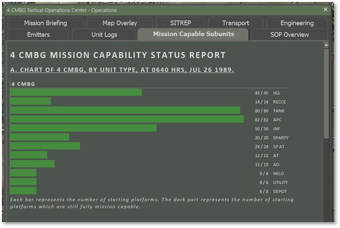

Section B is a tabled representation of your forces by type. The table notes each Type, the number of units that Started the scenario, those still Running, any units Withdrawn, any units that have Fallen Out (i.e., damaged/wounded and no longer combat effective), and those Destroyed (i.e., “brewed up” or killed).

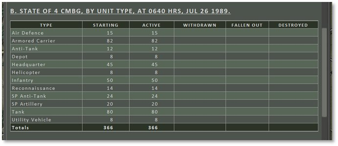

Section C is a similar table to that above but platforms are organized by Platform name and Description rather than by type.

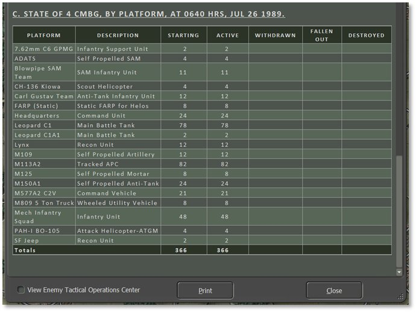

### SOP Overview

The SOP Overview tab provides a summary of the settings all units are using for their Default SOP. Settings are displayed with the named preset that is the closest match at the top of the entry, and where there are differences from that preset, highlights of those differences are indicated in the breakdown (see yellow text in the image below). Modify specific units’ SOPs directly by right-clicking the counter to open the Unit Popup Menu and selecting SOP Manager either from this dialog or the map. Alternatively, hit ***Ctrl+K*** to open the SOP Manager at any time for the currently selected unit or right-clicking the unit in the Spotlight Order of Battle Tree (see Section 13.3.1 above). Only one unit can be modified at a time.

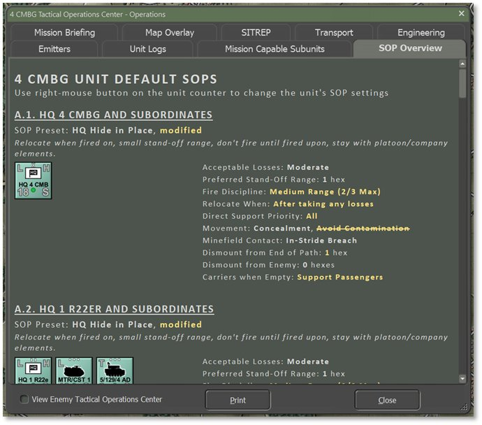

Units are grouped by identical SOPs in this overview. Modifying the settings for a unit will move it to a new location depending on the specific new parameters. Multiple SOPs can be modified at once by issuing a group SOP (see Section 23.7 below).

This overview allows for speedy verification that units are set the way players might expect. Pre-set SOPs allow new players to proceed with issuing orders and hitting Start to begin play without needing to worry about setting SOPs for their forces. Intermediate players may wish to check that the values support the tasks assigned and switch presets as needed. Advanced players may use this to quickly make adjustments to fine-tune the SOPs and get the maximum performance out of their units.

See Section 23 below for details on Standard Operating Procedures.

## Intelligence

The Intelligence Staff Reports (Int) provide information about your enemy’s forces and capabilities, kills, claims against the enemy, and other factors that impact your ability to fight effectively.

If the following two Game Options were selected during scenario setup: Enemy Units Always Visible and Allow Gathering of Full Information of Visible Enemy Units, this dialog will have an option in the bottom left corner to View Enemy Tactical Operations Center. Checking this toggle converts each tab to show the same information but from the enemy’s perspective and the details change accordingly. Uncheck this toggle to return to your forces’ information. Selecting only one or the other of these two Game Options will not allow this information to be viewed (see Section 4.3.2 above).

### Threat Assessment

The Threat Assessment provides your Intel section’s assessment of the enemy forces you face during battle. Along with the verbal Threat Brief, a map with the best graphical estimation of what the enemy’s plan may be is provided, as shown below. This should help with planning for how to use your forces to win Victory Points and complete your mission as described in the Scenario Information (see Section 15.1 above) and Mission Briefing (see Section 15.2.1 above).

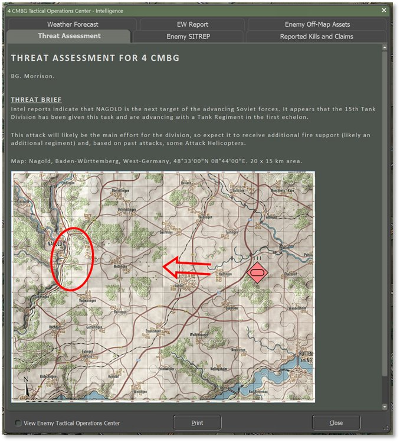

### Enemy SITREP

The Enemy SITREP tab provides information on the estimated state of the enemy forces to help shape your strategy.

Section A provides a graphical Estimate of the Enemy Command Cycle for the past, present, and future cycles.

Section B shows the game map and a geographical Estimate of Enemy Locations. The circles show a rough idea of the dispersion of specific enemy units. This map is updated in real time as more information is gained during the fight.

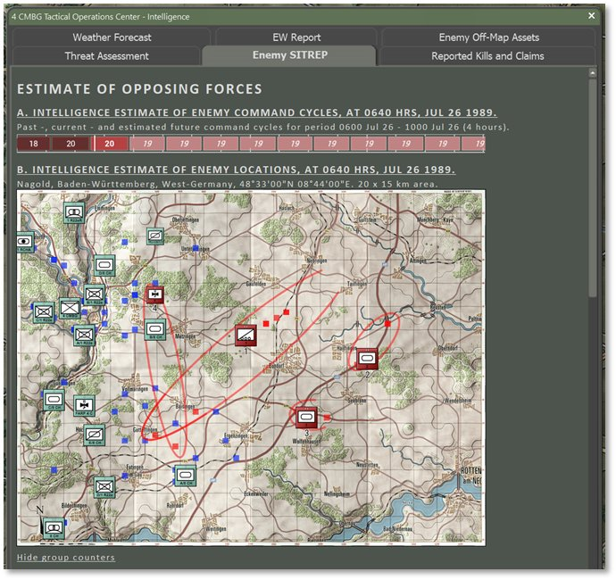

Below it is a list of Spotted enemy units. The unit size and a hyperlinked hex location (four-digit column/row grid coordinates) are also shown, with the row numbers in the left-hand column matching those labelled above on the map. If an off-map unit has been Detected, it is also noted on the list but shown as an Off-Map Asset with a distance and direction.

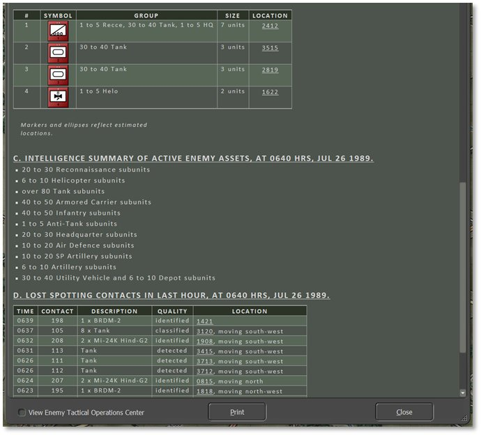

Section C provides a Summary of Active Enemy Assets with numbers and types of enemy units from your Intelligence staff. This supplies a starting point for being able to track enemy losses and an idea of the numbers and types of threats you face (especially if enemy information has been turned off during setup).

Section D provides a list of Lost Spotting Contacts in the last hour of the battle. This shows the Time of the contact, a Contact number for tracking, a Description based on the Quality of detection, the Quality itself of the contact (Classified, Identified, Detected, or Radar), and the hyperlinked Location of the lost contact. Contacts are lost when the unit moves out of Line of Sight or your own units move and lose the Line of Sight to the target.

### Reported Kills and Claims

The Reported Kill and Claims tab provides a table tracking what each of your units have killed during the scenario.

The Unit column lists all your units. The A/F/D column notes which of *your* units are still Active (alive and fighting), Fallen Out (damaged/wounded), and Destroyed (“brewed up” or killed). The remaining columns represent the enemy’s forces and the number of kills (or fallouts) your forces are claiming for each unit type. At the very bottom of the table is a line with the Grand Totals for the A/F/D and enemy types columns.

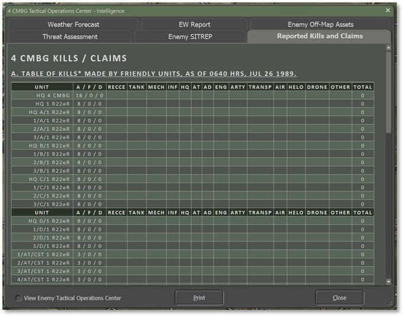

### Weather Forecast

The Weather Forecast tab provides information on weather as well as any interference on various systems. Weather significantly impacts combat operations, and you, as commander, should plan accordingly.

Section A provides details of the weather forecast for 24 hours. This table includes the time in Hours of the weather conditions, the Temperature, Conditions of the sky, any Precipitation, Wind speed and direction, Visual (Visibility) and Illumination ranges (see Section 24.3 below), and Cloud Ceiling.

Section B, Light Data, notes the times for Dawn and Dusk, and the phase of the moon for night Illumination.

Section C provides information on any Systems Impact (Artillery, Air Defense, and NBC Operations) from the weather at different times of the scenario.

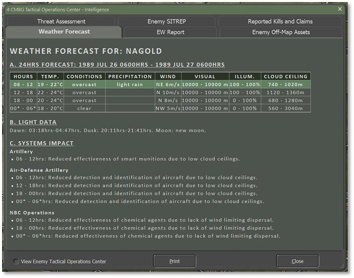

### EW Report

The EW (Electronic Warfare) Report tab provides information on the level of your EW efforts and what the enemy is doing to you currently.

EW disrupts your communications with your troops and adds additional Delay to issuing orders. The higher the hindrance, the longer the delays (see Section 21.7 below).

Section A details the Situation of both your EW level versus the enemy’s and the effects of the enemy EW on your forces. The main impact will be a Delay in your command cycle.

Section B shows Planned Electronic Warfare Activity to be Inflicted on the Enemy, By Hour which graphs out the level of EW for both sides (yours in blue) hour-by-hour for the scenario.

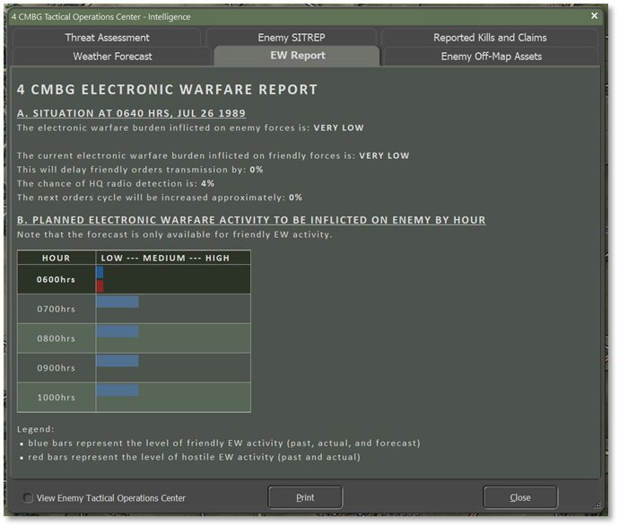

### Enemy Off-Map Assets

The Enemy Off-Map Assets tab lists any units the enemy has off-map that are Detected by radio intercepts, counter-battery radar, or other recon sources provided by friendly forces outside of your command. These units are being used against your forces.

Currently, those off-map assets are long-range artillery units. More types may be added in future updates.

These enemy units can be targeted by long-range artillery or airpower.

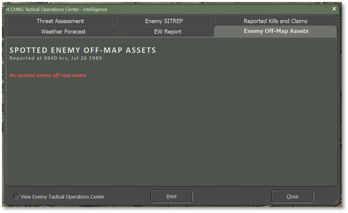

## Fire Support

The Fire Support (FS) Staff Reports provide information about artillery and air units available in the scenario, a listing of fire missions and strikes planned and in progress, and any fire missions in the Fire Support Control Center (FSCC) queue.

If the following two Game Options were selected during scenario setup: Enemy Units Always Visible and Allow Gathering of Full Information of Visible Enemy Units, this dialog will have an option in the bottom left corner to View Enemy Tactical Operations Center. Checking this toggle converts each tab to show the same information but from the enemy’s perspective and the details change accordingly. Uncheck this toggle to return to your forces’ information. Selecting only one or the other of these two Game Options will not allow this information to be viewed (see Section 4.3.2 above).

### Fire Support Assets

The Fire Support Assets tab notes mortars, artillery, rockets, and strike aircraft available to use during the scenario. Each entry shows the counter and the FSCC control toggle underneath it, see image below. Right-clicking the counter opens the Orders Menu Popup dialog to issue orders to these units (see Section 14.1 above).

The first text block on the left-most side provides the unit’s name, training level, type, and size (artillery formations are normally called batteries). It also shows the unit’s location (hyperlinked hex grid coordinates for on-map units or distance and map edge for off-map), the current orders, and arrival or withdrawal time if needed.

The next block states the current Readiness, Morale, and Ammo level percentages, along with the Spotted status of the unit.

The next block of information shows the unit’s detailed ammunition levels.

The last block (furthest right) notes the details of any fire mission currently in progress. The first mortar unit has not yet fired in the image below, but the first artillery unit has a mission scheduled.

Running along the width of these blocks is information on what units it can provide fires for (see Sections 25.3 and 25.4 below) and the possible delay time for the call to be processed in the command chain. Underneath this is the unit’s Fire Support Group information (see next subsection) and the Fire Mission Preset.

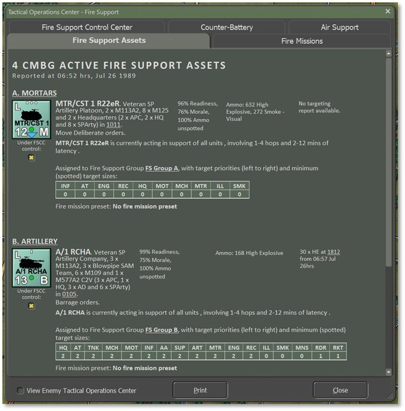

#### Fire Support Groups

Individual fire support assets can receive orders independently but it is more doctrinally correct to operate in coordinated groups known as Fire Support Groups (FSGs). Assets, typically of the same or very similar types, are grouped together and given a common targeting criteria so that only targets of a certain type and density are selected. This gives both finer-grained control and greater weight to the resulting fires.

FSGs are automatically created by the Fire Support Control Center (FSCC) at the start of a game. The Fire Support Group report shows which FSG each asset is assigned to, what the target priorities are from left to right, and what minimum Spotted target size in steps is needed to trigger a mission. Finally, a default Fire Mission Preset can be specified. This preset can include any available special ammunition such as smoke, illumination, or FASCAM (scatterable mines).

A unit will not fire as part of the group if unchecked from having FSCC control. It will remember which group it is part of in case it is selected again, however.

These settings can be viewed in greater detail as shown below by clicking on the FSG name (“FS Group A” in the example above).

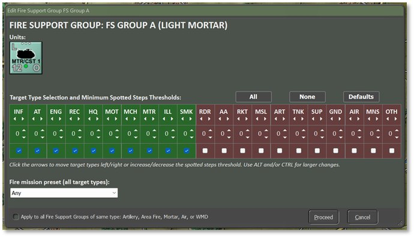

The target types in row 1 of the green/red table represent target unit types (headquarters [HQ]), rocket artillery [RKT], missile systems [MSL], etc.) and special target types such as illumination (ILL), obscuration/smoke (SMK), and FASCAM minefields (MNS). Hover over the abbreviations to show their full descriptions.

The priority of the different target types can be increased (moved left) or decreased (moved right) by clicking on the left and right arrows under the Target Type names in Row
1. 

The required density of subunits in a hex can be adjusted with the up and down arrows in Row 2.

The type can be selected (green) or deselected (red) by toggling the check box in Row 3.

The preferred Fire Mission Preset for ammunition types and duration can be selected in the bottom drop down menu.

See **FM03B Tutorial Operations: Intermediate** for more information on using fire support groups.

### Fire Missions

The Fire Missions tab shows a List of Active and Planned Fire Missions for your forces. Each numbered entry shows the Start and Finish time of the fire mission in game time, the Status of the mission (Active or Planned), the Contact number of the enemy if known/Spotted, the Target and its hyperlinked grid location if known/Spotted, Type of fire mission ammunition being used, the total number of Rounds to be fired at the target, the Duration of the fire mission, the counter of the Asset firing, and the Asset Status covering average Ammo percentage and Readiness level at each mission.

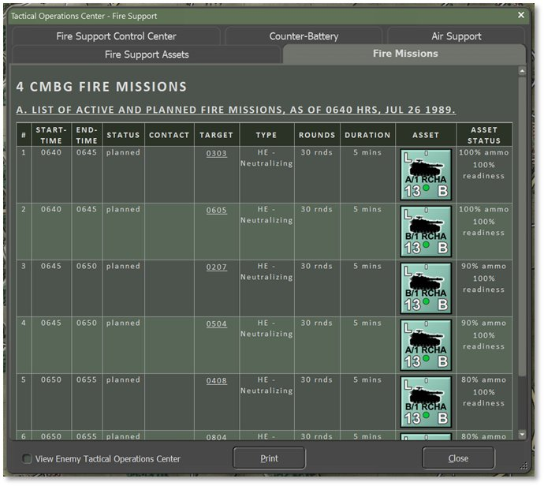

### Fire Support Control Center (FSCC)

The Fire Support Control Center (FSCC) tab provides a listing of all requested fires on targets that have been Spotted and any off-map targets Detected for counter-battery fire.

Table A below shows the Queue of Fire Support Requests with their entry # (number), time the request was Sent, Time the request is needed, the request’s Priority level (higher ranking is more important), the Contact identification number of the target, details on the Target including its type and if it is moving, the Location of the target using hyperlinked grid coordinates for on-map targets or directions for off-map targets, and the name of the Spotter or unit that is making the fire request.

You can also use this listing to find targets for manually entered fires from your artillery by noting the hex locations and target types.

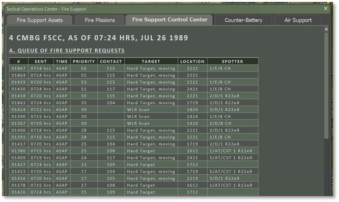

Table B below show the List of Accepted Fire Support Requests with their entry # (number), time the request was Sent, Received, and Processed, the Time the request was needed, Priority level, Contact number, Target details, hex Location, Spotter name, the Asset used, and the request’s Status (Completed, Cancelled, or Aborted).

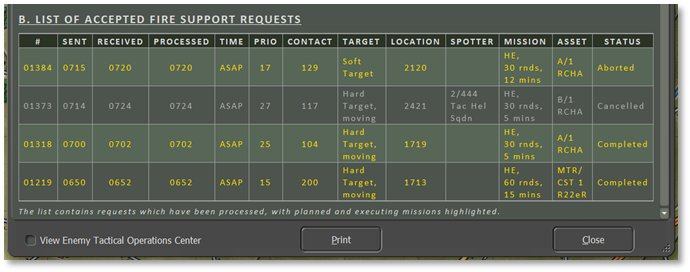

### Counter-Battery

The Counter-Battery tab shows any Weapons Locating Radar (WLR) available and provides details on counter battery actions that have been ordered or have occurred, as shown below.

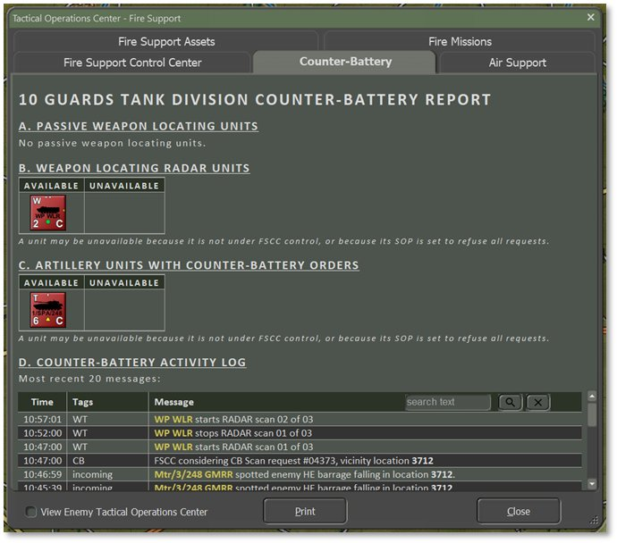

Section A displays Passive Weapon Locating Units. These are currently not in the game.

Section B displays active Weapon Locating Radar (WLR) Units. WLR systems detect and track artillery projectiles in flight and estimate the location from which these projectiles were fired to Detect and locate hostile artillery positions.

When a hostile artillery position is detected, the WLR will pass the location of the Fire Support Control Center (FSCC) who will attempt to issue a fire mission to an artillery unit that is on Counter Battery duty and within range of the hostile artillery unit (see Section 25.4 below for more on indirect fires and the FSCC).

Section C shows Artillery Units with Counter-Battery Orders listed as either Available or Unavailable. Available artillery units are those that have an On Call, Direct Support, or Counter Battery order and otherwise are ready to fire (i.e., not wiped out, not moving, not already assigned an FSCC mission, etc.).

Section D shows the most recent 20 messages from the Counter-Battery Activity Log (if there are at least 20 messages). This log has the same filtering and highlighting capabilities as the Radio Log covered in Section 14.4 above, with an additional filter to show only counter-battery-related activity.

### Air Support

The Air Support tab shows the current Situation regarding who has control over the air space along with the weather in Section A (see below). Control of the air provides an advantage to the owning side and affects the likelihood of an air strike getting intercepted or a helicopter being shot down from enemy fighter planes.

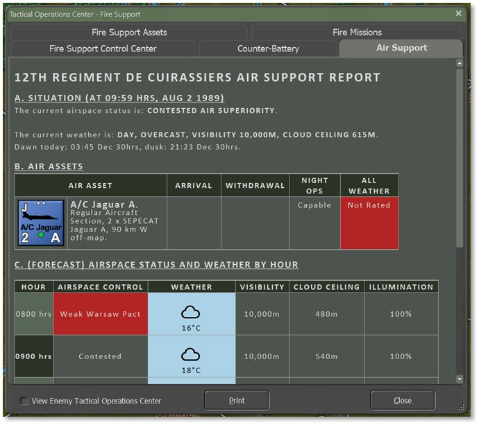

Section B lists Air Assets in the scenario that are available to use. See Section 18.4.5 below for off-map air support, and Section 22.3 below for calling in air strikes. Additional information about air strikes can be found in Section 25.6 below.

Section C provides a full Forecast with Airspace Status and Weather by Hour. Weather affects Visibility range both along the horizontal plane between ground units and also vertically due to a cloud ceiling restricting sight lines to and from aircraft (see Section 24.3 below). The forecast lists each Hour, Airspace Control, Weather, Visibility, Cloud Ceiling, and Illumination.

## Personnel and Logistics

The Personnel and Logistic Staff Reports (PL) provide information about the condition of your forces, when new units will arrive on the map, when other units on the map will leave, and an overview of ammunition use and quantities for your forces.

If the following two Game Options were selected during scenario setup: Enemy Units Always Visible and Allow Gathering of Full Information of Visible Enemy Units, this dialog will have an option in the bottom left corner to View Enemy Tactical Operations Center. Checking this toggle converts each tab to show the same information but from the enemy’s perspective and the details change accordingly. Uncheck this toggle to return to your forces’ information. Selecting only one or the other of these two Game Options will not allow this information to be viewed (see Section 4.3.2 above).

### Staff Alerts

The Staff Alerts tab warns about any units suffering problems that degrade their ability to fight and maneuver on the battlefield.

This includes the following problems:

- **Out of Command Range –** This impedes resupply and adds Delays to orders being done (see Section 21.7 below).

- **Low Morale, Readiness, or Ammo** – These reduce the effectiveness of fighting the enemy (see Section 26 below).

- **Insufficient Transport** – This means units are Lost or stranded. Leg units no longer have carriers to move them quickly across the battlefield. The Leg Movement Indicator in the top left corner turns orange when a unit becomes Lost (see 22.1.3 below).

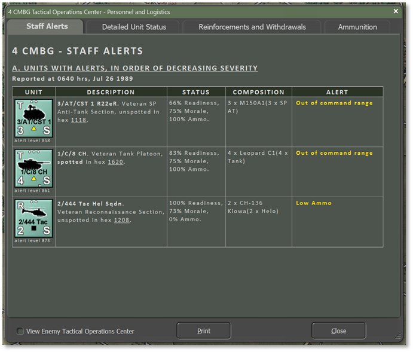

### Detailed Unit Status

The Detailed Unit Status tab provides an order of battle (OOB) listing in the left window. Select a unit to display its information in the right window. This shows the counter with the unit’s name, training, type, and total Victory Point (VP) value (see Section 15.1.2 above). Readiness, Morale, and Ammo percentages are shown along with hyperlinks to the unit’s headquarters and its own location (four-digit column/row grid coordinates).

Below this is a breakdown of subunits by name and type with the current number of Active Runners, Fallen Out, and Lost units. Under this is a silhouette of the unit and its VP cost. The next column shows the type of mobility and top speed followed by a list of basic protection values (see this also in the Subunit Inspector [***F6***] and Section 14.3 above). The number of crew and date of use are also listed. Beside this column is a list of the subunit’s armaments and special capabilities. At the very end is information on number of enemy units it has claimed as destroyed.

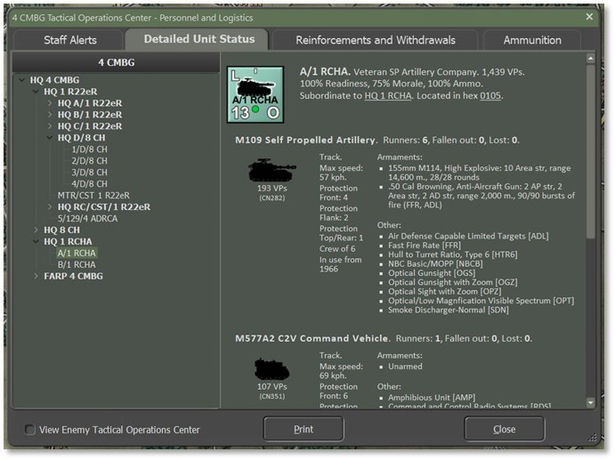

### Reinforcements and Withdrawals

The Reinforcement and Withdrawals tab provides an order of battle (OOB) listing in the left window that organizes the units by arrival or withdrawal time throughout the scenario. Selecting a unit in the left window provides a subunit breakdown and details in the right window, as seen in Section 15.5.2 above.

Of importance in the right window is the time of arrival or withdrawal and the hex the unit will enter the map. This is displayed in the last line of the detailed unit information (to the right of the unit counter) under Unit Status. Click the hyperlink for the location in the line above to flash the hex on the map.

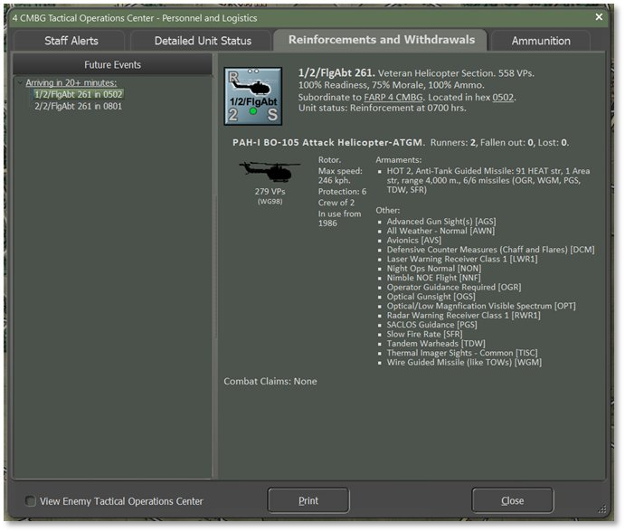

### Ammunition

The Ammunition tab provides a means to track and review a unit’s Ammo use and remaining rounds by weapon and by munition for weapons that use multiple types. This report is updated as the scenario unfolds.

Section A runs down the Overall Ammunition Status of your force.

This table shows the weapon system’s Ammo Type and Description, the starting Basic Loadout of the ammunition, the current number of rounds/bursts On Hand, the Percentage On Hand, and the number of rounds or bursts that have been Expended.

Information in yellow highlights units and subunits that have fired and expended ammunition. The values in white reflect units that have not engaged the enemy. Currently, there may be duplicated entries from different subunit types with the same weapon system.

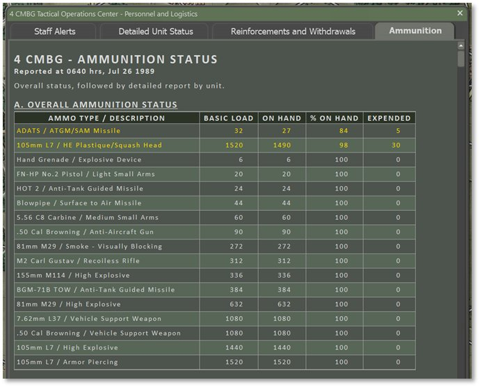

Section B shows each unit and the ammunition for each significant weapon system (no small arms weapons are listed). Each entry contains the unit’s name, unit composition, counter, and then a table showing each weapon system’s ammunition in the same format detailed in Section A above.

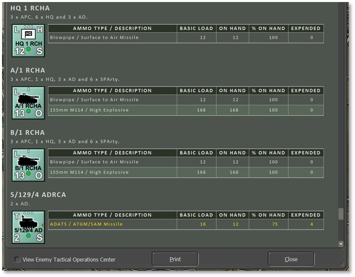