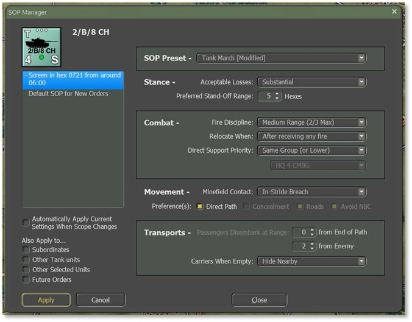
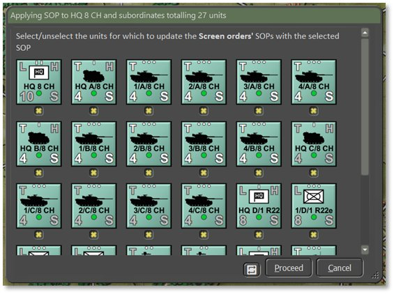
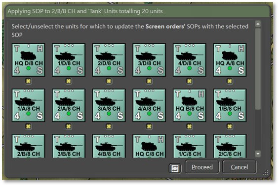
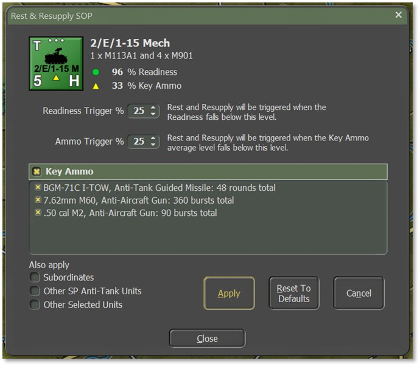

# Standard Operating Procedures (SOP)

One of the more requested features from earlier games was the ability to set Standard Operation Procedures (SOP[s]; pronounced as its acronym ess-oh-PEE[Z]) in more detail for your units. We have that now and it is a very powerful tool for you as the commander to wield. This tool gives you the flexibility to adjust many different operational parameters of your units, per unit, per waypoint, and for new orders. Grayed-out parameters are not available for the selected unit.

These SOPs can be applied to the selected unit or easily applied to other units in the formation or of a similar platform type as described below.

There are many ways to open the SOP Manager: right-click on a unit to open the Unit Popup Menu, select a unit and hit ***Ctrl+K***, click on the Edit Order SOP button on the Orders tab of a unit’s Dashboard (see Section 14.2.2 above), or open from the SOP menu bar option.

## SOP Preset

- **SOP Preset** – Use the dropdown as a fast way to set all other values on the form to match the selected preset. Changing any values from the exact values in a preset will change the dropdown to show the closest-matching preset and append [Modified] at the end to indicate it has been customized, as shown above. Which presets are available depend on the unit selected. HQ units have Preset options for all their subordinates in addition to their own.

## Stance

- **Acceptable Losses** – The unit’s/units’ willingness to take losses before seeking a change in orders. The settings for this item are Do or Die, Substantial, Moderate, or Minimal.

- **Preferred Standoff Range** – The number of 500 m hexes the unit(s) are to be distant from any Detected enemy units.

## Combat

- **Fire Discipline –** Sets the range/ability to shoot at enemy units in direct fire. The available settings are Refuse Fire, Hold Until Fired On, Point Blank (0 to 1 hex), Short Range (1/3 Max Range), Medium Range (2/3 Max Range), and Maximum Range.

- **Relocate When** – Determines under what conditions a unit will seek to Scoot to a new location for better protection or to avoid enemy fire (see Section 21.8 above). The possible selections are After Each Fire Mission, After All Fire Missions, While Enemy Spotted, After Receiving Any Fire, After Receiving Direct Fire, After Taking Any Losses, After Taking Direct Fire Losses, After Taking Indirect Fire Losses, or Stance Only. Some of these settings work better for certain types of units. The after-fire mission settings work better for artillery for instance.

- **Direct Support Priority** – Set specific Direct Support operations for artillery assets. This setting is for indirect fire units only. The default is to support All requesting units which is the same as General Support noted in Section 25.4 below. Other options to support specific units directly are Same Group (or Lower), Specified Unit (and Lower), or None (Refuse All) which stops the Fire Support Control Center (FSCC) AI from using this unit in any supporting call for fires. These are the same as Direct Support as noted in 25.4 below.

## Movement

- **Minefield Contact** – The unit’s/units’ response to entering a minefield. The options here are Ignore and Run (do not delay, accept the potential for more subunit losses crossing the field), In-Stride Breach (slow down to follow a leader through the field, hoping to avoid mines by traveling in the same tracks), or Stop and Reduce (halt and either wait for engineers to remove enough mines to open a path, or do the work themselves at a slower rate).

- **Preferences** – Set stricter movement preferences for travel between waypoints (see Section 22 above for waypoint plotting). Move Hasty prefers roads while Move Deliberate or Assault orders mix roads with cross-country movement. For additional control, check any number of boxes to prefer a Direct Path (favors arrival in the destination over considering hexes’ protective or risk factors), Concealment (favors off-road paths and seeks better-Covered terrain to move through), Roads (favors taking roads instead of cross country, can result in less Cover), and Avoid NBC (which paths units around nuclear, chemical, and/or biological contamination on the map). See Section 11.8 above for information on how different terrain features impact movement.

## Transports

- **Passengers Disembark at Range** – There are two options for disembarking transported troops and teams from their carriers. The first is to set the number of hexes (500 m) from the final waypoint or end of path. This is useful for assaults or recon efforts in hostile territory. The second is to set the number of hexes from a Spotted enemy. This is useful if your troops encounter unexpected enemy contact while on the move.

- **Carriers When Empty** – Once transporting APCs (Armored Personnel Carriers) or IFVs (Infantry Fighting Vehicles) disembark their troops or teams, this setting tells the transporting units what they to do next. For APCs, the better choice is to Hide Nearby (seek Cover and do not engage the enemy) as these vehicles are usually poorly armed and armored. The other option is Support Passengers (seek good Cover but engage enemy units with on-board weapon systems) to improve firepower against the enemy, but risks losing transports to enemy fire. See Section 22.1.3 above on the Lost transport indicator.

## Automatically Apply

To automatically save changes while clicking between orders, check the box to Automatically Apply Current Settings When Scope Changes located between the Also Apply To… toggles and the Orders window. When checked, any changes to the indicated scope (i.e., the selected order) will automatically Apply to become the new SOP if you select a new order or new unit. This removes the need to click the Apply button at the bottom to move through adjustments more quickly, but also means that any changes are automatically saved and cannot be reverted to by clicking Cancel.

## Also Apply To…

There are four toggles on the bottom left corner of the SOP Manager dialog that are used to select which units the orders Also Apply To:

- **Subordinates** – Apply settings for all units in a formation (HQ and subordinates, as shown below). Higher HQs have more units that will change down the order of battle chain. Hitting Apply pops up a dialog showing all the affected units, see image below. Units can be excluded from the change by unchecking the toggle below a counter. Click the recycle button to the left of the Proceed button to invert the selections. Click Proceed.

- **Other Tank units** – Apply settings to all units of the same type (e.g., tanks, APCs, HQs, etc.). Hitting Apply pops up a dialog showing all the affected units, see image below. Units can be excluded from the change by unchecking the toggle below the counter. Click the recycle button to the left of the Proceed button to invert the selections. Click Proceed when finished.

- **Other Selected units** – Apply settings to any other units selected while the dialog is open.

- **Future Orders** – Apply settings to all orders that follow the current order. Check this box to modify the Default SOP going forward.

## Rest & Resupply SOP

Another SOP that can be customized is for Rest and Resupply. Open this dialog by selecting Adjust Rest & Resupply SOP from the Unit Popup Menu (see Section 14.1 above) or by selecting Edit Rest & Resupply SOP from the Staff tab of the Unit Dashboard (see Section 14.2.4 above).

The following changes can be made with this dialog:

- **Readiness Trigger** – Set the Readiness level that will trigger a Rest and Resupply order if it falls below it. The default is set to 25% but can be changed to be higher or lower.

- **Ammo Trigger** – Set the Key Ammo level that will trigger a Rest and Resupply order if it falls below it. The default is set to 25% but can be changed to be higher or lower.

- **Key Ammo** – This window shows the key ammunition for the unit selected. Each ammunition type can be toggled individually to resupply when it falls below the defined threshold from above so that resupply time is used only for the preferred or highest-priority ammunition to suit your needs.

- **Also Apply** – Select other conditions to apply the current Rest and Resupply SOP to: Subordinates, Other Units of the same type, or Other Selected Units.

Click Apply to implement changes to the SOP. Click Reset to Defaults to discard changes and use game defaults. Click Cancel to revert to the last saved SOP. Close the dialog when finished.