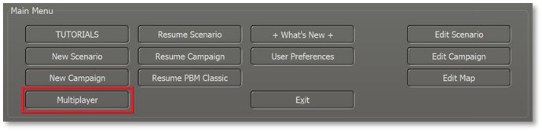
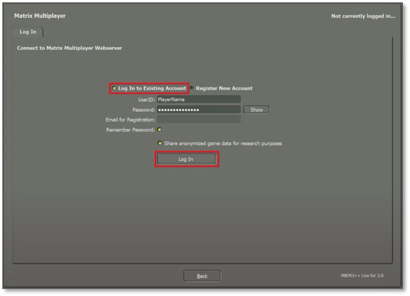
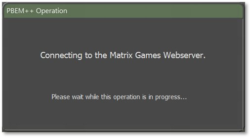
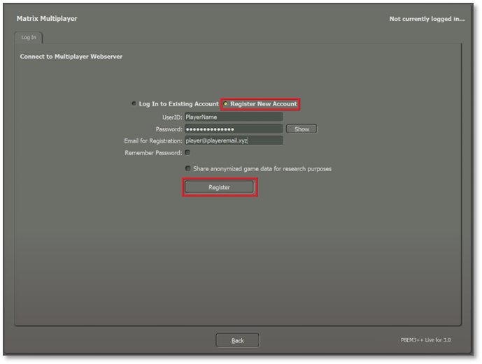
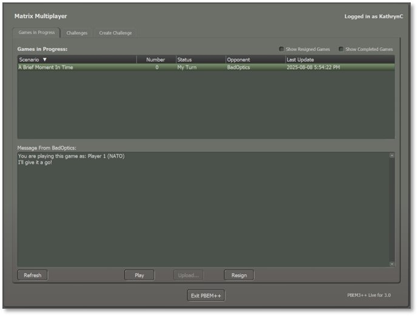
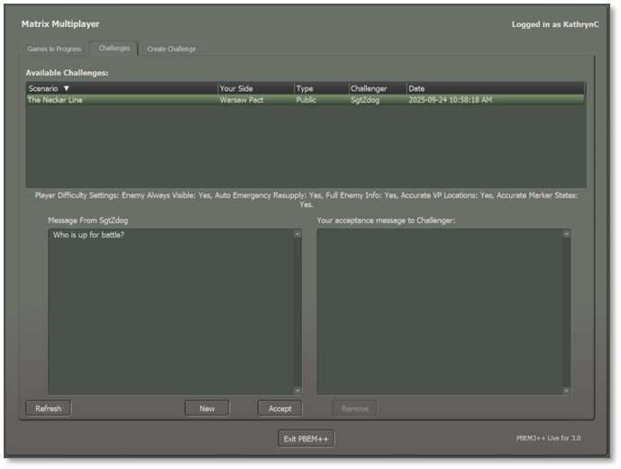
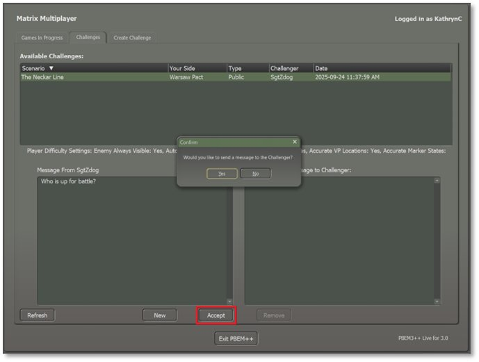
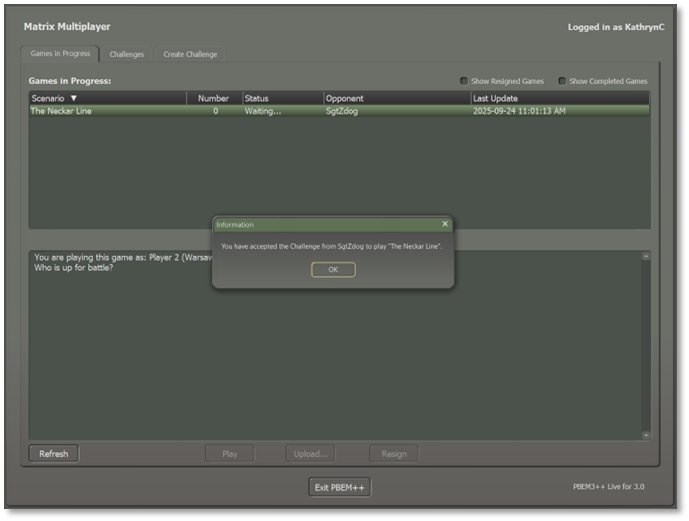

# Start a Multiplayer Game

PBEM++ Multiplayer is a more advanced and user-friendly way to do the standard play by email game. In this case, games are sent back and forth automatically via Matrix servers at Slitherine Games as you finish turns. The game file resides on the Matrix server so you can log in to your account from any computer and pick up your games with friends.

## Log In to an Existing Multiplayer Account

Log in using an established Matrix/Slitherine account. Make sure Log In to Existing Account is selected as shown below.

Enter your existing UserID.

Then enter your Password. Clicking the Show button reveals your password to verify it if you need to.

Email for Registration will be grayed out if you are logging into an existing account.

Check the Remember Password box to auto-populate your information on the next login.

If you wish to help with game data analytics, click the Share Anonymized Game Data for Research Purposes.

Click the Log In button and the following message will appear while the game contacts the servers and loads the game.

## Registering for New Multiplayer Account

To create a new Matrix/Slitherine PBEM++ Multiplayer account, select the Register New Account option and enter a UserID (alphanumeric with no spaces), Password (something you will remember), and valid Email address.

If you want the game to remember your PBEM++ password the next time you load the game, check the box next to Remember Password.

Once finished, click the Register button. It may take a few moments to send the information to the servers. You will be presented with the PBEM++ Game Lobby if this is successful. If there is an error, a dialog will pop up with information that you can use to contact Matrix support to see if they can resolve the problem.

**NOTE:** If you already have a Matrix/Slitherine account, please use that as your login. To make a new account for PBEM++, you must have an unregistered email available to use.

## The Multiplayer Game Lobby

After logging into the PBEM++ Multiplayer system and the server has validated your credentials, you are placed into the Flashpoint Campaigns game lobby. Here, there are options to either continue a Game in Progress, pick a new Challenge, or start a Challenge of your own.

### Games in Progress

This tab shows all the games ready for you to continue along with game details, the option to Play the game and set up your turn on the server, Upload a locally saved game turn that is already ready for your opponent to play (such as if the automatic game upload had failed on rare occasions), or Resign from a game.

The top window shows all the Games in Progress you are currently playing with others. This information includes the Scenario being played, turn Number, Status, Opponent being played against, and the date of the Last Update for the game.

The bottom window shows any Messages for the currently selected PBEM++ game in the top window.

Check the Show Completed Games box near the top right-hand corner to see all games you have finished already.

Check the Show Resigned Games box to see all games you have previously resigned from.

Click the Refresh button to update all games from the server on demand.

### Challenges

This tab shows any games ready to be played with another player.

The top window shows all the Challenge information. This includes the Scenario name, the Side you will play, the Type of game (Public or Private), who the Challenger is, and the Date the Challenge was issued.

The Type can be one of two choices: Public and Private. Anyone can accept a Public Challenge and play the game. Private Challenges are those created by a player and have a password. To accept the Challenge, you need to know the password. These types of Challenges are usually between friends and are set up so the other player can access the game.

Click the Accept button after selecting a Challenge. You will be offered a chance to send a message to your opponent before the action starts as seen below.

Whether or not you send a message, the next dialog shown below will appear stating you have accepted the Challenge and moves you to the Games in Progress tab.

Hit OK to start the game and set up for the first turn.

### Creating a Challenge

To start a new Challenge for someone to play against you, select the New button at the bottom of the Challenges tab.

Perform the following actions to issue a new Challenge, as shown in the image below.

- Click the Scenario button to open the Scenario Selection dialog (see Section 4.1 above for details on this dialog).

- Choose a scenario to play and click Proceed.

- Select which Side your challenger will play, NATO or the Warsaw Pact.

- If you wish to play with a friend instead of issuing a Challenge that is open to anyone, place a password in the Optional Password field. You will need to give this password to your friend for them to accept the Challenge and start playing. This will show up as a Private Challenge in the Challenges lobby. Do not place the password in the Comments box as this is visible to everyone.

- Place a message in the Your Comments box if desired (don’t enter a private Challenge password). This can be info on the scenario, a friendly greeting, or any other relevant information.

- Check the Share Account Email Address With Opponent After Challenge Accepted box to share your PBEM++ email address with the opponent who accepts your Challenge.

- Set the Difficulty Settings to be used in the scenario Challenge. Refer to Section 4.3 above for details on these settings.

- Then click Upload the Challenge to pass the information on to the PBEM++ server, where it will show up in the Challenges tab.

## Recovering a Dropped PBEM++ Game

If there is a dropped connection to the PBEM++ Multiplayer servers, the following dialog appears when trying to upload your game turn. It notes the name of the file created and where it is located to retrieve it again.

The game engine will create a save file that you can recover from a failed upload that allows you to retry when the servers are back online. Click the Upload button on the Games in Progress screen, then select the file you wish to resend to the server.

