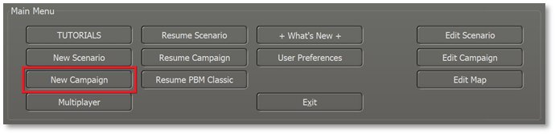
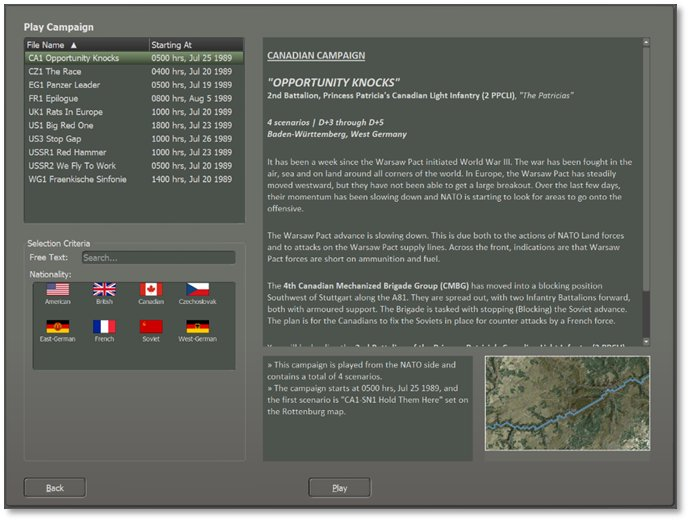
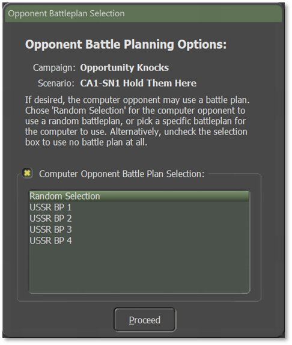

# Start a New Campaign

A campaign is a sequence of scenarios from one nation’s perspective where the result of one scenario may influence the subsequent scenario. The player will be able to carry over core forces from scenario to scenario. This means that campaign scenarios might play out very differently from single scenarios because it is of vital importance to preserve your forces as you try to win your part of the war.

To start a new campaign, click on the New Campaign button in the Main Menu.

## Campaign Selection Dialog

This launches the Campaign Selection dialog, as seen below. Review the campaigns that are available in the module in the list on the left. Click a campaign to show an overview in the right-side text box so you can get an idea of the overall mission and historical context of the campaign.

## Difficulty Settings and Battle Plan

After selecting the campaign, you are sent to the Difficulty Settings dialog. The settings here are covered in Section 4.3 above.

After hitting Proceed, select the enemy Battle Plan that will be used in the first scenario of the campaign as seen below.

Hit Proceed to finish loading the selected campaign and launch the Announcement Screen for the first scenario, which gives you the Mission Overview (click anywhere in the dialog to disable the timer countdown if using this option). Head to Section 9 below to see information on all the User Interface (UI) elements in detail.

For a walkthrough on playing a campaign, see Section 31 below.