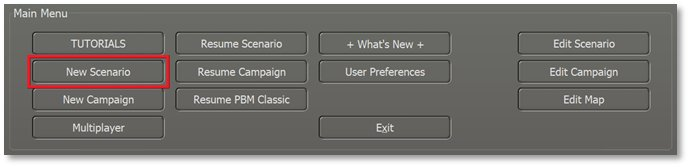
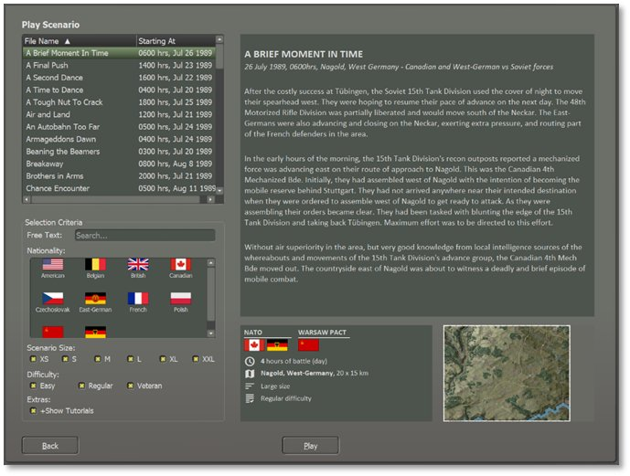
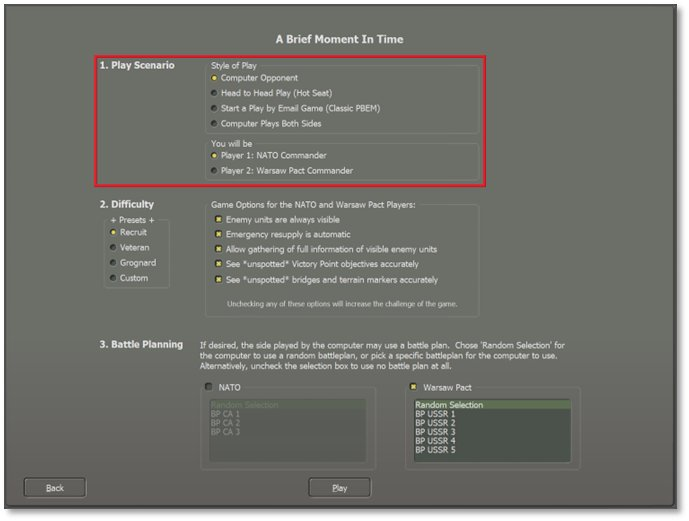
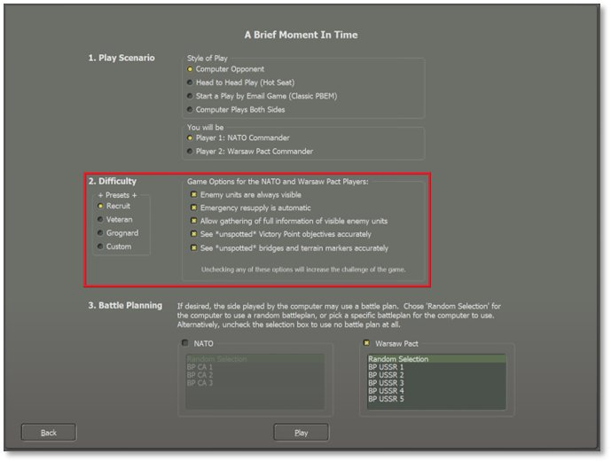
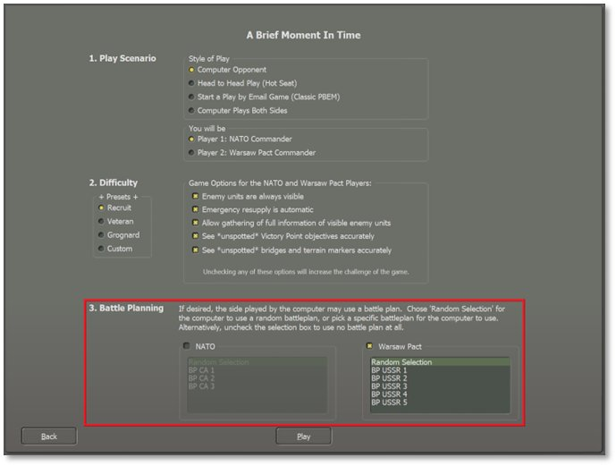
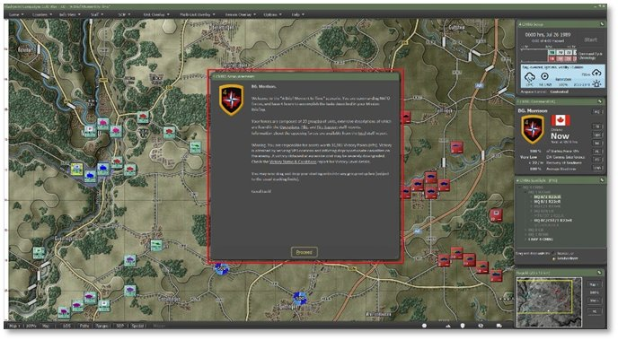

# Start a New Scenario

To start a new scenario, click on the New Scenario button in the Main Menu to access the list of options available.

## Scenario Selection Dialog

Selecting New Scenario launches the Scenario Selection dialog pictured below. Here you can review all the scenarios that are available in the module. Selecting a scenario by clicking on it also shows a description of the scenario’s meta-data details, including the map, forces, and overall size of the selected scenario. Lastly, you can read the Scenario Summary to get an idea of the mission and historical context of the battle.

Underneath the scenario selection list is a Selection Criteria panel where you can search for a scenario by entering names or other scenario details in the text box.

Below the search box are flags of all the nations in the current module. Clicking on them filters the scenario list to include only the selected nations.

There is also the option to filter the list by the size of the scenario based on total units. Check any or all boxes to set the list (filtered or otherwise) to your preferences.

Click Play to load the scenario setup options.

## Play Mode Selections

The next step for starting a new scenario is deciding how the game will be played and what side, if any, you will play as the player.

### Play Style

Currently, the game system offers four styles of play to choose from:

- **Computer Opponent –** Play against our AI using either a random or set Battle Plan (See Section 4.4 below).

- **Head-to-Head Play (Hot Seat) –** Play against another human on the same computer in hot seat mode, taking turns issuing orders and then watching the resolution phase together.

- **Start a Play by Email Game (Classic PBEM)** –Play against another human using the Classic Play by Email system (PBEM Classic) where you send the game file to your opponent via email or, these days, a cloud service. See Section 7 below for more details.

- **Computer Plays Both Sides** – The computer AI plays both sides and uses a Battle Plan, if set, to fight out the scenario.

### Which Commander Will You Be

The second selection will determine which side you will command in a human-played game style.

- **Player 1: NATO Commander –** Play as an American, Canadian, French, or West German commander.

- **Player 2: Warsaw Pact Commander –** Play as a Czechoslovakian, East-German, or Soviet Commander.

## Difficulty Settings

While most games have difficulty settings that make the game easier to win by raising and lowering various values, this game does not do that. There are a few adjustments to make things easier to learn the game and in that way the game is “easier” to play, but is not necessarily easier to win. No gameplay values are modified so if tank A shoots and can kill tank B, this will always be the case regardless of these settings.

Winning the scenario requires having more Victory Points (VPs) for your forces than your enemy has for theirs at the end of battle (see Section 15.1.2 below for victory information). VPs are fixed values in that subunits, VP locations, and bonuses are all worth specific numbers of VPs and there are no settings to change these.

What can be changed, however, is how much information you have available to you to make strategic decisions, and whether certain helpful actions are automated. Allowing more data about enemy forces to be visible reduces the difficulty of winning by facilitating more informed decision-making about preserving and gaining VPs. Reducing the amount of data that is visible increases the difficulty of winning by relying more on your analyzing, predicting, and problem-solving skills to preserve and gain VPs instead which can also be very gratifying.

New players may wish to review Section 32 below for designers’ notes and thoughts on strategizing for the Cold War.

### Presets

There are three presets to select different groups of pre-set difficulty options. The Custom option will be selected automatically if you change any settings. These are saved and active on reloading.

- **Recruit** – Set this if you are new to the game system to turn on all options to make learning the game easier.

- **Veteran** – Set this if you are familiar with our game system and want more of a challenge.

- **Grognard** – The ultimate in realism. No options are set. Good hunting!

- **Custom** – Set your options to play the game the way you want.

### Game Options for Players

There are three settings that you can adjust for each side of the game. These change how you see various forms of information in the game. Checked options make gameplay easier for the player without altering how Victory Points are won. For information on Spotting enemy units, See Section 24.1 below.

- **Enemy Units are Always Visible** – When checked, this is a potent option as you will always see all enemies on the map. Combat still requires the units to “see” the enemy, but you do not need to locate hidden enemies by recon or fire. When unchecked, units must use their sensors to Spot enemy units and take time to identify them before they will be displayed on the game map.

**NOTE:** If checked, units that are Spotted have a tiny white spotting dot on the bottom edge of the counter towards the right. These dots will not be shown if unchecked.

- **Emergency Resupply is Automatic** – When checked, this setting allows units with low Ammo to resupply an amount of ammunition even if it is moving or fighting at the time. Unit orders do not affect or prevent emergency resupply. This option may help new players to relieve some of the strategic difficulty of the game without altering how Victory Points are won. When unchecked, you as the commander must monitor levels and order units to Rest and Resupply, and set Resupply parameters (see Section 21.2 below for issuing orders and Section 23 below the SOP settings) in order for resupply to take place.

- **Allow Gathering of Full Information of Visible Enemy Units** – When checked, the player gets detailed information on a unit by right-clicking and seeing a read-only version of the enemy unit’s Subunit Inspector (see Section 14.3 below). It is also possible to right-click and see some unit overlays from the Show menu item (see Section 11.6 below for unit overlays).

**NOTE:** Experienced players should unselect this option as it gives away too much information on the enemy and its units.

### Fog of War for Map Markers

- **See “Unspotted” Victory Point (VP) Objectives Accurately** – When checked, this setting provides perfect information on the markers. This means that if a hostile unit seizes a VP location, that information appears immediately on the map. When unchecked, the map won't reveal hostile-triggered VP ownership changes until your units have Line of Sight to them (see Section 11.6.1 below for Line of Sight information). Friendly-triggered changes are visible.

- **See “Unspotted” Bridges and Terrain Markers Accurately** – When checked, this setting provides perfect information on the markers. Details about a bridge built by a hostile unit appear immediately on the map. When unchecked, the map won't reveal hostile-triggered marker changes (like bridges or obstacles) until your units have Line of Sight to them (see Section 11.6.1 below for details). Friendly-triggered changes are visible.

## Battle Planning

In the final section, set the AI Battle Plan or have it randomly determined to add to the unknown nature of the enemy’s locations and travel routes at the start of the scenario. Some scenarios may not have a Battle Plan, and the selection box will be grayed out.

Additional Battle Plans can be added to scenarios to increase the replayability of a given scenario further.

Hit Play to load the selected scenario.

## Scenario Load and Announcements

At this point the selected scenario loads and the Announcement Screen provides the Mission Overview (click anywhere in the dialog to disable the timer countdown if using this option). Head to Section 9 below to see information on all the User Interface (UI) elements in detail.

