# Starting a PBEM Classic Game

This is the classic play-by-email mode. Players will play through a scenario by playing turns and submitting them via email or a file-sharing service like Dropbox to each other.

## Getting Started

At the Main Menu, select Start New: Scenario. Then select a scenario that you wish to play with your opponent and click Proceed. In the following dialog (below), select the Start a Play by Email Game (Classic PBEM). Next, choose which side you will command in the scenario and click the Proceed button.

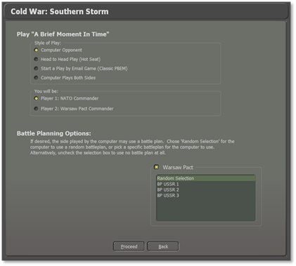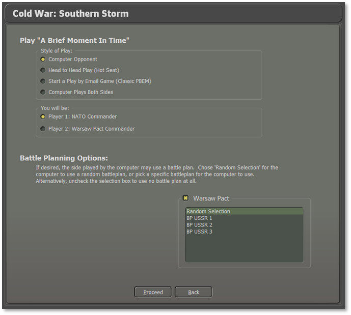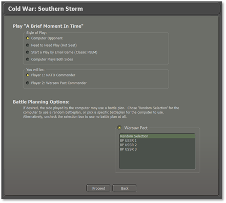

## Difficulty Settings

In the next screen, select the Difficulty Settings (refer to Section 4.4 above) to be used for the scenario and click the Proceed button.

## Set the Initial Orders

The scenario will load, and you will see the game interface (Refer to Section 8 below for details on the interface). Next, issue initial orders for your forces and click the Start button. You will get the following dialog alerting you that your opponent needs to do initial orders.

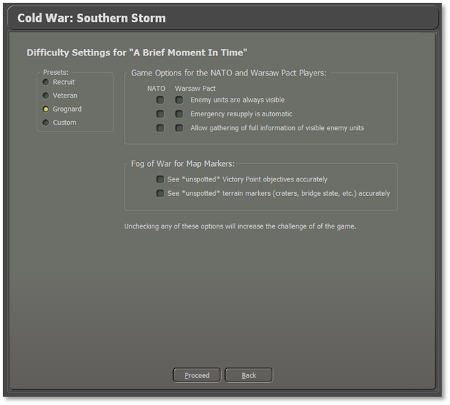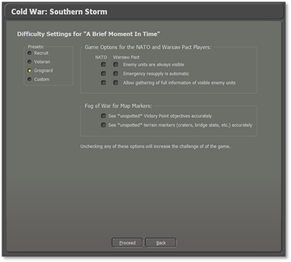

Click Proceed, and you will get the following dialog to enter information for the Classic PBEM file.

## Play by Email Parameters

The following items are displayed, and some require inputs:

- **Game Name**: This is the scenario name. You can edit this name, and it will automatically change the File Name.

- **Password**: You can add a password to the file for extra security. Please make sure your opponent knows it to open the supplied game file.

- **Increment File**: Check this box to add a “00X” number to the filename to keep a better track of game turns.

- **File Name**: This is automatically generated from the Game Name and increment (if selected).

- **PBEM File Destination Directory**: This is the folder on your computer where the generated Play By Email (\*.PBM) files will be placed. You can change the folder location by clicking on the Folder icon on the right of the panel.

- **Game Text Message**: You can write a short message for your opponent in the bottom window that will be displayed to them at the start of their game turn.

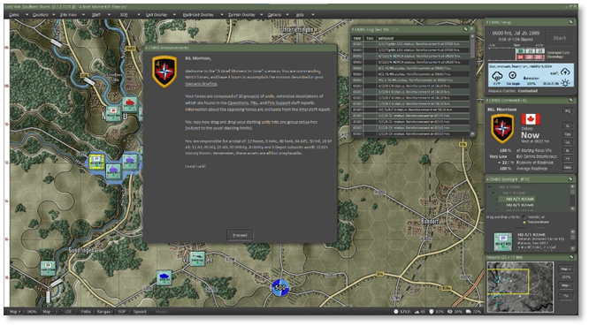

Click the send button to save the game file.

## Upload Notice and Exit

Next, you will see the following notice. Click Proceed when you are done reading it.

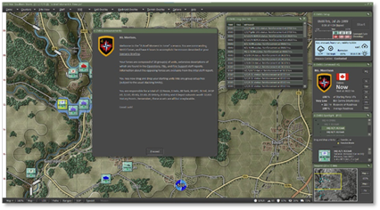

Next, you will see the following message, and you can Exit the game or go back to the Main Menu and start another game from the game’s Main Menu. Clicking Proceed will close the dialog.

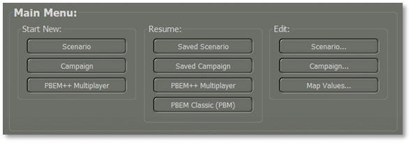

## Recovering a Dropped PBEM++ Game

If there is a dropped connection to the PBEM++ servers, the game engine will create a save file that allows you to retry a load back to the server later when the servers are online.

The following dialog will show if the connection drops when trying to upload your game turn. It notes the name of the file created and where it is located.

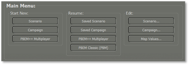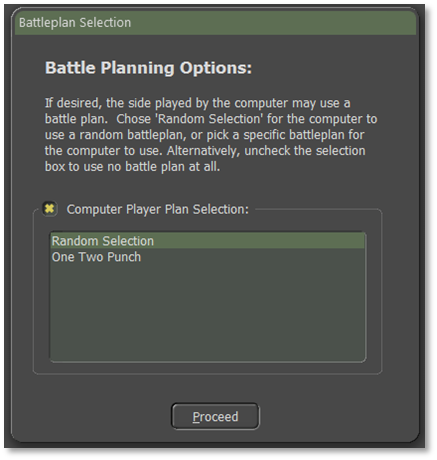

If there was a loss of connection to the server, once you Resume a PBEM++ game, the following dialog will be shown, offering you the chance to recover a failed upload.

Select the file you want to resend to the server and click Upload.

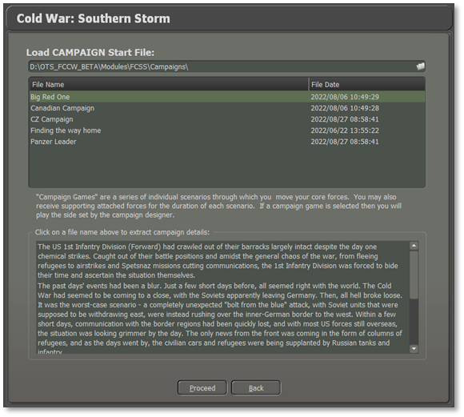

