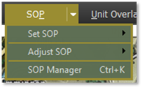
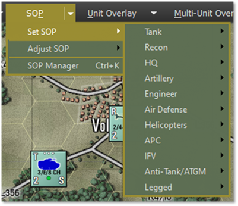

# Status Bar

At the bottom of the game screen is the Status Bar. This bar has two areas with different functions and information.

In the blank area between the two status zones, information about the selected unit and overlay(s) in use is displayed.

## Speed Buttons

The left side of the Status Bar has several Speed Buttons that perform various game functions.

- **Map + and Map - -** These speed buttons are used to zoom the map in or out, and the percentage of zoom is shown between these speed buttons.

- **LOS –** This speed button turns on the Line of Sight (LOS) overlay for the selected unit, or a shift selected hex.

- **Paths –** This speed button toggles on or off all the movement paths for your units if set.

- **Ranges –** This speed button draws in the range rings for Spottable, Weapon Ranges, and Spotting range for the selected unit. If the unit is an HQ, then the command range will be shown as well.

- **SOP –** This speed button draws the selected unit’s SOP-related range rings showing Stand-Off range and Weapon Firing range settings.

- **Special –** This speed button will toggle off or back on the last overlay not covered by any of the other speed buttons on the status bar.

- **Mission –** This speed button toggles on and off any custom or loaded Mission Graphic for the scenario.

## Hex Information

The right side of the Status Bar has five symbols and numeric information for the hex the mouse cursor is in.

- **Hex Icon** – this is the ID number of the selected hex.

- **Mountain Icon** – This is the elevation of the selected hex, with 00 being water/ground level and going up from there.

- **Shield Icon** – This is the percentage of cover the hex provides units in it. Higher is more cover.

- **No Eye Icon** – This is the concealment capability of the hex selected. Higher numbers make it harder to be spotted.

- **Truck Icon** – This is the mobility rating for the selected hex. The higher the number, the quicker units can move through the hex.

