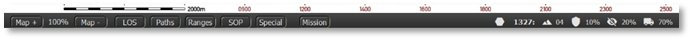
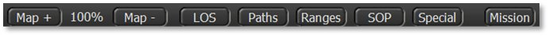
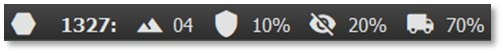

# Status Bar

At the bottom of the game screen is the Status Bar. This bar has two areas with different functions and information and are looked at in turn.

In the blank area between the two status zones, the name of the selected unit and any active overlay(s) in use are displayed. This information appears whether the overlay is activated via speed buttons, menu items, or hotkeys.

## Speed Buttons

The left side of the Status Bar has several speed buttons that perform various game functions.

- **Map + and Map** - – Zooms the map in or out. The percentage of current zoom is shown between these buttons.

- **LOS –** Toggles the Line of Sight (LOS) overlay on and off for the selected unit or a ***Shift***-selected hex (see Section 11.6.1 above).

- **Paths –** Toggles All Movement Paths on and off for your units (see Section 11.7.1 above).

- **Ranges –** Toggles the range rings on and off for a few features depending on the unit selected, such as Spotting, Spottable, weapons’ Max and Effective ranges, and if the unit is a headquarters, then the Command range overlay (see Section 11.7.7 above) is shown as well.

- **SOP –** Toggles the selected unit’s SOP-related range rings on or off, showing Stand-Off range and Weapon Firing range areas (see Section 11.6.3 above).

- **Special –** Toggles on and off the last overlay used that is not covered by any of the other speed buttons on the status bar.

- **Mission –** Toggles on and off any custom or loaded Mission Graphic for the scenario (see Section 11.4 above).

## Hex Information

The right side of the Status Bar shows five symbols with numeric values about the hex under which the mouse cursor is hovering.

- **Hex Icon** – The ID number of the hex. It is the sum of the two map edge coordinate values. As a shortcut, the first two digits also correspond with the east-west (horizontal) grid coordinates, while the last two digits correspond to the north-south (vertical) grid coordinates.

- **Mountain Icon** – The Elevation of the hex, with 00 being water/ground level and going up from there (see Section 11.8.2 above).

- **Shield Icon** – The percentage of Cover in the hex, from 0-99%. Higher values are more Cover (see Section 11.8.3 above ).

- **No Eye Icon** – The Concealment capability of the hex, from 0-99%. Higher numbers make it harder to be Spotted (see Section 11.8.4 above).

- **Truck Icon** – The Mobility rating for the hex, from 0-99%. Higher numbers make for quicker movement (see Section 11.8.5 above).