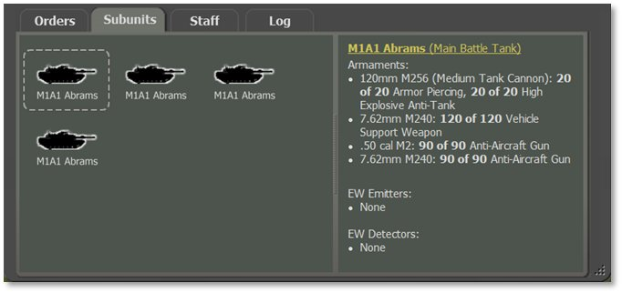
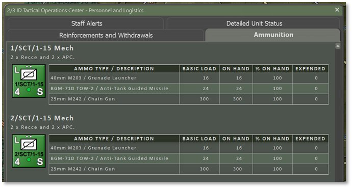

# Supply and Logistics

Supply is the “Achilles’ heel” (i.e., weakness or mechanism of downfall) of all modern armies. It is burned at a ferocious pace during operations and commanding officers are constantly mindful of “topping off” or replenishing their units. Given the basic scale and duration of the game, ammunition is likely to be far more of a limiting factor than fuel, rations, or other forms of supply.

The lesson of the 1973 Arab-Israeli war was that ammo gets used up far faster than expected; rates of five times greater than expected were not unheard of. It is an essential part of the command dilemma to be able to ration it out effectively.

In game terms, resupply is presumed to occur whenever a unit receives Resupply orders and there is a lull in the action so supply trucks and other vehicles can come forward and provide ammo and fuel to combat vehicles in place (see Section 4.3.2 above for setting Automatic Emergency Resupply during game setup and Section 27.4 below for fuel information). Alternatively, individual vehicles can drive a short distance to the rear to resupply and then return to their original location.

As stated earlier, units must be clear of enemy units and combat in order to resupply. Units within the command radius of their HQ can get fully resupplied on Ammo and gain more Readiness and Morale recovery. Units outside of the command radius get a small percentage of Ammo replacement and gain minor improvements in Readiness and Morale.

## Ammo Loadouts

One of the new features of the game is tracking ammunition by type and down to a single round for most weapon systems.

Where this new system is apparent is with gun systems that use different munitions and rocket pods. Other weapons will be converted over to having munition options as required in the future.

Ammo loadouts are set by the scenario designer for each unit and those munitions are used by subunits based on the combat situation and the available rounds during battle.

The ammunition available for a unit and its subunits are noted in a few places. It can be viewed in the Subunits tab of the Dashboard for each subunit (see Section 14.2.3 above) and on the Ammunition tab in the Personnel and Logistic Staff Report for the entire unit (see Section 15.5.4 above). See images below. More detail is shown in the Ammunition tab which provides the number of rounds expended up to that current point of time in the battle.

For indirect fire units, the Fire Support Assets tab in the Fire Support Staff Report (see Section 15.4.1 above) also notes the total load of munitions for the units.

## Resupply

Units ordered to Rest and Resupply will re-equip ammunition levels to the amount specified under % Supply in the Recover Supply and Readiness dialog (see Section 21.2 above). Resupplying to 100% places the units back at full ammunition based on the scenario designer’s loadout levels. For faster return to battle, set a lower value for % Supply to procure only enough Ammo to keep the unit going until a later resupply. The length of the recovery period (in minutes) will adjust to be longer or shorter based on the assigned % Supply value to suit the amount of work that needs to take place.

Resupply only takes place if the unit is not in combat. Units with Rest and Resupply orders will receive supply trucks and other vehicles that meet them in place during lulls in battle, or units may drive to the rear if close enough and then promptly return to their original location. Aircraft and helicopters return to base to rearm and refuel.

See also Section 23.8 above for information on the Rest & Resupply SOP settings.

## Automatic Emergency Resupply

If the setting for Emergency Resupply is Automatic was selected in Game Options during scenario or campaign setup (see Section 4.3.2 above), then any unit that runs out of ammunition is automatically restored to 30% Ammo if it falls below 5%. Unit orders do not affect or prevent emergency resupply in this case and the unit will resupply even if it is moving or fighting at the time.This option may help new players to relieve some of the strategic difficulty of the game without altering how Victory Points are won.

## Why No Fuel Tracking?

Given the short time and relatively short distances covered in the game, we assume there is enough fuel for operations on the map to take place. When units are resupplied for ammunition and to recover Readiness and Morale, we assume fuel tanks are topped off as well. We may take a more detailed approach to fuel tracking in the future, but for now, it sits beyond trackable concern compared to the other factors covered.