# The Game Map

All the action in the game takes place on beautifully rendered maps of real-world terrain. Each hex represents 500 meters of distance, hex face too hex face. The map shows terrain elevations, terrain types, roads, rails, and map markers. Knowing the effects of these elements is critical for success on the battlefield.

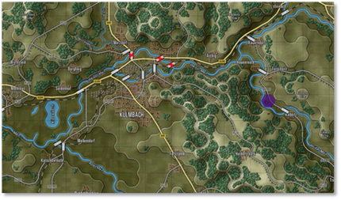

## Moving the Map

There are a few ways to move around the map during the game and they are as follows:

- Map scrolling by placing the mouse cursor near a map or program edge. This is defined in Game Options.

- You can left-click and drag any non-unit part of the map to a new position on the screen in real time. Clicking a unit will highlight the unit.

- You can click the Mini Map and center the game map to the chosen location based on the zoom level.

## Zooming the Map

There are a few ways to zoom the map during the game and they are as follows:

- Rolling a mouse wheel will zoom the map in and out by the set increments if your mouse is equipped as such. There is a setting in the game option to reverse the direction of the zoom function.

- You can click the Mini Map (+) and (–) buttons. The Fit button will zoom the map out so the whole map is visible on the screen.

- You can go to the Options menu select the Map Zoom Option item and select a Zoom from the menu.

## Flyout Panel/Unit Hint

The Flyout Menu activates if you hover the mouse cursor over a stack of units or a hex on the map. The Flyout menu appears after a second or so showing you the terrain under the counters or markers, any significant markers like VP markers, bridges, mines, or obstacles, and each of the counters present in the stack. At the bottom of the Flyout menu, you also get the hex location (column/row), hex elevation, cover, concealment, and mobility values.

Beyond helping see stacked units, you can right-click on units in the Flyout dialog to issue orders and even shift-click units to group select them.

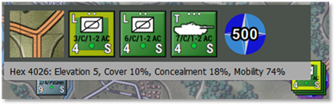

## Elevations

On the game map, you will notice that the ground is colored differently based on its elevation. The more elevated the terrain is, the lighter the basic green color will be. Elevated sections of the terrain are outlined in a visible shaded edge.

You can also check the hex elevation by hovering on the tile and seeing the information on the Flyout or in the Status Bar at the bottom right of the screen or going to the Terrain Overlay menu and selecting Elevation Values.

Placing units on higher terrain will provide them with a better line of sight.

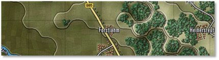

## Terrain

The map is made up of various terrain elements applied over the elevations.

Each type of terrain has mobility, concealment, and cover values that impact spotting, combat, and movement in various ways. The values are set in the Map Values Editor for each map used in the game.

- 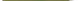**Clear** – A few small elements are visible on the elevation art. These tiles are not really “clear”, as they have a small number of rolling hills, some trees, fields, and buildings. These elements have a small amount of cover and concealment capability.

- **Fields** – Cultivated farm fields. Relatively flat solid terrain (in the summer and if it is not raining). One of the more numerous terrain types in central Europe. Fields do provide some concealment with the crops during the growing seasons.

- 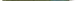**Forest/Orchards** – Lots of trees of various types cut with the occasional path, trail, or road. Not so thick that driving over them is prohibited. Orchards show smaller trees in nicely spaced rows. Trees can also be found along many country roads.

- **Rural** – Houses and small buildings found in villages and towns. These built-up areas provide good cover and concealment and decent mobility with many roads. They also provide good ambush sites for infantry against armored vehicles. They are depicted as orange squares, some trees, and minor roads.

- **Urban** – Larger government buildings, shops, and apartment complexes. These built-up areas provide good cover and concealment and decent mobility with many roads. Also, provide good ambush sites for infantry against armored vehicles. They are depicted as brown squares, a few trees, and some roads.

- 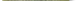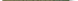**Industrial** – Factories and warehouses. These built-up areas provide good cover and concealment and decent mobility with many roads. They also provide good ambush sites for infantry against armored vehicles. They are depicted as gray squares, occasional trees, and roads.

- **Named Landmarks** – On several maps, there are some named landmarks like airfields, depots, or hills with heights. These are cosmetic but informational.

## Roads

The map has a few types of major road networks represented for use in the game.

Each type of road provides improved mobility through the various types of terrain found on the map.

- **Road** – These are basic two-lane country roads paved and in decent condition. These roads provide a suitable means of movement for forces through the various terrain on the map. Roads are shown as gray lines with a black border.

- **Highway** – These are multilane roads paved and in good condition for heavy traffic. These roads provide a reasonable means of movement for forces through the various terrain on the map. Highways are shown as wide yellow lines with a black border.

- 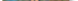**Autobahn** – These are modern very wide multilane roads built to allow fast movement of traffic and military vehicles. These roads provide an excellent means of movement for forces through the various terrain on the map. Autobahns are shown as double orange lines with black borders.

## Railroads

- 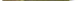**Railroad** – While we do not have trains or move things by rail in the game, we do show railways as alternating black and light gray lines on the map. Rail bridges are also shown on the maps and can, in a pinch, be used to cross units over water.

## Water Obstacles

The map has a few types of water obstacles that can hamper the movement of military units across the map. There are different means to cross these obstacles.

- 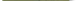**Stream** – These waterways are small, narrow, and shallow. With a bit of prep time units can cross these without the aid of bridges or engineering bridges.

- **Minor River** – These waterways are wide enough and deep enough to require a bridge (road or engineering) or amphibious vehicles to cross (with some prep time). Most of these will be names on the map.

- **Major River** – These waterways are vast and deep and must be crossed by bridge (in this case shown by two bridge markers) or swam at slow speeds by amphibious capable vehicles. Most of these major rivers will have names on the map.

- 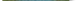**Lakes** – Lakes and ponds are various sizes of enclosed water obstacles. The only means of crossing these obstacles is an engineering bridge or two or amphibious units that can slowly swim across to the other side. In most cases, going around them is the better plan.

## Bridges

As noted in the section above, the primary way to cross rivers and streams is to use a bridge. These markers are shown on the map as wide light gray/white semi-transparent rectangles with black edges, and they are placed on the map across water obstacles and meet up with the ends of roads.

- Road and Rail bridges both use the same marker.

- A Blown bridge is denoted with a red cross over it. Bridges can be in a blown state as part of the scenario design or can be blown with engineering units during a scenario.

- Specific engineering units can place temporary bridges across water obstacles. These bridges are colored blue for NATO-owned and red for Warsaw Pact-owned bridges.

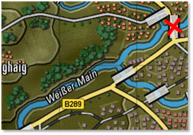

## Map Markers – Full Hex

Full hex map markers apply their effects on the entire hex and any units within. The color shows ownership. Red for Player one and Blue for Player two. Unowned markers are in yellow.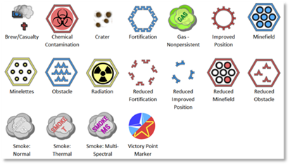

- **Brew/Casualty Kill Markers** – A small blue (Player 1) or red (Player 2) smoking tanks or crosses showing where a subunit vehicle/squad was destroyed or fell out.

- **Chemical Contamination** – The hex at this location is contaminated with persistent chemicals. Units can suffer losses if they move through these areas and become contaminated.

- **Crater** – A small image showing the impact point of a barrage or air strike. Craters cause a slight movement penalty in the hex.

- **Fortification** – A purposely built defensive structure made to protect forces from enemy fire. Units can screen or hold in them to gain a significant protection advantage. Not currently in the game.

- **Gas Cloud (Nonpersistent)** – The hex contains a non-persistent chemical cloud. Units entering run the risk of losing subunits. These clouds will dissipate over time and pose no lingering threat.

- **Improved Position (IP)** – An engineered defensive position that provides additional protection to units in them.

- **Minefield** – A mixed anti-tank/anti-personnel minefield that attacks all who enter the location particularly those who do not know it is there. Engineering units can clear lanes in these fields for safe movement.

- **Obstacle** – An engineered barrier that obstructs the movement of forces leading to movement delays. Engineering units can clear lanes in these fields for safe movement.

- **Radiation Contamination** – The hex is littered with highly radioactive debris and fallout after a nuclear strike. Entering these can cause losses to subunits based on the NBC protection level of the units passing through. Units moving through become contaminated and must be “cleaned” when out of the hazardous terrain.

- **Reduced Fortification** – Marker shows a Fortification that has been damaged by engineers or combat and is no longer able to protect the unit in it. Not currently in the game.

- **Reduced Improved Position (IP)** – The marker shows an Improved Position (IP) that has been damaged by engineers or combat and is no longer able to protect the unit in it.

- **Reduced Minefield** - The marker shows a Minefield that has been cleared by engineers with lanes making it safe to pass through.

- **Reduced Obstacle** – The marker shows an obstacle that has been cleared by engineers with lanes making it safe to pass through.

- **Smoke: Normal** – An obscuring cloud that reduces the visibility into and through it extensively unless a unit is using a thermal sight.

- **Smoke: Thermal** – A thermally obscuring cloud that reduces the visibility into and through it considerably unless a unit is using a radar system for spotting.

- **Smoke: Multi-Spectral** – An obscuring cloud that blocks visual, thermal, and radars from seeing into it and past it.

- **VP Location** – A banner with a point value that is awarded to the owner (blue-Player 1 and red-Player 2) who holds the objective at the end of the game. Unclaimed VP locations are shown with a split NATO/Warsaw Pact symbol. The point values for these locations can be split with different values for each side.

## Map Markers – Hex Edge

Hex Edge Map Markers are placed along the edge of a hex, and the marker's effect only applies when crossing that hex edge. These markers are shown as full on the top of the picture below or reduced at the bottom of the image for each type. The color shows ownership. Red for Player one and Blue for Player two. Unowned markers are in yellow.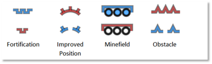

- **Fortification** – A purposely built defensive structure made to protect forces from enemy fire. Units can screen or hold in them to gain a significant protection advantage. A Reduced Fortification has been damaged by engineers or combat and is no longer able to protect units in it. Not currently in the game.

- **Improved Position (IP)** – An engineered defensive position that provides additional protection to units in them. A reduced IP marker shows an Improved Position (IP) that has been damaged by engineers or combat and is no longer able to protect units in it.

- **Minefield** – A mixed anti-tank/anti-personnel minefield that attacks all who enter the location particularly those who do not know it is there. Engineering units can clear lanes in these fields for safe movement. A Reduced Minefield shows that it has been cleared by engineers with lanes making it safe to pass through.

- **Obstacle** – An engineered barrier that obstructs movement leading to movement delays. Engineering units can clear lanes in these fields for safe movement. A Reduced Obstacle shows an obstacle that has been cleared by engineers with lanes making it safe to pass through.

## MCOO Map Legend

The following hatches and lines are found on the Modified Combined Obstacle Overlay (MCOO) and have the following impact on gameplay for ground-based units. These effects do not hamper the movement of air units.

- 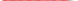**Impassible Terrain** – A terrain with a red cross-hatching is considered impassable by ground units. Units cannot travel into or through this type of terrain. There is no impassible terrain currently in the game.

- 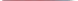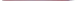**Impassible Hex Edge** – Hex edges shown with a red solid line are impassible to ground forces. This indicates a slope that is at an incline/decline that is too steep for ground units to traverse. This is seen in hexes with multiple elevations at an edge.

- **Slow-Go Terrain** – The terrain with the red hatch is noted as slow-go terrain. This means your ground units will be slowed down as they navigate more restricted lanes of travel. This terrain is mainly seen in forested hexes in the game.

- 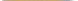**Built-Up Terrain** – Terrain with an orange hatch is built-up areas like villages, towns, and cities. The unit will be a bit slower through these areas. These hexes are also a potential danger for units moving through as cover and concealment for enemies is high in these areas.

- **Open Terrain** – The grey terrain zones are considered open ground. These hexes have a few hills, trees, or buildings, and can be crossed without slowing down. They also show clear lanes of fire and line of sight. These areas are good to avoid if moving into an enemy area and having clear lanes of fire from cover is excellent when defending.

- **Road Network** – The black or dark gray lines show the road network on the map. This terrain will have better movement rates than open ground and also allow for faster travel through any Slow-Go or Built-up terrain.

- 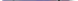**Water Obstacles** – The solid blue lines or blue-filled hexes represent water obstacles that require bridging or units with amphibious capability to cross over them. Other units can cross with road bridges.

## Animated Fire Lines

Flashpoint Campaigns offers two types of fire line animations. The default basic fire lines or direct-fire-based weapon animations. You can turn on the weapon-based effects from the Options menu.

### Classic Fire Lines

These are the fat red/blue (default colors, transparency, and width, which can be changed in the User Preferences dialog) lines from shooter to target.

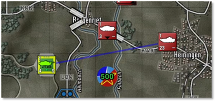

### Main Gun Fire Animation

These are narrow “semi-transparent” straight lines from shooter to target. Fast-moving colored projectile with a thin vapor trail moving from shooter to target. A wide muzzle blast smoke animation at the shooter location.

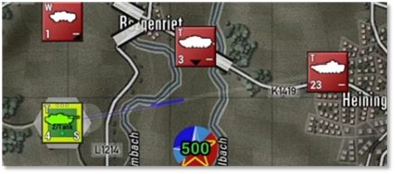

### Autocannon/Machine Gun Animation

These are narrow “semi-transparent” straight-line vapor trails from shooter to target with three short colored projectiles moving from shooter to target. Three narrow muzzle blasts smoke animations at the shooter location.

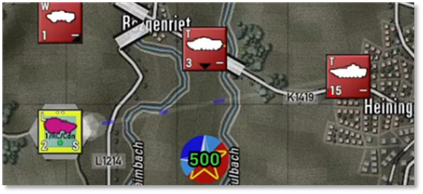

### Anti-Tank Guided Missile Animation

These are wiggly trajectory vapor trails from shooter to target (representing ATGM course corrections) a fat, colored projectile with a bright orange tail (engine), and a vanishing smoke trail. There is a launch blast smoke animation at the shooter location.

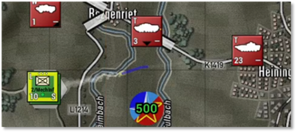

### Surface-to-Air Missile (SAM) Animation

These are hooked trajectory vapor trails from shooter to target (representing off-angle launch followed by tracking) and a fat accelerating color projectile with a persistent smoke trail. There is a launch blast smoke animation at the shooter location.

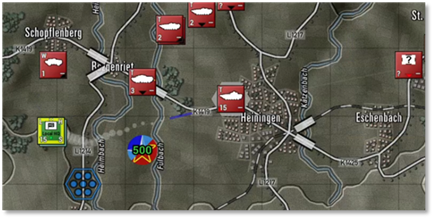

### Fire Line Colors and Scaling

Projectile colors follow User Preferences for Line of Fire colors for both sides. You may want to switch to more tracer-like colors like yellow, orange, or red to brighten up the default colors (brighter is the new default for new installs).

Animation sizes follow map scaling and will scale up and down with changes in zoom levels.

Animation speed follows other animation speeds but is capped at a maximum speed of 10. Reduce animation speed below 10 to slow down fire exchange animations.