# The Game Map

All action in the game takes place on beautifully rendered maps of real-world terrain. Each hex represents 500 meters of distance from hex face to hex face. The map shows terrain elevations, terrain types, roads, rails, and map markers. Knowing the effects of these elements is critical for success on the battlefield.

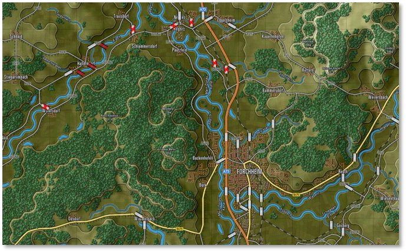

## Moving the Map

There are a few ways to move around the map during the game:

- Scroll the map by placing the mouse cursor near a map or program edge. This is defined in User Preferences under Map Scrolling Parameters ([***F2***], see Section 3.2.1 above).

- Left-click and drag any non-unit part of the map to a new position on the screen in real time. Clicking a unit highlights the counter in a yellow square. Clicking a hex highlights the hex in gray.

- Click the Mini Map to center the game map on the specified location based on the zoom level (see Section 13.4 above).

## Zooming the Map

There are a few ways to zoom the map during the game:

- Roll a mouse wheel to zoom the map in and out by set increments if your mouse is equipped as such. A setting in the User Preferences [***F2***] reverses the direction of the zoom function (see Section 3.1.1 above).

- Click the Mini Map (+) and (–) speed buttons. The Fit button zooms the map out so the whole map is visible on the screen (see Section 13.4 above).

**NOTE:** To take a screen capture of your entire map, it may be more helpful to use the Full Map Screen Capture[***Ctrl+Z***]feature instead. This captures the entire game map and all counters and markers on it with no UI shown and saves in the specified screen capture folder.

- Go to the Options menu to select the Map Zoom Option item and select a Zoom from the menu (see Section 11.9.3 above). Hotkeys for different zoom levels are listed in this submenu (***Ctrl*** + numbers ***0*** through ***9***).

## Flyout Panel/Unit Hint

The Flyout Panel opens from hovering the mouse cursor over a stack of units or a hex on the map. The Flyout Panel appears after a second or so showing the terrain under the counters or markers, any significant markers like Victory Point (VP) locations, bridges, mines, or obstacles, as well as each of the counters present in the stack. At the bottom of the Flyout Panel are the hex location (column/row grid coordinates), Elevation, Cover, Concealment, and Mobility values.

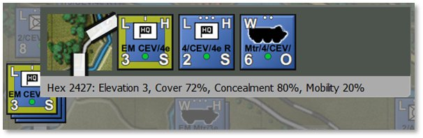

How long it takes to trigger the Flyout Panel can be changed via the Map Mouse Hover Delay setting in the General tab of User Preferences ([***F2***], see Section 3.1.1 above).

Beyond helping to see stacked units, the Flyout Panel facilitates right-clicking on units to issue orders. ***Shift***-click units to group select them (see Section 21.9 below for issuing group orders).

## Elevations

The ground on the game map is shaded differently based on elevation (see also Section 11.8.2 above). The more elevated the terrain, the lighter the basic green color. Elevated sections of the terrain are outlined in a visible shaded edge.

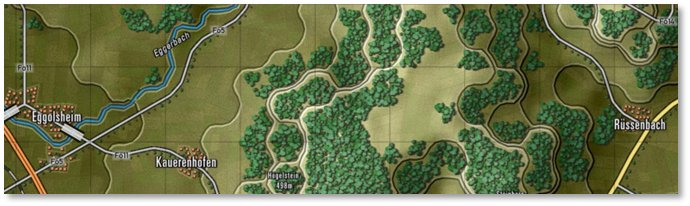

Check the hex elevation by hovering over the tile to open this information in the Flyout Panel (see Section 16.3 above), in the Status Bar at the bottom right of the screen (see Section 12.2 above), or going to the Terrain Overlay menu and selecting Elevation Values (see Section 11.8.2 above).

Placing units on higher terrain provides them with a better Line of Sight (see Section 11.6.1 above).

## Terrain

Each type of terrain has values for Cover (see Section 11.8.3 above), Concealment (Section 11.8.4 above), and Mobility (Section 11.8.5 above) that impact Spotting, combat, and movement in various ways. The values are set in the Map Values Editor for each map used in the game. See Section 11.8 above for more information about other terrain factors.

- 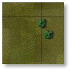**Clear** – A few small elements are visible on the elevation art. These tiles are not really “clear” as they have a small number of rolling hills, trees, fields, and buildings. However, these elements have relatively small amounts of Cover and Concealment capabilities.

- 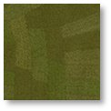**Fields** – Cultivated farm fields. Relatively flat, solid terrain. One of the more numerous terrain types in central Europe. Fields do provide some Concealment with the crops during growing seasons.

- 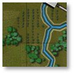**Forest/Orchards** – Lots of trees of various types cut with the occasional path, trail, or road. Not so thick that driving over them is prohibited. Orchards show smaller trees in nicely spaced rows. Trees can also be found along many country roads.

- 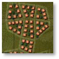**Rural** – Houses and small buildings found in villages and towns. These built-up areas provide good Cover and Concealment, and decent Mobility with many roads. They also provide good ambush sites for infantry against armored vehicles. Depicted as orange squares, some trees, and minor roads.

- 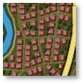**Urban** – Larger government buildings, shops, and apartment complexes. These built-up areas provide good Cover and Concealment, and decent Mobility with many roads. They provide good ambush sites for infantry against armored vehicles. Depicted as red squares, a few trees, and roads.

- 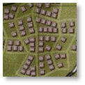**Industrial** – Factories and warehouses. These built-up areas provide good Cover and Concealment, and decent Mobility with many roads. They provide good ambush sites for infantry against armored vehicles. Depicted as brown squares, occasional trees, and roads.

- 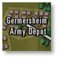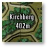 **Named Landmarks** – Maps may have some named landmarks like airfields, depots, or hills with heights. Cosmetic but informational.

## Roads

Each type of road provides improved ease of movement through the various types of terrain found on the map compared to off-road routes. There are a few types of road networks.

- 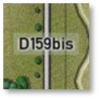**Road** – Basic two-lane country roads that are paved and in decent condition. Roads provide a suitable means of movement for forces through the various terrain on the map. Roads are shown as gray lines with a black border.

- 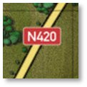**Highway** – Multilane roads, paved and in good condition for heavy traffic. Highways provide a reasonable means of movement for forces through the various terrain on the map. Highways are shown as wide yellow lines with a black border.

- 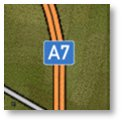**Autobahn** – Modern, very wide multilane roads built to allow fast movement of traffic and military vehicles. Autobahns provide an excellent means of movement for forces through the various terrain on the map. Autobahns are shown as double orange lines with black borders.

## Railroads

- 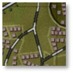**Railroad** – While we do not have trains or move things by rail in the game, railways are shown as alternating black and light gray lines on the map. Rail bridges are also shown on the maps and can, in a pinch, be used to cross units over water.

## Water Obstacles

There are a few types of water obstacles that can hamper the movement of military units across the map. There are different means to cross these obstacles.

- 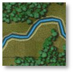**Stream** – Small, narrow, and shallow bodies of water. With a bit of prep time, units can cross streams without the aid of existing bridges nor engineered bridges.

- 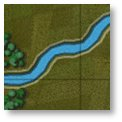**Minor River** – Wide enough and deep enough to require a bridge (road or engineering) or amphibious vehicles to cross (with some prep time). Most minor rivers are named on the map.

- 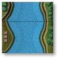**Major River** – Vast and deep bodies of water that must be crossed by bridge (may be shown with two bridge markers) or swam at slow speeds by amphibious-capable vehicles. Most major rivers are named on the map.

- 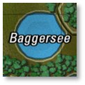**Lakes** – Lakes and ponds are various sizes of enclosed water obstacles. The only means of crossing these obstacles is an engineered bridge or two or amphibious units that can slowly swim across to the other side. In most cases, going around lakes is the better plan.

## Bridges

As noted in the section above, bridges are the primary way to cross rivers and streams. These markers are shown on the map as wide, white/light gray, semi-transparent rectangles with black edges when part of the map. Combat engineers can also place them on the map across water obstacles to meet up with the ends of roads, see **FM03B Tutorial Operations: Intermediate** for more information on using engineers.

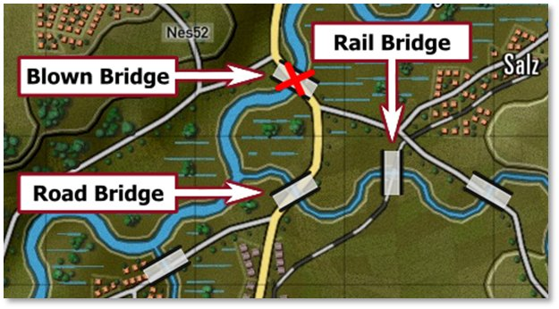

- Road and Rail Bridges both use the same marker.

- A Blown Bridge is marked with a red cross over it, as shown above. Bridges can be in a blown state as part of the scenario design or can be blown with engineering units during a scenario.

- Specific engineering units can place temporary bridges across water obstacles. These bridges are colored blue for NATO-owned and red for Warsaw Pact-owned.

## Map Markers – Full Hex

Full hex map markers apply their effects on the entire hex and any units within. The color shows ownership for some of them, red for Player 1 and blue for Player 2. Un-owned markers are in yellow.

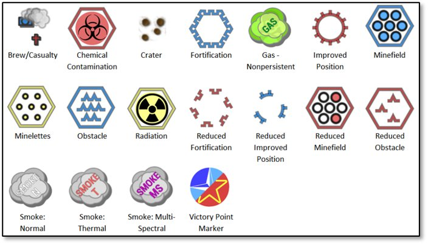

- **Brew/Casualty** – Small blue (Player 1) or red (Player 2) kill markers of smoking tanks or crosses show where a subunit vehicle or squad was destroyed or fell out.

- **Chemical Contamination** – This hex is contaminated with persistent chemicals. Units can suffer losses if they move through these areas and become contaminated.

- **Crater** – A small image shows the impact points of a barrage or air strike. Craters cause a slight Movement penalty in the hex (see Section 11.8.5 above for more on Mobility ratings).

- **Fortification** – A purposely-built defensive structure made to protect forces from enemy fire. Units can Screen or Hold in them to gain a significant protection advantage. Not currently in the game.

- **Gas – Nonpersistent** – This hex contains a non-persistent chemical cloud. Units that enter run the risk of losing subunits. These clouds dissipate over time and pose no lingering threat.

- **Improved Position (IP)** – An engineered defensive position that provides additional protection to units in these hexes.

- **Minefield** – A mixed anti-tank/anti-personnel minefield that attacks all who enter this location, particularly those who do not know it is there. Engineering units can clear lanes in these fields for safe movement (see Section 23.4 below for minefield movement orders).

- **Obstacle** – An engineered barrier that obstructs the movement of forces leading to movement delays. Engineering units can clear lanes in these fields for safe movement.

- **Radiation** – This hex is littered with highly radioactive debris and fallout after a nuclear strike. Entering these hexes can cause losses to subunits based on their NBC (nuclear, chemical, and biological) protection level. Units moving through become contaminated and must be “cleaned” when out of the hazardous terrain by ordering Rest and Resupply.

- **Reduced Fortification** – This shows a fortification that has been damaged by engineers or combat and is no longer able to protect the unit in it. Not currently in the game.

- **Reduced Improved Position (IP)** – This shows an Improved Position (IP) that has been damaged by engineers or combat and is no longer able to protect the unit in it.

- **Reduced Minefield** – This shows a minefield that has been cleared by engineers and has lanes making it safe to pass through.

- **Reduced Obstacle** – This shows an obstacle that has been cleared by engineers and has lanes making it safe to pass through.

- **Smoke: Normal** – An obscuring cloud that extensively reduces the Visibility into and through these hexes unless a unit is using thermal sight.

- **Smoke: Thermal** – A thermally obscuring cloud that considerably reduces the Visibility into and through these hexes unless a unit is using a radar system for Spotting.

- **Smoke: Multi-Spectral** – An obscuring cloud that blocks visual, thermal, and radars from seeing into and past these hexes.

- **VP Location** – A banner with the Victory Point (VP) value that is awarded to the owner who holds the objective at the end of the game (blue: Player 1 and red: Player 2). Unclaimed VP locations are shown with a split blue/red symbol. The point values for these locations can be split with different values for each side.

## Map Markers – Hex Edge

Hex edge map markers are placed along the edge(s) of a hex and the effect only applies when crossing that hex edge. These markers are shown as full-effect in the top row of the image below or reduced-effect in the bottom row for each type of marker. The color shows ownership: red for Player 1 and blue for Player 2. Un-owned markers are in yellow.

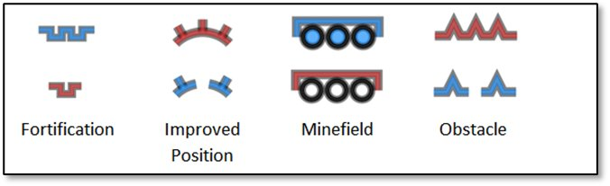

- **Fortification** – A purposely-built defensive structure made to protect forces from enemy fire. Units can Screen or Hold behind these hex edges to gain a significant protection advantage. A Reduced Fortification has been damaged by engineers or combat and is no longer able to protect units in it. Not currently in the game.

- **Improved Position (IP)** – An engineered defensive position that provides additional protection to units behind these hex edges. A reduced IP marker shows an Improved Position (IP) that has been damaged by engineers or combat and is no longer able to protect units behind it.

- **Minefield** – A mixed anti-tank/anti-personnel minefield that attacks all who enter the location, particularly those who do not know it is there. A Reduced Minefield shows that it has been cleared by engineers with lanes making it safe to pass through (see Section 23.4 below for minefield movement orders).

- **Obstacle** – An engineered barrier that obstructs movement leading to movement delays. Engineering units can clear lanes in these fields for safe movement. A Reduced Obstacle shows an obstacle that has been cleared by engineers with lanes making it safe to pass through.

## MCOO Map Legend

The following hatches and lines are found on the Modified Combined Obstacle Overlay (MCOO; pronounced mah-KOO) and have the following effects on gameplay for ground-based units. These effects do not hamper the movement of air units.

The MCOO can be activated by the Terrain Overlay menu bar item (see Section 11.8.1 above) or hitting ***Ctrl+M***.

- 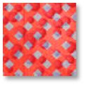**Impassible Terrain** – Terrain with red cross-hatching is considered impassable by ground units. Units cannot travel into or through this type of terrain. There is no impassible terrain currently in the game.

- 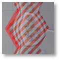**Impassible Hex Edge** – Hex edges shown with a red solid line are impassible to ground forces. This indicates a slope that is at an incline/decline that is too steep for ground units to navigate. This is seen in hexes with multiple elevations at an edge. See Section 11.8.2 above for more on Elevation values.

- 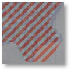**Slow-Go Terrain** – Terrain with a red hatch is noted as slow-go terrain. This means ground units are slowed down as they navigate more restricted lanes of travel. This terrain is mainly seen in forested hexes in the game. See Section 11.8.5 above for more on Mobility ratings.

- 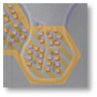**Built-Up Terrain** – Terrain with an orange hatch is built-up with villages, towns, or cities. Units travel a bit slower through these areas. These hexes are also potentially dangerous for units moving through as Cover and Concealment for enemies is high in these areas (see Sections 11.8.3 and 11.8.4 above, respectively).

- 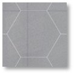**Open Terrain** – Gray zones are considered open ground. These hexes have relatively few hills, trees, or buildings, and can be crossed without slowing down. They also have clear lanes of fire and Lines of Sight (see Section 11.6.1 above). These areas are good to avoid if moving into an enemy area but having clear lanes of fire from Cover is excellent when defending.

- 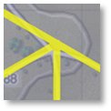**Road Network** – Yellow lines show the road network on the map. This terrain has better movement rates than open ground and also allows for faster travel through any Slow-Go or Built-Up Terrain.

- 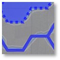**Water Obstacles** – Solid blue lines or blue-filled hexes represent water obstacles that require bridging or units with amphibious capability to cross over them. Other units can cross with road bridges. See Section 16.8 above for information on water obstacles.

## Animated Fire Lines

***Flashpoint Campaigns: Cold War*** offers two types of fire line animations: default basic fire lines or direct-fire-based weapon animations. Toggle these weapon-based effects from the User Preferences menu ([***F2***], see Section 3.3 above).

**NOTE:** In the following images, the counters used are for fire line/animation illustration purposes only and may not reflect the weapons capability of the units shown.

### Classic Fire Lines

These are fat red/blue lines from shooter to target. Default colors, transparency, and width can be changed in User Preferences ([***F2***], see Section 3.3 above3.3.1 above).

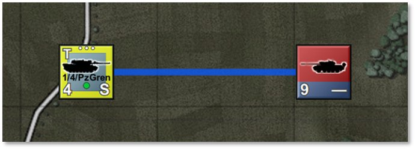

### Main Gun Fire

These are narrow, semi-transparent, straight lines from shooter to target. Main gun fire lines show a fast-moving projectile with a thin vapor trail moving from shooter to target. There is a wide muzzle blast smoke animation at the shooter location.

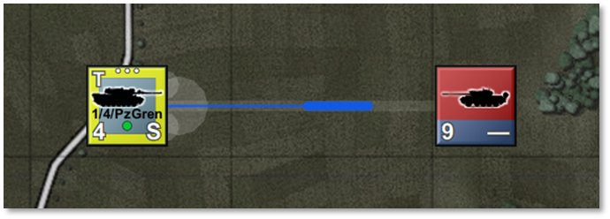

### Autocannon/Machine Gun

These are narrow, semi-transparent, straight-line vapor trails with three short projectiles moving from shooter to target. There are three narrow muzzle blasts and corresponding smoke animations at the shooter location.

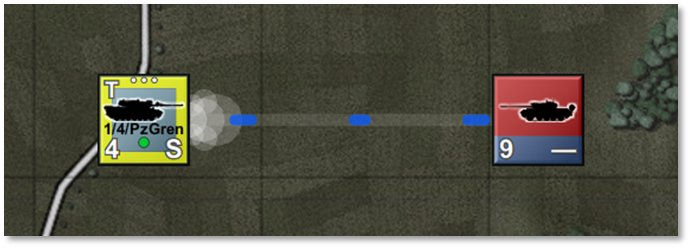

### Anti-Tank Guided Missile

These are wiggly-trajectory vapor trails from shooter to target, representing anti-tank guided missile course corrections, with a fat projectile, a bright tail from the engine (shown with a mixture of white, yellow, orange, and red), and a vanishing smoke trail. There is a launch blast smoke animation at the shooter location.

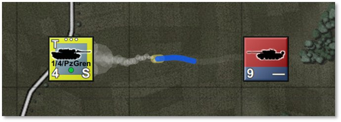

### Surface-to-Air Missile (SAM)

These are hooked-trajectory vapor trails from shooter to target, representing off-angle launch followed by tracking, and a fat, accelerating projectile with a persistent smoke trail. There is a launch blast smoke animation at the shooter location.

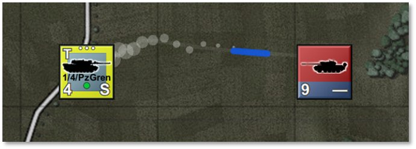

### Fire Line Colors and Scaling

Projectile colors follow User Preferences for Line of Fire colors for both sides ([***F2***], see Section 3.4 above). It may be desirable to switch to more tracer-like colors like yellow, orange, or red to brighten up the default colors.

Animation sizes follow map scaling and will scale up and down with changes in zoom levels.

Animation speed follows other animation speeds but is capped at a maximum speed value of 50. Reduce animation speed below 50 to slow down fire exchange animations (see Section 3.1.1 above).