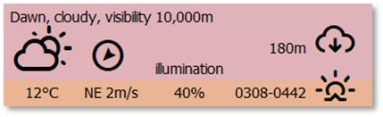
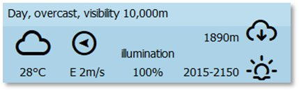
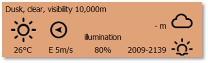
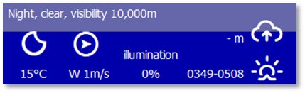

# Time of Day

***Flashpoint Campaigns: Cold War*** deals with four different times of the day. Dusk and Dawn take place at the times of day appropriate to the region for that month of the scenario.

A dialog appears with the relevant information when the time of day changes during the game. The Weather Panel (see Section 13.1 above as well as the images in the following subsections below) and the map itself will have distinct changes in color to show the various times of day.

Time of day is closely linked to Visibility and Illumination factors. See Section 24.3 above for details on these.

## Dawn

Dawn occurs roughly 90 minutes before sunrise and the timeframe for this transition is noted in the bottom right of the panel. There is a thermal inversion of surface temperatures during this time that degrades thermal sight detection ranges and the accuracy of optically guided weapons (i.e., temperatures of the ground and air flip). The map shows a gradually disappearing nightshade as the sun rises. Illumination also increases as the sun comes up.

## Day

Day is the time between sunrise and sunset when the maximum possible Visibility occurs. The map is shown free of any color adjustment. The upcoming Dusk transition time is noted in the bottom right of the panel.

## Dusk

Dusk occurs roughly 90 minutes after sunset and the timeframe for this transition is noted in the bottom right of the panel. There is a thermal inversion of surface temperatures during this time that degrades thermal sight detection ranges and the accuracy of optically guided weapons (i.e., temperatures of the ground and air flip). The map shows a gradual darkening as the sun sets. Illumination also decreases as the sun goes down.

## Night

Night is the time from after sunset until sunrise. The maximum Visibility is determined by the level of Illumination based on the phase of the moon. Operation of aircraft may be impacted if those aircraft are not capable of night operations. The upcoming Dawn transition time is provided in the bottom right of the panel.

!!! note

    While Visibility may be extensive in distance, objects cannot be observed

without having Illumination or using sensors that work without light (thermal, radar, infrared systems). In other words, Visibility alone is not enough to Spot enemies.

