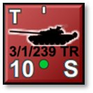
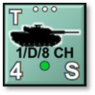
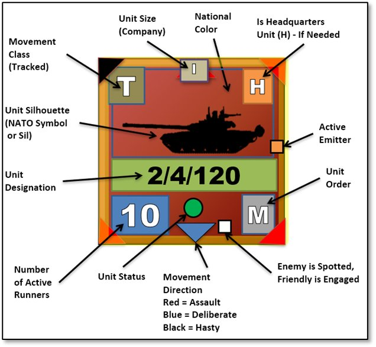

# Unit Counters

{.img-right}{.img-right}Units are the individual playing pieces in the game. Units are composed of one or more subunits such as vehicles, aircraft, artillery pieces, or squads of people. Details of the counter display are examined below.

For example, a tank brigade HQ unit composed of 3 subunits might contain a T-80 command tank, a BMP-2 armored personnel carrier, and a BTR-60 command vehicle. Units can also be a mix of unit types that are used together for operation needs. One of the most common mixed units are mechanized units with Infantry Fighting Vehicles (IFVs) or Armored Personnel Carriers (APCs), infantry squads, and weapon teams. Aircraft units like helicopters or Close Air Support (CAS) assets are always of the same type in a unit but could have different roles like attack and recon (see Section 18 below for more on roles).

The unit counters in the game contain several important values and show a variety of information on the state of the unit. These items are detailed in the following section.

## Counter Information Layout

The image below shows all the various bits of information contained on most of the counters in the game.

Understanding these items and their meaning is essential to the game. The breakdown begins with the Unit Silhouette (middle left-side label in the image below) and moves clockwise via labels.

- **Unit Silhouette (Sil)** – The primary constitution of the unit is shown by the central graphic. In this case a tank is shown with a fair assumption that the unit is predominantly composed of those types. Vehicles of all types, artillery, and aircraft are shown with vehicle graphics. Non-vehicular units use NATO symbol graphics. This shows up, for example, if the unit is composed of carrier vehicles and dismountable passengers. The vehicle Sil is shown while the unit is moving and the dominant passenger NATO symbol is shown while the unit is stationary to indicate that the passengers have dismounted.

- **Movement Class** – The letter in the upper left of the counter indicates the unit’s movement class type. These types are as follows: “L” = Leg, “W” = Wheeled, “T” = Tracked, “R” = Rotor, “P” = Propeller, “J” = Jet, “R” = Rocket, “S” = Static (non-movable).

!!! note

    See Section 22.1.3 below for details on the Lost Transport Indicator that can also appear in this location.

- **Unit Size** – The icon at the top center shows the size of the unit, which in this case is a company. The size indicators are “X” = brigade, “III” = regiment, “II” = battalion, “I” = company (approx. 10 subunits), “...” = platoon (approx. 3-5 subunits), “..” section (1 or 2 subunits), and “.’ = an individual subunit. This information is shown only to the owning player.

!!! note

    For headquarters units, the unit size shown is the size of the command, not of the HQ unit itself.

- **National Color** – Every unit of a nation has a color-coded background for the unit counters. The Soviets are red, the Americans are green, and the French are blue. Each nation’s background is unique and allows the players to tell the various forces apart.

- **Is Headquarter Unit** **(H)** – The “H” in the upper right corner means that this unit is a headquarters unit. Some are formally organized to be headquarters and some are just acting as such. In either case, an H appears in this location. This information is shown only to the owning player. These units provide the chain of command and communications link to their subordinates.

- **Active Emitter** – If a unit is equipped with a radar system that is activated and in use, i.e., air search or ground search, an orange box is displayed along the right edge of the counter to show an active emitter.

- **Unit Order** – The white letter in the lower right corner of the counter indicates the unit’s current order (“M” in the above example). Valid orders are the following: “A” = Assault, “M” = Move Deliberate or Move Hasty, “S” = Screen, “H” = Hold, “B” = Barrage, “G” = Gas Attack, “C” = Counter Battery, “E” = Engineering Action, “R” = Resupply, “O” = On Call, “F” = Fallback (Scooting), “W” = Withdrawing, and “Z” = Hunt (for helicopters). This information is shown only to the owning player. These orders will be explained in more detail in Section21 below.

- **Spotted Indicator** – If the unit has been sighted by the enemy, a very tiny white square is drawn at the bottom of the counter next to the unit order. It is enlarged on the image above and will look like a “.” punctuation mark to the lower left of the order indicator. This is based on being lazed, shot at, or a reasonable estimation of “we see them so I bet they can see us” for your units if they have Spotted the enemy.

!!! note

    This indicator only shows if the option Enemy Units Are Always Visible is turned on during scenario set up, see Section 4.3.2 above for more information on selection these options.

- **Movement Direction** – A small triangle is drawn to point in the direction of the next move if a unit is ordered to move or already in motion. A black triangle means the unit is using road movement via a Hasty Move order and is going for speed over combat readiness. A blue triangle indicates a Deliberate Move order where the unit is moving more carefully, using both road and off-road movements towards the objective while being ready for combat. A red triangle indicates a unit moving in an Assault order and is combat ready. Assault movement is a bit faster than Deliberate, trading Cover for speed to close on an objective.

!!! note

    More information can be found in Section 21.2 below for Issuing Primary Unit Orders, Section 22 below for Plotting Movement and Fires, and Section 23.4 below for more on Movement Preferences.

- **Unit Status** – A symbol in the center of the bottom area of the counter quickly shows a unit’s overall combat effectiveness. The symbols are used as follows:

    - **Green Circle** – Indicates the unit is combat effective and is in good order with Ammo and Readiness levels.

    - **Yellow Triangle** – Indicates a unit is of marginal fighting capability. It has possibly taken some losses or is low on Ammo, Readiness, or Morale and its combat abilities are reduced.

    - **Red Diamond** – Indicates a unit with critical combat effectiveness conditions. It is deficient in Ammo, Readiness, or Morale, has taken significant losses, or a combination of this effect. These units should be pulled out of combat for Resupply as they are not very effective in this state.

    - **Black Square** – Indicates a unit has reached combat ineffectiveness and is no longer capable of practical combat action. These units are usually out of critical Ammo, very low on Readiness, have shattered Morale, or sustained heavy losses in several subunits. See Section 26 below for combat soft factors.

- **Number of Active Runners** – The large number in the bottom left corner is the number of mission-capable subunits (“10” in this example). A subunit is mission-capable (also known as a “runner”) if it is physically and psychologically able to carry out its orders. The other possible states are Destroyed and Fallen Out. A tank that has thrown a track, a truck with a conked-out or broken down engine, or an infantry squad so shattered that it cannot rise from the bottom of its trench are examples of subunits that have Fallen Out. Fallen out subunits count equally with Destroyed subunits for victory purposes but can be recovered between scenarios in a campaign game.

- **Unit Designation** – Immediately below the unit graphic is an identifying unit designation. These tags allow the player to more quickly identify where the unit belongs in the general organization of your forces. This information is shown only to the owning player and long tags are truncated to fit. This unit designation matches the unit identifier in the Order of Battle tree (see Section 20 below).