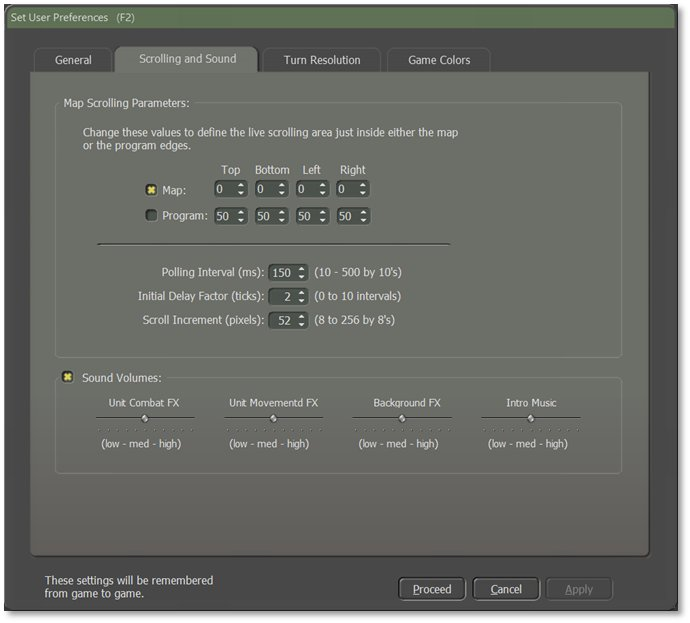
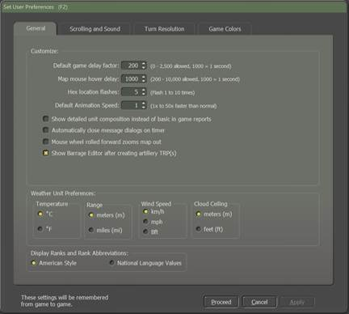
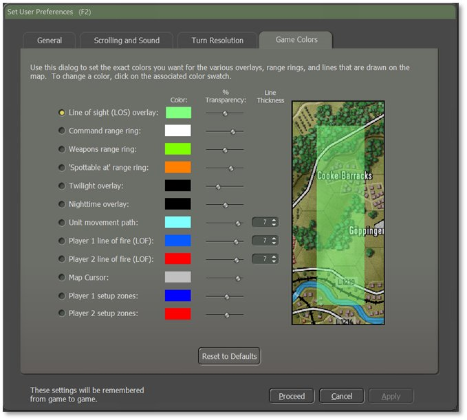

# User Preferences

Clicking on the “User Preferences” button in the Main Menu opens a dialog with four tabs of settings for various game functions. Once applied, these settings will be remembered from game to game. These settings can be changed at any time via this button on the Welcome Commander Screen, in-game from the Menu Bar, or hitting ***F2***.

## General Tab

The General tab allows the player to Customize basic game engine performance parameters, set Weather Unit Preferences, and set the Display Rank and Rank Abbreviation styles.

### Customize

- **Default Game Delay Factor** – Set the pacing of the game during turn resolution. If you find that the resolution is happening too quickly to follow, use a larger number. If it is too slow, use a smaller number.

- **Map Mouse Hover Delay –** Set the length of time needed to trigger the Flyover Panel showing the objects in the hex the mouse is hovering over (see Section 16.3 below).

- **Hex Location Flashes –** Set the number of times the hex of an active unit flashes to alert the player.

- **Default Animation Speed** – Set how fast the in-game animations are shown during combat resolution.

- **Show Detailed Unit Composition** – If checked and when known, various in-game displays show the actual platform names (e.g., “T-72M”) in the description window instead of generic descriptions (e.g., “Tank”).

- **Automatically Close Message Dialogs** **on Timer** – If checked, Secure Transmission dialogs use a timer (displayed in the dialog box) to close. If unchecked, dialogs remain on screen until the user clears them by selecting the Proceed button.

- **Mouse Wheel Rolled Forward Zooms Map Out** – If checked, scrolling the mouse wheel forward zooms the map out to see more of it. Scrolling backward zooms the map in. Zoom *is not* centered on the cursor. Unchecking flips the direction of the zooming.

- **Show Barrage Editor After Creating Artillery TRP(s)** – If checked, the Barrage Editor dialog automatically opens so adjustments to the fire missions can be made after the player plots any Artillery Target Reference Points (TRPs).

- **Hide Victory Status in Leader Panel** – If checked, the indicator bar for the overall victory level is not displayed in the Commander Panel (see Section 13.2 below). This more strictly preserves the fog of war. Unchecking this displays the indicator bar.

### Weather Unit Preferences

These settings change how information is displayed throughout the game.

- **Temperature** – Set this to either Fahrenheit (degrees F) or Celsius (degrees C).

- **Range** – Distances can be referred to in Meters (m) or Miles (mi).

- **Wind Speed** – Speeds can be in Kilometers Per Hour (km/h), Miles Per Hour (mph), or Beaufort Wind Force Scale (Bft).

- **Cloud Ceiling** – The cloud ceiling can be shown in Meters (m) or Feet (f).

### Display Rank Information

You can choose to see ranks in American Style (US Army) rank names or in the National Language of the country being played.

## Scrolling and Sound Tab

The player can alter different values regarding Map Scrolling Parameters and Sound Volumes on this tab.

### Map Scrolling Parameters

The map is scrolled by hovering the mouse cursor in a sensitive zone of the game. This zone can either run along the inside edge of the Map or the inside edge of the entire game (Program) screen. Be aware that if choosing the game edge, there may be unwanted scrolling when trying to access specific information controls. This effect may be more pronounced on multiple monitors or extremely widescreen displays.

- **Map and Program Edges** – Define the top, bottom, and sides of the scrolling-sensitive area independently of each other for either the Map edge or the Program edge (select desired check box). The values are the number of screen pixels that make up the sensitive zone for edge scrolling.

- **Polling Interval** – This is the length of time between checks for a map scroll measured in thousandths of a second. The polling interval defines one ”tick” and shorter intervals make for faster scrolling.

- **Initial Delay Factor** – This is the number of ticks before a scrolling action is initiated. A certain delay may be desirable to prevent unwanted scrolling when moving through these zones to other areas of the screen.

- **Scroll Increment** – This is the number of pixels that are scrolled for each tick. Use a lower value for faster/smoother scrolling.

### Sound Volumes

- **Check Box** – This check box/toggle turns off all sounds without changing the settings below it when sounds are wanted/unwanted.

- **Unit Combat FX** – Allows the volume of the firing sounds during combat to be independently set.

- **Unit Movement FX** – Allows the volume of the movement sounds during turn resolution to be independently set.

- **Background FX** –Allows the volume of the ambient background battle noise during turn resolution to be independently set.

- **Intro Music** – Allows the volume of the beginning and endgame music to be independently set.

## Turn Resolution Tab

Tweak various settings that influence how the Turn Resolution is displayed in this tab (these are not rule changes). Disable some settings here should you wish to speed up the progress.

### Combat Resolution

- **Scroll Map to On-Map Firing Artillery Units During Turn Resolution** – When checked, the game scrolls to the firing on-map indirect fire unit and target. This helps the player to watch firing events as they unfold but can be dizzying if the game is set to resolve quickly through the General custom preferences. Disable to speed up the resolution of combat.

- **Show Line of Fire (LOF) from Attacker to Defender** – When checked, a line is drawn on the map from the attacker to the target to show the current direct fire attack being resolved (see Section 16.13 below for details on these lines).

!!! note

    In some cases, the attacker may not be Spotted, but the general area of fire may be noticed.

- **Flash Target Hex Location** – When checked, the hex of the target unit in combat flashes the number of times set in the General tab to help locate the action.

- **Enable Combat Sound Effects –** When checked, a few of the current weapon shooting/launching sound effects play. Disable to speed up combat resolution.

- **Enable “Hit” Animations** – When checked, attacks on units that hit cause an explosion graphic on the counter. Disable to speed up combat resolution some.

- **Show Combat Result Hints –** When checked, results of combat actions are displayed as hints next to the affected unit. The size of the combat hints displayed during the game can be increased or decreased by changing the Font Size value.

### Additional Settings

- **Autosave Game After Each Player Orders Phase –** When checked, the game autosaves immediately before the turn resolution begins into the \Saved folder. This allows you to replay a scenario from any of these points in battle. These are regular saved games and may be reopened and resumed if desired.

- **Show Friendly Movement Paths During Turn Resolution** – When checked, all friendly units with plotted movement show their paths with an overlay while the turn resolves. This overlay can also be pulled up during the planning phase by hitting ***Ctrl***+***X*** for Chain of Command (see Section 11.7.7 below) or clicking the Multi-Unit Overlay menu bar option and selecting Chain-of-Command. The color and transparency of these Unit Movement Paths can be modified in the Game Colors preferences as well (see next subsection below). Disable to speed up combat resolution a bit.

- **Enable Unit Movement Sound Effects** – When checked, the game plays various types of movement sound effects like tracks, wheels, rotors, etc. Disable to speed up combat resolution a bit.

- **Scroll Map to Active Unit During Turn Resolution** – When checked, the map centers on the active unit during turn resolution. Like the other scrolling option above, this can also be helpful to watch all activity/combat events as they unfold. It can be dizzying if the game is set to resolve quickly through the General custom preferences.

## Game Colors Tab

Individual map overlays, fire lines, and other helpful color markers can be edited by the player through the Game Colors tab.

The level of color transparency can also be changed. This allows the player, for example, to create a distinctly different hue for each kind of overlay to easily tell which is in effect at any given time. The effect of these changes can be seen in the terrain sample to the right of the selections.

**Reset to Defaults –** This button returns all color options back to the game’s default settings for color, size, and transparency.

!!! note

    It is possible to create unsightly or even invisible colors. If you want to experiment with this, you might want to consider backing up the original “overlays.ini” file.
    