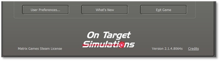
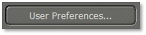

# User Preferences

Clicking on the “User Preferences...” button will open a dialog box with four tabs of settings information for various game functions. Once applied, these settings will be remembered from game to game. These settings can be changed at any time via this button on the Welcome Commander screen or in-game from the Main Menu Bar.

## General Tab

The General Tab allows the player to Customize basic game engine performance parameters, set Weather Unit Preferences and set the Display Rank and Abbreviation languages.

### Customize

- **Default Game Delay Factor** - This value controls the pacing of the game during turn resolution. If you find that the resolution is happening too quickly to follow, then use a larger number. If it is too slow, then use a smaller number.

- **Map Mouse Hover Delay -** The length of time needed to trigger the map flyover panel showing the objects in the hex.

- **Hex Location Flashes –** Set the number of times the hex of an active unit flashes to alert the player.

- **Default Animation Speed** – Sets how fast the in-game animations are shown during combat resolution.

- **Show Detailed Unit Composition** - If checked and when known various in-game displays will show the actual platform names (“T-72M”) in the description window instead of generic descriptions (“Tank”).

- **Close the ‘Secure Transmission’ message dialog** **on a timer** – If this option is checked, dialogs use a timer (displayed in the dialog box) to close. If not enabled, then the Secure Transmission dialogs will remain on screen until the user clears them by selecting the Proceed button.

- **Mouse wheel rolled forward zooms map out** – If checked, scrolling the mouse wheel forward will zoom the map out to see more of it. Scrolling backward will zoom the map in. The zoom IS NOT centered on the cursor. Unchecking will flip the direction of the zooming.

- **Show Barrage Editor after creating artillery TRP(s)** – If checked, after the player plots any Artillery Target Reference Points (TRPs), the Barrage Editor dialog will automatically open so adjustments to the fire missions can be made.

### Weather Unit Preferences

These settings change how information is displayed throughout the game.

- **Temperature** – You can set this to either Fahrenheit (degrees F) or Celsius (degrees C).

- **Range** – Distances can be referred to in Meters (m) or Miles (mi).

- **Wind Speed** – Speeds can be in Kilometers Per Hour (km/h), Miles Per Hour (mph), or Beaufort Wind Force Scale (Bft).

- **Cloud Ceiling** – The cloud ceiling can be shown in Meters (m) or Feet (f).

### Display Rank Information

You can choose to see ranks in the American (US Army) rank names or in the National language of the country.

## Scrolling and Sound Tab

The player can alter different values regarding Map Scrolling Parameters and Sound Volumes on this customization tab.

### Map Scrolling Parameters

- **Map Edge or Game Edge -** The map is scrolled by hovering the mouse cursor in a sensitive zone of the game. This zone can either run along the inside edge of the map or the inside edge of the entire game (program) screen. Be aware that if you choose the game edge, then there may be unwanted scrolling when trying to access specific information controls. This effect may be more pronounced on multiple monitors or extremely widescreen displays.

- **Effective Border Areas** - Define the top, bottom, and sides of the sensitive area independently of each other. The value is the number of screen pixels of the sensitive zone for scrolling.

- **Polling Interval**
- This is the length of time between checks for a map scroll measured in
thousandths of a second. The polling interval defines one ‘tick.’

- **Initial Delay Factor** - This is the number of ticks before a scrolling action is initiated. A certain delay may be desirable to prevent unwanted scrolling when moving through these zones to other areas of the screen.

- **Scroll Increment**
- is the number of pixels that are scrolled for each tick. Use a lower value
for faster/smoother scrolling.

### Sound Volumes

- **Check Box** – This check box turns off all sounds without changing the settings below it when sounds are required.

- **Unit Sound FX** - This is the volume control for unit movement and firing sounds.

- **Background FX -** This controls the volume of the ambient background battle noise during turn resolution.

- **Intro Music** - Controls the volume of the beginning and endgame music themes.

## Turn Resolution Tab

Here, you can tweak various settings that influence how the turn resolution is displayed (these are not rule changes). Should you wish to speed up the progress, you can disable some settings here.

### Combat Resolution

- **Scroll Map to On-Map Firing Artillery Units during Turn Resolution** – When checked, the game will scroll to the firing on-map indirect fire unit and then the target. Disable to speed up the resolution of combat.

- **Show Line of Fire (LOF) from Attacked to Defender** - If checked, a line is drawn on the map from the attacker to the target to show the current direct fire attack being resolved.

- In some cases, the attacker may not be spotted, but the general area of fire may be noticed.

- **Flash Target Hex Location** - When checked, the hex of the target unit in combat will flash the number of times set in the General tab to help locate the action.

- **Enable Combat Sound Effects –** When checked, a few of the current weapon shooting/launching sound effects will play. Disable to speed up combat resolution.

- **Enable “Hit” Animations** – When checked, attacks on units that hit will cause an explosion(s) graphic on the counter. Disable to speed up combat resolution some.

- **Show Combat Result Hints -** If this item is checked, the results of combat actions will be displayed as hints next to the affected unit. Here, you can also alter the Combat Hint Font Size: The size of the combat hints displayed during the game can be increased or decreased by changing the value.

### Additional Settings

- **Autosave game after each player orders phase
-** When checked, this will save the game immediately
before turning resolution into the \Saved folder under the name of the scenario and with a percentage complete number. These are regular saved games and maybe reopened and resumed if desired.

- **Show friendly movement paths during turn resolution** – When checked, all friendly units with plotted movement show those moves on the map with plot lines. Disable to speed up combat resolution a bit.

- **Enable Unit Movement Sound Effects** – When checked, the game plays various types of movement sound effects like tracks, wheels, rotors, etc. Disable to speed up combat resolution a bit.

- **Scroll Map to Active Unit during Turn Resolution** - When checked, the map will center on the active unit during turn resolution.

## Game Colors Tab

A color selection dialog exists so that individual map overlays, fire lines, and other helpful color markers can be edited by the player and established as new game defaults. 

The level of color transparency can also be changed. This will allow the player, for example, to create a distinctly different hue for each kind of overlay so that he can easily tell which is in effect at any given time. The effect of these changes can be seen in the terrain sample to the right of the selections.

**Reset to Defaults -** Thisbutton will return all color options back to the game’s default settings for color size and transparency.

!!! note

    It is possible to create unsightly or even invisible colors. If you want to experiment with this, you might want to consider backing up the original “overlays.ini” file.

