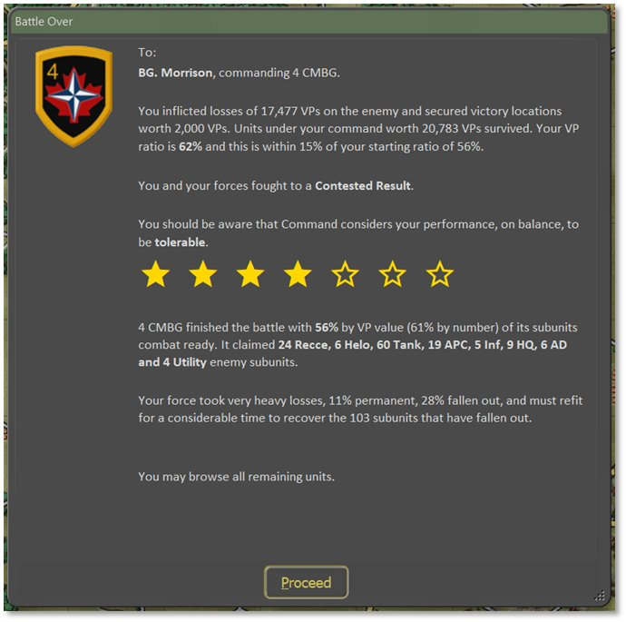
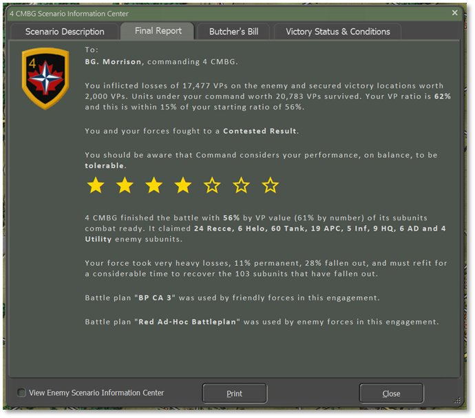
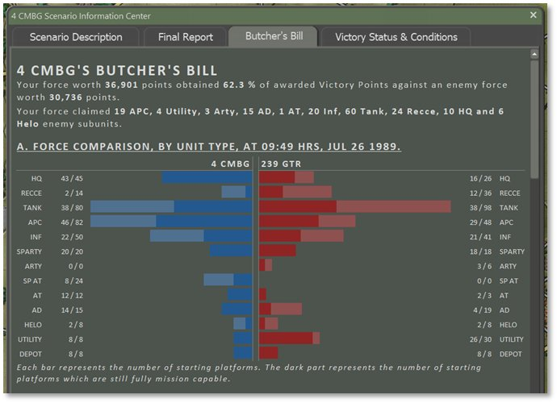
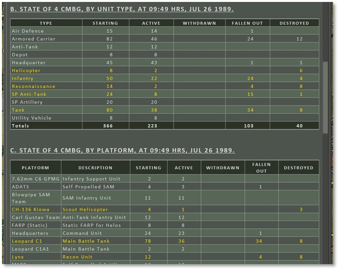
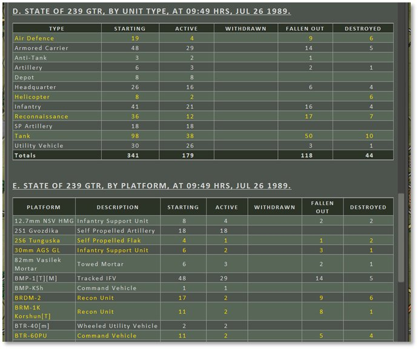
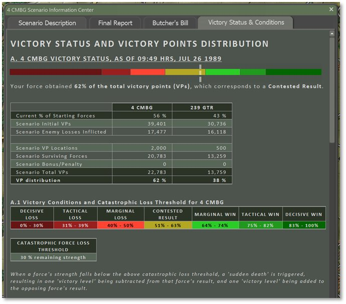
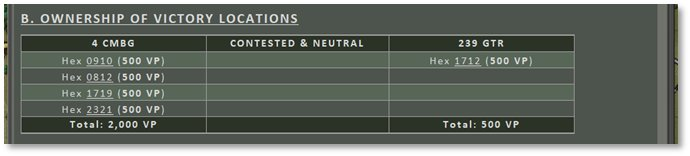
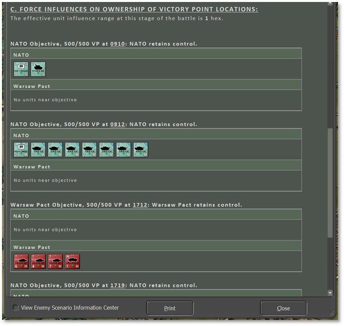

# Victory Conditions and End Game

The victory conditions for each scenario are specified in detail in the Scenario Information (see Section 15.1.2 above) and Mission Briefing 15.2.1 above). The most important way to ensure victory is to find and secure the Victory Point (VP) locations that have been placed on the map by the scenario designer. Blue locations are secured by Player 1, red locations by Player 2, and unsecured locations will show as half red and half blue. An unsecured location becomes “secured” if a friendly ground unit passes through it. Air units like helicopters can fly over this location and engage or Spot enemy units in or from here, but they cannot “take” an objective. The values of the different locations are shown by the map markers in the Mini Map (see Section 13.4 above) and in the Scenario Information Staff Report.

Players also get Victory Points for knocking out or destroying enemy subunits. The value of each subunit is shown in the Subunit Inspector (see Section 14.3 above). The subunit’s exact number of VPs is awarded whether it is destroyed or just minimally damaged – either way, it is a mission kill and that is what is being measured.

## Game End and Mission Postmortem

The game is over when the end of the scenario time limit is reached or when the force strength of one side or the other drops below 30% and triggers “Sudden Death” (see Section 30.5 below). The length of the game in hours is defined in the Mission Briefing. Force strength is the percentage calculated from the active units’ Victory Point (VP) values over the total number of forces’ VP values for each side. It starts at 100% and goes down as each side accrues losses.

Once one of these end-game triggers is reached, the Battle Over screen seen below is displayed and there is somber end-game theme music to listen to as you review the mission’s postmortem.

A representative of the General Staff Inspectorate provides a quick review of your combat actions and decisions. This person holds your fate in their hands and is also harried, short of sleep, and unlikely to take a finely balanced view of the nuances of your performance. The General quickly evaluates your performance, telling you that you did an excellent job, failed your mission, or something in between. This will be based on your Victory Points total. A star rating is displayed with the filled stars indicating a basic score out of seven (7) for the mission. Next, the percentage of VPs awarded is noted and the numbers and types of enemy subunits you claimed is listed. Finally, the General tells you what shape your force is in based on losses and fallouts, with an estimation of recovery time to get back up to full combat strength.

Click the Proceed button to continue to the Scenario Information Staff Report to see the full postmortem results.

**NOTE:** If the following two settings in Game Options were selected during scenario setup: Enemy Units Always Visible and Allow Gathering of Full Information of Visible Enemy Units, the dialog that follows hitting Proceed will have an option in the bottom left corner to View Enemy Scenario Information Center. Checking this toggle converts each tab to show the same information but from the enemy’s perspective and the details change accordingly. Uncheck this toggle to return to your forces’ information. Selecting only one or the other of these two Game Options will not allow this information to be viewed (see Section 4.3.2 above).

## Final Report

The Final Report, seen below, is a repeat of the Battle Over screen and offers the chance to review that information again as well as note which Battle Plans each side used if it was under AI control (see Section 4.4 above for Battle Plan information).

## Butcher’s Bill

The Butcher’s Bill is a tally of all units lost (destroyed or fallen out) during the battle. This information is displayed in several forms and compares your forces to those of your enemy.

Section A of the Butcher’s Bill has a graph showing the breakdown of subunits for both sides with the longer, lighter bar showing the number of starting units of that type and the shorter, darker bar showing the number of units remaining of that type. Starting and ending numbers are also listed with each row. Player 1 is shown in blue and Player 2 is in red.

Sections B and C show the state of your forces by Unit Type and by Platform, respectively, in a tabled format.

Section B looks at each general Type of subunit, how many Started the scenario, how many are still Active or running at the end of the scenario, any subunits that have Withdrawn, the number of Fallen Out subunits (damaged/wounded), and finally the number of Destroyed subunits (irreparably destroyed/killed in action). The final Totals for each column are shown along the bottom of the table in the dark green row.

Section C looks at each type of Platform in the battle, a Description of that platform, how many Started the scenario, how many are still Active (running) at the end of the scenario, any platforms that have Withdrawn, the number of Fallen Out subunits (damaged/wounded), and the number of Destroyed subunits (irreparably destroyed/killed in action). The final Totals for each column are shown along the bottom of the table in the dark green row.

Sections D and E, below, show the state of the enemy forces by unit Type and Platform, respectively. The information is in the same format as noted above for Sections B and C.

## Victory Status and Conditions

The Victory Status & Conditions tab features breakdowns of how your forces’ points were achieved.

Section A, shown below, provides a graphical and tabled representation of the final Victory Point Distribution and game result.

The colorful bar at the top shows via vertical white bars where your score landed in the context of a low number of points (red) to a high number of points (green). Below this is some text noting the percentage of Victory Points (VPs) gained and the result of the battle.

The table underneath shows the breakdown of Starting Forces and VPs awarded for both sides in the scenario which makes up the final VP Distribution totals along the bottom row.

Section A.1 shows the colorful bar in table form and the distributed VP values that match up to the various Victory Conditions. Losses or wins can be Decisive, Tactical, or Marginal and a close battle is a Contested Result. These percentages are based on the starting conditions for the scenario to allow for unbalanced forces without penalizing size, but provide real Victory Conditions based on these ratios. Lastly, the Catastrophic Force Loss Threshold that triggers Sudden Death is indicated.

Section B, seen below, provides a table of Victory Location ownership by each force in the left and right columns, and Contested and Neutral (not owned) locations in the middle column. The Victory Locations are labeled by hex number (column/grid map coordinates) along with their VP value. These values are summed in the bottom row for a Total for each force.

Section C, seen below, details how ownership of each Victory Location was determined based on local units and time remaining in the game.

## Sudden Death

Once a side has triggered “Sudden Death” by having their forces drop below the indicated Catastrophic Force Loss Threshold (see Section 30.4 above), the outcome of the scenario will be a foregone conclusion. A force that has eroded down to 30% of its starting value has become combat ineffective in the grand scheme of the battle and is assumed to pull back remaining forces to be available in the future.

There is the option to continue playing until the end of the scenario time or until the point you wish to end the game via the Game menu bar item, End Game Now option.

!!! note

    It is infrequent to improve on the

Sudden Death evaluation as your forces are combat ineffective and usually will suffer more losses if the Sudden Death threshold is ignored.