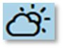
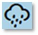
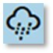
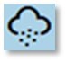

# Weather

Weather plays an important role by having a significant influence on Visibility and also impacting the performance of certain weapons and sensors. The game’s weather is dynamic and based on real-world weather data. A weather forecast is available in the Intelligence Staff Report (see Section 15.3.4 above). Review it to know when and for how long the weather may change. The following sections give a summary of the available weather types currently in the game and how they may impact Visibility (see Section 24.3 above for details on this factor).

A dialog appears with the relevant information when the Weather changes during the game.

## Clear

{.img-right}Clear weather means no precipitation, few to no clouds, and extended Visibility ranges based on the time of day, moon phase at night, and lack of cloud cover. Clear weather has no adverse impact on weapons or sensors. At night, the sun in this picture is replaced with a moon symbol.

---

## Cloudy

{.img-right}Cloudy weather means a mix of sun and clouds and no precipitation, with suitable Visibility ranges for all methods of Spotting. Cloudy weather may have an impact on Close Air Support operations if the cloud deck is too low. At night, the sun is replaced with a moon symbol.

---

## Overcast

{.img-right}Overcast weather means a blanket of clouds with no precipitation and very little or no sunshine. Overcast conditions still have reasonable Visibility ranges for all methods of Spotting. Overcast weather may have an impact on Close Air Support operations if the cloud deck is too low.

---

## Light Rain

{.img-right}Light Rain means scattered showers with minimal impact on Visibility, weapons, and sensors. Visibility ranges are still decent in these conditions. This type of weather does not have any impact on the effectiveness of your fighting forces.

---

## Moderate Rain

{.img-right}Moderate Rain is a constant widespread rain that has some influence on Visibility. Moderate Rain may impact the accuracy of some optically-guided weapons and degrade the range of Detection for thermal imaging sensors. This type of weather does have some adverse effects on your fighting forces and may halt air operations.

---

## Heavy Rain

{.img-right}Heavy Rain is a constant heavy downpour that alters Visibility. Heavy Rain impacts the accuracy of some optically-guided weapons and degrades the range of Detection for thermal imaging sensors. It is essential to take these factors into account when the weather is abysmal on the battlefield. Heavy Rain can stop air operations for specific aircraft.

---

## Snow

{.img-right}Even though the game is set in the spring/summer of 1989, it is possible to make custom scenarios in the fall and winter which means Snow can be a condition. Snow alters Visibility as well as weapon and sensor accuracy. It can also impede aircraft and helicopter operations.

---

## Fog / Mist / Haze

{.img-right}{.img-right}{.img-right}Fog/Mist/Haze sit low to the ground, dramatically reduce Visibility ranges, and impact thermal sighting and other sensors and weapons when present. Fog or Mist have a better chance of occurring at night and dawn. It will burn off within a few hours after sunrise. Fog/Mist/Haze can occur in Clear, Cloudy, or Overcast weather states.

---

## Weather and Movement

While weather does influence operations, weapons, and sensors in the game engine, there are currently no changes to ground movement based on weather and its terrain impacts. The development team does want to address this in a future update so seasons and weather change movement rates.