# Welcome Commander Screen

After starting the game and seeing the splash screen, you will see the following dialog with many selections. There are welcome statements, the Main Menu area, and under that, some useful buttons and information that we will cover shortly.

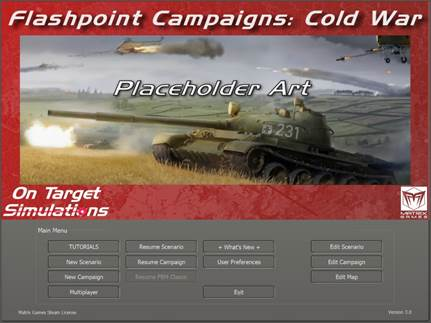

## Main Menu

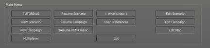

The Main Menu has all the buttons to Start New games, Resume a game in play, or jump into one of the Edit functions to create game content.  

### Start New Group

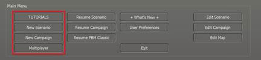

- **Scenario** - Clicking on the Scenario button will launch the Scenario selection screen, where the player can choose one of the single battles included in the game. Scenarios have a few options as to how they are played. You can play scenarios versus the Artificial Intelligence (AI) and choose which side you are, Launch the game in a two-player head-to-head mode, launch the game in AI versus AI mode, or choose a side and start a Standard Play by Email (PBEM) game. See Section 4 below for more details.

- **Campaign** - Clicking on the Campaign button will launch the Campaign selection screen. The player can review the provided campaigns and select one to play through.

- Campaigns take a core force of units and run them through several scenarios during the war. See Section 5 below for more details.

- **PBEM++ Multiplayer** - Clicking on the PBEM++ Multiplayer button will start the process of playing a scenario via the Matrix Game’s PBEM++ service. This allows you to set up or join a game versus someone else using the PBEM++ service across the globe. See Section 6 below for more details.

### Resume Group

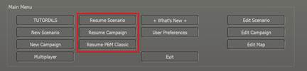This group of options allows you to browse the various save files you have for the different types of games you have played and Resume them. See Section 8 below for more details on Resuming Play for these types of games.

- **Saved Scenario** - Opens a dialog to review all the single battle games you have started and saved or autosaved.

- **Saved Campaign** - This opens a dialog to see all your campaigns that are in progress.

- **PBEM++ Multiplayer** - Clicking the button will take you to the PBEM++ login system and then into the current games selection tab of the PBEM++ lobby.

- **Classic PBEM** - Click the PBEM Classic button to see all your ongoing games and choose one to continue.

Saved games can also be deleted in the dialog that pops up. See Section 8 below for more details.

### Edit Group

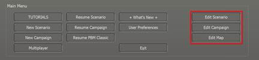

Three buttons start in-game editors for Scenarios, Campaigns, and Map Values Scanner. Each of these editors is covered in detail in other field manuals (FMs), as noted in Section 1.3.1 above.

## Useful Buttons and Information

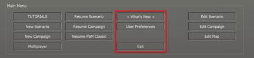

### User Preferences

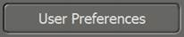 Clicking on the “User Preferences...” button will open a dialog box with four tabs of settings information for various game functions, information display sound, and looks. See Section 3 for the details of all the Preference settings.

### What’s New

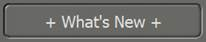Clicking on the “What’s New” button will bring up a PDF document that summarizes any new content, updates, bug fixes, or game engine tweaks we have made in the latest version of the game. More detailed information will be found in the noted and revised game field manuals (FMs).

### Exit Game

If, for some reason, you need to stop playing and return to your operating system, clicking the Exit Game button will fully close out the game and return you to your main computer screen.

### License Information

Any licensing information, if needed, will be found in the lower left of the Welcome Commander Screen.

### On-Target Simulations (OTS) Logo

Our glorious team logo is on display in the bottom middle of the panel.

### Game Engine Version

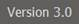 At the bottom of the screen, the game engine version is shown. Make sure you have the same version of the game as your opponent when you play multiplayer.

**NOTE:** It is recommended to exit the game if you do work in the various editors and then restart the game to play a scenario. This helps to make sure new values are correctly initialized and avoids the possibility of odd gameplay issues from occurring.

### Credits

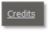Clicking on the Credits hyperlink will take you to a dialog that lists all those hard-working people who brought you this deep and detailed wargame.

## Common User Interface Buttons

Throughout the game, we have a few buttons that have the same essential functions. Those buttons are as follows.

### Apply

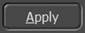 If you have made any setting changes that turn on or off functions or adjust the values of settings, then this button will commit and save those changes to the game while keeping the dialog open.

### Back

This button will move you back to a previous dialog or menu so you can change game parameters, and settings, or select other gameplay options.

### Cancel

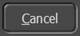If you have made any setting changes that turn on or off functions or adjusted values of settings and do not wish those to take effect, then this button will revert those changes in a dialog.

### Proceed

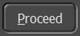 This button will move you forward to the following dialog or menu. If there is no Next dialog (as in User Preferences), this button will Apply, then close the dialog.

## Confirmation Dialogs

There are several times in the game when changes made will require confirmation. Selecting “Yes” will accept any changes. Selecting “No” will decline any changes. Selecting “Cancel” will place you back into the dialog so additional changes can be made.