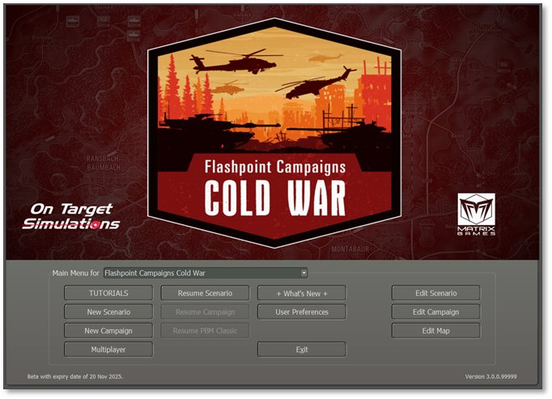

# Welcome Commander Screen

After starting the game and seeing the splash screen, you will see the following dialog with many selections. There are logos, art, important game information, and the Main Menu area, which includes some useful buttons that are covered shortly.

## Main Menu

The Main Menu has all the buttons to start new games, resume a game in play, or jump into one of the edit functions to create game content.

### Start New Group

- **TUTORIALS** – Clicking the TUTORIALS button launches a similar scenario selection dialog as below, except it only shows the Tutorial scenarios to make them easier to find. They can also be located at the bottom of the scenario list under New Scenario.

- **New Scenario** – Clicking on the New Scenario button launches the scenario selection screen to choose one of the single battles included in the game. Scenarios have a few options as to how they are played. You can play scenarios versus a Computer Opponent (Artificial Intelligence) and choose which side you play, launch the game in a two-player Head to Head Play (Hot Seat) mode, choose a side and start a Play by Email Game (Classic PBEM), or launch a game where Computer Plays Both Sides (AI versus AI) mode. See Section 4 below for more details.

- **New Campaign** – Clicking on the New Campaign button launches the campaign selection screen. The player can review the campaigns provided and select one to play through.

o Campaigns take a core force of units and run them through several scenarios during the war. See Section 5 below for more details.

- **Multiplayer** – Clicking on the Multiplayer button starts the process of playing a scenario via the Matrix/Slitherine PBEM++ Multiplayer service. This allows you to set up or join a game versus someone else using the PBEM++ Multiplayer service across the globe. See Section 6 below for more details.

### Resume Group

This group of options allows you to browse existing save files for the different types of games you have played and resume them.

- **Resume Scenario** – Opens a dialog to see all the single battle games you have started and saved or autosaved.

- **Resume Campaign** – Opens a dialog to see all your campaigns that are in progress.

- **Resume PBM Classic** – Opens a dialog to see all your ongoing games and choose one to continue.

Saved games can also be deleted in the dialog that pops up. See Section 8 below for more details on Resuming Play for these types of games.

### Useful Buttons and Information

Each useful button and information option is described below in turn.

- **What’s New** – Clicking this button brings up a PDF document that summarizes any new content, updates, bug fixes, or game engine tweaks we have made in the latest version of the game. More detailed information can be found in the noted and revised game field manuals (FMs).

- **User Preferences** – Clicking this button opens a dialog box with four tabs of settings information for various game functions, information display sound, and looks. See Section 3 for details of all the Preferences settings. User Preferences can be accessed from in-game as well using the Option menu or hitting ***F2***.

- **Exit** –– Clicking this button fully closes out the game and returns you to your main computer screen.

### Edit Group

The buttons on the right start in-game editors for Scenarios, Campaigns, and Maps. Each of these editors is covered in detail in other field manuals (FMs) as noted in Section 1.2.1 above.

## License Information

Any licensing information, if needed, is found in the lower left of the Welcome Commander Screen below the Main Menu.

## Game Engine Version

The game engine version is located in the bottom right corner of the Welcome Commander Screen. Make sure you have the same version of the game as your opponent when you play multiplayer.

**NOTE:** It is recommended to exit the game if you do work in the various editors and then restart the game to play a scenario. This helps to make sure new values are correctly initialized and avoids the possibility of odd gameplay issues from occurring.

## Common User Interface Buttons

There are a few buttons that have the same essential functions throughout the game. Those buttons are as follows:

- **Apply** – If you have made any setting changes that turn on/off functions or have adjusted the values of settings, this button commits and save those changes to the game while keeping the dialog open.

- **Back** – This button moves you back to a previous dialog or menu so you can change game parameters, settings, or select other gameplay options.

- **Cancel** – If you have made any setting changes that turn on/off functions or have adjusted values of settings and do not wish those to take effect, this button reverts those changes.

- **Proceed** – This button moves you forward to the next dialog or menu. Clicking this button will prompt you to apply any unsaved changes (see below) and then close the dialog.

### Confirmation Dialogs

There are several instances when changes require confirmation. Selecting “Yes” accepts any changes. Selecting “No” declines any changes and proceeds through the action. Selecting “Cancel” will place you back into the dialog so additional changes can be made.

