# Air Support Operations

This tutorial covers Air Support Operations, detailing how to request, coordinate, and maximize the effectiveness of airpower.

**NOTE:** This tutorial will only cover Close Air Support (CAS), Strike/Interdiction, and Suppression of Enemy Air Defense (SEAD) operations. In the future, when we expand the Air Operations, we will add more information and update the scenario to show how to use those types of air assets.

The screenshot below shows the first screen when the game launches. To proceed, click the “Tutorial” button.

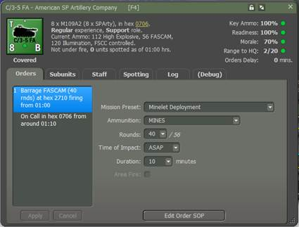

As shown in the screenshot below, a list of tutorials will appear. Highlight Tutorial – Air Support Operations and select the “Play” button at the bottom of the dialog. As shown in the vertically split layout on the next page, the left side contains the relevant screenshot.

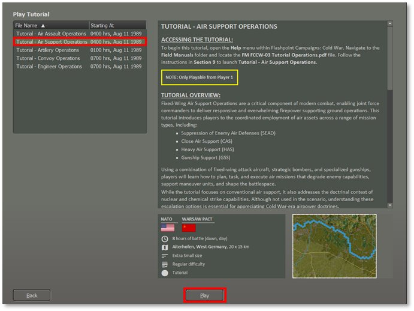Next, we must set the Difficulty Settings for the Tutorial mission,

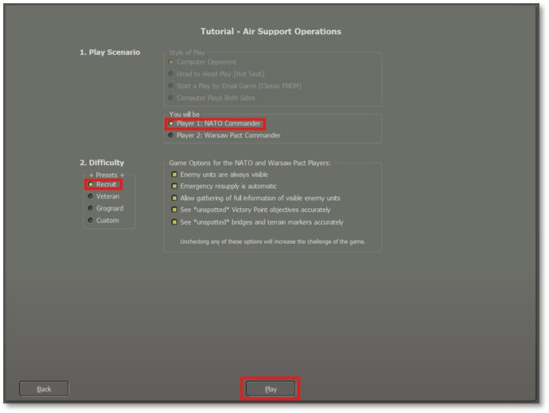For the best tutorial experience, follow the settings as shown above.

Select “Player 1: NATO Commander.”

To help with this tutorial, we recommend setting the Difficulty Level to “Recruit” so you can see the various enemy target locations.

**NOTE:** In actual game play, your forces would need to spot these enemy units or detect them via electronic interception means to provide a location for your aircraft to attack.

Select the “Play” button to proceed to the next screen.

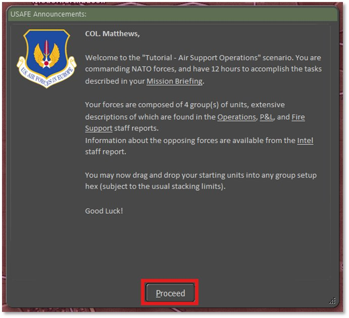The following section shows the scenario description, as shown above.

Review the mission details carefully to understand your forces' objectives and expectations.

Click the “Proceed” button to launch the game.

After you select the “Proceed” button, you will be presented with a screen, as shown in the above screenshot, which displays your forces' initial setup on the map. The next step is to review the forces you will command.

## Review Your Forces

Before executing air support operations, thoroughly review your available fixed-wing aircraft. Assess their payload configurations, mission assignments, and operational range to ensure they are equipped to conduct the strikes effectively against the enemy target units.

Effectively managed air assets can disrupt enemy concentrations, provide direct support to ground units, and maintain aerial dominance over the area of operations.

### F-4G Wild Weasel (SEAD)

- Quantity: 2x

- Role: The F-4G Wild Weasel has electronic countermeasures and anti-radiation missiles (ARMs), making it a key asset for Suppression of Enemy Air Defenses (SEAD). It identifies and targets enemy radar installations to clear the path for strike aircraft.

**NOTE:** This F-4 has had the Napalm Bombs removed to focus on the ARMs and cannon.

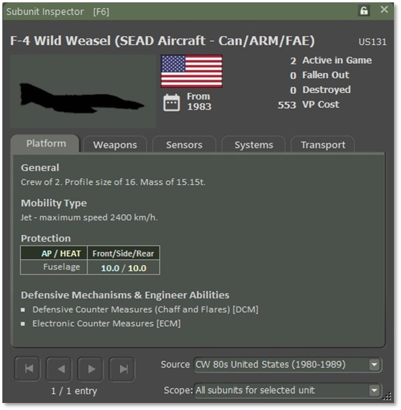

### A-10 Thunderbolt II (CAS):

- Quantity: 2x

- Role: The A-10, known as the Warthog, is a close air support aircraft with a 30mm GAU-8/A Avenger cannon and can carry bombs, guided missiles, and rockets. It is optimized for ground attack, targeting armored vehicles, fortifications, and troop concentrations.

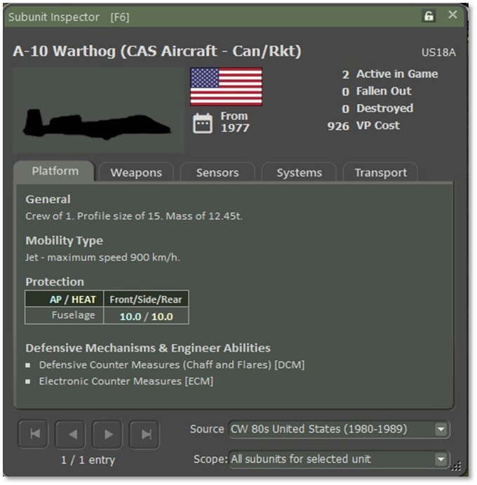

### F-16C Fighting Falcon (Strike)

- Quantity: 2x

- Role: The F-16 is a multi-role fighter capable of conducting air superiority, close air support, and interdiction missions. It is equipped with various munitions, including air-to-air missiles, bombs, and rockets, providing versatile support for ground operations.

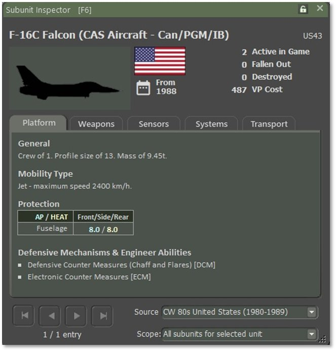

## Starting Air Strike Operations

The following steps will get you ready to start ordering Air Support missions by getting the map set for enemy locations and opening the Fire Support dialog to access the aircraft you have available for the missions.

### Opening Mission Overlay

First, we will review the Mission Overlay to gain a better understanding of the battlefield layout. From the Menu, select "Staff," then choose "Import Mission Graphics from Briefing" to display the provided graphics as seen below.

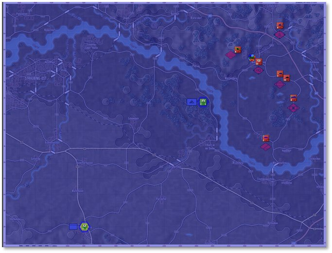

The overlay indicates the approximate positions of the enemy units targeted by the various attacks in this tutorial. You can leave this overlay one and also change its transparency in the Option Menu > Mission Graphics Transparency Options.

You can toggle the Mission Overlay on/off by clicking the Mission button at the bottom left of the game window (it is enabled once you import the overlay).

Next, Zoom the map to 80% or so and set the viewing window to the upper right of the map to see all the enemy locations using the mini-map panel at the bottom right of the screen. You should see an image like the one below.

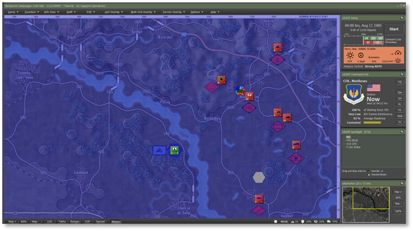

### Opening the Fire Support Dialog

Now we need to open the Fire Support Dialog to have access to information on all the aircraft packages available and to be able to order the various strikes on enemy targets. There are two methods to open this dialog.

First, you can go to the main menu, select the Staff tab, and select Fire Support from the drop down menu as seen below.

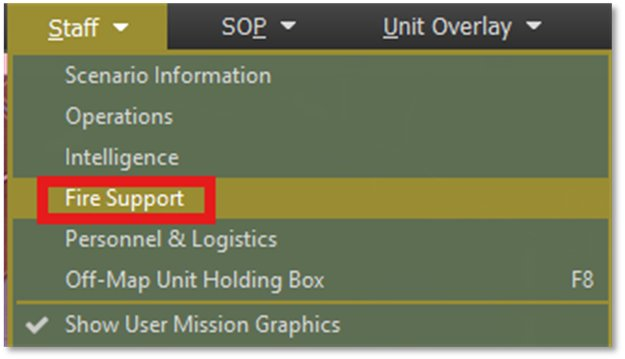

The other option is to click on the FS speed button in the Command Panel as shown below.

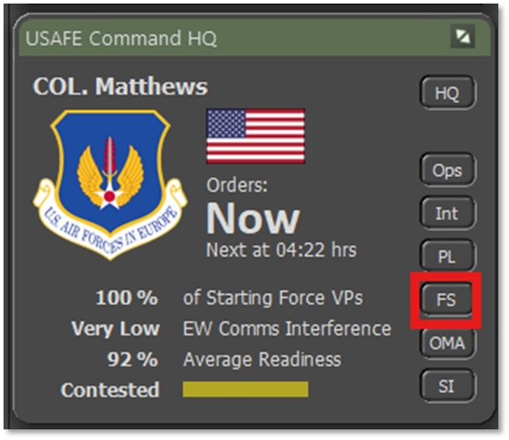

Both methods will bring up the Fire Support dialog as seen below. From the Fire Support Assets tab, you can review the assets, order strikes and other missions with a right mouse click on the aircraft counter and turn on or off FSCC use of the aircraft.

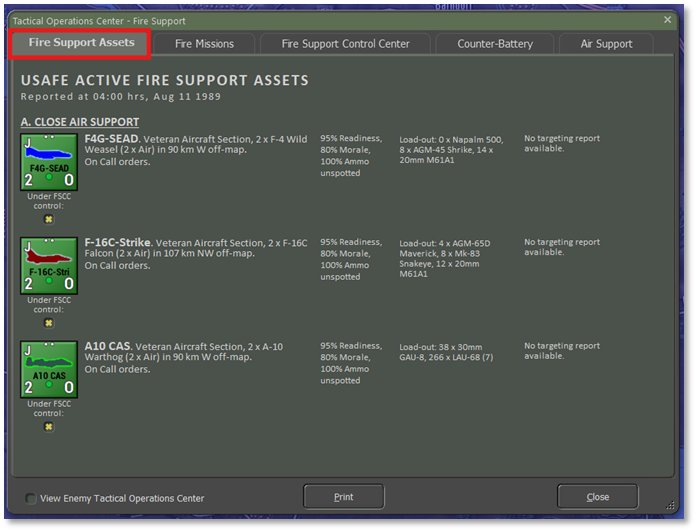

Next, click on the Air Support tab on the right. As can be seen in Section B of the image below, your Air Assets are shown with type and number of aircraft, location, listed Arrival and Withdrawal times (if used in the scenario), and two important pieces of information, Night Ops and All Weather. Night Ops capable aircraft can operate normally in dark conditions. In this case, all three types of aircraft can operate in the current low illumination start of this scenario. All Weather notes aircraft capable of performing strikes while in precipitation/heavy clouds. In this case if the weather were poor, these strikes would not be able to be launched.

Section A of the dialog states the current Air Superiority level. In this case, NATO owns the airspace over the battlefield so flying in is unlikely to encounter enemy aircraft that can bounce your strike causing losses or chasing them off and not doing their missions.

Section C provides an hour by hour forecast of the weather, visibility, cloud ceiling, and the illumination (day or night level of light). Depending on the capabilities of the aircraft, you may need to hold off on a strike until there are favorable conditions for the mission to be executed.

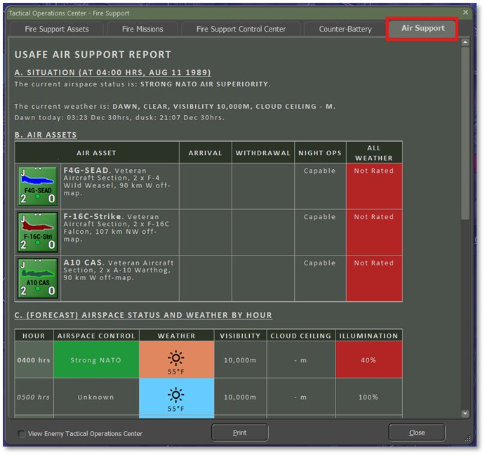

**NOTE:** Airspace Control is only known for the current hour of operations and can change in the next hour. The player does not know when and by how much control will change.

Return to the Fire Control Assets tab to start ordering missions.

## Phase 1: SEAD (Suppression of Enemy Air Defenses)

Before we send other strikes in to take out priority targets, we need to take out the enemies Radar-Guided Surface to Air Missile systems (SAMs) that pose a serious threat to our aircraft. To accomplish this mission, we will use the F-4G SEAD aircraft to attack the SAMs with Anti-Radiation Missiles (ARMs) and if necessary, cannon fire.

### Order the SEAD Airstrike

There are two ways to open the Orders menu to issue the Airstrike. First, with the Fire Support dialog open, right click on the F4G counter image and open the menu as seen below and then click on Air Strike.

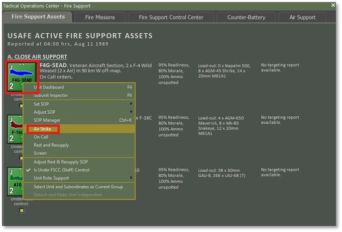

The second option is to right-click on the F4G SEAD unit in the Spotlight panel as seen below.

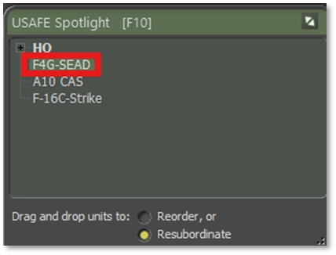

Then select and click on the Air Strike order in the list as seen below.

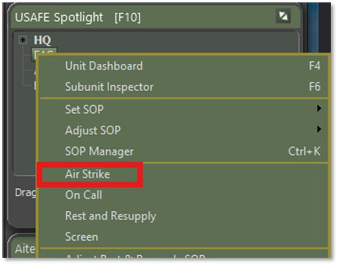

Both methods will open the Plot Target dialog.

Find the Tor (SA-15 Gauntlet launcher) as seen in the image below and click on it.

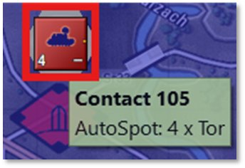

After selecting it you will see the Target Marker with a 1 in it. Since this is the target, click Commit. If you select the wrong target, select cancel and reissue the Air Strike order.

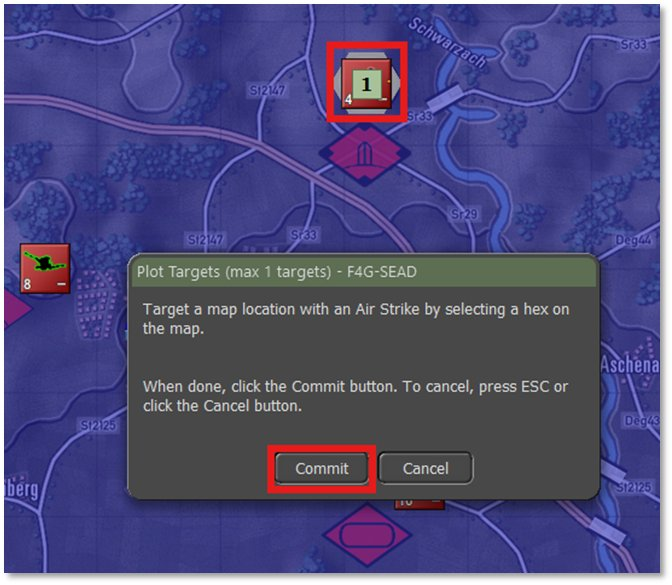

If you reopen the Fire Support tab (or left it open), you will see that the information has been updated to note the Air Strike order and show the strike location and timing and radius of target selection.

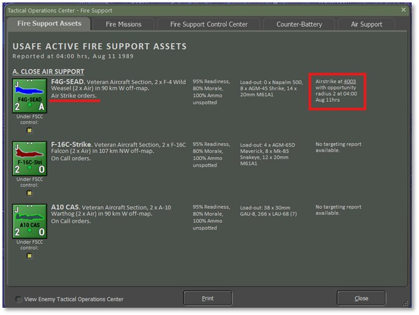

Before we start the turn and resolve the attack, open the Dashboard for the F-4G SEAD unit. You can either right-click the F4G SEAD unit in the Spotlight panel and select Unit Dashboard or right-click the F4G counter in the Fire Support dialog. You will see the dialog seen in the image below.

Important information shown here is the Air Strike order and to the right, you can add minutes of delay for the attack if needed to space out strikes. In this case, we will just start with the attack with zero delay. If you do add some delay, the Appy button will activate, and you need to click it to confirm the delay change.

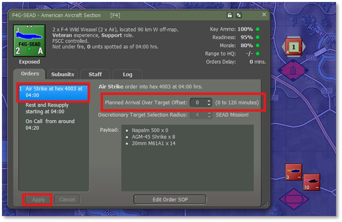

Keep the Dashboard open and click on the Log tab so we can view any information from the upcoming strike as seen in the image below.

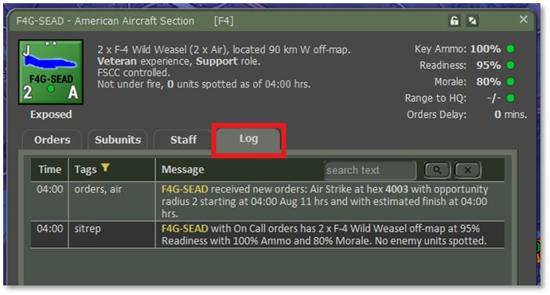

### Resolve the SEAD Mission

Start the turn resolution by clicking the START button.

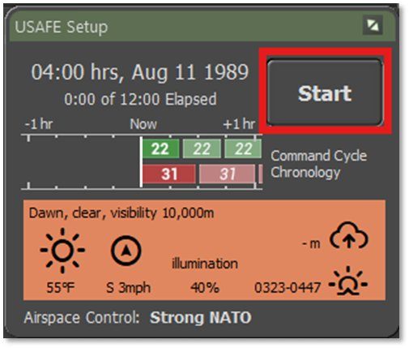

The Start Game Resolution Phase Dialog will pop up and if you are ready, hit the Proceed button.

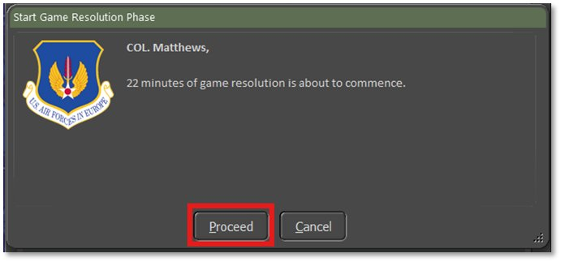

Almost immediately the F4G should pop on the map over the target as seen below. An airstrike area graphic is placed on the map with information about the strike and its timing. You can hide the counters (Ctrl+U - toggle) to see it.

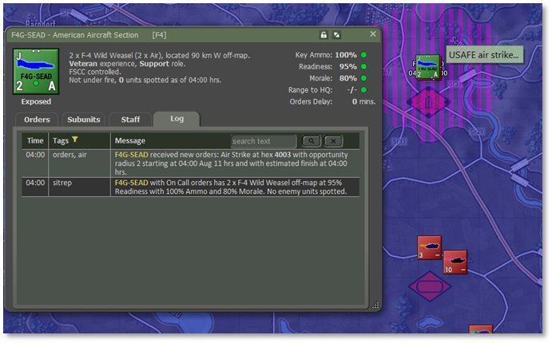

On the way in, there are other spotted AD systems in the area that are not emitting radar signals and cannot be engaged.

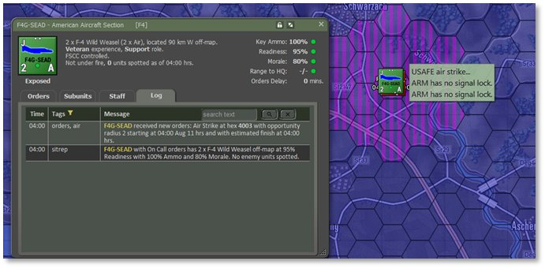

The F4G avoids any AD fire and attacks the target unit. It is possible that the F4Gs may take fire and losses on the strike. If that happens, you can reload and try the strike again.

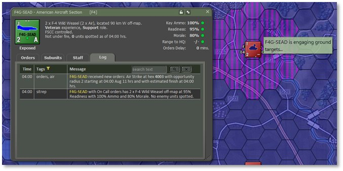

The targets are getting attacked.

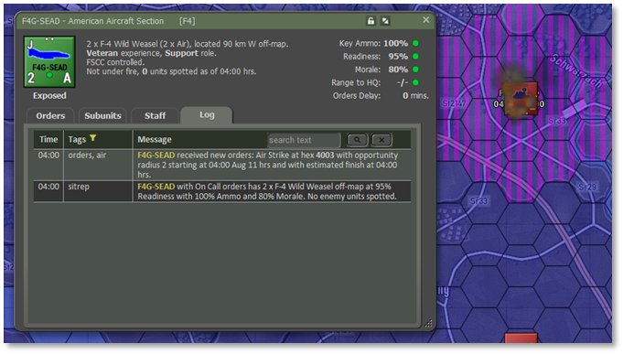

Target units are hit and destroyed, and a combat message is shown and explosions of the units on the map.

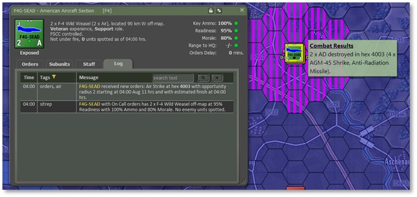

After the strike, the map is updated with the wrecks, and the Log for the F4G is updated with the results of the engagement.

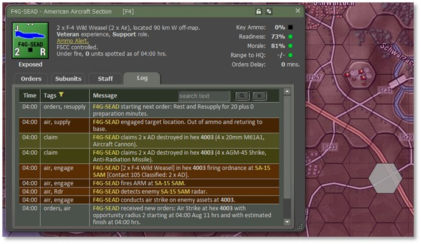

After the strike the aircraft will return to base to rearm and be ready for another mission. If the strike fails to take out all four of the SA-15 Gauntlets (Tor systems), then order the F4Gs to strike them again. Once the SAM threat is gone, we can continue with the other strikes with a greatly reduced chance of loss of our aircraft. Let the turn complete to the next orders phase.

## Phase 2: CAS (Close Air Support)

With the enemy air defense threat greatly reduced, we can deploy attack aircraft to directly support friendly ground forces and engage enemy troops, vehicles, and fortifications.

### Order the CAS Airstrike

From the Spotlight panel, select the A10 CAS unit and right-click on it to bring up the orders menu.

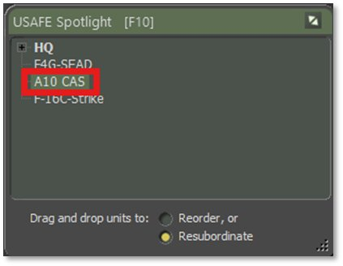

Then select and click on the Air Strike order in the list as seen below.

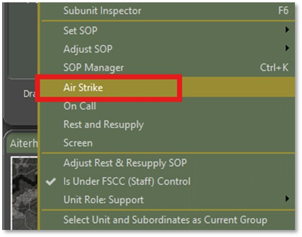

With the Plot Target dialog open, find the Tanks with the T-72s and the T-80s as seen in the image below and click on it.

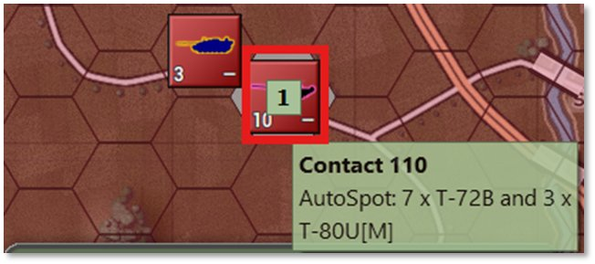

After selecting it you will see the Target Marker with a 1 in it. Since this is the target, click Commit. If you select the wrong target, then cancel and reissue the Air Strike order.

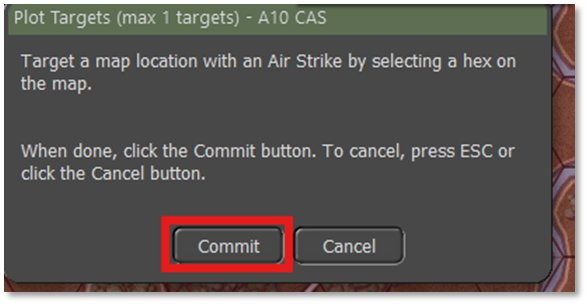

Before we start the turn and resolve the attack, open the Dashboard for the A10 CAS unit. You will see the dialog seen in the image below.

For the Air Strike order, we can adjust the delay time of the strike, but we can also adjust the Target Selection Radius for the strike. This Radius allows the aircraft to locate the best high payoff target in the radius of the strike location. In this case set it to 1 to focus the tank unit. Hit Apply.

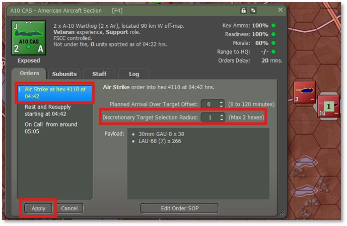

Keep the Dashboard open and click on the Log tab so we can view any information from the upcoming strike as seen in the image below.

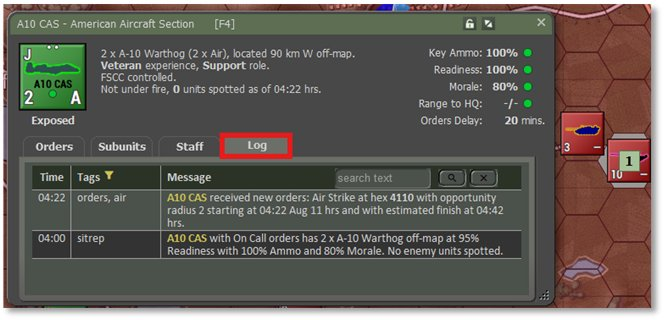

### Resolve the CAS Mission

Start the turn resolution by clicking the START button.

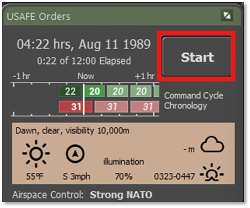

The Start Game Resolution Phase Dialog will pop up and if you are ready, hit the Proceed button.

Unlike the F4G, we need to wait about 20 minutes for the A-10s to fly in from their on-station point off-map. You may have to start another resolution turn before the strike flies in.

Now the A-10s are on the attack.

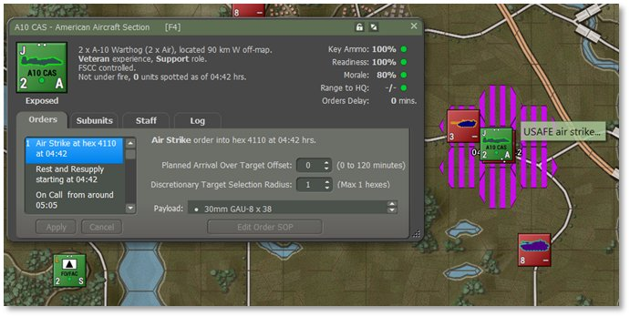

The A-10s avoid any AD fire and attack the target unit. It is possible that the A-10s may take fire and losses on the strike.

The targets are getting attacked.

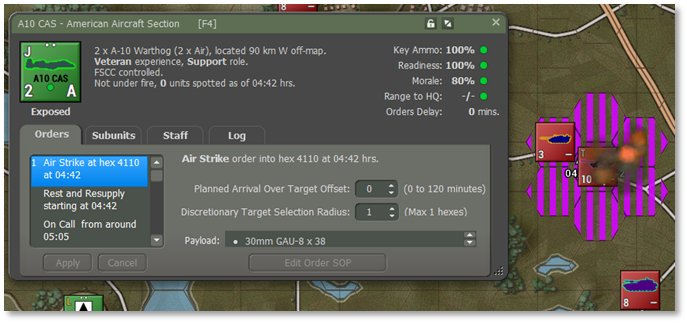

Target units are hit and destroyed, and a combat message is shown and explosions of the units on the map.

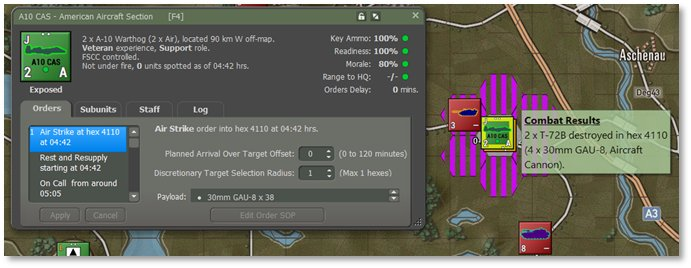

After the strike, the map is updated with the wrecks, and the Log for the A-10s is updated with the results of the engagement.

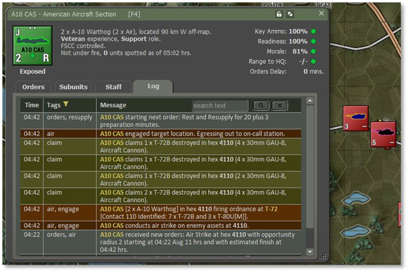

After the strike the aircraft will return to base to rearm and be ready for another mission later. If the strike fails to take out all the enemy tanks, you can send the A-10s on another strike when ready or even use the F-16s after they attack in the next Phase.

You can use any surviving A-10s to hit any of the other targets on the map once you are through the tutorial.

## Phase 3: Strike/Interdiction Attacks

With the enemy air defense threat greatly reduced, we can go after the enemies high-value units. In this case, we will go after the artillery battery.

### Order the Strike/Interdiction Airstrike

From the Spotlight panel, select F-16C Strike unit and right-click on it to bring up the orders menu.

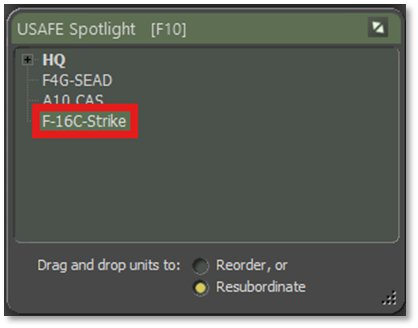

Then select and click on the Air Strike order in the list as seen below.

With the Plot Target dialog open, find the Artillery Battery with the 8x 2S1 Gvozdikas and click on them.

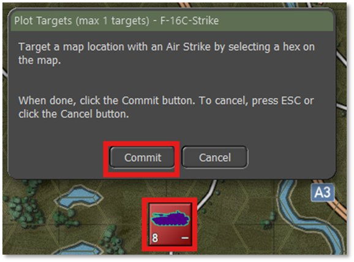.

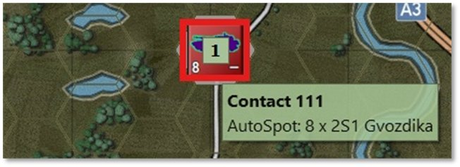

After selecting it you will see the Target Marker with a 1 in it. Since this is the target, click Commit. If you select the wrong target, then cancel and reissue the Air Strike order.

Before we start the turn and resolve the attack, open the Dashboard for the F-16C Strike unit. You will see the dialog seen in the image below.

For the Air Strike order, we can adjust the delay time of the strike, but we can also adjust the Target Selection Radius for the strike. This Radius allows the aircraft to locate the best high payoff target in the radius of the strike location. In this case set it to 1 to focus the tank unit. Hit Apply.

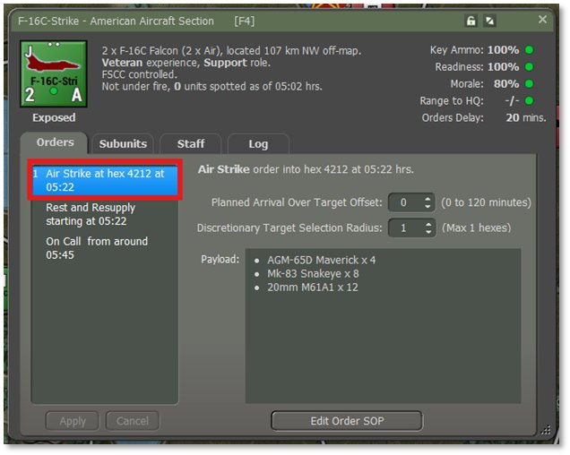

Keep the Dashboard open and click on the Log tab so we can view any information from the upcoming strike as seen in the image below.

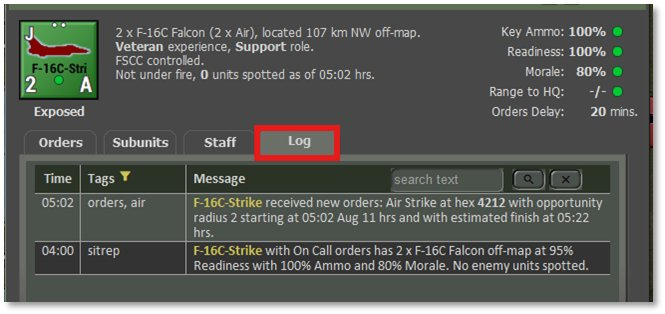

### Resolve the Strike/Interdiction Mission

Start the turn resolution by clicking the START button.

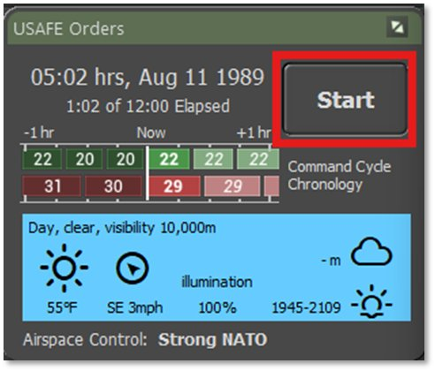

The Start Game Resolution Phase Dialog will pop up and if you are ready, hit the Proceed button.

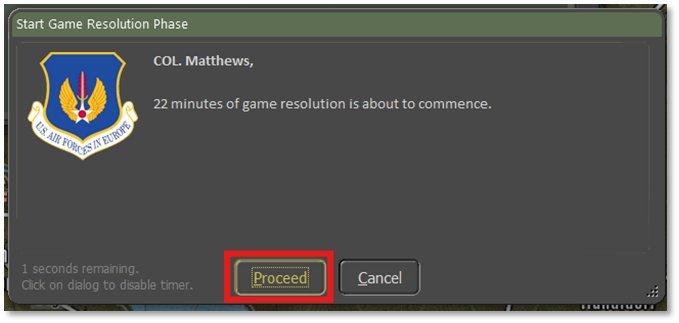

Like the A-10s, we need to wait about 22 minutes for the F-16s to fly in from their on-station point off-map. You may have to start another resolution turn before the strike flies in.

Now the F-16s are on the attack.

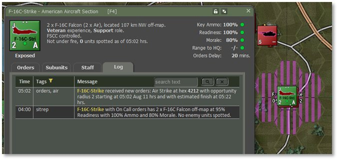

The F-16s avoid any AD fire and attack the target unit. It is possible that the F-16s may take fire and losses on the strike.

The targets are getting attacked.

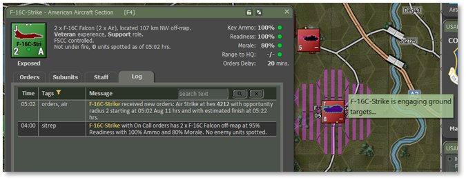

Target units are hit and destroyed, and a combat message is shown and explosions of the units on the map.

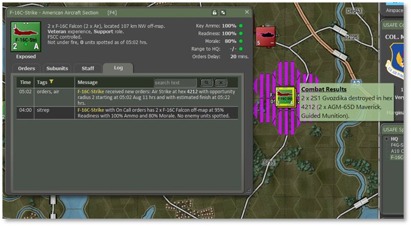

After the strike, the map is updated with the wrecks, and the Log for the F-16s is updated with the results of the engagement.

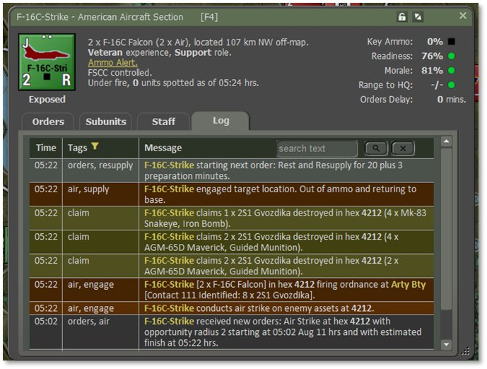

After the strike the aircraft will return to base to rearm and be ready for another mission later. If the strike fails to take out all the enemy artillery units, you can send the F-16s on another strike when ready or even use the A-10s if they are available.

### Continuing Air Strike Operations

At this point, we have covered the various types of airstrike operations and if the strikes went well, they inflicted a fair amount of loss on the enemy forces. It is also possible we lost aircraft to the other air defenses the enemy has on the map.

You can now freely finish out this tutorial by issuing the A-10s and F-16s (once reloaded and ready) additional strike orders to hit all the remaining targets.

You may also wish to retry this scenario at the Grodnard level which will hide the enemy units, and they will need to be spotted by aircraft or the observer ground units.

**NOTE:** This spotting will be easier in actual game scenarios where you have an abundance of ground forces to find the enemy.

### Points to Remember

- Use SEAD aircraft, if you have them, to suppress or eliminate dangerous air defense systems before sending in strike aircraft.

- Use the right tool for the job. Certain aircraft and weapon systems are better suited against certain targets.

- Aircraft are an expensive and rare item to have as a force multiplier, do not send them in blind.

- Even with all the SEAD in the world, the enemy has a lot of air defense systems, and some are hard to see. Always assume there is something out there that can hit your aircraft.

- Pay attention to the Airspace Control level under the weather panel. Flying in when the enemy owns the sky is a high risk action.

- Watch the time of day and the weather. Some aircraft cannot fly in the dark or bad weather.