# Artillery Operations

This tutorial focuses on Artillery Operations, covering the planning, execution, and coordination of indirect fire support.

The screenshot below shows the first screen when the game launches. To proceed, select the “Tutorial” button.

 A list of tutorials will appear. Highlight “Tutorial - Artillery**Operations”**and select the “Play” button at the bottom of the dialog.

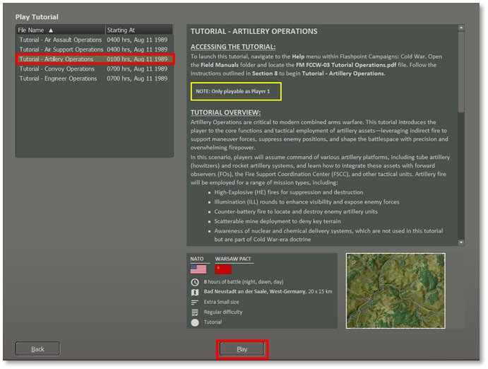

Next, set the Difficulty Settings for this Tutorial mission.

Select “Player 1: NATO Commander.”

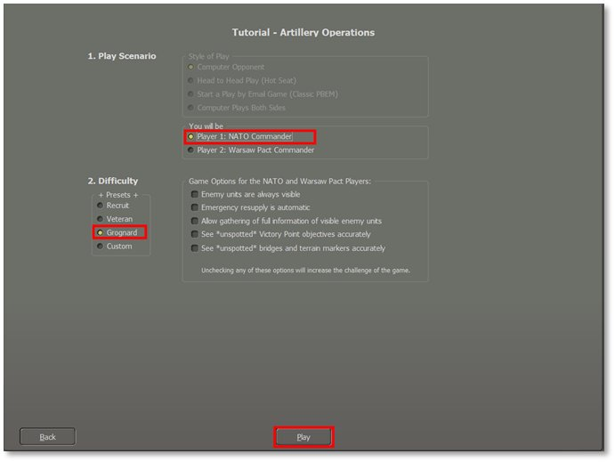 We recommend using the settings shown above for the first attempt at this mission. If that proves too challenging, try again and make the enemy units visible to aid your planning and movement.

Select the Difficulty level at “Grognard” and then select the “Play” button to proceed. You will see a player Announcement describing the Tutorial, and you should read this. When done, click on the Proceed button at the bottom. You have now arrived at the main map and can start to see what you have at your disposal.

**NOTE:** You can set the Difficulty to “Recruit” to help show the enemy units the first time you play the scenario to take some of the guess work out of locating the targets.

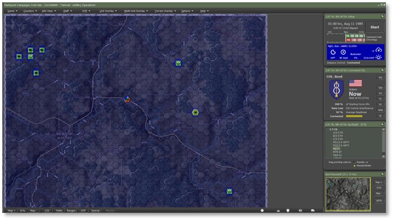 This displays the initial setup of your forces on the map. The next step is to review the troops you will command

## Review Your Forces

Before commencing artillery operations, evaluating the fire support assets under your command is essential. “Artillery” includes everything from small mortars to field guns and howitzers to multiple-launch rocket systems (MLRS) to Surface-to-Surface missiles (SSM). They are indirect fire weapons, so they need to be within range of the enemy, and sometimes there will be a minimum range to consider, too. Keep an eye on their ammunition supply and readiness levels.

To use them, you will often create a Barrage mission for them where they fire a particular number of rounds of ammo of a certain type over a specified period of time, at one or more target hexes. You can manually order these barrages or leave the units “On Call” and assigned to the Fire Support Coordination Center (FSCC) so that the staff can use them for barrages on their own. There are other missions too – Direct Support and Counter Battery, for example – that will be covered below.

The key types of artillery units in this Tutorial are covered. If you select a subunit in the Subunits tab of a Unit Dashboard (as shown below for each unit type) and hit F6, you will get the Subunit Inspector for your selection. This will provide further details on the platform, weapons, sensors, systems, and transport capabilities.

This list from the Chain of Command information panel shows the units you will command in the tutorial. Let’s do a quick review of the units under the 3-5 FA Headquarters.

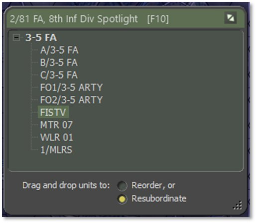

### M109A2 Self-Propelled Howitzer

*The workhorse artillery of NATO*

- Quantity: 3 x Batteries of 8 vehicles plus a command vehicle. These are A/3-5 FA in hex 0506, B/3-5 FA in hex 0307, and C/B 3-5 FA in hex 0706. Note that “FA” stands for “Field Artillery”.

- Role: The M109A2 is a self-propelled 155mm howitzer providing indirect fire support for maneuver units. It can deliver high-explosive, smoke, and illumination rounds to suppress, neutralize, or destroy enemy positions. This is the most common artillery platform and is very versatile.

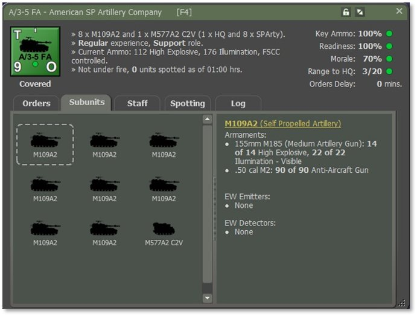

### Forward Observers (FOs)

*Dismounted spotters*

- Quantity: 1x 2-man Team on foot. We have two of these units in this tutorial: FO1/3-5 ARTY in hex 4027 and FO2/3-5 ARTY in hex 3108.

- Role: These are not artillery units themselves, but they are used by artillery units to observe the targets to call in their fire. Forward Observers utilize laser rangefinders, binoculars, and radios to coordinate precision fire missions with supporting units.

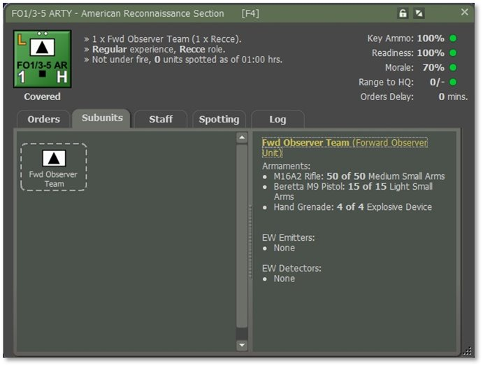

### M981A3 FIST-V (Fire Support Team Vehicle)

*Mounted spotters*

- Quantity: 1x FIST-V vehicle. We have a unit named FISTV in hex 3415.

- Role: The M981A3 FIST-V is an armored vehicle configured for fire support coordination. It has targeting equipment and radios to direct artillery and air support fire missions, enhancing accuracy and response time.

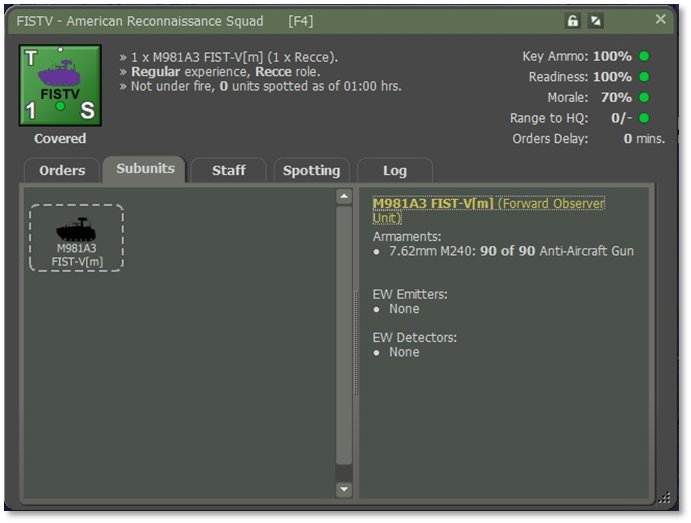

### M106A2 Mortar

*Lighter but more immediate fire support.*

- **Quantity:** 1x Section of four mortar vehicles equipped with large mortars. This is unit MTR 07 in hex 0609.

- **Role:** The M106A2 Mortar section provides close, responsive, indirect fire support to maneuver units. Mounted with a 107mm (4.2-inch) mortar, each vehicle enables rapid displacement and sustained fire missions against enemy infantry, light vehicles, and defensive positions—ideal for suppressing threats in support of company- and battalion-level operations.  We will not use them in this tutorial, but they generally work like the other artillery units, just with shorter range and faster response times.

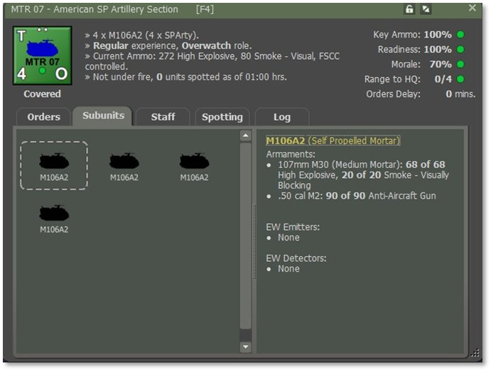

### Counter-Battery Radar

- Quantity: 1x Weapons Locating Radar. We have a unit WLR 01 located 2 km off the map in a general north-west direction. It is long-range and always covers the entire map.

- Role: This is not an artillery unit but rather is used to detect enemy artillery units when they fire. Their Counter-Battery (CB) Radar detects and locates enemy artillery, mortars, and rockets. One system enables rapid detection of enemy artillery and is very valuable in organizing CB fire in return.

**NOTE:** This unit is NOT player-controlled and does its job automatically and sends fire mission requests to the FSCC that need to be served by artillery units that are on Counter-Battery orders.

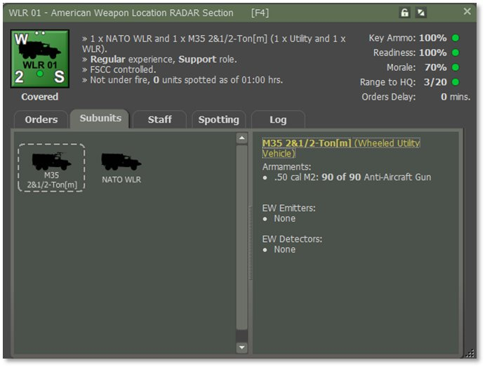

### MLRS (Multiple Launch Rocket System)

*Mass firepower on a large area*

- Quantity: 1x Platoon of three vehicles with a command vehicle. This is the 1/MLRS unit, and it, too, is located off the map – 2 km north-west of the top-left corner.

- Role: The MLRS delivers area saturation and precision rocket fire, capable of engaging high-value targets, enemy concentrations, and artillery positions. It can fire both unguided rockets and precision-guided munitions. When firing unguided rockets, it is capable of multi-hex “area fire” as described below.

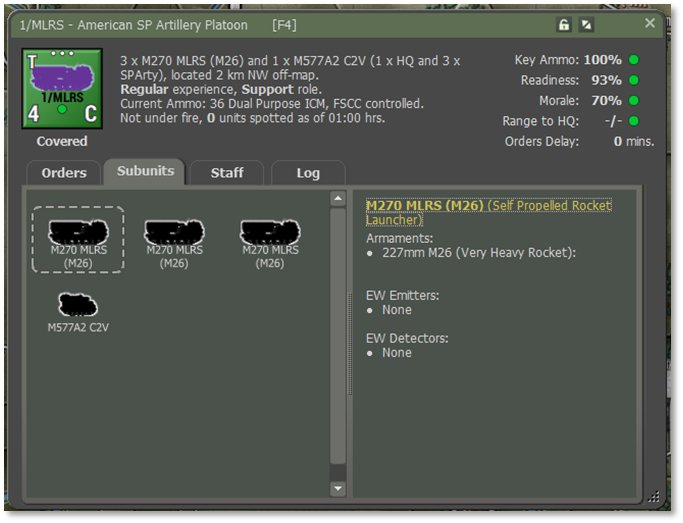

## Starting Fire Support Operations

However, before we proceed, let's review the steps to understand your task better. If you have not already read the Mission Briefing, it is recommended that you do so now before proceeding.

### Opening the Mission Overlay

We will review the Mission Overlay to understand the battlefield layout better. From the Menu, select "Staff," then choose "Import Mission Graphics from Briefing" to display the provided graphics.

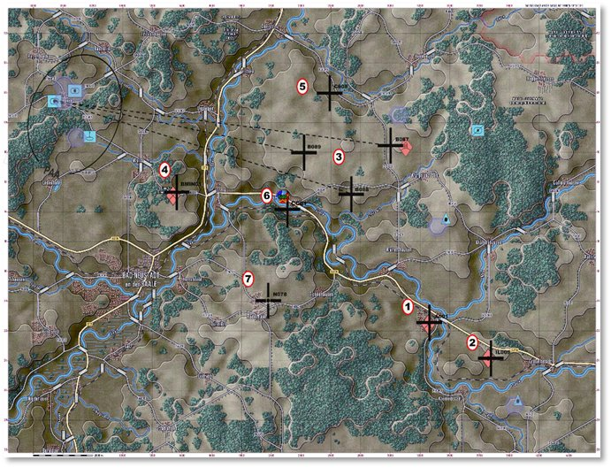

The screenshot above displays your units, which are represented by NATO symbols for artillery, mortars, FISTV, and FO units.

For this tutorial, you will notice black crosses (TRP) showing where you will fire your artillery mission.

**NOTE:** Each numbered circle is the phase number for each task you will do.

Additionally, enemy units on the map show where the suspected enemy positions are located.

Next, we want to open the Staff > Fire Support tab.

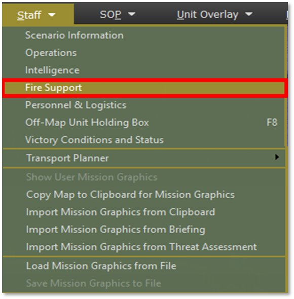

### Main Display – Fire Support Units

Tactical Operations Center – Fire Support interface provides a comprehensive view of all indirect fire assets currently available to the player and is a key part of managing artillery and mortar support during combat operations.

#### Top Menu Tabs

- Fire Support Assets (Active Tab):

o Displays all currently available mortar and artillery units, including their readiness, morale, ammunition levels, and current tasking status.  It can also be used to manage which units are under centralized FSCC control for coordinated fire planning. This helps reduce fire mission latency and ensures synchronized support.

- Fire Missions:

o Lists all currently planned or active fire missions, allowing players to modify or cancel them.

- Fire Support Control Center (FSCC):

o Shows the status of FSCC fire support requests.

- Counter Battery:

o Used to assign counter-battery missions targeting enemy artillery once their firing positions are detected.

- Air Support:

o Manages available air-delivered fire support (e.g., CAS, SEAD), separate from ground-based artillery.

This section, “Fire Support Assets”, displays detailed information about each fire support unit under your control, divided into mortar and artillery sections:

#### Section A: Mortars

- MTR 07 (4× M106A2 107mm mortars in hex 0609). On-call with high ammo levels can fire HE, smoke, and illumination rounds.

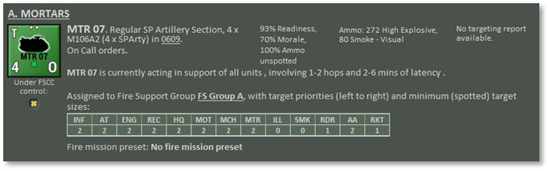

#### Section B: Artillery

- A/3-5 FA (8× M109A2 155mm SP howitzers + 1 M577A2 C2V in hex 0606). These are your central firepower units with heavier payloads, and they are also able to deliver illumination.

- B/3-5 FA (8× M109A2 155mm SP howitzers + 1 M577A2 C2V in hex 0506). These are your central firepower units with heavier payloads, and they are also able to deliver illumination.

- C/3-5 FA (8× M109A2 155mm SP howitzers + 1 M577A2 C2V in hex 0506). These are your central firepower units with heavier payloads, and they are also able to deliver FASCAM (Scattered Mines).

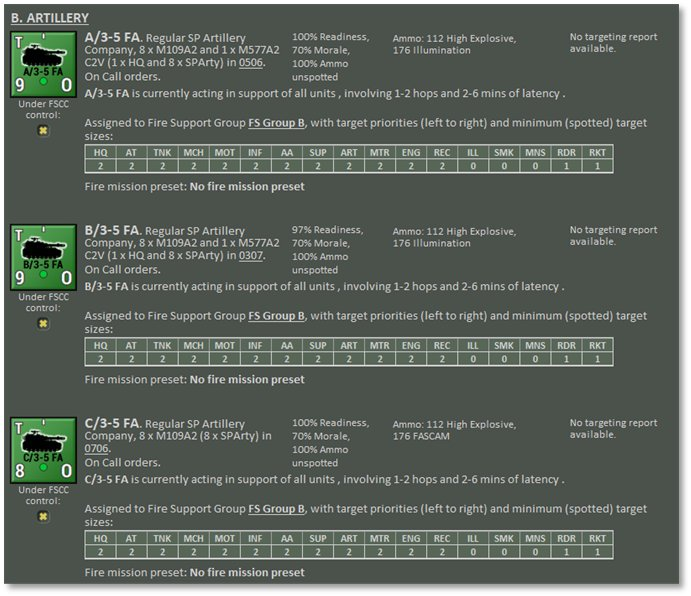

#### Section C: Area Fires

- 1/MLRS (3× M270 MLRS (M39) and 1× M577A2 C2V, located 2 km NW off-map). Operates under Counter-Battery orders.

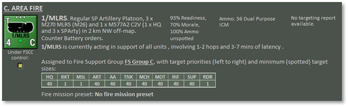

Each unit entry includes:

- Unit readiness and morale

- Types and quantities of ammunition

- Whether the enemy currently spots them

- Communication latency (affecting how fast they respond to fire missions)

This section,” Counter-Battery”, displays detailed information about each counter-battery unit under your control. Divided into weapons, locating radar, and artillery sections with counter-battery orders:

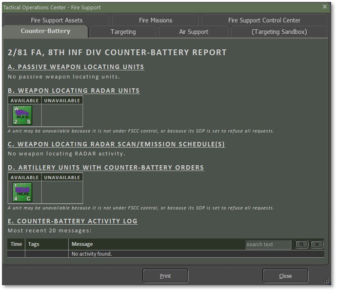

## Phase 1: Basic Artillery Fire Missions

Learn how to request and execute a fundamental artillery fire mission, a “barrage”, to support ground operations. This includes selecting a target, choosing munition types, and understanding delays and effectiveness.

The most common mission is the high-explosive (HE) barrage. These are the steps to create one:

1. Pick an artillery unit. In this case, we will use A Battery of 3-5 Field Artillery (“A/3-5 FA”) located in hex 0506. This is also the second unit in the Chain of Command (“CoC”) display. You can right-click on either the unit icon or on its name in the CoC and select the pop-up menu item “Barrage > HE – Suppression”.

2. This shows the Plotting dialog, which states that you can click on up to six hexes to include in this barrage. To keep things simple, click on any hex that does not contain a friendly unit. The hilltop in hex 2710 would be perfect. Then go back to the Plotting dialog and click on the Commit button to lock in your choice.

3. What then happens is that a map overlay is created with an orange line drawn from the firing unit to the target hex. This is to help you visualize your choices and allocate your fire when dealing with multiple firing units and multiple targets.

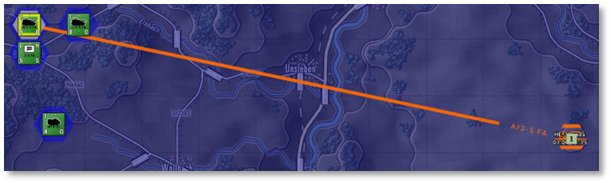

4. If you are not satisfied with your target hex selection, you may drag and drop the target waypoint to a new location, and the orange firing line will update.

5. Your choice of target hexes will be limited by the maximum range of the artillery unit you have selected. There is a range ring overlay that draws these over the map. In the row of buttons at the very bottom of the map is one called “Ranges”. This toggles the display of range rings on and off for the currently selected unit. For artillery, the key range to know is the “Max” range. For our selected unit, this is 20,000 meters and covers virtually all the map. Toggle on this overlay and scroll to the east until you see this bright green arc that says “Max: 20000m”. You cannot shoot beyond this line.

**NOTE:** Some units, especially mortars, have quite a short range and need to be close enough to engage the chosen target hexes.

6. Having committed the mission, you are now presented with the unit Dashboard open to the first of the barrage orders in the Orders tab. You can leave the mission as is or tweak the parameters.

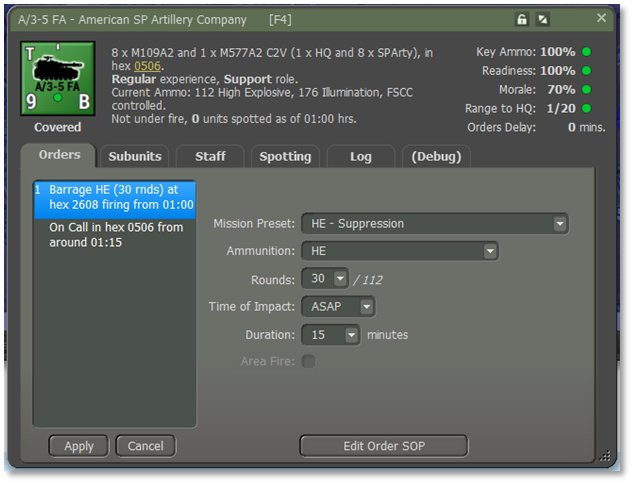

a. The Mission Preset is the template from which the rest of the parameters are taken. If you have changed your mind to switch to the more destructive “Neutralizing” barrage from “Suppression” then this is the place to make that change. It saves you from having to recreate the entire barrage order from scratch. It also lets you plot, say, six target hexes, but then customize the weight of fire that hits each. For example, changing it to “HE- Neutralizing” would fire all 30 rounds in just 5 minutes instead of 15. This will likely catch more of the occupants of the target hex unprepared, but keep their heads down for only 5 instead of 15 minutes.

b. Similarly, the Ammunition type can be changed, as can the number of rounds in total to be fired by the unit, the delay from now to the time of first impact, and the intended length of the barrage.

c. Keep the defaults for now. Should you change them, then you will need to click on the “Apply” button in the lower left of the dashboard to lock them in. If outstanding changes are pending for an order, the order text will be drawn in yellow in the orders stack to remind you.

7. Please follow the same initial procedure as in Step 1 to switch the unit “B/3-5 FA” to a Counter Battery mission.

8. We have both the MLRS and one of your M109 batteries set to Counter Battery now.  You can assign them other missions if you like, it will just prevent them from responding to Counter Battery opportunities until they are available again. There will be more information on Counter Battery fire below.

### **4.3.1** **Resolution**

With this Barrage order entered we can now see how it resolves. Close the unit Dashboard if it is open and press the game Start button to begin turn execution.

Since this mission was plotted to be delivered without delay, and since this is the start of the game and no orders delays are enforced, this barrage will start as soon as the clock starts. Remember that it is spread over 15 minutes of game time. If enemy subunits are killed in the target hex, then you will see a small explosion animation, and a kill marker will be placed there. Otherwise, you will see the line of fire animation, see the artillery impact animations, and hear the sound of the attacker firing. A small crater map marker will be placed in the target hex. Other combat, if any, will be interleaved with this barrage as the clock advances.

The total number of rounds to be fired will be divided amongst the active artillery subunits, and this will result in one or more barrages being observed. In this case, 30 rounds will be delivered between 8 M109A1s.

When the mission is complete, you may see the attacking artillery unit scoot to an adjacent hex for safety (this is determined by its SOP, described elsewhere) and then assume On Call orders. If it does not scoot, then it will assume On Call orders immediately.

The Unit Dashboard (F4) Log tab will show what has happened: 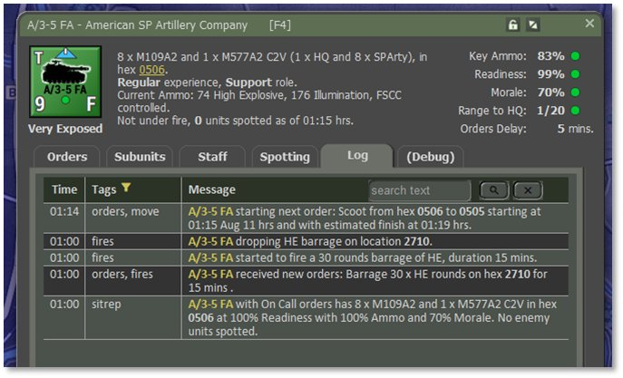

**NOTE:** The game timings are approximate, can be influenced by events on the map, and are subject to rounding error. This is normal and expected.

## Phase 2: Illumination Fire Missions

Illumination fire missions expose enemy activity and terrain under limited visibility, such as during night operations, heavy fog, or smoke-obscured battlefields. These missions improve target acquisition, identification, and engagement by friendly forces, especially when thermal or night-vision capabilities are limited or absent. Illumination rounds can also disrupt enemy concealment efforts and reveal movement across key avenues of approach.

### Set up an Illumination Fire Mission

Since we have already used A Battery of the 3-5 FA, let’s right-click on C/3-5 FA to activate the unit popup menu and order an illumination fire mission. Select the "Barrage" menu item, and a submenu will pop up to select the type of fire mission, in this case “Illumination”.

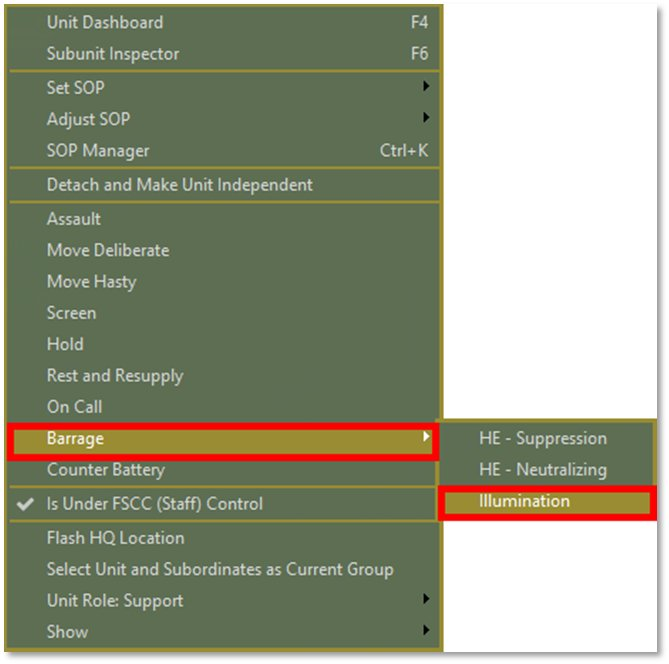

Plot the location where the rounds will hit, somewhere near TRP-IL005 (hex 3824), for example. You can plot up to 6 points on the map. In this case, we will make one point at the map marker, the Phase 2 location near hex 3824. Then click on the “Commit” button.

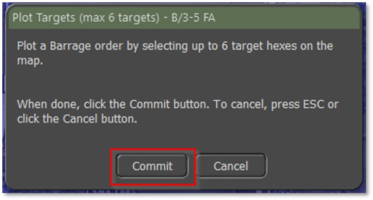 The next screen, shown below, will show the mission's plot.

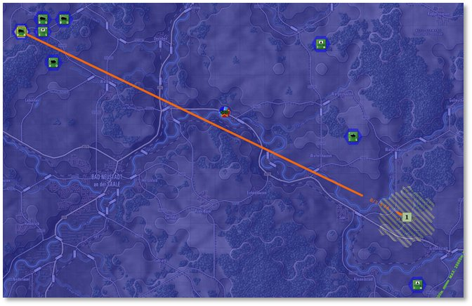

This is the illumination size on the selected hex; as you can see, the diameter is five hexes.

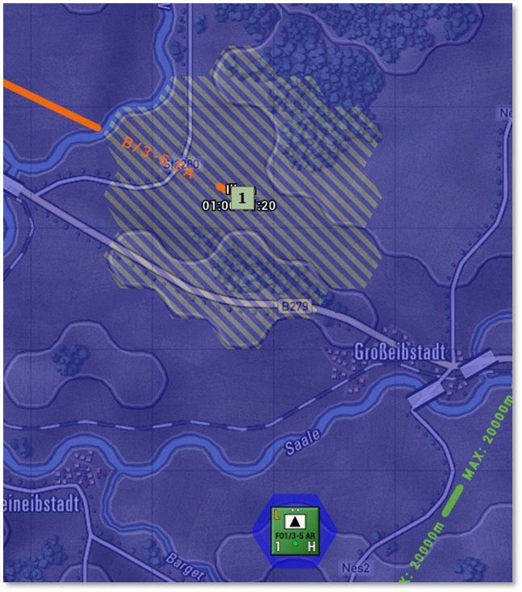 Here, you can adjust the number of rounds and the duration of the mission. We will leave it as is with the defaults.

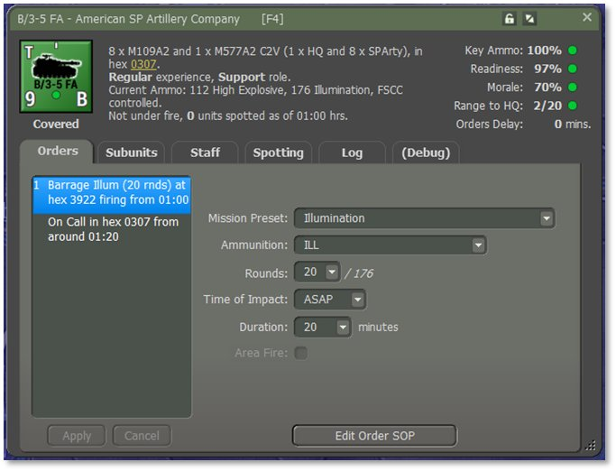

Reduce the map to 70% to see the whole map. But before we start, it won't hurt to save this turn in case you want to return later. Click the “Start” button.

You may see an enemy unit revealed by this Illumination mission.  It’s your choice whether you wish to target it with a fire mission.

### Illumination Rounds and Coverage

Illumination rounds vary by caliber and delivery system. Larger-caliber systems provide more comprehensive coverage and longer illumination duration. The approximate coverage area by caliber is as follows:

|  |  |  |
| --- | --- | --- |
| **Caliber/Weapon System** | **Approximate Coverage** | **Diameter** |
| 50 – 60 mm Mortars | 1 hex | 1 hex |
| 81 – 82 mm Mortars | 7 hexes | 3 hexes |
| 100 mm+ Mortars / 90 – 122mm Guns | 19 hexes | 5 hexes |
| 130 mm+ Guns | 19 hexes | 5 hexes |

Each illumination mission produces a temporary light source over the target area, enabling visual detection of enemy units for a limited time. These effects wear off briefly and do not persist beyond their design window.

### Conducting and Adjusting Illumination

Illumination fire missions are issued via the Barrage Menu and executed similarly to standard artillery missions. Key points to consider:

- Availability: The unit must have *Illumination (Visible)* rounds in its ammunition loadout to fire this mission type.

- Default Fire Mission: 20 rounds are fired over 20 minutes unless manually modified.

- Mission Adjustment:

o Use the Waypoint Button to reposition an existing or planned illumination fire mission.

o The Paths Overlay and Fire Missions Overlay can display active and queued missions, assisting with coordination.

o During the Orders Phase, mission timing can be adjusted or delayed using the Unit Dashboard.

o Avoid overlapping illumination areas to maximize efficiency and reduce waste.

Plan illumination to precede anticipated engagements or assaults by 1–2 minutes to optimize visibility for your maneuver elements.

### Combat Units

- Will request illumination support when engaged by unspotted enemies during low-visibility conditions (e.g., night).

- Units do not actively avoid illumination zones even though these may reveal their position to the enemy. Illumination is treated as a short-lived effect that does not require automatic evasion.

### Fire Support Coordination Center (FSCC)

- Processes illumination requests with a delay of several minutes, depending on the command and system load.

- Allocates illumination only if a suitable artillery asset is available and capable.

- FSCC optimizes the mission by:

o Evaluating the current tactical situation and nearby threats.

o Avoiding overlaps with other illuminated areas.

o Preventing friendly units from being exposed unnecessarily.

o Targeting last known enemy contact locations when appropriate.

o Placing illumination near the requesting unit’s location to ensure tactical relevance.

o Coordinating counter-battery fires to suppress or neutralize enemy artillery threats.

### Computer-Controlled Player (AI):

- Uses FSCC routines to request and execute illumination fire missions.

- Relies on Scenario Designer-defined Illumination Barrage Battle Plans (BP) if included in the mission scripting.

- Typically employs illumination to support attacks, ambushes, or when operating in low-light conditions.

**NOTE:** Illumination rounds do not cause damage and cannot be used to suppress or destroy enemy forces. Their value lies purely in increasing visibility and battlefield awareness.

Check the unit loadout to confirm it has `ILLUM` or `Illumination-Visible` ammunition.

Right-click on unit C/3-5 FA and select “Dashboard (F4)” and then select “Subunit Inspector (F6)” to view details.

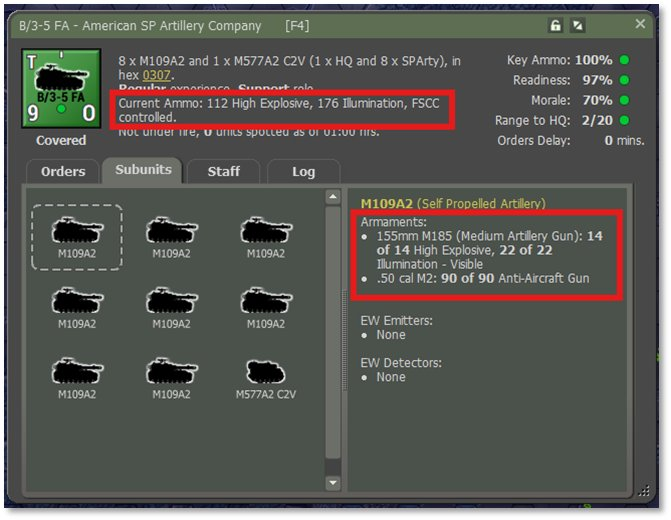

As you can see, this first subunit has “14 of 14 HE”, and “22 of 22 Illumination-Visible” rounds. For “8 x M109A2s”, there is a total of 112 rounds of HE, and 176 Illumination.

## When FOs can’t Spot: Night Operations

Here’s a checklist of possible reasons and solutions:

### Illumination Conditions

- 0100 hrs = deep night. Even under clear skies, illumination is low.

- *Direct line of sight* doesn't always mean a *visible target*. If the moon phase is a new moon or is waning, FOs will not have enough light to acquire targets visually.

**Solution:** Use illumination fire missions from artillery or mortars to light up the area.

### Target Concealment

- Enemy units may be:

o Stationary

o In forest, urban terrain, or improved positions

o Not moving or firing, reducing detection chances

**Solution:**Use area fire missions or recon elements to provoke enemy action.

### FO Unit Capabilities

- FOs may have:

o Limited night observation gear

o Low detection skill rating in game mechanics

o Obstructed terrain details (trees, buildings, elevation)

**Solution:**Move FO units to a higher elevation or closer range and check their equipment (e.g., no NVDs).

## Illumination Fire Mission Triggers

The following action and situations can lead to Illumination missions being generated.

### Previous Enemy Contact

- The enemy was spotted or engaged in that hex during daylight or earlier in the battle.

- FO suspects the enemy remained or returned after repositioning or disengaging.

### Tactical Terrain Features

- Choke points, hilltops, bridges, wood lines, or likely cover positions.

- FO might suspect units are hiding or staging there.

### Indirect Indicators from Other Units

- Nearby friendly units report:

o Being fired upon from a general direction

o Unexplained mine strikes, ATGM hits, or small arms fire

### Recon Intelligence

- A scout team or friendly unit saw the enemy earlier, then lost contact.

- FO attempts to reacquire enemy targets with illumination.

### Movement Detected on FLIR / NVDs (if equipped)

- Even without a complete visual ID, FOs may have thermal movement detected at night and want confirmation.

## Phase 3: Pre-Planned Strike

An artillery pre-planned strike is a fire mission scheduled before the battle begins or before a specific event occurs, such as an assault or landing. Unlike on-call fire missions that react to enemy contact, pre-planned strikes shape the battlefield, disrupt enemy positions, and support friendly movements at critical times. They are carefully timed and targeted based on the operation plan, ensuring artillery fire is already in motion when the battle starts. This gives friendly forces a tactical advantage by suppressing enemies, covering maneuvers, or interdicting reinforcements.

In essence, this is a series of generic barrages (as in Phase 1) where multiple artillery units are firing against multiple targets in accordance with a plan that the player has created.

In this tutorial, do a pre-planned strike using units A/3-5FA and C/3-5 FA to drop several HE barrages each in the general vicinity of Staff overlay marker “3”. Select A Battery, start a “Barrage > HE – Neutralizing” mission and then click on two hexes in the approximate target area. You will see the unit Dashboard Orders tab appear when you Commit the mission and you will be able to edit each of the individual barrage orders. Note that if you assign too many rounds to early barrages, you may starve subsequent barrages of ammo.

Repeat the process for C/3-5 FA and examine the barrage overlay map. You may deliberately want to have multiple barrages on the same hex or you may want to spread them out. Drag and drop the waypoints to relocate the target hex.

If all, or substantially all the ammo is expended, then you will likely want a final order of Rest and Resupply to bring the supply state up to 100% again.

When you resolve the turn you will see the firing lines, animations, and explosions of any enemy units that have been caught in the fire.

## Phase 4: Counter-Battery Fire

Counter-battery fire uses friendly artillery to destroy enemy artillery after they have fired. Counter-battery fire is most effective when targeting stationery or slow-moving enemy artillery.

This operation requires that a friendly artillery unit under FSCC control be given “On Call” or “Counter Battery” orders. (The difference between the two is that On Call units can respond to any type of fire support request, while those dedicated to Counter Battery are reserved solely for that and thus have increased availability when needed.)  The unit will then allow the staff to assign barrage orders to suspected enemy artillery units during the turn resolution phase.

You can of course manually issue a Barrage order on a location where you have detected or believe enemy artillery to be instead of letting the Counter Battery system handle this task, but that will result in missing some opportunities that are fleeting in between your order cycles.

Detecting suspected enemy artillery units is the job of highly specialized radar units called Weapons Locating Radars. There is one in this scenario called **WLR 01**. It works automatically to send fire mission requests to the FSCC that will be served by available counter-battery artillery.

### WLR Details:

- Provide periodic counter-battery detection to support FSCC-directed fire missions. Operates in a concealed location with controlled emission cycles to balance coverage and survivability.

- Radar is pre-deployed and starts scanning at 01:00 hrs.

- Players receive automated CB detection only during active emission windows.

- Scans can support counter-battery fire, FASCAM delivery, or target updates.

- The record of activity can be found in the Fire Support TOC Counter Battery report if desired.

### Other Notes

- WLR operations and counter-battery fire are automated and are not under player control.

- Not every scenario has WLR for each side

- Consider setting “Shoot & Scoot” SOP for your own artillery units to reposition after firing. Movement is the most effective countermeasure for counter-battery fire.

While the scenario is resolving turn resolution, you will see occasional enemy artillery fire that will be responded to with counter battery fire. The Fire Support TOC Counter Battery report will contain details of this fire.

## Phase 5: DPICM Fire Missions

Dual-Purpose Improved Conventional Munitions (DPICM, or ICM) are artillery shells that release multiple bomblets, each designed to destroy light armor and personnel targets over a wide area. DPICM is ideal for saturating grid locations containing dispersed or mobile infantry, motorized units, or soft-skinned vehicles.

This type of munition is used the same way that HE is used, except that the appropriate munition type is “ICM”.

Unit 1/MLRS has an allocation of ICM rounds. Select this unit and order a Barrage > Improved Conventional Munitions (ICM) mission in the general vicinity of the Staff overlay labeled as “5”. This is a suspected location of enemy infantry, logistics, or lightly armored vehicles (e.g., TRP C009).

Area Fire. The MLRS unit is rated as an ‘area fire’ unit due to the large number of rockets it can deliver simultaneously. It can spread these rockets over seven hexes instead of just one. By default, the mission will default to a single target hex, and this may be desirable from time to time, but the true benefit is to distribute fire over a much larger area. To do so, check the Area Fire checkbox shown below, then click the usual orders edit Apply button. You will see the barrage overlay redraw from one target hex to seven.

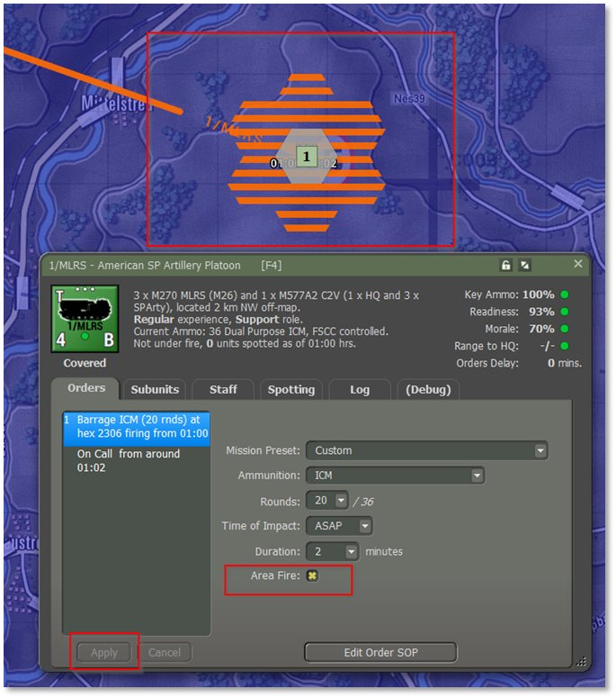

**Resolution**. When you press the Play button to resolve the game turn, you will see this barrage occur, and the results will be logged to the Radio Log.

### Tips for Success

- DPICM is less effective against dug-in or heavily armored units.

- Avoid using DPICM near friendly forces to prevent fratricide.

- It works best when the target is dispersed or on the move in open terrain.

## Phase 6: Scatterable Mines (FASCAM)

Deploy scatterable mines to disrupt enemy movement, delay reinforcements, or canalize forces into kill zones. Note that it takes a minimum of 40 rounds of FASCAM in total to create a minefield. Smaller numbers will not result in the creation of a minefield.

This type of munition is used the same way that HE is used except that the appropriate munition type is “MINES”.

Unit C/3-5 FA has an allocation of FASCAM rounds sufficient to generate a minefield. Select this unit and order a Barrage
> Scatterable Mines (FASCAM) mission on the hex in the general vicinity of
the Staff overlay labeled as “6”.

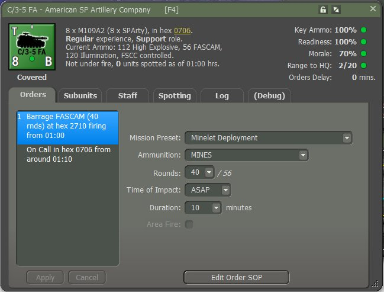

### Resolution

When you press the Play button to resolve the game turn, you will see this barrage occur, and the results will be logged to the Radio Log.

### Monitor Mine Deployment

- Observe the target area once the fire mission is complete.

- The target hex will display a minefield icon.

- Enemy units entering the hex may be damaged or disrupted.

### Coordinate with Friendly Movement

- Ensure no friendly units pass through the mined area.

- Consider using additional fires to channel enemy movement into the FASCAM zone.

### Tips for Success

- Plan ahead – scatterable mines are not immediately visible to the enemy.

- Combine with pre-planned fires or ambush zones for maximum effect.

- Avoid using near your own routes or fallback positions.