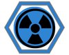

# Deep Dive: NBC Operations

!!! quote
    *"Gas! Gas! Gas! – The call you never want to hear but must always be ready for."* – Infantryman’s Lament

***Flashpoint Campaigns: Cold War****, Nuclear, Biological, and Chemical (NBC) Operations* introduces hazardous battlefield conditions that impact unit effectiveness and survivability. Units must be adequately equipped and trained to operate in contaminated environments requiring specialized tactics and planning.

!!! note

    NATO and Warsaw Pact NBC units may have different equipment, but NBC detection and protection follow the same procedures in-game. Both factions must monitor contamination zones, deploy protective gear, and respond to threats using identical gameplay logic.

This tutorial covers NBC Operations, detailing NBC protection and battlefield management in the event of WMD threats.

## What are NBC Operations?

NBC Operations involve combat scenarios where nuclear, biological, or chemical weapons have been deployed, requiring specialized training and protective measures for units to function effectively.

### NBC Protection Measures:

- Units must activate NBC protective gear to reduce exposure.

- Contaminated areas should be avoided when possible.

- Specialized NBC reconnaissance units can assess hazard zones.

- In Flashpoint Campaigns, recon units can be utilized to locate and mark contaminated areas.

### Decontamination Procedures:

- Decontamination units can restore the combat effectiveness of forces contaminated by chemical agents.

- Decontamination sites must be established for prolonged operations.

- In Flashpoint Campaigns, decontamination is performed by units under Rest and Resupply orders.

### Combat in NBC Environments:

- Units operating in contaminated zones may suffer reduced combat efficiency.

- NBC-capable artillery and munitions may be available in specific scenarios.

### Post-NBC Considerations:

- Units in contaminated areas may need replacement or prolonged recovery.

- Commanders must factor NBC threats into operational planning.

By mastering NBC Operations, players can mitigate the impact of WMDs and maintain combat effectiveness in extreme battlefield conditions.

## Weapons of Mass Destruction (WMDs)

Weapons of Mass Destruction are potent and must be handled with caution. In the game, WMDs come in three types: Nuclear Weapons, Persistent Chemical Weapons, and Non-Persistent Chemical Weapons.

!!! note

    The game does not include biological weapons.

### Nuclear Weapons:

A nuclear strike delivers a devastating attack that affects all units within its blast radius. The game simulates a tactical nuclear weapon with a yield of approximately 10 kilotons and a blast radius of 2 kilometers.

- Effects: Units within the blast zone face severe losses based on their protection rating, NBC rating, cover, and posture.

- Contamination: For the remainder of the game, the ground remains contaminated within two hexes of the blast center. Units passing through contaminated zones risk further losses and contamination.

- Helicopters: The shock wave destroys all helicopters within a 5 km radius.

- Decontamination: To recover from radiation exposure, units must receive a Resupply order and spend time clearing the hazard.

Nuclear Contamination (Blue Side Nuclear Attack)

### Persistent Chemical Weapons:

Persistent chemical attacks involve nerve or blood agents that linger in the area, creating long-term hazards.

- Effects: Units caught in the strike can suffer losses based on their NBC rating and readiness while donning protective gear (MOPP suits). Morale may also drop significantly.

- Contamination: Contaminated areas are marked on the map for the entire game. Any units moving through these zones are attacked and contaminated.

- Decontamination: Units can be decontaminated through a Resupply order, but their combat effectiveness is reduced while wearing protective gear.

Chemical Contamination (Blue Side Attack)

### Non-Persistent Chemical Weapons:

Non-persistent chemical strikes use agents that dissipate quickly but still pose a severe immediate threat.

- Effects: Units caught in the attack can suffer losses based on their NBC rating and readiness while donning MOPP suits. Morale may also drop.

- Contamination: The gas cloud remains visible on the map briefly, dissipating according to weather conditions. Units passing through the cloud are vulnerable to attack.
