# Engineering Operations

This tutorial focuses on Combat Engineering Operations, covering the planning, execution, and coordination of Engineering capabilities.

The screenshot below shows the first screen when the game launches. To proceed, click the “Tutorial” button.

As shown in the screen below, a list of tutorials will appear. Select Tutorial - Engineer Operations, review the scenario briefing information, then click the “Play” button at the bottom of the dialog.

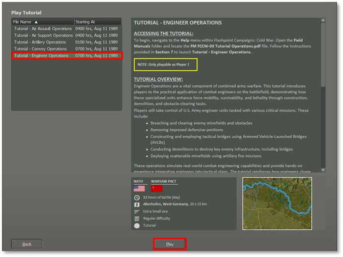

Next, as shown in the screenshot below, we must set the Difficulty Settings for this Tutorial mission.

Select “Player 1: NATO Commander.”

For your first attempt at this mission, use the settings shown in the screen above.

Select the Difficulty level at “Grognard”, then select the “Play” button to proceed to the next screen.

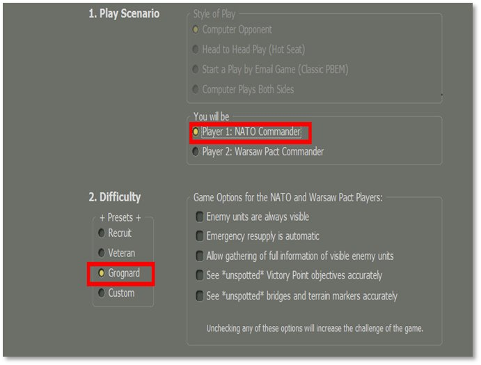The following screen shows the Mission information after selecting the “Play” button. See the screen below. The Mission information screen is on a 5 second timer. Left click on the screen to keep it from closing.

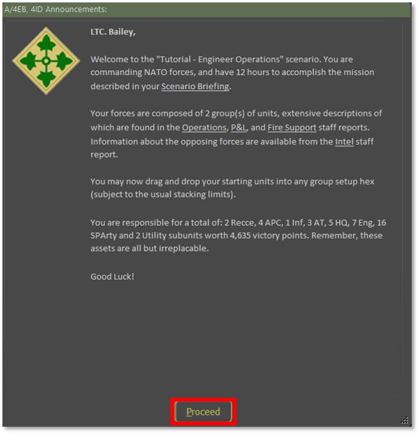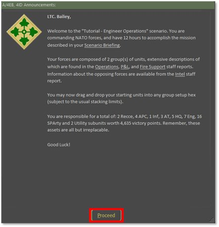Once you have read the mission information in the screenshot above, click the “Proceed” button.

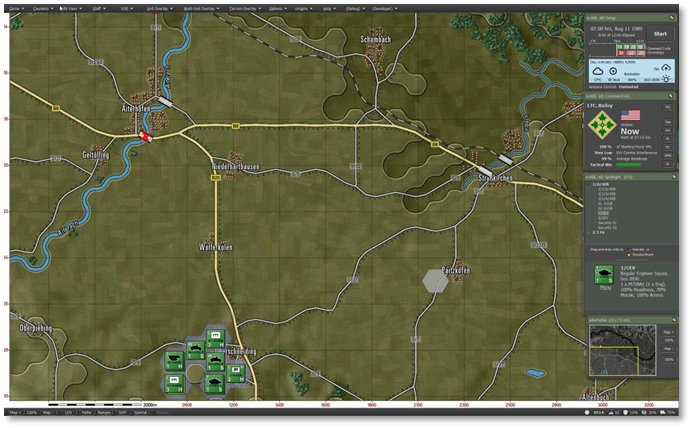

After you select the “Proceed” button, you will be presented with a screen, as shown above. This displays your forces' initial setup on the map.

The next step is to review the troops you will command.

## Reviewing Your Forces

Before initiating any engineering operations, it is critical to assess the capabilities and limitations of your engineering units. Review the assigned engineer assets, including combat engineer platoons, engineer squad vehicles, and specialized equipment such as AVLBs, CEVs, and demolition charges. Verify their readiness levels, current orders, and position on the map to ensure they are correctly positioned to execute breaching, clearing, or demolition tasks. Understanding the strengths and weaknesses of each asset will enable you to plan and allocate resources for upcoming operations effectively, whether it involves breaching minefields, clearing obstacles, or demolishing key infrastructure.

### Combat Engineer Platoon

- Composition: 1x Combat Engineer Platoon

- Transport: 1x M113A2 APCs

- Role: The Combat Engineer Platoon is responsible for breaching obstacles, clearing minefields, and providing mobility support for maneuver forces. The M113A1 APCs provide armored transport and protection for 1x engineer squads during operations.

As shown in the screenshot below.

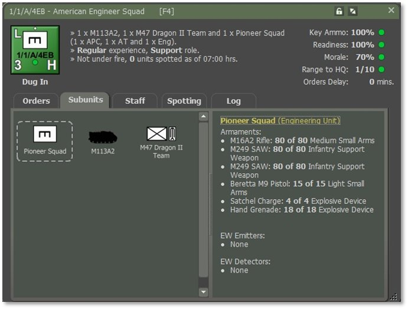

### M60 AVLB (Armored Vehicle Launched Bridge)

- Quantity: 1x M60 AVLBs

- Role: The M60 AVLBs provide gap-crossing capabilities, enabling rapid deployment of mobile bridges to overcome water obstacles, anti-tank ditches, and other terrain impediments. These vehicles are essential for maintaining mobility during the assault phase.

As shown in the screenshot below.

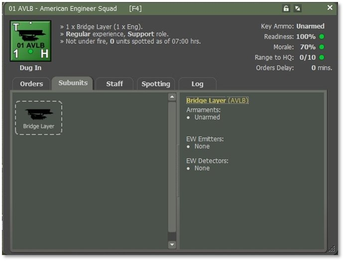

### M728 CEV (Combat Engineer Vehicle)

- Quantity: 1x M728 CEV

- Role: The M728 CEV is equipped with dozer blades and demolition guns for obstacle reduction and destruction. They are vital assets for clearing debris, fortifications, and other obstructions impeding friendly movement.

As shown in the screenshot below.

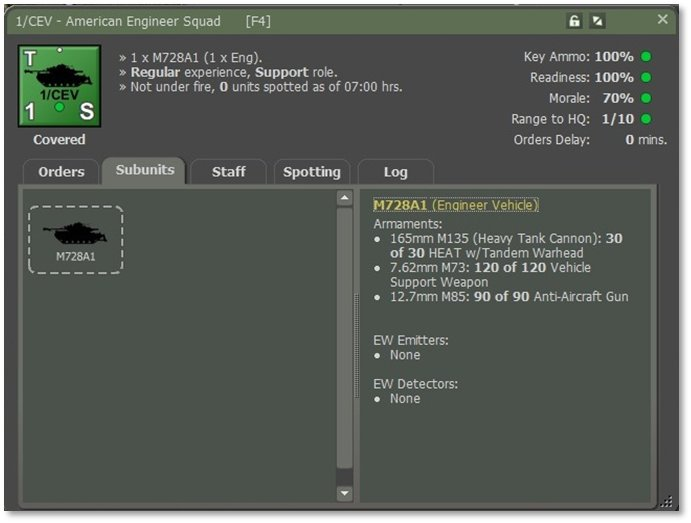

### M998 HMMWV Security Elements

- Quantity: 1x M988 HMMWV[m]

- Role: The M998 serves as security and escort vehicle for the engineer convoy. These light vehicles are tasked with screening engineer assets from potential threats and providing convoy protection.

As shown in the screenshot below.

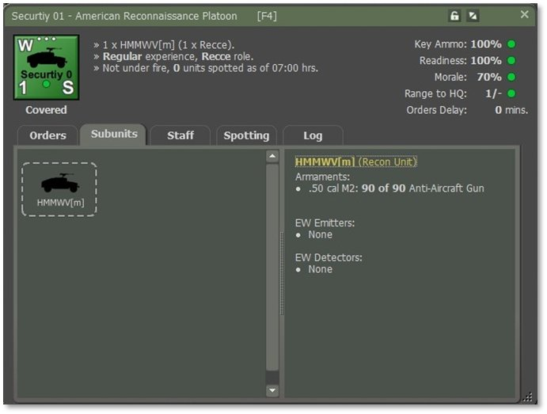

### M109A2 Artillery Batteries

- Quantity: 2x M109A2 Batteries

- Role: The Artillery Batteries provide indirect fire support, focusing on deploying smoke rounds to obscure friendly movement and disrupt enemy observation. The smoke coverage can also conceal engineering breaching operations and assist in maneuvering.

As shown in the screenshot below.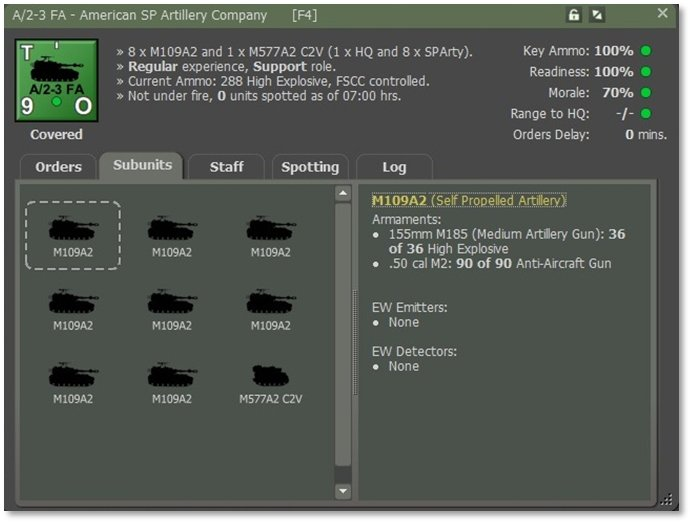

**NOTE:** These units are off-map and can be accessed on the OB Tree in the Spotlight Panel or via the Fire Support (FS) Dialog.

## Starting the Mobility Operations

However, before we proceed, let's review the steps to understand your task better.

### Opening the Mission Overlay

The first step is to review the Mission Overlay to understand the battlefield layout better. Select " Staff " from the Menu, then choose "Import Mission Graphics from Briefing" to display the operational graphics on the map.

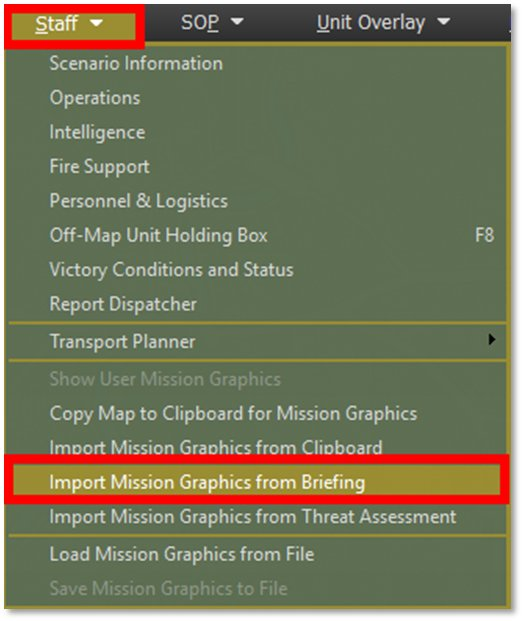

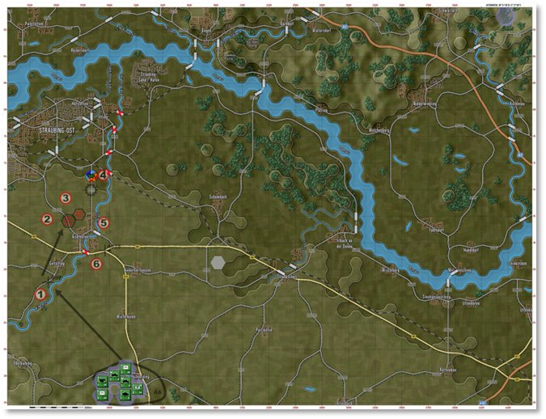

The image above displays the operational graphics along with the units of 1/A/4 Engineer Bn. For this tutorial, you will notice black arrows showing where you will move your forces. Each numbered circle is the phase number for each task you will do.

Additionally, map makers are included on the overlay to indicate the locations of suspected minefields, obstacles, and improved positions on the map.

Next, we want to open “Staff > Operations,” as shown in the image on the next page.

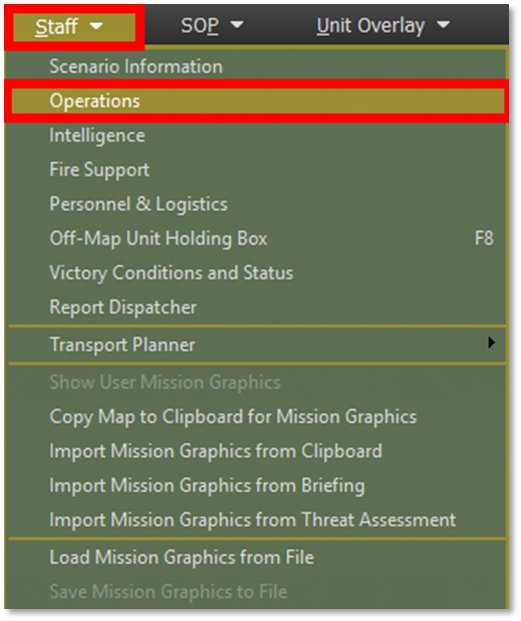

Then select the “Engineering” tab, as shown below.

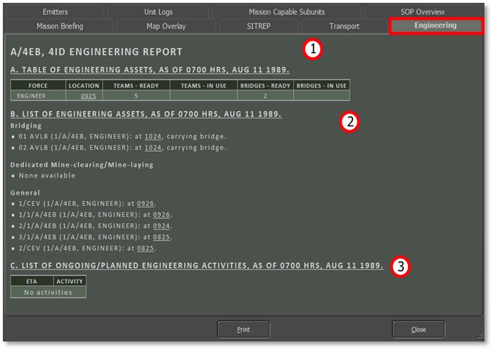

### Engineer Report

**The Engineer Report** provides a comprehensive overview of all engineering support available and current operational efforts. It includes **①** a table and **②** a categorized list of engineering assets, covering bridging equipment, dedicated mine-clearing and mine-laying systems, and general engineering tools. **③** The report also outlines ongoing and planned engineering activities, ensuring leadership remains informed of mobility, counter mobility, and survivability efforts across the operational area.

### Phase 1: Deploying an AVLB to Bridge a River

Phase 1 of the Mobility Operations focuses on executing a Wet Gap Crossing to establish a secure bridgehead for follow-on forces. The objective is to transport designated units across the water obstacle using AVLBs, engineer boats, and amphibious vehicles while maintaining tactical cohesion and suppressing enemy interference.

All units must adhere to established movement routes and control measures to prevent congestion and maintain operational tempo.

Upon securing the far bank, units will consolidate, establish a defensive perimeter, and prepare for subsequent phases.

Select the Combat Engineer formation and move it to the designated riverbank. Hold down the “Ctrl key”, left click, and drag it to create a box. As shown below. All units within the box will then be selected. Plot your movement now by choosing the HQ unit and giving it a Hasty movement order to hex 0522. All the selected units will be given the same movement order. To ensure that the units are not bunched up in the same hex, the final waypoint for each unit can be adjusted to a new hex. The 01 AVLB unit should remain in hex 0522 to bridge the river at that location.

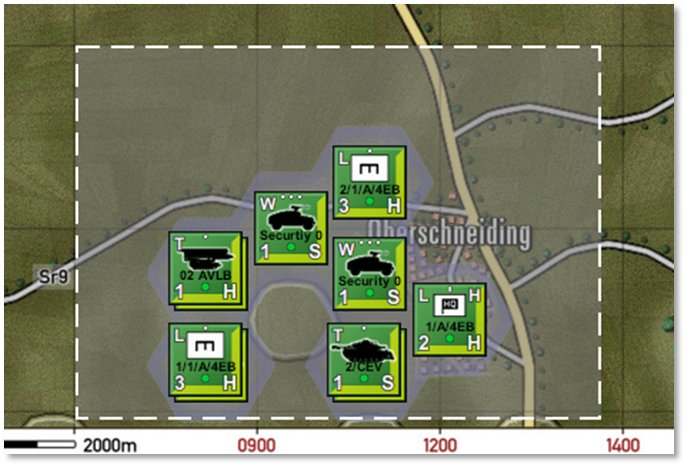

Have the artillery battery lay a smoke screen on the west bank, concealing the AVLB laying the bridge. Select the A/2-3 FA battery on the OOB tree and right-click to bring up the following Dashboard screen, as shown below.

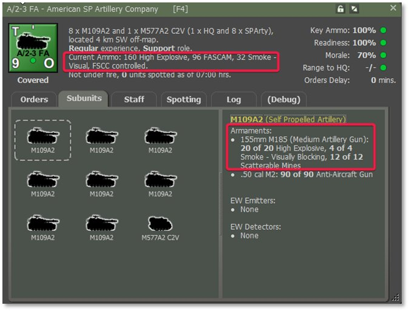

You will notice that this artillery battery with the first red box has 160 rounds of HE, 96 rounds of FASCAM, and 32 rounds of Smoke total for the battery. This indicates that this artillery unit can fire Smoke and FASCAM missions. And you will also notice that FSCC controls the unit. The red box to the right is for a single howitzer with 20 rounds of HE, 4 rounds of Smoke, and 12 rounds of Scatterable mines. However, we want to override the FSCC and fire smoke rounds on the other side of the river.

In the Orders tab, right-click on the blue highlighted “on Call” order to get a screen as shown below.

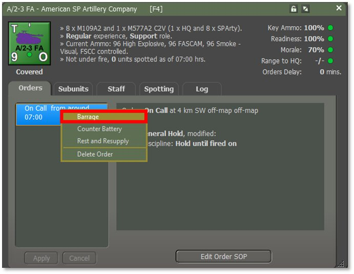Select the word Barrage, and a pop-up screen appears where you plot the location where the rounds will hit. We will select the TRP S07 (Hex 0421) location for this fire mission. Then click on the “Commit” button.

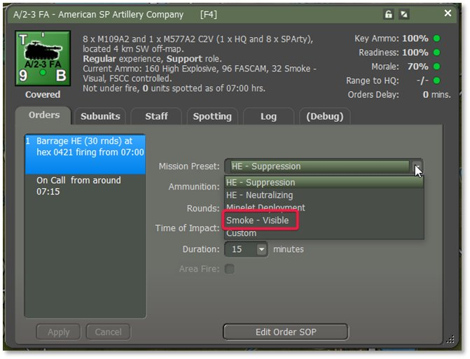

The next screen, shown above, shows the type of mission it is set for. We want to change the Mission Preset to 'Smoke—Visible', as shown in the screen below.

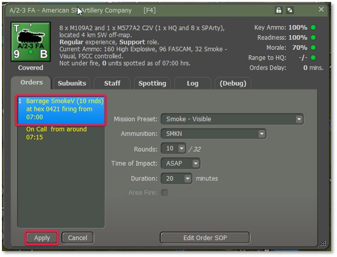

Here, you can adjust the number of rounds, the time of impact, and the duration. Leave the rest of the settings for this tutorial as shown in the screenshot above. Then click on the “Apply” button to confirm this Fire Mission. Exit with the “X” in the top right corner.

With planning complete, orders issued, and SOPs adjusted, it’s time to commence the battle. Adjust the map zoom to 80 percent or lower for a more comprehensive battlefield view. Use the mini-map to navigate and position the main map in the lower left corner for optimal visibility during the engagement.

Before proceeding, consider saving the game to secure your setup in case of unexpected issues.

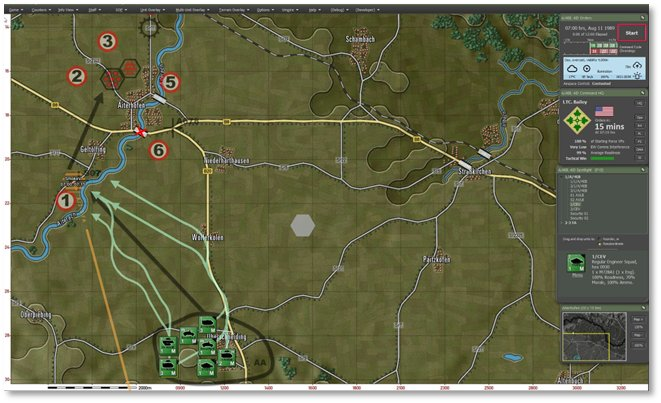

When ready, click the “Start” button in the upper right corner to initiate the battle. The game will resolve the next 15 minutes of game time, advancing to the next Orders Phase. If the operation proceeds as planned, the engineer units will move toward the river during this initial phase.

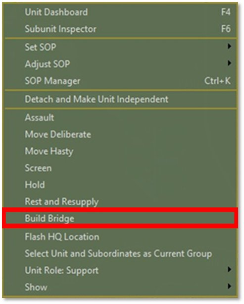

The units move. The 01 AVLB is now in position next to the riverbank and can be ordered to lay a bridge over it by selecting the “Build Bridge” button, as shown above.

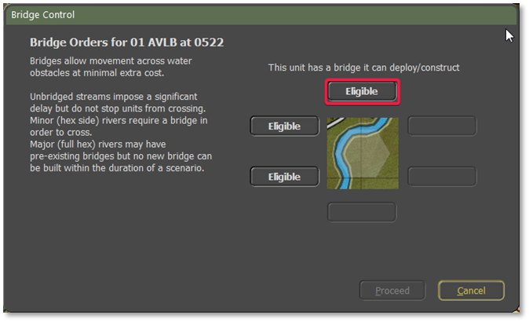

As shown in the screenshot above, I have only three eligible locations to build a bridge. One is in the north corner, another is in the middle across from the 01 AVLB, and the other is in the southwest corner.

**NOTE:** Depending on the actions of other units and the location you select near the river, the number of Eligible bridging locations may differ from what is shown here.

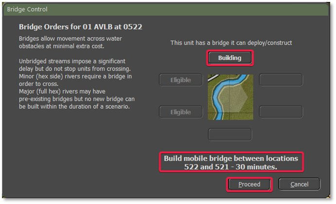

The screenshot above shows where the bridge will be built at the north corner, as indicated by the Hex Grids, along with the estimated time required to complete the build. Then select the “Proceed” button.

You can also go to the Staff>Operations and select the “Engineering” tab for the same information, as shown in the screen below.

Now you can hit Start to resolve the next turn and get the bridge placed.

**NOTE:** Depending on the current orders cycle timing, you may have to hit Start more than once to finish the bridge.

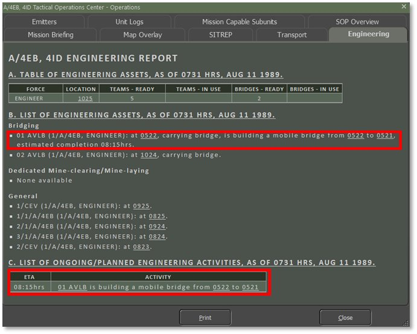Referring to the screenshot above, the first red box shows which M60 AVLB is conducting the bridge layer and the time it will take.

The second red box gives the same information.

The map marker indicating that the bridge is being constructed can barely be seen. Here is an example of what a map building marker looks like with the completion time (the one in the Tutorial should be around 8:00) as shown below.

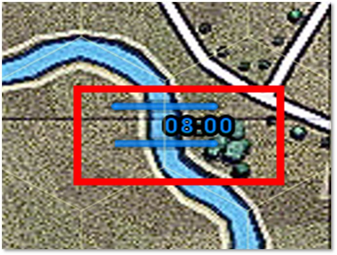

Press Start at this time to commence the next turn resolution and the 01 AVLB will begin the process of laying the bridge. It may take several turns to complete the bridge. Once the bridge building is complete, the Engineer Report will now show that the 01 AVLB bridge is deployed. You can also go to the unit dashboard to see the Log for that bridge layer. As shown in the Dashboard/Log below.

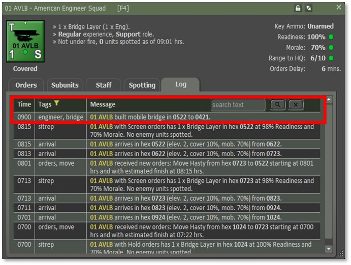This is what the symbol for a bridge being laid looks like on the map. Once it is complete, it will look like the one shown below.

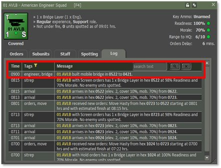Laying Bridge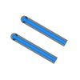Completed Bridge

Once the bridge is laid, move the Combat Engineer’s units across the deployed bridge. Select all the engineering units except the AVLB that laid the bridge and move them to hex 0520, the town of Geltolfing. Move the AVLB to hex 0521 on the other side of the river to retrieve the bridge. You don’t want to leave an unattended bridge for the enemy to use.

Once crossing is complete, select the AVLB and use the “Remove Bridge” command to deny enemy use and then link back up with the rest of the Combat Engineer units.

Right-click on the 01 AVLB and select “Remove Bridge,” as shown in image below.

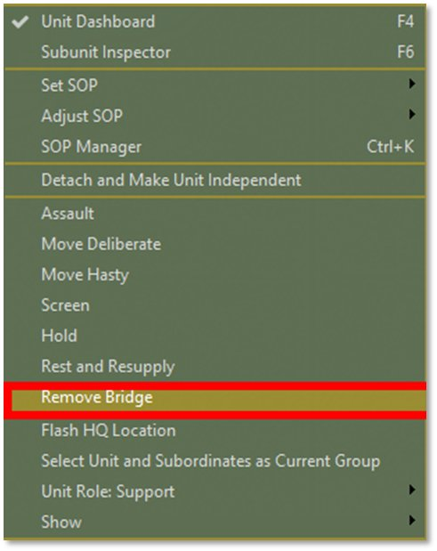

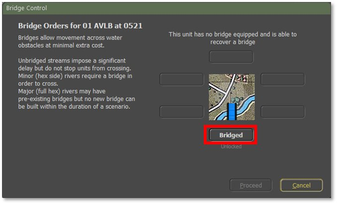

When you select “Remove Bridge,” a screen will appear as shown above. Select the “Bridge” button, which will change to “Recovering” as shown below. This will display the location and estimated time required to recover the bridge. Then, select the “Proceed” button.

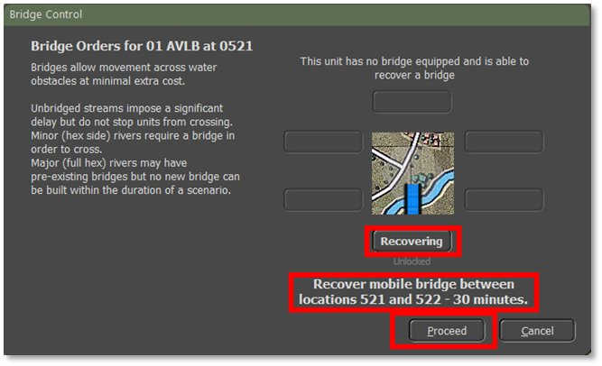

As the 01 AVLB recovers the bridge, the Combat Engineers will move North to the suspected minefields.

To ensure that you gave orders to the 01 AVLB, right-click on the unit and select the “Unit Dashboard,” which will display the orders given. See image below.

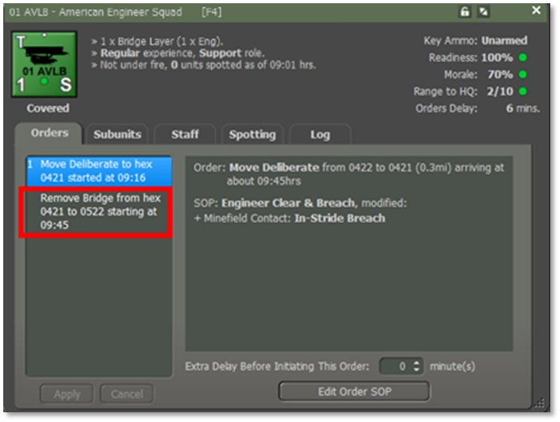

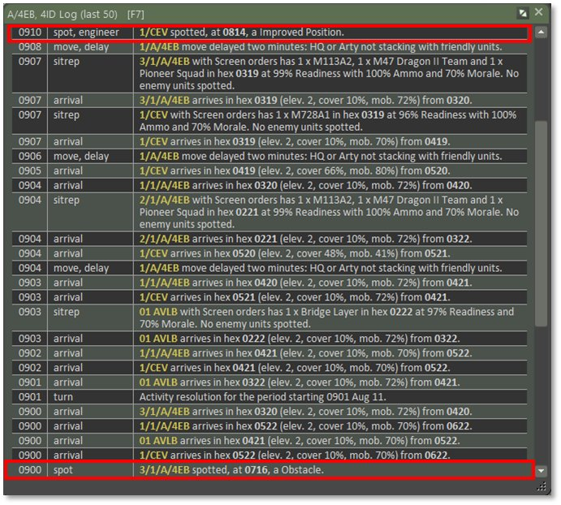At 0900, 3/1/A/4EB, spotted enemy obstacles. At 0910, 1/CEV spotted an improved position, as shown in the radio log. However, as shown above in the screenshot of the radio Log, they cannot detect any minefields.

**NOTE:** The time the units spot the obstacle, and the improved position may vary.

### Phase 2: Removing a Minefield

After successfully constructing the bridge over the river and getting the Combat Engineer units across, the Combat Engineer Units moves to the suspected enemy minefield.

**NOTE:** The Map Markers on the overlay do not indicate the locations of the minefields. You will not know where the minefield is located unless you drive over it.

The best approach is to stop short of what is shown on the overlay and send one engineer squad or a CEV to locate the minefield.

Upon reaching the minefield, engineers will initiate breaching operations using standard explosive and mechanical methods to create a clear lane for advancing units. Priority is given to establishing a primary breach lane with sufficient width to accommodate armored and mechanized assets.

Move one of the combat engineer Squad or one of the CEVs to the location of the suspected minefield (hex 0616). The only way to determine if there are mines in the hex is for the unit to move into the hex. In the following turn after confirming the presents of mines, give the Combat Engineer/CEV unit a “lift mines” order from the orders menu.

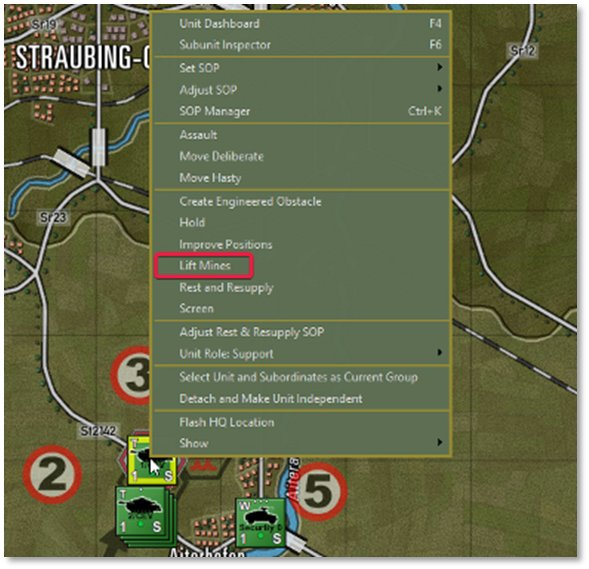

During the next turn resolution, the Engineer unit will begin the process of clearing a path through the minefields so that other units can pass through it. At this time other units can be moved such as security units to provide protection to the Engineer unit preforming the mine clearing. Press Start to begin the next turn resolution.

It may take several turn resolutions to lift the mines. Once the mines have been cleared, a popup message will appear on the map. Also, there will be a notation in the unit’s log.

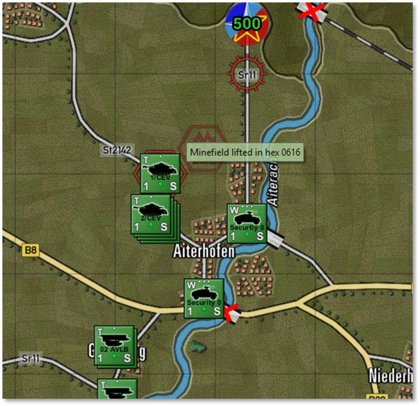

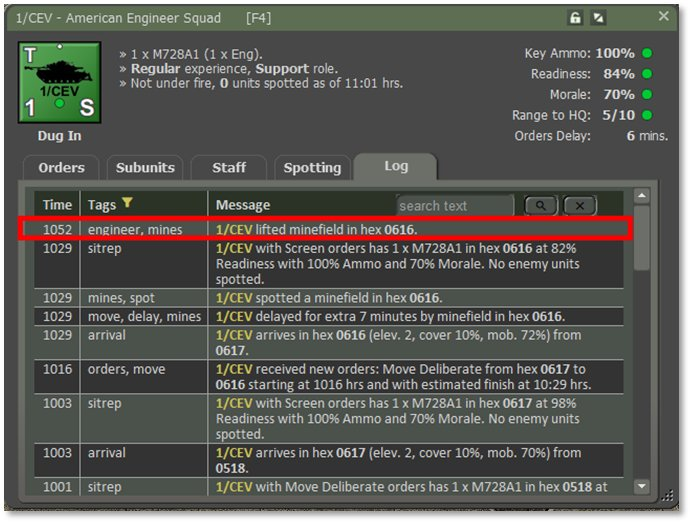

The map marker shown is a minefield and a reduced minefield.

Minefield  Reduced Minefield

### Phase 3: Removing an Obstacle

After the minefield is successfully cleared, engineers will focus on removing the remaining obstacles that could impede follow-on forces.

Engineers will use specialized equipment and demolition assets to systematically remove or neutralize obstacles, ensuring clear lanes for advancing units. Priority will be given to high-threat areas such as roadblocks, tank traps, and wire entanglements.

Coordination with security elements will be maintained throughout to prevent enemy interference and protect engineer teams during clearance operations.

Select a combat engineer squad of the other CEV and move them to the target location.

Select the “Remove Obstacle” command to remove enemy barriers, as shown in this page's vertically split layout. The relevant screenshot is on the right side.

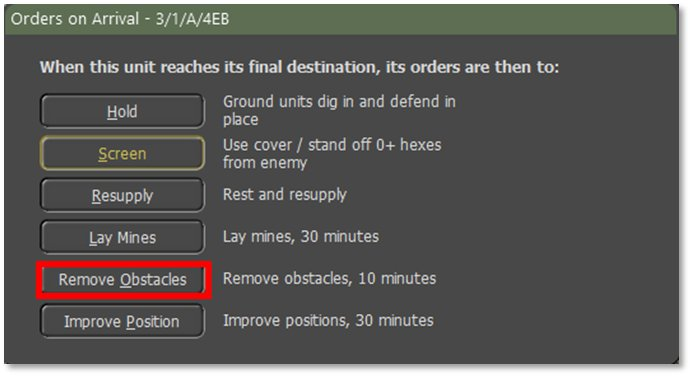

The Unit Log records the time obstacles are removed, as shown above.

The map marker shown is an obstacle and a reduced obstacle, as shown below.

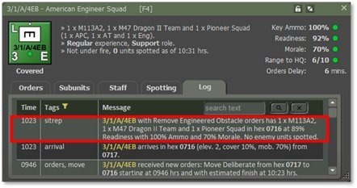Obstacle  Reduced Obstacle.

### Phase 4: Removing Improved Position

After removing the obstacle, send another combat engineer squad or a CEV to the spotted Improved Position. Upon reaching the designated improved position, the engineer units will begin clearing to dismantle enemy fortifications. This phase involves using demolition charges, heavy equipment, and manual tools to systematically reduce bunkers, fighting positions, and other defensive structures. Engineers will coordinate with adjacent units to ensure the area is secure before commencing demolition operations. Once cleared, the area will be marked for follow-on forces to occupy or bypass as the operational plan requires.

Use the same procedure as in Section 3.2.5 above, Removing an Obstacle.

The map markers shown below are an improved position and a reduced position.

Improved Position 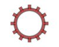Reduced Position

### Phase 5: Engineers Destroying a Bridge

While the Combat Engineer Squad and CEV move to remove the improved position, another combat engineer squad with Security will proceed to the designated bridge demolition site (hex 0817). The objective is to cut the enemy’s critical lines of communication and impede their ability to reinforce or withdraw.

Coordination with security elements will be maintained throughout the operation to prevent enemy interference during the detonation phase.

Move a combat engineer squad (in M113s) to the target bridge location to destroy the bridge.

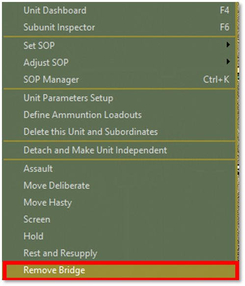

Have the artillery battery (B/2-3 FA) lay a smoke screen on the river's east bank.

Select the engineer squad and issue the “Remove Bridge” command, as shown above. The Bridge Control screen will appear. Select the “Bridged” location as in the image below.

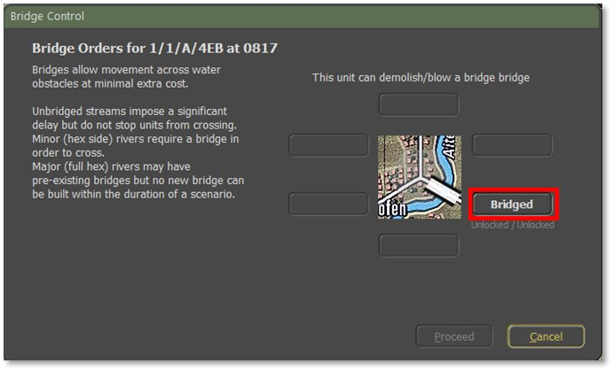Select the Bridge as shown above.

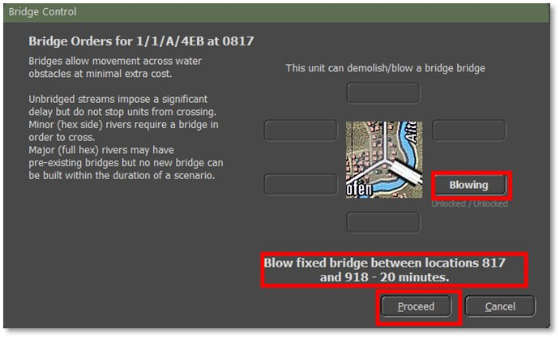It will change from bridge to “Blowing” as shown above. Then select the “Proceed” button.

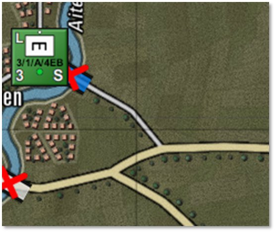

The map marker shown below is a blown bridge.

Blown Bridge

### Phase 6: Artillery Scatterable Mines

After completing the bridge's destruction, engineers will request artillery-delivered scatterable mines to reinforce key areas and disrupt potential enemy counterattacks. Target areas will be designated based on expected enemy avenues of approach and tactical objectives. Engineers will coordinate with artillery units to establish precise fire missions, ensuring proper placement of scatterable mines while minimizing risk to friendly forces.

Once the minefields are laid, engineers will reposition to support subsequent operations as directed.

Select your artillery unit capable of firing scatterable mines. Both batteries can fire scatterable mines.

Target TRP A078. Instead of using “Smoke—Visible” as we did for smoke rounds, we will change it to “Scatterable Mines (FASCAM).”

As shown below, the map marker differs between blue and red, making it easier to see on the map. It lands randomly in the hex, so it is unmapped. Hence, it is neutral. It's just as dangerous for you to go through as the enemy.

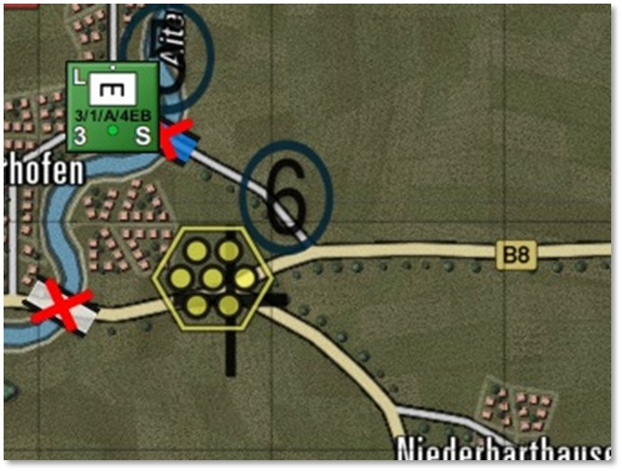