# NBC Operations

This tutorial focuses on NBC Operations, covering the planning, execution, and coordination of chemical and nuclear strikes.

The screenshot below shows the first screen when the game launches. To proceed, click the “Tutorial” button.

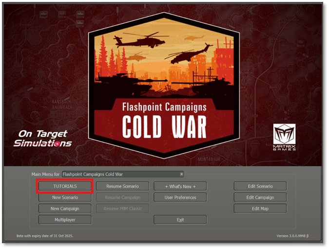

As shown in the screenshot below, a list of tutorials will appear. Highlight **Tutorial - Artillery Operations** and select the “Play” button at the bottom of the dialog. As shown in the vertically split layout on the next page, the left side contains the relevant screenshot.

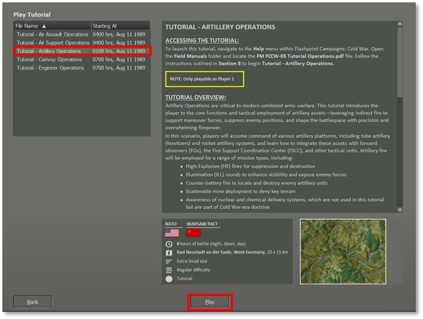

Next, as shown in the screenshot below, we must set the Difficulty Settings for this Tutorial mission.

Select “Player 1: NATO Commander.”

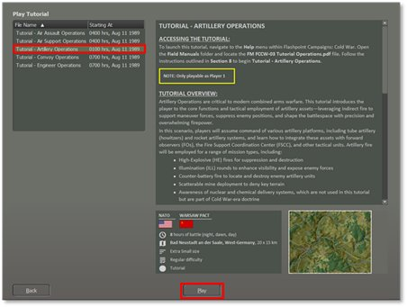

I recommend using the settings shown above for the first attempt at this mission. If that proves too challenging, try again and make the enemy units visible to aid your planning and movement.

Select the Difficulty level at “Grognard,” then select the “Play” button to proceed to the next screen. As shown in the vertically split layout on the next page, the left side contains the relevant screenshot.

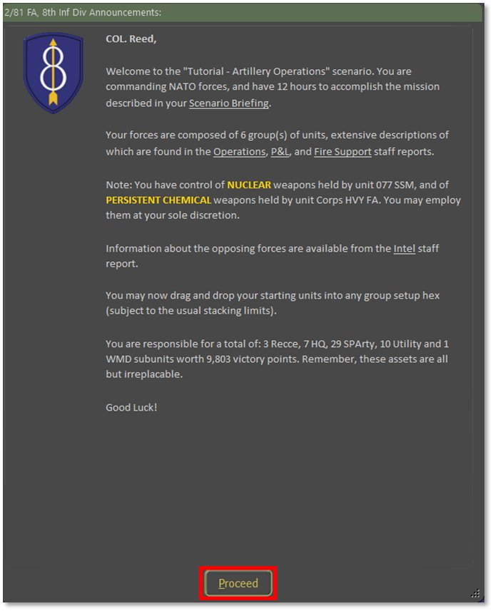

Once you have read the Mission information in the screenshot above, click the “Proceed” button.

After you select the “Proceed” button, you will be presented with a screen, as shown below. 

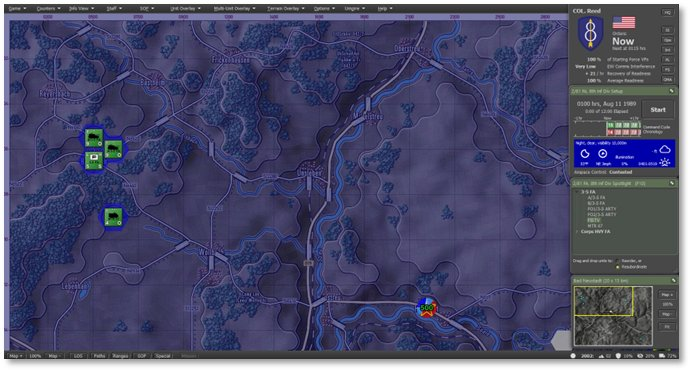

This displays the initial setup of your forces on the map. The next step is to review the troops you will command. If you need to review the forces and some basics of the Artillery operations, refer to Section 4 above.

## Review of the NBC Assets

Before commencing NBC operations, evaluating the fire support assets under your command is essential. Force these missions you have long range field artillery and a Surface-to-Surface missile (SSM). They are indirect fire weapons, so they need to be within range of the enemy. Both NBC attacks come with immediate and lingering effect on the battlefield.

For the two missions in this tutorial, you will have access to a battery of M110A2 Self Propelled Howitzers and a single MGM-52 Lance surface-to-surface missile (SSM).

### M110A2 Self-Propelled Howitzer

- Quantity: 1x Battery of six self-propelled vehicles plus a command vehicle and supporting ammo carriers. We have a unit Corps HVY FA that is off the map by 2 km in a general north-west direction. Given the very long range of the guns, it will still have all the map within range.

- Role: The M110A2 is a self-propelled 203mm howitzer designed for long-range heavy artillery fire support. It is used for deep-strike missions, counter-battery fire, and the destruction of fortified positions with high-explosive rounds.

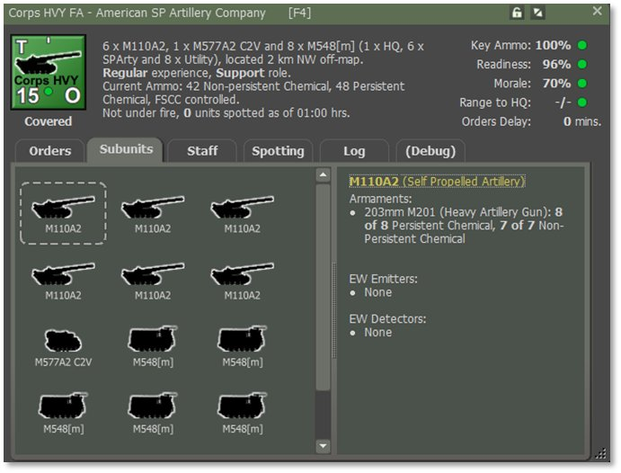

### Lance SSM (Surface-to-Surface Missile)

- Quantity: 1x self-propelled Missile Launcher. This is represented by unit 077 SSM which, due to its very long range, is put 4 km off the map in the north-west direction. It has the range to cover the entire map.

- Role: The Lance SSM is a tactical missile system that delivers nuclear and conventional warheads against high-priority enemy targets. It provides deep strike capability against command centers, airfields, and logistics hubs. In this game, the Lance is the representative nuclear warhead launcher. If you have one, or the equivalent Warsaw Pact SS-21 SSM, then you have a nuclear weapon and permission to use it.

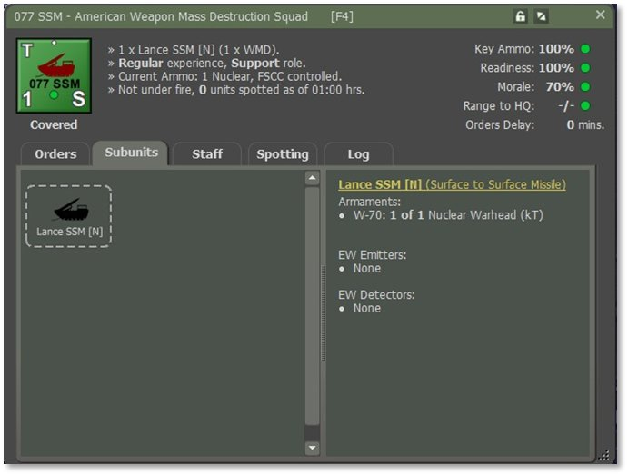

## Phase 1: Persistent or Non-Persistent Chemical Barrage

Deliver a chemical barrage to degrade enemy combat effectiveness. The key difference between persistent and non-persistent chemical munitions is that the former contaminates the hex and not just the units found within it. A special chemical contamination marker is drawn in the hex and is known to the owning player but needs to be encountered by the enemy before they are aware of it.

Non-persistent chemical munitions do not contaminate the hex. They will create a cloud of contamination that will contaminate any other unit that enters it until such time as the cloud dissipates below effective strength.

The casualties experienced by a contaminated unit will depend mostly on the NBC ratings of its subunits. Highly rated subunits will take minimal or no losses, whereas unprotected subunits will be devastated.

Both kinds of chemical contamination are removed by doing a Rest and Refresh cycle. Once decontaminated, the surviving subunits are fully operational again. While contaminated, crews are assumed to be in NBC protective gear, or equivalent, and will rapidly tire and lose readiness.

Terrain can never be decontaminated. Any unit that moves through a hex contaminated with persistent chemical will become contaminated and suffer a chemical attack as if it had been there when the barrage first arrived.

### Planning a Non-Persistent Chemical Barrage

1. You will use the “Corps HVY FA” unit for this tutorial. This unit is
equipped with M110A2 heavy self-propelled artillery, and their ammo packages contain 8 persistent and 7 non-persistent chemical rounds per gun. The main contribution of either kind of chemical barrage is to deny terrain, and to cause contaminated units to lose readiness. It is not a great killer, as both sides were prepared to encounter it and were equipped accordingly.

2. Corps HVY FAis located off-map, so there are two ways to order the mission.

a. Select the unit in the Spotlight panel, right click and select menu item “Barrage > Non-Persistent Chemical”, or

b. Select the “OMA” (Off-Map Assets) button on the leader panel, locate “Corps HVY FA” on the Artillery asset report which pops up, right click on the unit counter and select “Barrage > Non\_Persistent Chemical”

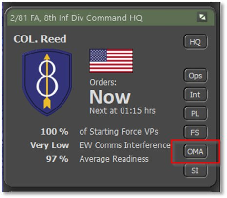 

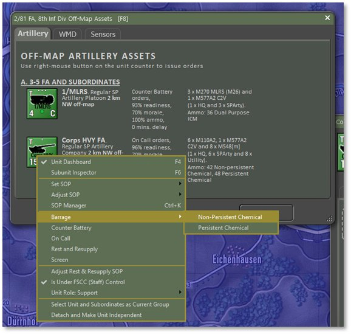

3. This now brings up the Plotting dialog, and you can select up to six target locations. Pick two hexes, say 2119 and 2219 to be the target hexes. Return to the Plotting dialog and click on the Commit button to lock in your choices.

4. This will result in the map overlay being updated to show the two target hex barrages. Note: The orange lines extend off the top edge of the map in the direction of where this firing unit is located.

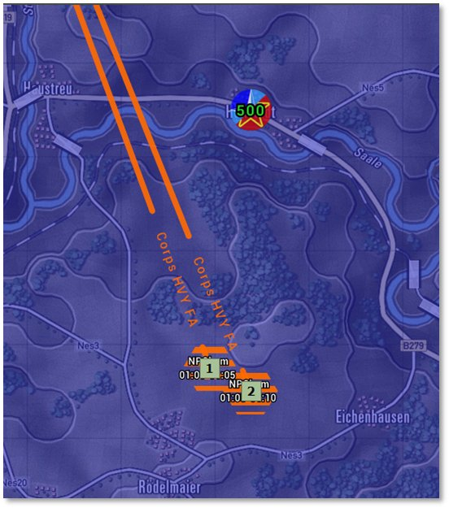

5. As with other barrages, if you are not satisfied with your target hex selection, you may drag and drop a target waypoint to a new location, and the orange firing line will update.

6. Having committed the mission, you are now presented with the unit Dashboard open to the first of the barrage orders in the Orders tab. You can leave the mission as is or tweak the parameters.

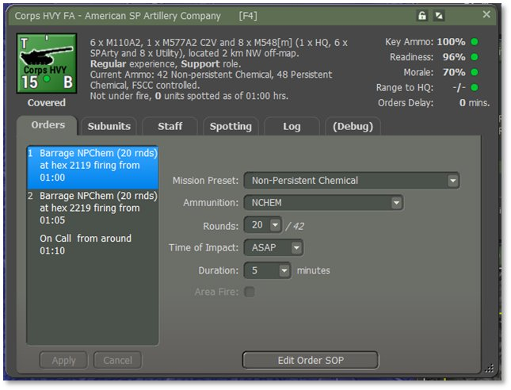

7. You will notice that you can change the mission preset for the individual barrage orders. This means you can mix persistent and non-persistent chemical barrage orders, or indeed, switch to HE should you wish.

8. Keep the defaults for now. Should you change them, then you will need to click on the “Apply” button in the lower left of the dashboard to lock them in. If outstanding changes are pending for an order, the order text will be shown in yellow in the orders stack to remind you.

### Resolution

Press the Start button to begin turn resolution. The greenish gas clouds will be drawn in the target hexes as the rounds of the barrages arrive overtime. Since this is a non-persistent chemical mission, the clouds will eventually clear, and there will be no remaining contamination marker. Until they clear, they will remain a threat to any unit that enters them. This screenshot is taken after 15 minutes and shows that two of the clouds persist currently.

These clouds do not linger. The clearing function is based on a 15% chance of clearing happening every five minutes.

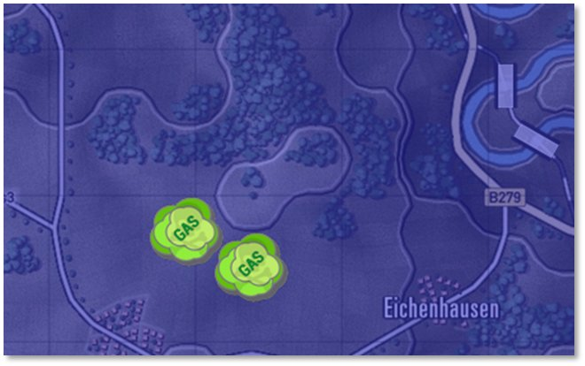

### Planning a Persistent Chemical Barrage

1. The player should know that there is a cost in Victory Points associated with using persistent chemical weapons. The penalty is 500 VPs for the first use (one single barrage) by a side. Use thereafter has no penalty.

2. Follow the same steps as for the non-persistent chemical barrage but select “Barrage > Persistent Chemical” instead. Try target hexes 2410 and 2411 and accept the barrage defaults.

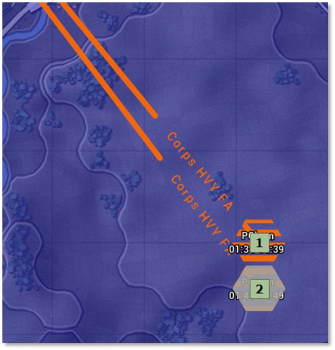

3. Start turn resolution and watch the results. You will see the same greenish gas cloud but also a chemical contamination marker. This will remain until the end of the game and contaminate any unit that enters this hex.

4. This is an example of a friendly side-owned chemical contamination marker:

### Tips for Success

- Use chemical strikes early to disrupt enemy movement or morale.

- Combine with FASCAM or conventional artillery to trap or destroy units in place.

- Chemical agents are more effective against dismounted or stationary forces.

- Observe the targeted area for the impact of the contamination (e.g., slowed enemy movement, unit disruption).

- Do not route friendly units through contaminated areas.

## Phase 2: Nuclear Strike

Using Missiles to deliver a nuclear strike to disrupt, neutralize, and destroy key enemy assets. If the player has been given nuclear strike capability, they are authorized to use it if needed.

The player should know that there is a cost in Victory Points associated with using nuclear weapons. The penalty is 5,000 VPs for the first use by a side. Use thereafter by that same side has no penalty.

!!! note

    The blast radius in is 3 hexes in all directions from the target location. All units caught within the blast radius will be destroyed, and all other units within three times this radius will suffer a severe Readiness loss. Place the target hex carefully.

All terrain hexes within the 3 hex blast radius will become contaminated. Any unit that enters a contaminated hex will become contaminated. This will not destroy many subunits outright, although a certain number will immediately give up the fight and fall out, but rather suffer severe and continuing morale and readiness losses until they are decontaminated in a Rest and Resupply cycle.

### Planning a Nuclear Strike

You will use the “077 SSM” unit for this tutorial. This unit is equipped with Lance Surface-to-Surface Missile launcher and one nuclear missile with a W-70 warhead.

1. 077 SSM is located off-map and so there are two ways to order the mission.

a. Select the unit in the Spotlight panel, right click and select menu item “Nuclear Strike”, or

b. Select the “OMA” (Off-Map Assets) button on the leader panel, locate “077 SSM” on the WMD asset report which pops up, right-click on the unit counter and select “Nuclear Strike”.

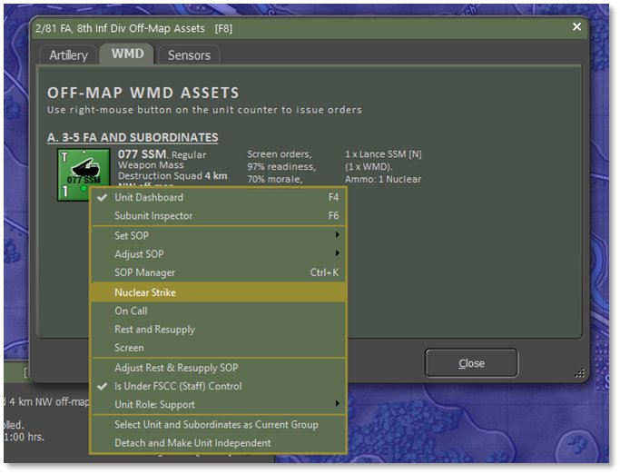

2. This now brings up a warning that using this weapon will incur a substantial VP penalty. This is not to be used lightly!

3. Hit Proceed to clear this dialog, and if you opt not to use the nuclear weapon, select Cancel in the subsequent Plotting dialog.

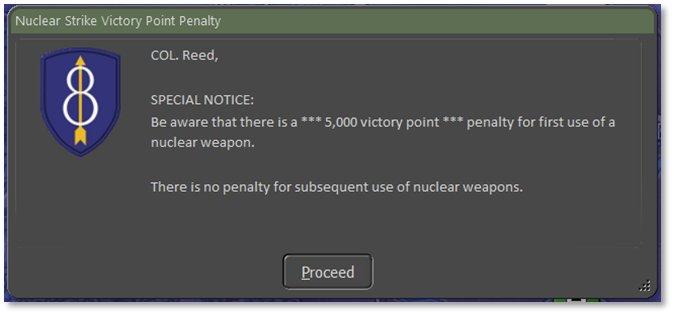

4. You will now see the Plotting dialog, and you can select one single target location. Note that the blast radius is 3 hexes in all directions from the target location. All units caught within the blast radius will be destroyed, and all other units within three times this radius will suffer a severe Readiness loss. Place the target hex carefully.

5. Target the hex 2215. Select Commit in the Plotting dialog to lock in the mission. This will result in an update to the map overlay to show the blast area. Note: The green lines extend off the top edge of the map in the direction of where this firing unit is located.

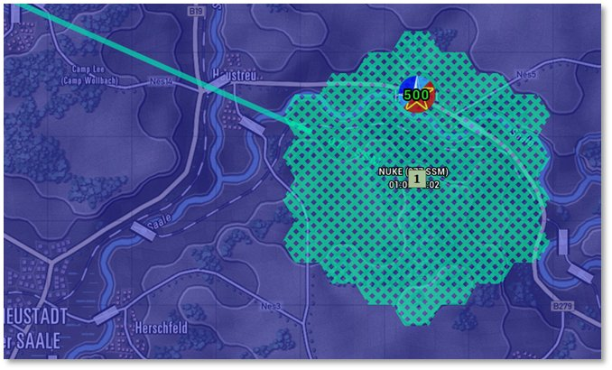

6. If you are not satisfied with your target hex selection, you may drag and drop a target waypoint to a new location, and the overlay will update.

7. Having committed the mission, you are now presented with the unit Dashboard open to the first of the barrage orders in the Orders tab. You can leave the mission as it is or tweak the parameters.

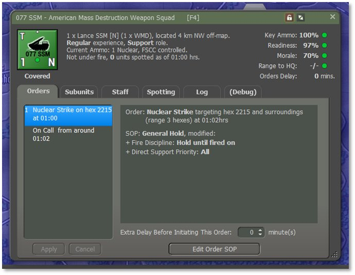

8. There are no parameters to set here, apart from the standard delay opportunity before launching the missile.

### Resolution

Press the Start button to begin turn resolution. When the nuclear event occurs, you will see the entire map flash and a very large cloud animation will play. The terrain will then be marked as contaminated and all units within the blast radius will be marked as dead. All bridges will be knocked down, and considerable smoke will obscure the terrain.

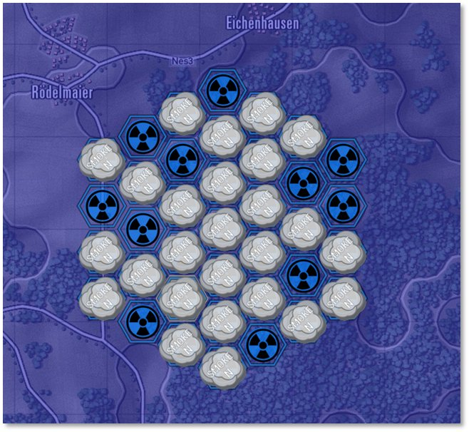

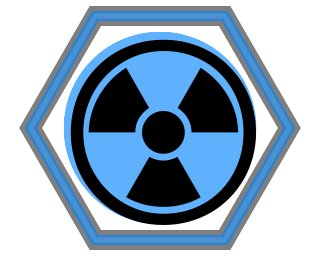

A “friendly” radiation marker is shown on the right.  The effects of radiation contamination will affect any unit that moves through it and can cause losses and heavy impacts on readiness and morale to contaminated units.

### Tips for Success

- Reserve nuclear strikes for critical breakthroughs or last-resort defense.

- Ensure full deconfliction with friendly forces prior to strike.

- Consider secondary effects such as radiation zones, morale loss, and escalation.
